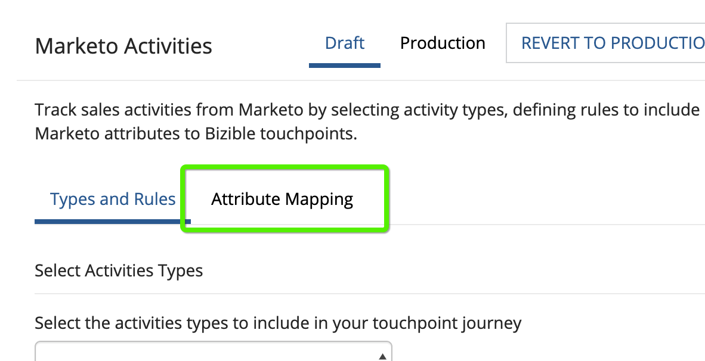

# [!DNL Marketo Engage] Integração de atividades {#marketo-engage-activities-integration}

Como parte do [!DNL Marketo Measure] e [!DNL Marketo Engage] Integração, esse esforço para atrair o Marketo Activities tem um papel importante. Por meio das Atividades do Marketo, o sistema rastreia eventos como Clique em Email, Alterar pontuação ou Alterar status em progressão - esses tipos de atividades podem ser preparados e definidos para selecionar um subconjunto elegível para pontos de contato. Depois que os pontos de contato são criados nessas atividades, eles são rastreados na jornada de engajamento e medidos junto com seus outros canais de marketing, como Pesquisa paga ou Marketing de parceiro.

## Requisitos {#requirements}

* Instância do Production Marketo
* Produção [!DNL Salesforce] ou [!DNL Microsoft Dynamics] instância
* Qualquer pagamento [!DNL Marketo Measure] assinatura
* Sincronização de Pessoas do Marketo Habilitada ([!DNL Marketo Measure] Configurações)
* Programas Marketo ativados ([!DNL Marketo Measure] Configurações)
* Atividades Marketo Ativadas ([!DNL Marketo Measure] Configurações)

## Configuração {#setup}

1. Para começar a configurar as Atividades do Marketo, navegue até **Minha conta** > **Configurações** > **Atividades**.

   

   

   A primeira coisa necessária é selecionar a lista de Tipos de atividade na qual você planeja criar regras. Não é necessário um número rígido de tipos de atividades, mas também recomendamos que você não sobrecarregue seus pontos de contato e dilua a importância de marcos significativos. Dito isso, talvez você não precise de mais de 5 tipos de atividade para rastrear os envolvimentos relevantes.

1. Clique no menu suspenso em [!UICONTROL Selecionar tipos de atividades] para começar a escolher os vários tipos.

   

1. Depois que todas as atividades necessárias forem selecionadas, você também as verá preenchidas em [!UICONTROL Lista de atividades selecionadas] bem como em [!UICONTROL Definir regras].

   

1. Para cada Tipo de atividade, será necessário definir uma ou mais regras que determinem quais registros estão qualificados para pontos de contato. No nosso exemplo, adicionaremos uma regra para o tipo de atividade &quot;Alterar pontuação&quot; para que o sistema crie um ponto de contato quando uma Pessoa do Marketo atingir uma pontuação 90 ou superior.

1. Primeiro, dependendo do Tipo de atividade, talvez seja necessário configurar um [!DNL Marketo Measure] Nome da campanha que pode ser usado posteriormente para mapeamento de canal. [!DNL Marketo Measure] Os nomes das campanhas podem ser reutilizados em várias regras. Isso ajuda a ter nomes mais amplos que podem ser usados em uma única regra de canal. Nem todos os tipos de atividades contêm um programa Marketo, portanto, é necessário ter um nome nesta primeira etapa.

   Este é um exemplo de como seria essa etapa extra:

   

1. No nosso exemplo de &quot;Alterar pontuação&quot;, não precisamos inserir um Nome de campanha, pois podemos extrair essas informações do Programa Marketo. Agora é possível criar a expressão da regra. Seguindo nosso exemplo, queremos selecionar o campo &quot;[!UICONTROL Novo valor]&quot; com um operador de &quot;[!UICONTROL é maior que]&quot; com um valor de 90.

   É possível expandir as regras e adicionar outros filtros ou critérios, adicionando instruções &quot;e&quot; ou &quot;ou&quot; para limitar os resultados.

   

   

1. Por fim, escolha o que devemos usar como Data do ponto de contato. Todos os campos de data ou data/hora disponíveis serão exibidos aqui na Marketo. A menos que tenha campos de data personalizados, você verá &quot;[!UICONTROL Data da atividade].&quot;

   

1. Certifique-se de clicar em **[!UICONTROL Salvar como rascunho]** ao longo do caminho para que você não perca suas alterações.

   

1. Navegue até o **[!UICONTROL Mapeamento de atributos]** guia .

   

1. Para cada Tipo de atividade selecionada, você tem a opção de mapear atributos adicionais do Marketo para campos de Ponto de contato, de modo que possa exibir e relatar esses valores em [!DNL Marketo Measure Discover] ou no CRM.

   Muitos dos campos foram mapeados automaticamente e não podem ser alterados para ficarem consistentes com nossas outras integrações. Consulte a seção Mapeamentos de campo abaixo para encontrar esses valores. Para alguns tipos de atividades, o Marketo inclui atributos para uma página de aterrissagem, página de referência ou navegador que você pode mapear opcionalmente para um campo de Ponto de contato. No exemplo abaixo, fizemos algumas sugestões adicionais que podem ser removidas.

1. Selecione o campo Ponto de contato do comprador na coluna à esquerda para a qual você deseja mapear. Em seguida, escolha o Atributo do Marketo que deseja preencher no campo Ponto de contato do comprador. Lembre-se de que esses são mapeamentos opcionais e adicionais sobre aqueles que [!DNL Marketo Measure] já tiver estabelecido.

   Campos mapeáveis:

   * Cidade
   * País
   * Região

   * Página
   * Página de indicação
   * Página do formulário
   * Data do formulário
   * Plataforma
   * Navegador

   >[!NOTE]
   >
   >Campos de publicidade como Conteúdo de publicidade ou Palavra-chave não estão disponíveis nessa lista, pois são reservados para integrações da plataforma de publicidade.

## Tipos de atividades {#activity-types}

Alguns tipos de atividades nos fornecem a ID do programa e o Nome do programa, portanto, é fácil mapeá-los para a ID da campanha e o Nome da campanha no ponto de contato do comprador. Para outros, não há associação de programa, portanto, parte da definição de regras exigirá que você crie uma [!DNL Marketo Measure] Nome da campanha. Abaixo estão as listas de cada categoria:

**Tipos de atividade com ID de programa**

Enviar Email (6)\
Email Entregue (7)\
Rejeição por email (8)\
Cancelar assinatura de email (9)\
Abrir Email (10)\
Clique em Email (11)\
Alterar valor de dados (13)\
Pontuação de alterações (22)\
Adicionar à Lista (24)\
Alterar Status em Progressão (104)\
Adicionar à Nurtura (113)\
Alterar a cadência de renovação (115)

>[!NOTE]
>
>Dos Tipos de atividade em que esperamos uma ID de programa, se uma atividade for detectada sem um programa, [!DNL Marketo Measure] O não aceitará isso como um ponto de contato elegível, pois não podemos ter valores de Campanha nulos.

**Tipos de atividades sem ID de programa**

Clique em Link (3)\
Novo cliente potencial (12)\
Sincronizar lead para SFDC (19)\
Converter lead (21)\
Alterar proprietário (23)\
Remover da Lista (25)\
Atividade SFDC (26)\
Enviado por email com rejeição suave (27)\
Excluir lead do SFDC (29)\
Clientes Potenciais de Mesclagem (32)\
Adicionar à Oportunidade (34)\
Remover da Oportunidade (35)\
Atualizar Oportunidade (36)\
Excluir lead (37)\
Enviar alerta (38)\
Enviar Email de Vendas (39)\
Email de vendas aberto (40)\
Clique em Email de vendas (41)\
Adicionar à campanha SFDC (42)\
Remover da Campanha SFDC (43)\
Alterar status na campanha SFDC (44)\
Receber Email de Vendas (45)\
Campanha de solicitação (47)\
Rejeição por email de vendas (48)\
Alterar Estágio da Receita (101)\
Alterar Estágio de Receita Manualmente (102)\
Alterar segmento (108)\
Ligue para o Webhook (110)\
Envio de email para amigo (111)\
Enviar para o email do amigo recebido (112)\
Alterar faixa de arquitetura (114)\
Encaminhar lead para a Marketo (145)\
Sincronizar lead para o Microsoft (300)\
Diálogo Compartilhar Conteúdo (400) Envolvido (158) Documento Interagido com (159) Compromisso de Diálogo Programado (160) Objetivo de Diálogo Atingido (161) Atividade Personalizada (xxx)

## Mapeamento de canal {#channel-mapping}

Para qualquer uma das regras de um Tipo de atividade com uma ID de programa, o Canal de programa Marketo é determinado a partir do Programa. Usamos o Canal de programa para mapear para seus Canais offline personalizados, de modo que você precisará verificar se os canais estão configurados corretamente [conforme instruído aqui](/help/marketo-measure-and-marketo/marketo-measure-integrations-with-marketo/marketo-engage-programs-integration.md#channel-mapping).

E para qualquer uma das regras de um Tipo de atividade sem uma ID de programa, seu primeiro passo foi criar um Nome de campanha. Use este Nome da Campanha para configurar seus Canais Online personalizados [apresentada aqui](/help/channel-tracking-and-setup/online-channels/online-custom-channel-setup.md).

Se os Canais para suas Atividades do Marketo não estiverem configurados corretamente, é provável que seus novos pontos de contato se encaixem no canal &quot;Outros&quot;.

## Custos do programa {#program-costs}

Por meio da importação de dados dos Programas Marketo, os custos são baixados automaticamente de Custos do período e o custo reportado no Marketo é distribuído durante o mês atribuído. Por exemplo, se $1000 for relatado para janeiro de 2021, os $1000 serão divididos entre 31 dias. Os custos podem ser encontrados em [!DNL Marketo Measure Discover].

## Mapeamento de cookies {#cookie-mapping}

Como resultado do [!DNL Marketo Measure] integração com o Marketo, a [!DNL Marketo Measure] A ID do cookie também agora é mapeada e sincronizada com a variável [!DNL Marketo Munchkin Id]. Isso ajuda a fechar a lacuna para atribuir o primeiro contato anônimo a uma sessão da Web, em vez de atribuir os toques de FT e LC a uma Atividade do Marketo. Imagine este cenário:

Marque cliques em um anúncio do Facebook e chegue a wayneenterprise.com onde ele recebe um cookie [!DNL Marketo Measure] Id 123 e [!DNL Marketo Munchkin Id] 456. Nenhum preenchimento de formulário ocorre.

A equipe de marketing Wayne Enterprise envia uma explosão de e-mail para leads específicos, um deles sendo `mark@email.com`.

`mark@email.com` O recebe o email e clica nele e chega a `wayneenterprises.com`. Isso se torna `mark@email.com's` segunda visita ao `wayneenterprise.com` com as mesmas IDs de cookie, mas não havia preenchimento de formulário, portanto, para [!DNL Marketo Measure], eles ainda são um visitante anônimo.

A equipe de marketing Wayne Enterprise cria uma regra de Atividade do Marketo para gerar pontos de contato para um tipo de atividade &quot;Clicar em email&quot;.

A implementação atual criaria um único ponto de contato FT e LC para `mark@email.com` na Atividade do Marketo, no tipo de atividade &quot;Clicar em email&quot;.

Com esse aprimoramento no mapeamento de cookies, a FT retornaria e seria creditada ao anúncio do Facebook e a LC seria creditada ao Email.

>[!NOTE]
>
>Com o comportamento de mapeamento de cookies, você pode encontrar alguns pontos de contato de LC que vêm de uma visita da Web. É possível que um cliente potencial tenha aparecido no Marketo sem nenhuma atividade associada, então [!DNL Marketo Measure] baixado o lead, correspondeu aos cookies associados e o rastreou para a sessão da Web mais recente, mesmo se não houvesse atividade de formulário que criasse o lead.

## Perguntas frequentes {#faq}

**Como faço para saber se uma regra de Programas Marketo ou uma regra de Atividades do Marketo deve ser criada?**

O [!DNL Marketo Engage] Integração de programas é uma maneira simples de gerar pontos de contato com base em se uma Pessoa é ou não membro do programa de um programa. Se você estiver interessado em definir uma regra com base no momento em que uma Pessoa mudar para um status específico do Programa, a variável [!DNL Marketo Engage] A Integração de atividades será a configuração desejada, especificamente o tipo de atividade &quot;Alterar status na progressão&quot; para que a Data do ponto de contato possa ser mapeada para a Data da atividade gerada pelo sistema.

**Por que o nome do meu tipo de ponto de contato está truncado?**

O campo Tipo de ponto de contato foi criado no [!DNL Marketo Measure] com 16 caracteres. Infelizmente, alterar o limite de caracteres do campo exigiria a desativação do campo existente e a criação de um novo. O valor do Tipo de ponto de contato é o Tipo de atividade, que também é definido no campo Médio.

**Por que meu Tipo de atividade personalizada não aparece na lista de atividades disponíveis?**

Mostramos apenas os tipos de atividades personalizadas &quot;Aprovado&quot; e não Rascunho ou Aprovado com Rascunho.

**Como determinar para quais tipos de atividade quero gerar um ponto de contato?**

Embora não haja limite para o número de Tipos de atividade que podem ser criados, geralmente recomendamos não mais do que cinco tipos de atividade. Leva tempo para determinar quais atividades de marketing são relevantes o suficiente para fazer parte da jornada do ponto de contato. Por exemplo, &quot;Cancelar inscrição no email&quot; pode não ser um ponto de contato significativo a ser rastreado, mas &quot;Clicar no email&quot; com filtros adicionais pode ser um bom ponto de contato. Isso varia de acordo com cada organização e com cada equipe, portanto sugerimos que você trabalhe com suas equipes para se familiarizar com a melhor abordagem aqui.

**Por que meu nome de navegador é cortado?**

O [!DNL Marketo Measure] O Nome do navegador tem um limite rígido de 20 caracteres, embora o valor do Agente do usuário obtido do Marketo tenda a ser uma string maior.

BrowserInfo.Name\
BrowserInfo.Version\
PlatformInfo.Name\
PlatformInfo.Version
