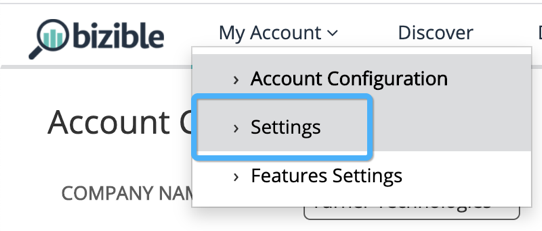
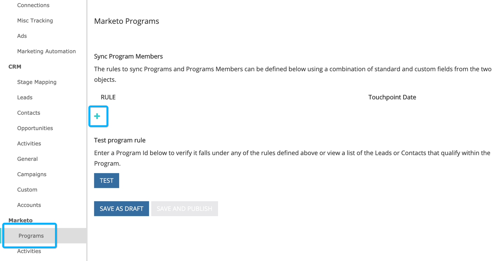
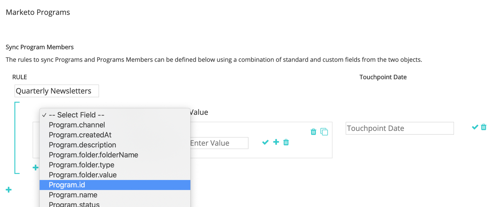
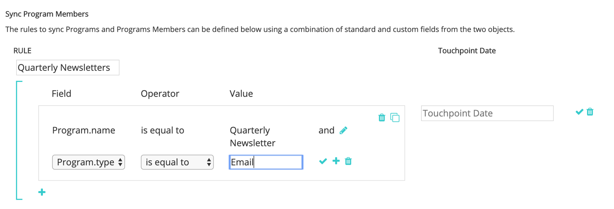
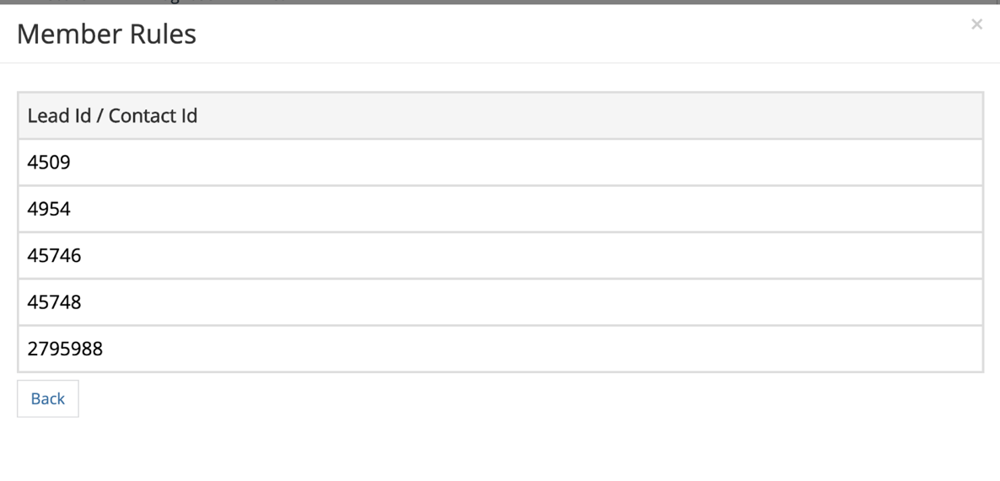

# [!DNL Marketo Engage] Integração de programas {#marketo-engage-programs-integration}

Por meio da [!DNL Marketo Measure] integração com [!DNL Marketo Engage] Programas, nossos clientes podem começar a criar pontos de contato para o rastreamento de atribuição a partir das Associações ao programa Marketo. Esse recurso permite que os profissionais de marketing comecem a rastrear associações de programa por email ou por programas de engajamento que, de outra forma, não seriam vistos pela [!DNL Marketo Measure] javascript e devem ser medidos na jornada de atribuição.

## Disponibilidade {#availability}

Todos os níveis.

## Requisitos {#requirements}

* Instância do Marketo de produção
* Produção Salesforce ou instância do Microsoft Dynamics
* Quaisquer [!DNL Marketo Measure] subscrição
* Sincronização de pessoas do Marketo habilitada ([!DNL Marketo Measure] Settings)
* Programas do Marketo ativados ([!DNL Marketo Measure] Settings)

## Configuração {#setup}

**Regras**

1. Para começar a configurar regras em Programas do Marketo, navegue até **[!UICONTROL Minha conta]** > **[!UICONTROL Configurações]** > **[!UICONTROL Programas]**. Clique em **+** ícone para começar a criar sua primeira regra.

   

   

1. Você pode, opcionalmente, definir um nome para a regra se isso ajudar a rastreá-los. primeiro, selecione o campo para definir a regra na lista dos campos Program e Program Membership (Programa). Continue criando a regra selecionando o operador e o valor esperado a serem verificados.

   

1. Adicione outra instrução na mesma caixa para configurar um critério &quot;and&quot; na regra ou clique no ícone + fora da caixa para configurar uma instrução &quot;or&quot;.

   

1. Escolha qual campo de data ou data/hora deve ser usado para mapear para a Data do ponto de contato. Para ver a lista de valores disponíveis no Marketo, insira uma chave `{` e exibiremos os campos disponíveis.

   

   >[!NOTE]
   >
   >Se a regra desejar capturar a Data da atividade ou a data em que um membro do programa atingiu um status específico, você utilizará a [!DNL Marketo Engage] Integração de atividades e configure uma regra para o tipo de atividade &quot;Alterar status na progressão&quot;.

   

A regra concluída deve ser semelhante a:

## Teste {#test}

Depois de criar algumas regras, você pode testá-las para verificar se a sua instrução corresponde aos seus programas.

1. Para executar um teste, clique no link **[!UICONTROL TESTE]** conforme mostrado abaixo.

   

1. Um modal será exibido onde você pode inserir a ID do programa no Marketo.

   

   Depois de inserir a ID e clicar no link [!UICONTROL Teste] , nosso mecanismo de regras analisará cada regra e determinará se o Programa se encaixa ou não em qualquer uma das regras. No exemplo abaixo, você pode ver aquele Programa 1002, chamado [!DNL Marketo Measure] Ebook, tem 5 membros do programa e está qualificado devido à regra exibida.

   As regras são executadas em um tamanho de amostra de 5000 membros. Se o seu programa contiver mais de 5000 membros, é possível que não verifiquemos a compatibilidade de todos os membros. Essa ferramenta simplesmente serve como uma maneira de verificar se as regras são construídas corretamente.

   

   Você pode clicar em Contagem de membros para ver uma lista de IDs de pessoas do Marketo elegíveis dentro do programa.

   

## Mapeamento de canal {#channel-mapping}

Na lista de Canais de programa do Marketo, é desejável mapear os valores para o [!DNL Marketo Measure] os canais de marketing personalizados criados em Configurações. Todos os pontos de contato gerados por esses programas herdarão os nomes dos canais e subcanais selecionados aqui.

1. Comece navegando até **[!UICONTROL Minha conta]** > **[!UICONTROL Configurações]** > **[!UICONTROL Canais offline]**.

1. Na parte superior, você terá a opção de mapear para seus Tipos de campanha de CRM e, abaixo, verá as opções para os Canais de programa do Marketo.

1. Primeiro, selecione o Canal que deve ser mapeado para o valor e, como opção, selecione o Subcanal. Quando terminar, clique em **[!UICONTROL Salvar]** na parte inferior.

   

## Custos do programa {#program-costs}

Por meio da importação de dados dos Programas do Marketo, os custos são baixados automaticamente a partir dos Custos do período e o custo relatado no Marketo é distribuído ao longo do mês atribuído. Por exemplo, se US$ 1000 forem relatados para janeiro de 2021, US$ 1000 serão divididos em 31 dias. Os custos podem ser encontrados em [!DNL Marketo Measure Discover].

## Como funciona {#how-it-works}

**Mapeamentos de campos**

<table> 
 <colgroup> 
  <col> 
  <col> 
 </colgroup> 
 <tbody> 
  <tr> 
   <th>biz_ad_campaigns</th> 
   <th>Marketo</th> 
  </tr> 
  <tr> 
   <td>ID</td> 
   <td>ID</td> 
  </tr> 
  <tr> 
   <td>IS_DELETED</td> 
   <td>(verifique se o programa ainda existe por meio da API)</td> 
  </tr> 
  <tr> 
   <td>
NAME
</td> 
   <td>name</td> 
  </tr> 
 </tbody> 
</table>

| biz_campaign_member | Marketo |
|---|---|
| ID | &quot;MarketoProgramMembership&quot;_ProgramId_Lead Id |
| MODIFIED_DATE | updatedAt |
| CREATED_DATE | dataAssociação |
| LEAD_ID | ID (associação à lista) |
| LEAD_EMAIL | Email (associação à lista) |
| STATUS | progressionStatus |
| HAS_RESPONDED | reachedStatus |
| CAMPAIGN_NAME | programName |
| CAMPAIGN_ID | programId |
| CAMPAIGN_TYPE | channel |

## Mapeamento de cookies {#cookie-mapping}

Como resultado da [!DNL Marketo Measure] integração com o Marketo, a [!DNL Marketo Measure] Agora a ID do cookie também está mapeada e sincronizada com o [!DNL Marketo Munchkin Id]. Isso ajuda a fechar a lacuna para atribuir o primeiro contato anônimo a uma sessão da Web, em vez de atribuir os toques FT e LC a uma atividade de Marketo. Imagine este cenário:

Marcar cliques em um [!DNL Facebook] anúncio e acessa o site wayneenterprises.com onde ele recebe um cookie com o [!DNL Marketo Measure] ID 123 e [!DNL Marketo Munchkin Id] 456. Não ocorre preenchimento de formulário.

A equipe de marketing da Wayne Enterprises envia uma explosão de email para clientes potenciais direcionados específicos, sendo um deles `mark@email.com`.

`mark@email.com` recebe o email, clica e acessa wayneenterprises.com. Isso se torna `mark@email.com's` segunda visita a `wayneenterprise.com` com as mesmas IDs de cookie, mas não havia preenchimento de formulário, portanto, [!DNL Marketo Measure], eles ainda são um visitante anônimo.

A equipe de marketing da Wayne Enterprises cria uma regra de Atividade do Marketo para gerar pontos de contato para um tipo de atividade &quot;Clique no email&quot;.

A implementação atual criaria um único ponto de contato FT e LC para `mark@email.com` da Atividade do Marketo no tipo de atividade &quot;Clique em email&quot;.

Com esse aprimoramento no mapeamento de cookies, a FT voltaria e seria creditada à [!DNL Facebook] e o LC seriam creditados ao Email.

>[!NOTE]
>
>Com o comportamento de mapeamento de cookies, você pode encontrar alguns pontos de contato LC que vêm de uma visita à Web. É possível que um lead tenha aparecido no Marketo sem nenhuma atividade associada, então [!DNL Marketo Measure] baixou o cliente potencial, correspondeu aos cookies associados e o rastreou até a sessão da web mais recente, mesmo se não houver atividade de formulário que tenha criado o cliente potencial.

## Perguntas frequentes {#faq}

**Como defino a Data do ponto de contato como a data de progressão ou a data em que a alteração de status aconteceu com meu membro do programa?**

Se a regra desejar capturar a Data da atividade ou a data em que um membro do programa atingiu um status específico, você utilizará a [!DNL Marketo Engage] Integração de atividades e configure uma regra para o tipo de atividade &quot;Alterar status na progressão&quot;. Caso contrário, a variável [!DNL Marketo Engage] Programas A integração só disponibiliza a Data de associação, que é a primeira data que trouxe a pessoa do Marketo para o Programa, mesmo que haja vários status.

**Posso obter uma lista de opções de data para a Data do ponto de contato?**

Para acionar o preenchimento automático, comece inserindo uma chave `{` no campo de texto, os campos disponíveis serão exibidos.

**Se eu criar regras do Programa Marketo e também tiver regras de Campanha do CRM, elas serão contadas duas vezes?**

Depende da definição da regra, mas possivelmente sim. avalie seu conjunto de regras para que não tenha regras que cubram um Programa e uma Campanha, pois não removeremos a duplicação ou detectaremos associações semelhantes. Uma solução possível é copiar as regras do Campaign para os Programas se desejar que o Marketo seja a única fonte da verdade e, em seguida, remover as regras do Campaign. Outra opção é adicionar os critérios &quot;CreatedOn&quot; ou &quot;CreatedDate&quot; às regras, para que as regras anteriores a uma determinada data usem as regras de Campanha e as regras após uma determinada data usem as regras do Programa. Há muitas soluções alternativas disponíveis, mas será necessário planejamento e coordenação.

**Os Campos personalizados de associação ao programa da Marketo estão disponíveis para definição?**

Por enquanto, devido a limitações técnicas, não podemos oferecer suporte aos Campos personalizados de associação de programa. Quando esses campos estiverem disponíveis por meio de APIs adicionais do Marketo, eles serão expostos a nós e estarão visíveis para uso.

**Como saberei se devo usar Programas ou Atividades?**

A variável [!DNL Marketo Engage] A integração de programas é uma maneira simples de gerar pontos de contato com base no fato de uma pessoa ser ou não membro de um programa. Se estiver interessado em definir uma regra com base no momento em que uma Pessoa muda para um status de Programa específico, a variável [!DNL Marketo Engage] A Integração de atividades será a configuração desejada, especificamente o tipo de atividade &quot;Alterar status na progressão&quot;.
