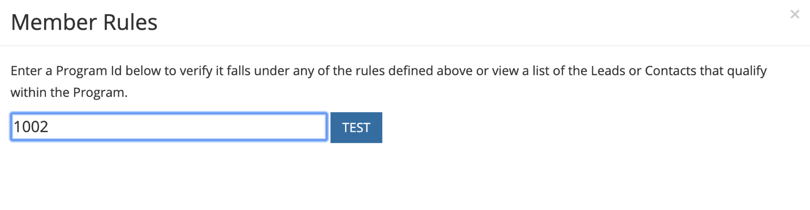

# [!DNL Marketo Engage] Integração de programas {#marketo-engage-programs-integration}

Por meio da [!DNL Marketo Measure] integração com [!DNL Marketo Engage] Programas, nossos clientes podem começar a criar pontos de contato para o rastreamento de atribuição a partir das Associações do Programa Marketo. Esse recurso permite que os profissionais de marketing iniciem o rastreamento de associações de programas por email ou programas de engajamento que, de outra forma, não seriam vistos pela variável [!DNL Marketo Measure] javascript e deve ser medido na jornada de atribuição.

## Disponibilidade {#availability}

Todos os níveis.

## Requisitos {#requirements}

* Instância do Production Marketo
* Instância de produção Salesforce ou Microsoft Dynamics
* Qualquer pagamento [!DNL Marketo Measure] assinatura
* Sincronização de Pessoas do Marketo Habilitada ([!DNL Marketo Measure] Configurações)
* Programas Marketo ativados ([!DNL Marketo Measure] Configurações)

## Configuração {#setup}

**Regras**

1. Para começar a configurar regras em programas Marketo, navegue até **[!UICONTROL Minha conta]** > **[!UICONTROL Configurações]** > **[!UICONTROL Programas]**. Clique no botão **+** ícone para começar a criar a primeira regra.

   

   

1. Opcionalmente, é possível definir um nome para a regra, caso isso ajude a acompanhá-la. Primeiro, você selecionará o campo para definir sua regra na lista de campos Programas e Membros do Programa . Continue criando a regra selecionando o operador e o valor esperado a ser verificado.

   

1. Adicione outra instrução na mesma caixa para configurar um critério &quot;e&quot; na regra ou clique no ícone + fora da caixa para configurar uma instrução &quot;ou&quot;.

   

1. Escolha qual data ou campo de data/hora deve ser usado para mapear para a Data do ponto de contato. Para ver a lista de valores disponíveis no Marketo, insira uma chave `{` e exibiremos os campos disponíveis.

   

   >[!NOTE]
   >
   >Se sua regra quiser capturar a Data da Atividade, ou a data em que um Membro do Programa atingiu um status específico, você desejará utilizar a variável [!DNL Marketo Engage] Integração de atividades e configure uma regra para o tipo de atividade &quot;Alterar status na progressão&quot;.

   

A regra concluída deve ser semelhante a:

## Teste {#test}

Depois de criar algumas regras, você pode testá-la para verificar se sua declaração corresponde aos seus programas.

1. Para executar um teste, clique no botão **[!UICONTROL TESTE]** como mostrado abaixo.

   

1. Um modal será exibido, onde você pode inserir a ID do programa na Marketo.

   

   Depois de inserir a ID e clicar no botão [!UICONTROL Teste] , nosso mecanismo de regras passará por cada regra e determinará se o Programa se encaixa ou não em qualquer uma das regras. No exemplo abaixo, você pode ver o Programa 1002, chamado [!DNL Marketo Measure] O Ebook tem 5 membros do programa e está qualificado por causa da regra exibida.

   As regras são executadas no tamanho da amostra de 5000 membros. Se o seu programa contém mais de 5000 membros, é possível que não verificemos a compatibilidade de todos os membros. Essa ferramenta serve simplesmente como uma maneira de verificar se as regras são construídas corretamente.

   

   Você pode clicar em Contagem de membros para ver uma lista de IDs de pessoas do Marketo qualificadas no programa.

   

## Mapeamento de canal {#channel-mapping}

Na lista de Canais do Programa Marketo, você desejará mapear os valores para a variável [!DNL Marketo Measure] canais de marketing personalizados criados em Configurações. Todos os pontos de contato gerados por esses programas herdarão os nomes de Canal e Subcanal selecionados aqui.

1. Comece navegando até **[!UICONTROL Minha conta]** > **[!UICONTROL Configurações]** > **[!UICONTROL Canais offline]**.

1. Na parte superior, você terá a opção de mapear para os Tipos de campanha do CRM e, abaixo, verá as opções dos Canais do programa Marketo.

1. Primeiro, selecione o Canal que deve mapear para o valor e, como opção, selecione o Subcanal. Quando terminar, clique em **[!UICONTROL Salvar]** na parte inferior.

   

## Custos do programa {#program-costs}

Por meio da importação de dados dos Programas Marketo, os custos são baixados automaticamente de Custos do período e o custo reportado no Marketo é distribuído durante o mês atribuído. Por exemplo, se $1000 for relatado para janeiro de 2021, os $1000 serão divididos entre 31 dias. Os custos podem ser encontrados em [!DNL Marketo Measure Discover].

## Como funciona {#how-it-works}

**Mapeamento de campos**

<table> 
 <colgroup> 
  <col> 
  <col> 
 </colgroup> 
 <tbody> 
  <tr> 
   <th>biz_ad_campanhas</th> 
   <th>Marketo</th> 
  </tr> 
  <tr> 
   <td>ID</td> 
   <td>ID</td> 
  </tr> 
  <tr> 
   <td>IS_DELETED</td> 
   <td>(verifique se o Programa ainda existe por meio da API)</td> 
  </tr> 
  <tr> 
   <td>
NOME
</td> 
   <td>name</td> 
  </tr> 
 </tbody> 
</table>

| biz_campaign_Members | Marketo |
|---|---|
| ID | Id &quot;MarketoProgramMembership&quot;_ProgramId_Lead |
| MODIFIED_DATE | updateAt |
| CREATED_DATE | membershipDate |
| LEAD_ID | Id (associação à lista) |
| LEAD_EMAIL | Email (associação à lista) |
| STATUS | progressionStatus |
| HAS_RESPONDED | reachedStatus |
| CAMPAIGN_NAME | programName |
| CAMPAIGN_ID | programId |
| CAMPAIGN_TYPE | canal |

## Mapeamento de cookies {#cookie-mapping}

Como resultado do [!DNL Marketo Measure] integração com o Marketo, a [!DNL Marketo Measure] A ID do cookie também agora é mapeada e sincronizada com a variável [!DNL Marketo Munchkin Id]. Isso ajuda a fechar a lacuna para atribuir o primeiro contato anônimo a uma sessão da Web, em vez de atribuir os toques de FT e LC a uma Atividade do Marketo. Imagine este cenário:

Marcar cliques em um [!DNL Facebook] e chega em wayneenterprise.com onde ele recebe cookies [!DNL Marketo Measure] Id 123 e [!DNL Marketo Munchkin Id] 456. Nenhum preenchimento de formulário ocorre.

A equipe de marketing Wayne Enterprise envia uma explosão de e-mail para leads específicos, um deles sendo `mark@email.com`.

`mark@email.com` O recebe o email e clica nele e chega a wayneenterprise.com. Isso se torna `mark@email.com's` segunda visita ao `wayneenterprise.com` com as mesmas IDs de cookie, mas não havia preenchimento de formulário, portanto, para [!DNL Marketo Measure], eles ainda são um visitante anônimo.

A equipe de marketing Wayne Enterprise cria uma regra de Atividade do Marketo para gerar pontos de contato para um tipo de atividade &quot;Clicar em email&quot;.

A implementação atual criaria um único ponto de contato FT e LC para `mark@email.com` na Atividade do Marketo, no tipo de atividade &quot;Clicar em email&quot;.

Com esse aprimoramento no mapeamento de cookies, a FT retornaria e seria creditada ao [!DNL Facebook] e o LC seria creditado ao Email.

>[!NOTE]
>
>Com o comportamento de mapeamento de cookies, você pode encontrar alguns pontos de contato de LC que vêm de uma visita da Web. É possível que um cliente potencial tenha aparecido no Marketo sem nenhuma atividade associada, então [!DNL Marketo Measure] baixado o lead, correspondeu aos cookies associados e o rastreou para a sessão da Web mais recente, mesmo se não houvesse atividade de formulário que criasse o lead.

## Perguntas frequentes {#faq}

**Como defino a Data do ponto de contato para ser a data de progressão, ou a data em que a alteração de status ocorreu com meu membro do programa?**

Se sua regra quiser capturar a Data da Atividade, ou a data em que um Membro do Programa atingiu um status específico, você desejará utilizar a variável [!DNL Marketo Engage] Integração de atividades e configure uma regra para o tipo de atividade &quot;Alterar status na progressão&quot;. Caso contrário, a variável [!DNL Marketo Engage] A Integração de programas só disponibiliza a Data de associação, que é a primeira data que trouxe a Marketo Pessoa para o Programa, mesmo se houver vários status.

**Posso obter uma lista de opções de data para a Data do ponto de contato?**

Para acionar a conclusão automática, comece inserindo uma chave `{` no campo de texto, os campos disponíveis serão exibidos.

**Se eu criar regras do Programa Marketo e também tiver regras de Campanha CRM, elas serão contadas duas vezes?**

Depende da sua definição de regra, mas possivelmente, sim. Você desejará avaliar seu conjunto de regras para que não tenha regras que cubram um Programa e uma Campanha porque não removeremos a duplicação ou detectaremos associações semelhantes. Uma solução possível é copiar as regras do Campaign para Programas se você quiser que o Marketo seja a única fonte de verdade e, em seguida, remover as regras do Campaign. Outra opção é adicionar os critérios &quot;CreatedOn&quot; ou &quot;CreatedDate&quot; nas regras para que as regras antes de uma determinada data usem as regras e regras do Campaign depois de uma determinada data usem as regras do Programa. Existem muitas soluções alternativas, mas será necessário um certo planejamento e coordenação.

**Os Campos Personalizados de Associação do Programa Marketo estão disponíveis para definição?**

Devido a limitações técnicas, não podemos suportar os Campos Personalizados de Associação do Programa por enquanto. Quando esses campos estiverem disponíveis por meio de APIs adicionais do Marketo, eles serão expostos a nós e estarão visíveis para você usar.

**Como sei se devo usar Programas ou Atividades?**

O [!DNL Marketo Engage] Integração de programas é uma maneira simples de gerar pontos de contato com base em se uma Pessoa é ou não membro do programa de um programa. Se você estiver interessado em definir uma regra com base no momento em que uma Pessoa mudar para um status específico do Programa, a variável [!DNL Marketo Engage] A Integração de atividades será a configuração desejada, especificamente o tipo de atividade &quot;Alterar status na progressão&quot;.
