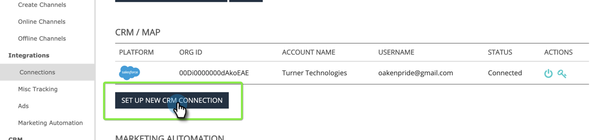
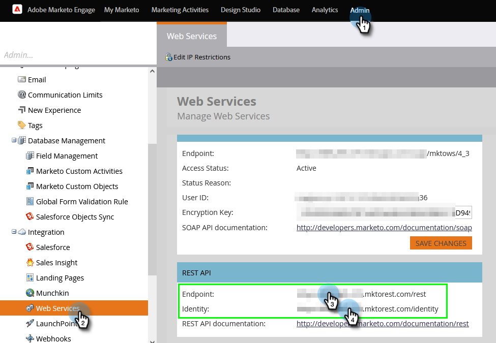
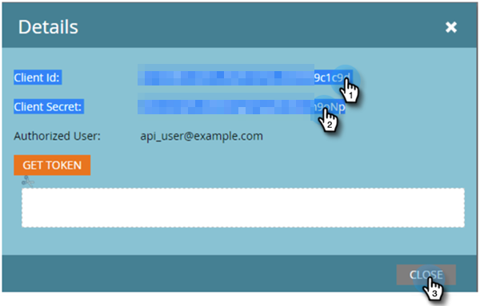
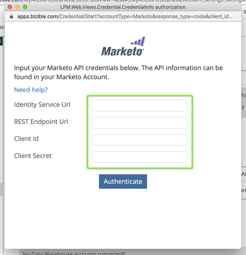
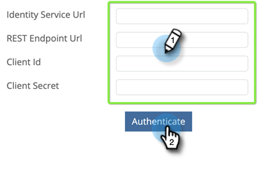

# Configurar conexão do Marketo {#set-up-marketo-connection}

Veja como configurar sua conexão com o Marketo.

>[!PREREQUISITES]
>
>[Criar uma função de usuário Somente API](https://experienceleague.adobe.com/docs/marketo/using/product-docs/administration/users-and-roles/create-an-api-only-user.html) para o [!DNL Marketo Measure]/Marketo Engage conexão.

1. Entrada [!DNL Marketo Measure], clique no link **[!UICONTROL Minha conta]** e selecione **[!UICONTROL Configurações]**.

   

1. Em [!UICONTROL Integrações], clique em **[!UICONTROL Conexões]**.

   

1. Clique em **[!UICONTROL Configurar Nova Conexão do CRM]**.

   

1. Clique em **[!UICONTROL Conectar]** botão ao lado do Marketo.

   

1. Em uma nova guia, faça logon em sua conta Marketo Engage. Ir para **Admin** > **Serviços da Web**. Role para baixo até API REST. Realce e salve o Ponto de extremidade e o URL do serviço de identidade. Você precisa deles nas etapas a seguir.

   

1. Ainda no Marketo Engage, selecione **LaunchPoint** na árvore à esquerda. Encontre o serviço personalizado que deseja conectar ao Marketo Measure e clique em **Exibir detalhes**.

   

1. Realce e salve a ID do cliente e o Segredo do cliente. Clique em **Fechar**.

   

1. Voltar para [!DNL Marketo Measure], preencha os campos com os dados coletados.

   

1. Depois de inserir os valores, clique em **[!UICONTROL Autenticar]**. Sua conta Marketo Engage está conectada ao [!DNL Marketo Measure].

   

   >[!NOTE]
   >
   >[!DNL Marketo Measure] O faz chamadas para a API do Marketo em seu nome sem consumir nenhum dos limites da API do Marketo, de modo que não há necessidade de se preocupar com limites e alocação de crédito com outras integrações.
