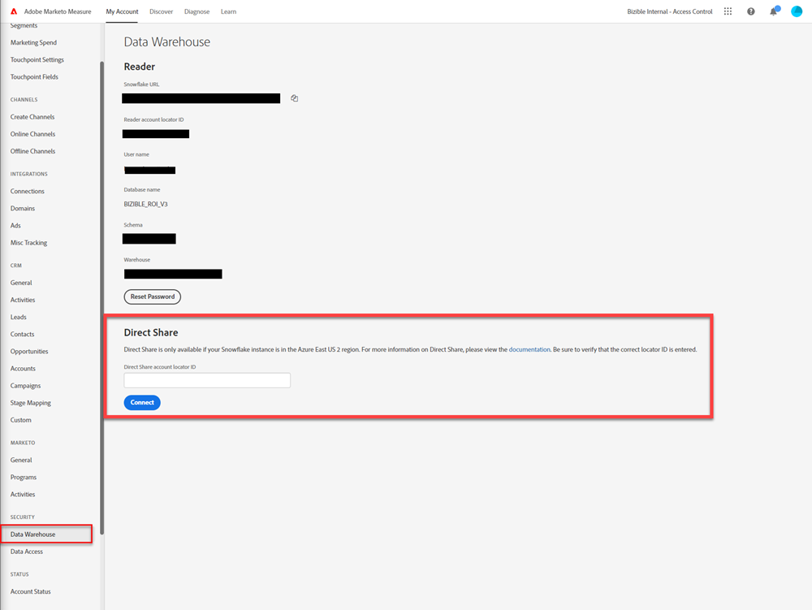

# Acesso ao Data Warehouse - Compartilhamento direto {#data-warehouse-access-direct-share}

## Requisitos {#requirements}

Para que [!DNL Marketo Measure] configure um compartilhamento direto para o data warehouse, você deve atender aos seguintes requisitos.

* Você tem sua própria instância Snowflake.
* Sua instância de Snowflake está na região de Snowflake do Azure East US 2.
* Você fornece a [!DNL Marketo Measure] sua ID de conta Snowflake.

## Limitações {#limitations}

O [!DNL Marketo Measure] só poderá configurar Compartilhamentos Diretos de Snowflake com contas localizadas no Azure East US 2 devido às limitações atuais de Compartilhamento Direto de Snowflake. Se você precisar que seus dados sejam disponibilizados em outras regiões Snowflake, recomendamos fazer uma cópia dos dados em uma conta Snowflake localizada no Azure East US 2 e usar o recurso [Replicação de Banco de Dados Snowflake](https://docs.snowflake.com/en/user-guide/database-replication-intro.html){target="_blank"} para copiar seus dados na região/conta Snowflake de sua escolha.

## Digite a ID da conta Snowflake {#enter-snowflake-account-id}

Abra a seção **Configurações** no aplicativo Marketo Measure e navegue até a página **Data Warehouse**. Na seção **Compartilhamento Direto**, digite sua [ID de conta do Snowflake](https://docs.snowflake.com/en/user-guide/admin-account-identifier.html){target="_blank"} na caixa fornecida e clique em **Conectar**.



## Acesso ao compartilhamento {#accessing-the-share}

Depois que o compartilhamento for criado para a ID de conta fornecida, você deverá concluir as [etapas de configuração](https://docs.snowflake.com/en/user-guide/data-share-consumers.html){target="_blank"} na sua instância do Snowflake para acessar os dados.

>[!NOTE]
>
>Você pode escolher qualquer nome de banco de dados desejado. Você pode designar os privilégios a qualquer atribuição escolhida, desde que ela exista na instância do Snowflake.

* Usar a função de administrador da conta

```
USE ROLE ACCOUNTADMIN
```

* Exibir compartilhamentos disponíveis (mostra o nome do compartilhamento concedido)

```
SHOW SHARES
```

* Criar um banco de dados para o compartilhamento

```
CREATE DATABASE <database_name> FROM SHARE <provider_account>.<share_name>
```

* Conceder privilégios no banco de dados compartilhado

```
GRANT IMPORTED PRIVILEGES ON DATABASE <database_name> TO ROLE <role_name>
GRANT IMPORTED PRIVILEGES ON ALL SCHEMAS IN DATABASE <database_name> TO ROLE <role_name>
```

Para obter instruções mais detalhadas e as etapas para realizar essas etapas da interface do usuário do Snowflake, consulte [documentação do Snowflake diretamente](https://docs.snowflake.com/en/user-guide/data-share-consumers.html){target="_blank"}.
