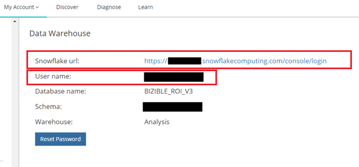
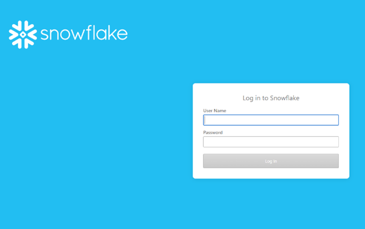
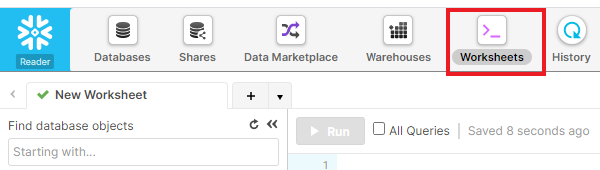
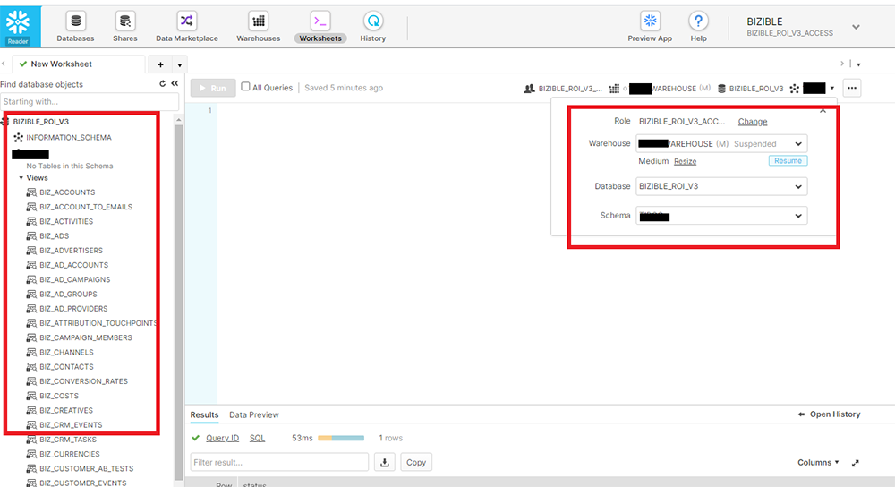

# Acesso ao Data Warehouse - Conta Reader {#data-warehouse-access-reader-account}

## Link de acesso ao Snowflake {#snowflake-access-link}

Para acessar o data warehouse do Snowflake, será necessário navegar até o URL específico da conta Snowflake. Você pode encontrar esse link de acesso fazendo logon no [!DNL Marketo Measure] e siga as etapas abaixo para navegar até a página de informações da Data Warehouse.

1. Entrada [!DNL Marketo Measure], na parte superior da página, clique em **[!UICONTROL Minha conta]** > **[!UICONTROL Configurações]**.

   

1. No menu do lado esquerdo, em Segurança, clique em **[!UICONTROL Data Warehouse]**.

   

1. Nesta página, você encontrará o link para seu data warehouse Snowflake e seu nome de usuário.

   

   >[!NOTE]
   >
   >Essa é uma conta somente leitura disponível para sua organização, não apenas para um usuário individual. Qualquer usuário em sua organização que tenha acesso ao [!DNL Marketo Measure] Você pode usar essa conta para fazer logon na conta do leitor de Data Warehouse do Snowflake.

1. Clique no link fornecido no URL do Snowflake e você será direcionado à página de logon do Snowflake, onde digitará seu nome de usuário e senha. _Se você não tiver sua senha, consulte as etapas abaixo para redefini-la_.

   

1. Depois de fazer logon, clique em **[!UICONTROL Planilhas]** na parte superior da página.

   

1. Os objetos do banco de dados BIZIBLE_ROI_V3 estão no lado esquerdo da tela. Informe o Depósito, o Banco de Dados e o Esquema nas opções suspensas na parte superior da janela de consulta. Deve haver apenas uma opção para cada um. Agora você está pronto para executar consultas no editor de consultas Snowflake.

   

## Redefina sua senha {#reset-your-password}

[!DNL Marketo Measure] não tem acesso à sua senha de login do Snowflake. Se precisar redefinir sua senha, clique no link [!UICONTROL Redefinir senha] na página de informações da Data Warehouse e siga as instruções. Uma senha temporária será exibida imediatamente na interface do usuário. Você será solicitado a criar sua própria senha no próximo login do data warehouse.

>[!NOTE]
>
>* Redefinir a senha a redefine para todos [!DNL Marketo Measure] usuários em sua organização, não apenas o usuário conectado no momento.
>* Somente mostramos a senha temporária na interface do usuário. Um email não será enviado.

## Conexão com o Snowflake através de ferramentas de terceiros {#connecting-to-snowflake-via-third-party-tools}

Você precisará inserir algumas informações para conectar seu data warehouse Snowflake a uma ferramenta de terceiros.

>[!NOTE]
>
>Cada ferramenta tem requisitos de conexão diferentes. Recomenda-se consultar a documentação da ferramenta específica que você está tentando conectar.

* **URI** (sempre obrigatório)
   * Este é o nome de domínio da conta Snowflake.  Ele está contido em uma parte do link de logon do Snowflake.
* **Nome de usuário** (sempre obrigatório)
   * O nome de usuário é listado na página Informações de Data Warehouse no [!DNL Marketo Measure].
* **Senha** (sempre obrigatório)
   * Esta é a senha que você definiu na primeira vez que fez login na sua conta Snowflake.  Para redefinir a senha, consulte as etapas descritas acima.
* **Nome do banco de dados** (nem sempre é obrigatório)
   * O banco de dados é o que armazena os dados no Snowflake. É o recurso de armazenamento. O nome do banco de dados está listado na página Informações da Data Warehouse em [!DNL Marketo Measure].
* **Nome do Depósito** (nem sempre é obrigatório)
   * O warehouse é o que executa consultas no Snowflake. É o recurso de computação.  O nome do warehouse está listado na página de informações de Data Warehouse em [!DNL Marketo Measure].

  
