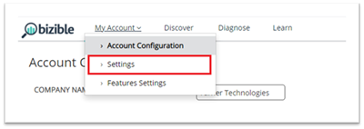
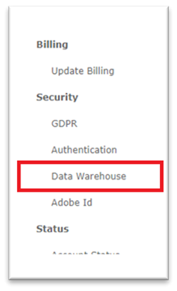

# Acesso ao Data Warehouse - Conta do Reader {#data-warehouse-access-reader-account}

## Link de acesso do Snowflake {#snowflake-access-link}

Para acessar o data warehouse da Snowflake, navegue até o URL específico da sua conta Snowflake. Você pode encontrar esse link de acesso fazendo logon no [!DNL Marketo Measure] e seguindo as etapas abaixo para navegar até a página de informações do Data Warehouse.

1. Em [!DNL Marketo Measure], na parte superior da página, clique em **[!UICONTROL Minha Conta]** > **[!UICONTROL Configurações]**.

   

1. No menu do lado esquerdo, em Segurança, clique em **[!UICONTROL Data Warehouse]**.

   

1. Esta página tem o link para o data warehouse da Snowflake e seu nome de usuário.

   

   >[!NOTE]
   >
   >Essa é uma conta somente leitura disponível para sua organização, não apenas para um usuário individual. Qualquer usuário em sua organização que tenha acesso ao [!DNL Marketo Measure] pode usar essa conta para fazer logon na conta do Snowflake Data Warehouse Reader.

1. Clique no link fornecido no URL do Snowflake e você será direcionado à página de logon do Snowflake na qual digitará seu nome de usuário e senha. _Se você não tiver sua senha, consulte as etapas abaixo para redefini-la_.

   

1. Depois de fazer logon, clique em **[!UICONTROL Planilhas]** na parte superior da página.

   

1. Os objetos do banco de dados BIZIBLE_ROI_V3 estão no lado esquerdo da tela. Informe o Depósito, o Banco de Dados e o Esquema nas opções suspensas na parte superior da janela de consulta. Deve haver apenas uma opção para cada um. Agora você está pronto para executar consultas no editor de consultas do Snowflake.

   

## Redefina sua senha {#reset-your-password}

[!DNL Marketo Measure] não tem acesso à sua senha de logon do Snowflake. Se precisar redefinir a senha, clique no botão [!UICONTROL Redefinir Senha] na página de informações do Data Warehouse e siga as instruções. Uma senha temporária é exibida imediatamente na interface do usuário do. Você será solicitado a criar sua própria senha no próximo login do data warehouse.

>[!NOTE]
>
>* Redefinir a senha a redefine para todos os [!DNL Marketo Measure] usuários em sua organização, não apenas para o usuário logado no momento.
>* Somente mostramos a senha temporária na interface do usuário. Um email não será enviado.

## Conexão com o Snowflake por meio de ferramentas de terceiros {#connecting-to-snowflake-via-third-party-tools}

É necessário inserir algumas informações para conectar o data warehouse do Snowflake a uma ferramenta de terceiros.

>[!NOTE]
>
>Cada ferramenta tem requisitos de conexão diferentes. Recomenda-se consultar a documentação da ferramenta específica que você está tentando conectar.

* **URI** (sempre obrigatório)
   * Esse é o nome de domínio da conta do Snowflake. Ele está contido em uma parte do link de logon do Snowflake.
* **Nome de usuário** (sempre necessário)
   * O nome de usuário está listado na página de informações do Data Warehouse em [!DNL Marketo Measure].
* **Senha** (sempre obrigatório)
   * Essa é a senha definida na primeira vez que você faz logon na sua conta da Snowflake. Para redefinir a senha, consulte as etapas descritas acima.
* **Nome do Banco de Dados** (nem sempre necessário)
   * O banco de dados é o que armazena os dados no Snowflake. É o recurso de armazenamento. O nome do banco de dados está listado na página de informações do Data Warehouse em [!DNL Marketo Measure].
* **Nome do Depósito** (nem sempre necessário)
   * O warehouse é o que executa consultas no Snowflake. É o recurso calculado. O nome do warehouse está listado na página de informações do Data Warehouse em [!DNL Marketo Measure].

  
