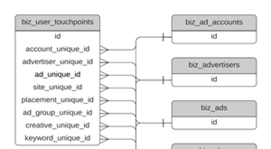

# Esquema de Data Warehouse {#data-warehouse-schema}

O Data Warehouse permite rastrear o quanto você desejar, relatar os dados de atribuição onde quiser e conectá-los a outros conjuntos de dados.

>[!IMPORTANT]
>
>* As linhas com um valor para _DELETED_DATE serão mantidas por 7 dias e, em seguida, removidas do Snowflake.
>* Os fusos horários usados no Snowflake seguem o Tempo Universal Coordenado (UTC).

>[!NOTE]
>
>[Clique aqui](#sample-queries) para ver consultas de amostra na parte inferior deste artigo.

## Diagramas de relação de entidade {#entity-relationship-diagrams}

O _Modelo de dados do Data Warehouse_ ERD mostra como os dados no data warehouse devem fluir e ser vinculados. Esse diagrama não inclui todas as tabelas disponíveis no data warehouse porque algumas delas representam tabelas de mapeamento, exibições de outras tabelas já presentes ou tabelas obsoletas que não recomendamos mais usar. Consulte as descrições detalhadas de tabelas e colunas presentes no data warehouse abaixo. Muitas dessas tabelas contêm campos desnormalizados, no entanto, esse diagrama é o modelo de dados recomendado, aproveitando dados de tabelas dimensionais.

O _Modelo de dados dimensionais de anúncios_ ERD apresenta uma exibição de como tabelas para dimensões específicas de anúncios podem ser melhor vinculadas às tabelas no modelo de dados principal. Embora as dimensões de anúncios também sejam desnormalizadas em outras tabelas, isso representa o modelo recomendado para unir essas dimensões.

_Clique em uma imagem para obter sua versão em tamanho real_

<table style="table-layout:auto"> 
 <colgroup> 
  <col> 
  <col> 
 </colgroup> 
 <tbody> 
  <tr> 
   <td><strong>Modelo de dados do Data Warehouse</strong></td> 
   <td><strong>Modelo de dados dimensionais de anúncios</strong></td> 
  </tr> 
  <tr> 
   <td> 
    <div> 
     <p><a href="assets/data-warehouse-data-model.pdf"></a></p> 
    </div></td>
   <td> 
    <div> 
     <p><a href="assets/ads-dimensional-data-model.pdf"></a></p>
    </div></td> 
  </tr> 
 </tbody> 
</table>

## Exibições {#views}

### BIZ_ACCOUNTS {#biz-accounts}

Contas importadas do sistema de origem.

<table>
  <tbody>
    <tr>
      <th><strong>Coluna</strong></th>
      <th><strong>Tipo de dados</strong></th>
      <th><strong>Descrição</strong></th>
      <th><strong>Dados de amostra</strong></th>
    </tr>
    <tr>
      <td>ID</td>
      <td>varchar</td>
      <td>A ID da conta do sistema de origem.</td>
      <td>0013100001kpAZxAAM</td>
    </tr>
    <tr>
      <td>CREATED_DATE</td>
      <td>timestamp_ntz</td>
      <td>A data de criação da conta, no sistema de origem.</td>
      <td>2016-08-28 00:32:55.000</td>
    </tr>
    <tr>
      <td>MODIFIED_DATE</td>
      <td>timestamp_ntz</td>
      <td>A última data de modificação da conta, no sistema de origem.</td>
      <td>2018-08-01 17:38:30.000</td>
    </tr>
    <tr>
      <td>NAME</td>
      <td>varchar</td>
      <td>O Nome da conta, no sistema de origem.</td>
      <td>[!DNL Marketo Measure]</td>
    </tr>
    <tr>
      <td>WEB_SITE</td>
      <td>varchar</td>
      <td>Site da conta, conforme registrado no sistema de origem, usado para o mapeamento de leads na conta.</td>
      <td>www.adobe.com</td>
    </tr>
    <tr>
      <td>ENGAGEMENT_RATING</td>
      <td>varchar</td>
      <td>Um grau de letra (A, B, C, D, N/A) que é gerado pelo [!DNL Marketo Measure] Modelo de aprendizado de máquina. Será nulo se o ABM estiver desabilitado.</td>
      <td>B</td>
    </tr>
    <tr>
      <td>ENGAGEMENT_SCORE</td>
      <td>number(38,19)</td>
      <td>Uma pontuação numérica calculada pelo [!DNL Marketo Measure] Aprendizado de máquina para gerar a Pontuação preditiva de engajamento (Engagement_Rating). Será nulo se o ABM estiver desabilitado.</td>
      <td>0.1417350147058800000</td>
    </tr>
    <tr>
      <td>DOMAIN</td>
      <td>varchar</td>
      <td>A versão analisada do site, armazenando somente o domínio.</td>
      <td>adobe</td>
    </tr>
    <tr>
      <td>IS_DELETED</td>
      <td>boolean</td>
      <td>Se o registro é ou não excluído no sistema de origem.</td>
      <td>false</td>
    </tr>
    <tr>
      <td>CUSTOM_PROPERTIES</td>
      <td>varchar</td>
      <td>Propriedades personalizadas que o [!DNL Marketo Measure] importou do sistema de origem, no formato JSON.</td>
      <td>{"Account_Type__c": "Security", "Foo":"Bar"}</td>
    </tr>
    <tr>
      <td>_CREATED_DATE</td>
      <td>timestamp_ntz</td>
      <td>Data em que o registro foi criado no Snowflake.</td>
      <td>2020-01-01 01:01:00.000</td>
    </tr>
    <tr>
      <td>_MODIFIED_DATE</td>
      <td>timestamp_ntz</td>
      <td>Data em que o registro foi modificado pela última vez no Snowflake.</td>
      <td>2020-01-01 01:01:00.000</td>
    </tr>
    <tr>
      <td>_DELETED_DATE</td>
      <td>timestamp_ntz</td>
      <td>Data em que o registro foi marcado como excluído no Snowflake.</td>
      <td>2020-01-01 01:01:00.000</td>
    </tr>
    <tr>
      <td><b>∗</b> INDÚSTRIA</td>
      <td>varchar</td>
      <td>Principal empresa da conta.</td>
      <td>Varejo, telecomunicações</td>
    </tr>
    <tr>
      <td><b>∗</b> PAÍS</td>
      <td>varchar</td>
      <td>Parte onde fica o país no endereço da conta.</td>
      <td>EUA, Canadá</td>
    </tr>
  </tbody>
</table>
<p>
<b>*</b> <i>Disponível somente no Marketo Measure Ultimate</i>
<p>

### BIZ_ACCOUNT_TO_EMAILS {#biz-account-to-emails}

Tabela de mapeamento entre endereços de email de lead/contato e contas conhecidas. Esta tabela estará vazia se o ABM estiver desativado.

<table>
  <tbody>
    <tr>
    <th><strong>Coluna</strong></th>
      <th><strong>Tipo de dados</strong></th>
      <th><strong>Descrição</strong></th>
      <th><strong>Dados de amostra</strong></th>
    </tr>
    <tr>
      <td>ID</td>
      <td>varchar</td>
      <td>Uma ID exclusiva para o registro.</td>
      <td>0013800001MMPPiAAP_person@adobe.com|2022-01-05 17:22:13.000</td>
    </tr>
    <tr>
      <td>ACCOUNT_ID</td>
      <td>varchar</td>
      <td>ID da conta do sistema de origem.</td>
      <td>0013100001phrBAAAY</td>
    </tr>
    <tr>
      <td>EMAIL</td>
      <td>varchar</td>
      <td>Endereço de email que foi mapeado para a Conta, por meio de Relações de contato ou Mapeamento de lead para conta.</td>
      <td>person@adobe.com</td>
    </tr>
    <tr>
      <td>MODIFIED_DATE</td>
      <td>timestamp_ntz</td>
      <td>A última data de modificação da conta, no sistema de origem.</td>
      <td>2018-08-31 23:53:39.000</td>
    </tr>
    <tr>
      <td>CREATED_DATE</td>
      <td>timestamp_ntz</td>
      <td>A data de criação da conta, no sistema de origem.</td>
      <td>2018-08-18 22:01:32.000</td>
    </tr>
    <tr>
      <td>IS_DELETED</td>
      <td>boolean</td>
      <td>Se o registro é ou não considerado excluído.</td>
      <td>false</td>
    </tr>
    <tr>
      <td>_CREATED_DATE</td>
      <td>timestamp_ntz</td>
      <td>Data em que o registro foi criado no Snowflake.</td>
      <td>2020-01-01 01:01:00.000</td>
    </tr>
    <tr>
      <td>_MODIFIED_DATE</td>
      <td>timestamp_ntz</td>
      <td>Data em que o registro foi modificado pela última vez no Snowflake.</td>
      <td>2020-01-01 01:01:00.000</td>
    </tr>
    <tr>
      <td>_DELETED_DATE</td>
      <td>timestamp_ntz</td>
      <td>Data em que o registro foi marcado como excluído no Snowflake.</td>
      <td>2020-01-01 01:01:00.000</td>
    </tr>
  </tbody>
</table>

### BIZ_ACTIVITIES {#biz-activities}

Atividades importadas de um sistema de origem ou Conta de anúncio conectada.

<table>
  <tbody>
  <tr>
    <th><strong>Coluna</strong></th>
    <th><strong>Tipo de dados</strong></th>
    <th><strong>Descrição</strong></th>
    <th><strong>Dados de amostra</strong></th>
    </tr>
    <tr>
      <td>ID</td>
      <td>varchar</td>
      <td>A ID da atividade do sistema de origem.</td>
      <td>1678625515</td>
    </tr>
    <tr>
      <td>LEAD_ID</td>
      <td>varchar</td>
      <td>Id do lead associado à atividade.</td>
      <td>15530482</td>
    </tr>
    <tr>
      <td>CONTACT_ID</td>
      <td>varchar</td>
      <td>Id do contato associado à atividade.
      </td>
      <td>13792552</td>
    </tr>
    <tr>
      <td>ACTIVITY_TYPE_ID</td>
      <td>varchar</td>
      <td>Id do Tipo de atividade, no sistema de origem.</td>
      <td>104</td>
    </tr>
    <tr>
      <td>ACTIVITY_TYPE_NAME</td>
      <td>varchar</td>
      <td>O Nome da atividade, no sistema de origem.</td>
      <td>
        <p>alterar status em andamento</p>
      </td>
    </tr>
    <tr>
      <td>START_DATE</td>
      <td>timestamp_ntz</td>
      <td>Data inicial da atividade, no sistema de origem.</td>
      <td>2020-01-01 01:01:00.000</td>
    </tr>
    <tr>
      <td>END_DATE</td>
      <td>timestapm_ntz</td>
      <td>Data final da atividade, no sistema de origem.</td>
      <td>2020-01-01 01:01:00.000</td>
    </tr>
    <tr>
      <td>CAMPAIGN_ID</td>
      <td>varchar</td>
      <td>A ID da campanha da atividade faz parte do sistema de origem.</td>
      <td>
        <p>li.508038570.147643566</p>
      </td>
    </tr>
    <tr>
      <td>SOURCE_SYSTEM</td>
      <td>varchar</td>
      <td>Identifica o tipo de sistema de origem.</td>
      <td>Marketo</td>
    </tr>
    <tr>
      <td>CREATED_DATE</td>
      <td>timestamp_ntz</td>
      <td>Data em que a linha foi criada no sistema de origem.</td>
      <td>2020-01-01 01:01:00.000</td>
    </tr>
    <tr>
      <td>MODIFIED_DATE</td>
      <td>timestamp_ntz</td>
      <td>Data em que a linha foi modificada pela última vez no sistema de origem.</td>
      <td>2020-01-01 01:01:00.000</td>
    </tr>
    <tr>
      <td>IS_DELETED</td>
      <td>boolean</td>
      <td>Se o registro é considerado excluído ou não no sistema de origem.</td>
      <td>false</td>
    </tr>
    <tr>
      <td>AD_FORM_ID</td>
      <td>varchar</td>
      <td>Id do Formulário de anúncio do qual a atividade faz parte, no sistema de origem.</td>
      <td>li.507063119.3757704</td>
    </tr>
    <tr>
      <td>_CREATED_DATE</td>
      <td>timestamp_ntz</td>
      <td>Data em que o registro foi criado no Snowflake.</td>
      <td>2020-01-01 01:01:00.000</td>
    </tr>
    <tr>
      <td>_MODIFIED_DATE</td>
      <td>timestamp_ntz</td>
      <td>Data em que o registro foi modificado pela última vez no Snowflake.</td>
      <td>2020-01-01 01:01:00.000</td>
    </tr>
    <tr>
      <td>_DELETED_DATE</td>
      <td>timestamp_ntz</td>
      <td>Data em que o registro foi marcado como excluído no Snowflake.</td>
      <td>2020-01-01 01:01:00.000</td>
    </tr>
  </tbody>
</table>

### BIZ_ADS {#biz-ads}

Anúncios importados de qualquer conta de anúncio conectada.

<table>
  <tbody>
    <tr>
      <th><strong>Coluna</strong></th>
      <th><strong>Tipo de dados</strong></th>
      <th><strong>Descrição</strong></th>
      <th><strong>Dados de amostra</strong></th>
    </tr>
    <tr>
      <td>ID</td>
      <td>varchar</td>
      <td>Uma ID exclusiva para o anúncio.</td>
      <td>fb.106851586409075.6052044288804.6052044290004.6053457066804</td>
    </tr>
    <tr>
      <td>DISPLAY_ID</td>
      <td>varchar</td>
      <td>A ID do anúncio do sistema de origem.</td>
      <td>6053457066804</td>
    </tr>
    <tr>
      <td>AD_ACCOUNT_UNIQUE_ID</td>
      <td>varchar</td>
      <td>Id da Conta de anúncio da qual o anúncio foi importado.</td>
      <td>fb.106851586409075</td>
    </tr>
    <tr>
      <td>AD_ACCOUNT_NAME</td>
      <td>varchar</td>
      <td>Nome da conta de anúncio da qual o anúncio foi importado.</td>
      <td>[!DNL Marketo Measure] Conta</td>
    </tr>
    <tr>
      <td>ADVERTISER_UNIQUE_ID</td>
      <td>varchar</td>
      <td>ID do anunciante do anúncio, especificamente para Doubleclick.</td>
      <td>300181641</td>
    </tr>
    <tr>
      <td>ADVERTISER_NAME</td>
      <td>varchar</td>
      <td>Nome do anunciante, especificamente para Doubleclick.</td>
      <td>Marketing Analytics</td>
    </tr>
    <tr>
      <td>AD_GROUP_UNIQUE_ID</td>
      <td>varchar</td>
      <td>Id do Grupo de anúncios do anúncio.</td>
      <td>fb.106851586409075.6052044288804.6052044290004</td>
    </tr>
    <tr>
      <td>AD_GROUP_NAME</td>
      <td>varchar</td>
      <td>Nome do grupo de anúncios do anúncio.</td>
      <td>Conjunto de anúncios do Anúncio B</td>
    </tr>
    <tr>
      <td>AD_CAMPAIGN_UNIQUE_ID</td>
      <td>varchar</td>
      <td>Id da campanha do anúncio.</td>
      <td>fb.106851586409075.6052044288804</td>
    </tr>
    <tr>
      <td>AD_CAMPAIGN_NAME</td>
      <td>varchar</td>
      <td>Nome da campanha do anúncio.</td>
      <td>Campanha de geração de leads</td>
    </tr>
    <tr>
      <td>IS_ACTIVE</td>
      <td>boolean</td>
      <td>Se o anúncio ainda está ativo ou não no sistema de origem.</td>
      <td>false</td>
    </tr>
    <tr>
      <td>IS_DELETED</td>
      <td>boolean</td>
      <td>Se o anúncio foi excluído ou não no sistema de origem.</td>
      <td>false</td>
    </tr>
    <tr>
      <td>MODIFIED_DATE</td>
      <td>timestamp_ntz</td>
      <td>Data em que o registro foi modificado pela última vez.</td>
      <td>2018-08-02 06:35:59.000</td>
    </tr>
    <tr>
      <td>FIRST_IMPORTED</td>
      <td>timestamp_ntz</td>
      <td>Data em que o registro foi importado pela primeira vez do sistema de origem.</td>
      <td>2018-08-02 06:35:59.000</td>
    </tr>
    <tr>
      <td>NAME</td>
      <td>varchar</td>
      <td>Nome do anúncio, no sistema de origem.</td>
      <td>Anúncio 2</td>
    </tr>
    <tr>
      <td>NEEDS_UPDATE</td>
      <td>boolean</td>
      <td>Se o anúncio precisa ou não ser atualizado para marcação do [!DNL Marketo Measure].
      <p>(Campo de diagnóstico, usado pelo processamento interno.)
      </td>
      <td>false</td>
    </tr>
    <tr>
      <td>GROUPING_KEY</td>
      <td>varchar</td>
      <td>Campo de diagnóstico, usado para processamento interno.</td>
      <td>fb.106851586409075.6052044288804.6052044290004</td>
    </tr>
    <tr>
      <td>ENTITY_TYPE</td>
      <td>varchar</td>
      <td>O objeto ou entidade principal desta tabela. Nesse caso, “Anúncio”.</td>
      <td>Anúncio</td>
    </tr>
    <tr>
      <td>PROVIDER_TYPE</td>
      <td>varchar</td>
      <td>Nome do provedor do anúncio.</td>
      <td>Facebook</td>
    </tr>
    <tr>
      <td>URL_CURRENT</td>
      <td>varchar</td>
      <td>O URL da landing page.
        <p>(Campo de diagnóstico, para processamento interno.)
      </td>
      <td></td>
    </tr>
    <tr>
      <td>URL_OLD</td>
      <td>varchar</td>
      <td>Valor anterior de URL_CURRENT.
      <p>(Campo de diagnóstico, para processamento interno.)
      </td>
      <td></td>
    </tr>
    <tr>
      <td>URL_REQUESTED</td>
      <td>varchar</td>
      <td>O URL será decorado com parâmetros do [!DNL Marketo Measure].
      <p>(Campo de diagnóstico, para processamento interno.)
      </td>
      <td></td>
    </tr>
    <tr>
      <td>URL_ALTENATIVES</td>
      <td>varchar</td>
      <td>Importado do sistema de origem.
      <p>(Campo de diagnóstico, para processamento interno.)
      </td>
      <td></td>
    </tr>
    <tr>
      <td>ROW_KEY</td>
      <td>number(38,0)</td>
      <td>Chave estrangeira da exibição Biz_Facts.</td>
      <td>6008900572523230000</td>
    </tr>
    <tr>
      <td>_CREATED_DATE</td>
      <td>timestamp_ntz</td>
      <td>Data em que o registro foi criado no Snowflake.</td>
      <td>2020-01-01 01:01:00.000</td>
    </tr>
    <tr>
      <td>_MODIFIED_DATE</td>
      <td>timestamp_ntz</td>
      <td>Data em que o registro foi modificado pela última vez no Snowflake.</td>
      <td>2020-01-01 01:01:00.000</td>
    </tr>
    <tr>
      <td>_DELETED_DATE</td>
      <td>timestamp_ntz</td>
      <td>Data em que o registro foi marcado como excluído no Snowflake.</td>
      <td>2020-01-01 01:01:00.000</td>
    </tr>
  </tbody>
</table>

### BIZ_ADVERTISERS {#biz-advertisers}

Os anunciantes importados de qualquer conta de anúncio conectada.

<table>
  <tbody>
    <tr>
      <th>Coluna</th>
      <th>Tipo de dados</th>
      <th>Descrição</th>
      <th>Dados de amostra</th>
    </tr>
    <tr>
      <td>ID</td>
      <td>varchar</td>
      <td>Uma ID exclusiva do anunciante.</td>
      <td>dc.6114.9143143</td>
    </tr>
    <tr>
      <td>DISPLAY_ID</td>
      <td>varchar</td>
      <td>A ID do anunciante do sistema de origem.</td>
      <td>9143143</td>
    </tr>
    <tr>
      <td>AD_ACCOUNT_UNIQUE_ID</td>
      <td>varchar</td>
      <td>Id da Conta de anúncio da qual o anúncio foi importado.</td>
      <td>fb.106851586409075</td>
    </tr>
    <tr>
      <td>AD_ACCOUNT_NAME</td>
      <td>varchar</td>
      <td>Nome da conta de anúncio da qual o anúncio foi importado.</td>
      <td>[!DNL Marketo Measure] Conta</td>
    </tr>
    <tr>
      <td>ADVERTISER_UNIQUE_ID</td>
      <td>varchar</td>
      <td>Id do Anunciante, especificamente para Doubleclick.</td>
      <td>300181641</td>
    </tr>
    <tr>
      <td>ADVERTISER_NAME</td>
      <td>varchar</td>
      <td>Nome do anunciante, especificamente para Doubleclick.</td>
      <td>[!DNL Marketo Measure] Marketing Analytics</td>
    </tr>
    <tr>
      <td>AD_GROUP_UNIQUE_ID</td>
      <td>varchar</td>
      <td>Esperado que seja nulo, pois não há um Grupo de anúncios acima do Anunciante em qualquer hierarquia de anúncios.</td>
      <td>nulo</td>
    </tr>
    <tr>
      <td>AD_GROUP_NAME</td>
      <td>varchar</td>
      <td>Esperado que seja nulo, pois não há um Grupo de anúncios acima do Anunciante em qualquer hierarquia de anúncios.</td>
      <td>nulo</td>
    </tr>
    <tr>
      <td>AD_CAMPAIGN_UNIQUE_ID</td>
      <td>varchar</td>
      <td>Esperado que seja nulo, pois não há Campanha de publicidade acima do Anunciante em qualquer hierarquia de anúncios.</td>
      <td>nulo</td>
    </tr>
    <tr>
      <td>AD_CAMPAIGN_NAME</td>
      <td>varchar</td>
      <td>Esperado que seja nulo, pois não há Campanha acima do Anunciante de anúncio em qualquer hierarquia de anúncios.</td>
      <td>nulo</td>
    </tr>
    <tr>
      <td>IS_ACTIVE</td>
      <td>boolean</td>
      <td>Se o Anunciante ainda está ativo ou não no sistema de origem.</td>
      <td>true</td>
    </tr>
    <tr>
      <td>IS_DELETED</td>
      <td>boolean</td>
      <td>Se o Anunciante foi excluído ou não no sistema de origem.</td>
      <td>false</td>
    </tr>
    <tr>
      <td>MODIFIED_DATE</td>
      <td>timestamp_ntz</td>
      <td>Data em que o registro foi modificado pela última vez.</td>
      <td>2018-08-02 06:35:59.000</td>
    </tr>
    <tr>
      <td>FIRST_IMPORTED</td>
      <td>timestamp_ntz</td>
      <td>Data em que o registro foi importado pela primeira vez do sistema de origem.</td>
      <td>2018-08-02 06:35:59.000</td>
    </tr>
    <tr>
      <td>NAME</td>
      <td>varchar</td>
      <td>Nome do anunciante, no sistema de origem.</td>
      <td>[!DNL Marketo Measure] Marketing Analytics</td>
    </tr>
    <tr>
      <td>NEEDS_UPDATE</td>
      <td>boolean</td>
      <td>Se o anunciante precisa ou não ser atualizado para marcação do [!DNL Marketo Measure].
      <p>(Campo de diagnóstico, usado pelo processamento interno.)
      </td>
      <td>false</td>
    </tr>
    <tr>
      <td>GROUPING_KEY</td>
      <td>varchar</td>
      <td>Campo de diagnóstico, usado para processamento interno.</td>
      <td></td>
    </tr>
    <tr>
      <td>ENTITY_TYPE</td>
      <td>varchar</td>
      <td>O objeto ou entidade principal desta tabela. Nesse caso, “Anunciante”.</td>
      <td>Anunciante</td>
    </tr>
    <tr>
      <td>PROVIDER_TYPE</td>
      <td>varchar</td>
      <td>O Provedor de anúncios do anunciante.</td>
      <td>DoubleClick</td>
    </tr>
    <tr>
      <td>ROW_KEY</td>
      <td>number(38,0)</td>
      <td>Chave estrangeira da exibição Biz_Facts.</td>
      <td>6008900572523230000</td>
    </tr>
    <tr>
      <td>_CREATED_DATE</td>
      <td>timestamp_ntz</td>
      <td>Data em que o registro foi criado no Snowflake.</td>
      <td>2020-01-01 01:01:00.000</td>
    </tr>
    <tr>
      <td>_MODIFIED_DATE</td>
      <td>timestamp_ntz</td>
      <td>Data em que o registro foi modificado pela última vez no Snowflake.</td>
      <td>2020-01-01 01:01:00.000</td>
    </tr>
    <tr>
      <td>_DELETED_DATE</td>
      <td>timestamp_ntz</td>
      <td>Data em que o registro foi marcado como excluído no Snowflake.</td>
      <td>2020-01-01 01:01:00.000</td>
    </tr>
  </tbody>
</table>

### BIZ_AD_ACCOUNTS {#biz-ad-accounts}

Contas de anúncio importadas de qualquer conta de anúncio conectada.

<table>
  <tbody>
    <tr>
      <th>Coluna</th>
      <th>Tipo de dados</th>
      <th>Descrição</th>
      <th>Dados de amostra</th>
    </tr>
    <tr>
      <td>ID</td>
      <td>varchar</td>
      <td>
        <p>Um identificador exclusivo da conta de anúncio.</p>
      </td>
      <td>
        <p>aw.6601259029</p>
      </td>
    </tr>
    <tr>
      <td>
        <p>DISPLAY_ID</p>
      </td>
      <td>varchar</td>
      <td>A ID da conta do anúncio do sistema de origem.</td>
      <td>
        <p>6601259029</p>
      </td>
    </tr>
    <tr>
      <td>
        <p>AD_ACCOUNT_UNIQUE_ID</p>
      </td>
      <td>varchar</td>
      <td>Esperado que seja nulo, pois este é o registro das Contas de anúncio na hierarquia de anúncios.</td>
      <td>nulo</td>
    </tr>
    <tr>
      <td>
        <p>AD_ACCOUNT_NAME</p>
      </td>
      <td>varchar</td>
      <td>Esperado que seja nulo, pois este é o registro das Contas de anúncio na hierarquia de anúncios.</td>
      <td>nulo</td>
    </tr>
    <tr>
      <td>
        <p>ADVERTISER_UNIQUE_ID</p>
      </td>
      <td>varchar</td>
      <td>
        <p>Esperado que seja nulo, pois não há um Anunciante acima das Contas de anúncio em qualquer hierarquia de anúncios.</p>
      </td>
      <td>nulo</td>
    </tr>
    <tr>
      <td>
        <p>ADVERTISER_NAME</p>
      </td>
      <td>varchar</td>
      <td>
        <p>Esperado que seja nulo, pois não há um Anunciante acima das Contas de anúncio em qualquer hierarquia de anúncios.</p>
      </td>
      <td>nulo</td>
    </tr>
    <tr>
      <td>
        <p>AD_GROUP_UNIQUE_ID</p>
      </td>
      <td>varchar</td>
      <td>
        <p>Esperado que seja nulo, pois não há um Grupo de publicidade acima das Contas de anúncio em qualquer hierarquia de anúncios.</p>
      </td>
      <td>nulo</td>
    </tr>
    <tr>
      <td>
        <p>AD_GROUP_NAME</p>
      </td>
      <td>varchar</td>
      <td>
        <p>Esperado que seja nulo, pois não há um Grupo de publicidade acima das Contas de anúncio em qualquer hierarquia de anúncios.</p>
      </td>
      <td>nulo</td>
    </tr>
    <tr>
      <td>
        <p>AD_CAMPAIGN_UNIQUE_ID</p>
      </td>
      <td>varchar</td>
      <td>
        <p>Esperado que seja nulo, pois não há Campanha publicitária acima das Contas de anúncio em qualquer hierarquia de anúncios.</p>
      </td>
      <td>nulo</td>
    </tr>
    <tr>
      <td>
        <p>AD_CAMPAIGN_NAME</p>
      </td>
      <td>varchar</td>
      <td>
        <p>Esperado que seja nulo, pois não há Campanha publicitária acima das Contas de anúncio em qualquer hierarquia de anúncios.</p>
      </td>
      <td>nulo</td>
    </tr>
    <tr>
      <td>
        <p>IS_ACTIVE</p>
      </td>
      <td>
        <p>boolean</p>
      </td>
      <td>
        <p>Se a Conta de anúncio ainda está ativa ou não no sistema de origem.</p>
      </td>
      <td>
        <p>true</p>
      </td>
    </tr>
    <tr>
      <td>
        <p>IS_DELETED</p>
      </td>
      <td>
        <p>boolean</p>
      </td>
      <td>
        <p>Se a Conta de anúncio foi ou não excluída no sistema de origem.</p>
      </td>
      <td>
        <p>false</p>
      </td>
    </tr>
    <tr>
      <td>MODIFIED_DATE</td>
      <td>timestamp_ntz</td>
      <td>
        <p>Data em que o registro foi modificado pela última vez.</p>
      </td>
      <td>
        <p>2018-09-06 12:54:37.000</p>
      </td>
    </tr>
    <tr>
      <td>
        <p>FIRST_IMPORTED</p>
      </td>
      <td>timestamp_ntz</td>
      <td>
        <p>Data em que o registro foi importado pela primeira vez do sistema de origem.</p>
      </td>
      <td>
        <p>2018-08-02 06:35:58.000</p>
      </td>
    </tr>
    <tr>
      <td>
        <p>NAME</p>
      </td>
      <td>varchar</td>
      <td>Nome da conta do anúncio, no sistema de origem.</td>
      <td>
        <p>[!DNL Marketo Measure] Conta do anúncio</p>
      </td>
    </tr>
    <tr>
      <td>
        <p>NEEDS_UPDATE</p>
      </td>
      <td>
        <p>boolean</p>
      </td>
      <td>
        <p>Se o anunciante precisa ou não ser atualizado para marcação do [!DNL Marketo Measure].</p>
        <p>(Campo de diagnóstico, usado pelo processamento interno.)</p>
      </td>
      <td>
        <p>false</p>
      </td>
    </tr>
    <tr>
      <td>
        <p>GROUPING_KEY</p>
      </td>
      <td>varchar</td>
      <td>Campo de diagnóstico, usado para processamento interno.</td>
      <td></td>
    </tr>
    <tr>
      <td>
        <p>ENTITY_TYPE</p>
      </td>
      <td>varchar</td>
      <td>
        <p>O objeto ou entidade principal desta tabela. Nesse caso, “Conta”.</p>
      </td>
      <td>
        <p>Conta</p>
      </td>
    </tr>
    <tr>
      <td>
        <p>PROVIDER_TYPE</p>
      </td>
      <td>varchar</td>
      <td>
        <p>O nome do Provedor de anúncios para a Conta de anúncio.</p>
      </td>
      <td>
        <p>AdWords</p>
      </td>
    </tr>
    <tr>
      <td>
        <p>ACCOUNT_CURRENCY_UNIT</p>
      </td>
      <td>varchar</td>
      <td>
        <p>O código de moeda usado para a Conta de anúncio, no sistema de origem.</p>
      </td>
      <td>
        <p>USD</p>
      </td>
    </tr>
    <tr>
      <td>
        <p>COMPANY_ID</p>
      </td>
      <td>varchar</td>
      <td>Usado para processamento interno.</td>
      <td>1933789</td>
    </tr>
    <tr>
      <td>
        <p>SOURCE</p>
      </td>
      <td>varchar</td>
      <td>Analisado do URL de utm_source.</td>
      <td>
        <p>Redes sociais</p>
      </td>
    </tr>
    <tr>
      <td>
        <p>MEDIUM</p>
      </td>
      <td>varchar</td>
      <td>Analisado do URL de utm_medium.</td>
      <td>
        <p>lisu07261601</p>
      </td>
    </tr>
    <tr>
      <td>
        <p>LAST_30_DAYS_COST</p>
      </td>
      <td>
        <p>number(38,19)</p>
      </td>
      <td>
        <p>A quantidade de gastos importada nos últimos 30 dias, aplicável somente ao AdWords.</p>
      </td>
      <td>
        <p>17260,000000000000000000</p>
      </td>
    </tr>
    <tr>
      <td>
        <p>LAST_30_DAYS_IMPRESSIONS</p>
      </td>
      <td>
        <p>number(38,0)</p>
      </td>
      <td>
        <p>O número de impressões dos últimos 30 dias, aplicável somente ao AdWords.</p>
      </td>
      <td>
        <p>730060</p>
      </td>
    </tr>
    <tr>
      <td>
        <p>LAST_30_DAYS_CLICKS</p>
      </td>
      <td>
        <p>number(38,0)</p>
      </td>
      <td>
        <p>O número de cliques dos últimos 30 dias, aplicável somente ao AdWords.</p>
      </td>
      <td>
        <p>3400</p>
      </td>
    </tr>
    <tr>
      <td>
        <p>LAST_30_DAYS_CONVERSIONS</p>
      </td>
      <td>
        <p>number(38,0)</p>
      </td>
      <td>
        <p>O número de conversões relatadas nos últimos 30 dias, aplicável somente ao AdWords.</p>
      </td>
      <td>
        <p>180</p>
      </td>
    </tr>
    <tr>
      <td>
        <p>TRACKING_URL_TEMPLATE</p>
      </td>
      <td>varchar</td>
      <td>Usado para diagnósticos internos.</td>
      <td>
        <p>http://cdn.adobe.com/redir?lp={lpurl}&amp;_bt={creative}&amp;_bk={keyword}&amp;_bm={matchType}</p>
      </td>
    </tr>
    <tr>
      <td>
        <p>TRACKING_URL_TEMPLATE_OLD</p>
      </td>
      <td>varchar</td>
      <td>Usado para diagnósticos internos.</td>
      <td></td>
    </tr>
    <tr>
      <td>
        <p>TRACKING_URL_TEMPLATE_REQUESTED</p>
      </td>
      <td>varchar</td>
      <td>Usado para diagnósticos internos.</td>
      <td></td>
    </tr>
    <tr>
      <td>
        <p>TRACKING_URL_TEMPLATE_APPLIED</p>
      </td>
      <td>varchar</td>
      <td>
        <p>O modelo de rastreamento foi adicionado no nível da Conta de anúncio para AdWords ou Bing para marcação de landing pages.</p>
      </td>
      <td>
        <p>http://cdn.adobe.com/redir?lp={lpurl}&amp;_bt={creative}&amp;_bk={keyword}&amp;_bm={matchType}</p>
      </td>
    </tr>
    <tr>
      <td>
        <p>ROW_KEY</p>
      </td>
      <td>
        <p>number(38,0)</p>
      </td>
      <td>
        <p>Chave estrangeira da exibição Biz_Facts.</p>
      </td>
      <td>
        <p>-4609512587744160000</p>
      </td>
    </tr>
    <tr>
      <td>_CREATED_DATE</td>
      <td>timestamp_ntz</td>
      <td>Data em que o registro foi criado no Snowflake.</td>
      <td>2020-01-01 01:01:00.000</td>
    </tr>
    <tr>
      <td>_MODIFIED_DATE</td>
      <td>timestamp_ntz</td>
      <td>Data em que o registro foi modificado pela última vez no Snowflake.</td>
      <td>2020-01-01 01:01:00.000</td>
    </tr>
    <tr>
      <td>_DELETED_DATE</td>
      <td>timestamp_ntz</td>
      <td>Data em que o registro foi marcado como excluído no Snowflake.</td>
      <td>2020-01-01 01:01:00.000</td>
    </tr>
  </tbody>
</table>

### BIZ_AD_CAMPAIGNS {#biz-ad-campaigns}

Campanhas importadas de contas de anúncios conectadas, sistemas de origem, utm e autorreportadas.

<table>
  <tbody>
    <tr>
      <th>Coluna</th>
      <th>Tipo de dados</th>
      <th>Descrição</th>
      <th>Dados de amostra</th>
    </tr>
    <tr>
       <td>ID</td>
      <td>varchar</td>
      <td>
        <p>Id exclusiva da campanha.</p>
      </td>
      <td>
        <p>aw.6601259029.285114995</p>
      </td>
    </tr>
    <tr>
      <td>
        <p>DISPLAY_ID</p>
      </td>
      <td>varchar</td>
      <td>A ID da campanha do sistema de origem.</td>
      <td>
        <p>285114995</p>
      </td>
    </tr>
    <tr>
      <td>
        <p>AD_ACCOUNT_UNIQUE_ID</p>
      </td>
      <td>varchar</td>
      <td>
        <p>Id da conta de anúncio da qual a campanha foi importada.</p>
      </td>
      <td>
        <p>aw.6601259029</p>
      </td>
    </tr>
    <tr>
      <td>
        <p>AD_ACCOUNT_NAME</p>
      </td>
      <td>varchar</td>
      <td>
        <p>Nome da Conta de anúncio da qual a Campanha foi importada.</p>
      </td>
      <td>
        <p>[!DNL Marketo Measure]</p>
      </td>
    </tr>
    <tr>
      <td>
        <p>ADVERTISER_UNIQUE_ID</p>
      </td>
      <td>varchar</td>
      <td>
        <p>Id do anunciante da campanha, especificamente para Doubleclick.</p>
      </td>
      <td>
        <p>300181641</p>
      </td>
    </tr>
    <tr>
      <td>
        <p>ADVERTISER_NAME</p>
      </td>
      <td>varchar</td>
      <td>
        <p>Nome do anunciante da campanha, especificamente para Doubleclick.</p>
      </td>
      <td>
        <p>Marketing Analytics</p>
      </td>
    </tr>
    <tr>
      <td>
        <p>AD_GROUP_UNIQUE_ID</p>
      </td>
      <td>varchar</td>
      <td>
        <p>Esperado que seja nulo, pois não há um Grupo de anúncios acima da Campanha em qualquer hierarquia de anúncios.</p>
      </td>
      <td>
        <p>nulo</p>
      </td>
    </tr>
    <tr>
      <td>
        <p>AD_GROUP_NAME</p>
      </td>
      <td>varchar</td>
      <td>
        <p>Esperado que seja nulo, pois não há um Grupo de anúncios acima da Campanha em qualquer hierarquia de anúncios.</p>
      </td>
      <td>nulo</td>
    </tr>
    <tr>
      <td>
        <p>AD_CAMPAIGN_UNIQUE_ID</p>
      </td>
      <td>varchar</td>
      <td>
        <p>Id exclusiva da campanha, use o campo Id.</p>
      </td>
      <td></td>
    </tr>
    <tr>
      <td>
        <p>AD_CAMPAIGN_NAME</p>
      </td>
      <td>varchar</td>
      <td>
        <p>Nome da campanha, use o campo Nome.</p>
      </td>
      <td></td>
    </tr>
    <tr>
      <td>
        <p>IS_ACTIVE</p>
      </td>
      <td>
        <p>boolean</p>
      </td>
      <td>
        <p>Se a Campanha ainda está ativa ou não no sistema de origem.</p>
      </td>
      <td>
        <p>true</p>
      </td>
    </tr>
    <tr>
      <td>
        <p>IS_DELETED</p>
      </td>
      <td>
        <p>boolean</p>
      </td>
      <td>
        <p>Se a Campanha foi excluída ou não no sistema de origem.</p>
      </td>
      <td>
        <p>false</p>
      </td>
    </tr>
    <tr>
      <td>MODIFIED_DATE</td>
      <td>timestamp_ntz</td>
      <td>
        <p>Data em que o registro foi modificado pela última vez.</p>
      </td>
      <td>
        <p>2018-08-02 06:35:58.000</p>
      </td>
    </tr>
    <tr>
      <td>
        <p>FIRST_IMPORTED</p>
      </td>
      <td>timestamp_ntz</td>
      <td>
        <p>Data em que o registro foi importado pela primeira vez do sistema de origem.</p>
      </td>
      <td>
        <p>2018-08-02 06:35:58.000</p>
      </td>
    </tr>
    <tr>
      <td>
        <p>NAME</p>
      </td>
      <td>varchar</td>
      <td>
        <p>Nome da campanha.</p>
      </td>
      <td>
        <p>Redirecionamento de parceiros</p>
      </td>
    </tr>
    <tr>
      <td>
        <p>NEEDS_UPDATE</p>
      </td>
      <td>
        <p>boolean</p>
      </td>
      <td>
        <p>Se a campanha precisa ou não ser atualizada para marcação do [!DNL Marketo Measure].</p>
        <p>(Campo de diagnóstico, usado pelo processamento interno.)</p>
      </td>
      <td>
        <p>false</p>
      </td>
    </tr>
    <tr>
      <td>
        <p>GROUPING_KEY</p>
      </td>
      <td>varchar</td>
      <td>Campo de diagnóstico, usado para processamento interno.</td>
      <td></td>
    </tr>
    <tr>
      <td>
        <p>ENTITY_TYPE</p>
      </td>
      <td>varchar</td>
      <td>
        <p>O objeto ou entidade principal desta tabela. Nesse caso, “Campanha”.</p>
      </td>
      <td>
        <p>Campanha</p>
      </td>
    </tr>
    <tr>
      <td>
        <p>PROVIDER_TYPE</p>
      </td>
      <td>varchar</td>
      <td>
        <p>Nome do provedor de anúncios para a campanha.</p>
      </td>
      <td>
        <p>AdWords</p>
      </td>
    </tr>
    <tr>
      <td>
        <p>DAILY_BUDGET</p>
      </td>
      <td>
        <p>number(38,19)</p>
      </td>
      <td>
        <p>O orçamento diário definido na Plataforma de publicidade da campanha.</p>
      </td>
      <td>
        <p>0,0000000000000000000</p>
      </td>
    </tr>
    <tr>
      <td>
        <p>TRACKING_URL_TEMPLATE</p>
      </td>
      <td>varchar</td>
      <td>Usado para diagnósticos internos.</td>
      <td></td>
    </tr>
    <tr>
      <td>
        <p>TRACKING_URL_TEMPLATE_OLD</p>
      </td>
      <td>varchar</td>
      <td>Usado para diagnósticos internos.</td>
      <td></td>
    </tr>
    <tr>
      <td>
        <p>TRACKING_URL_TEMPLATE_REQUESTED</p>
      </td>
      <td>varchar</td>
      <td>Usado para diagnósticos internos.</td>
      <td></td>
    </tr>
    <tr>
      <td>
        <p>TRACKING_URL_TEMPLATE_APPLIED</p>
      </td>
      <td>varchar</td>
      <td>
        <p>O modelo de rastreamento adicionado no nível da Campanha para AdWords ou Bing para marcação de landing pages.</p>
      </td>
      <td>
        <p>http://cdn.adobe.com/redir?lp={lpurl}&amp;_bt={creative}&amp;_bk={keyword}&amp;_bm={matchType}</p>
      </td>
    </tr>
    <tr>
      <td>
        <p>ROW_KEY</p>
      </td>
      <td>
        <p>number(38,0)</p>
      </td>
      <td>
        <p>Chave estrangeira da exibição Biz_Facts.</p>
      </td>
      <td>
        <p>-6008900572523230000</p>
      </td>
    </tr>
    <tr>
      <td>_CREATED_DATE</td>
      <td>timestamp_ntz</td>
      <td>Data em que o registro foi criado no Snowflake.</td>
      <td>2020-01-01 01:01:00.000</td>
    </tr>
    <tr>
      <td>_MODIFIED_DATE</td>
      <td>timestamp_ntz</td>
      <td>Data em que o registro foi modificado pela última vez no Snowflake.</td>
      <td>2020-01-01 01:01:00.000</td>
    </tr>
    <tr>
      <td>_DELETED_DATE</td>
      <td>timestamp_ntz</td>
      <td>Data em que o registro foi marcado como excluído no Snowflake.</td>
      <td>2020-01-01 01:01:00.000</td>
    </tr>
  </tbody>
</table>

### BIZ_AD_FORMS {#biz-ad-forms}

Formulários de anúncio importados de qualquer conta de anúncio conectada.

<table>
  <tr>
    <th>
      <p>Coluna</p>
    </th>
    <th>
      <p>Tipo de dados</p>
    </th>
    <th>
      <p>Descrição</p>
    </th>
    <th>
      <p>Dados de amostra</p>
    </th>
  </tr>
  <tbody>
    <tr>
       <td>ID</td>
      <td>varchar</td>
      <td>
        <p>Uma ID exclusiva do Formulário de anúncio.</p>
      </td>
      <td>
        <p>li.507063119.3757704</p>
      </td>
    </tr>
    <tr>
      <td>
        <p>AD_ACCOUNT_UNIQUE_ID</p>
      </td>
      <td>varchar</td>
      <td>
        <p>Id da Conta de anúncio da qual o Formulário de anúncio foi importado.</p>
      </td>
      <td>
        <p>li.507063119</p>
      </td>
    </tr>
    <tr>
      <td>
        <p>AD_ACCOUNT_NAME</p>
      </td>
      <td>varchar</td>
      <td>
        <p>Nome da conta de anúncio da qual o formulário de anúncio foi importado.</p>
      </td>
      <td>
        <p>[!DNL Marketo Measure]</p>
      </td>
    </tr>
    <tr>
      <td>
        <p>IS_DELETED</p>
      </td>
      <td>
        <p>boolean</p>
      </td>
      <td>
        <p>Status excluído do sistema de origem. Definido como excluído se o status for Rascunho, Arquivado ou Cancelado.</p>
      </td>
      <td>
        <p>false</p>
      </td>
    </tr>
    <tr>
      <td>MODIFIED_DATE</td>
      <td>timestamp_ntz</td>
      <td>
        <p>Data em que o registro foi modificado pela última vez.</p>
      </td>
      <td>
        <p>2018-08-02 06:35:58.000</p>
      </td>
    </tr>
    <tr>
      <td>
        <p>FIRST_IMPORTED</p>
      </td>
      <td>timestamp_ntz</td>
      <td>
        <p>Data em que o registro foi importado pela primeira vez do sistema de origem.</p>
      </td>
      <td>
        <p>2018-08-02 06:35:58.000</p>
      </td>
    </tr>
    <tr>
      <td>
        <p>NAME</p>
      </td>
      <td>varchar</td>
      <td>
        <p>Nome do formulário de anúncio.</p>
      </td>
      <td>
        <p>NSPA Ebook LGF (maio de 2020)</p>
      </td>
    </tr>
    <tr>
      <td>
        <p>ENTITY_TYPE</p>
      </td>
      <td>varchar</td>
      <td>
        <p>O objeto ou entidade principal desta tabela. Nesse caso, “AdForm”.</p>
      </td>
      <td>
        <p>AdForm</p>
      </td>
    </tr>
    <tr>
      <td>
        <p>PROVIDER_TYPE</p>
      </td>
      <td>varchar</td>
      <td>
        <p>Nome do Provedor do formulário de anúncio.</p>
      </td>
      <td>
        <p>LinkedIn</p>
      </td>
    </tr>
    <tr>
      <td>
        <p>DESCRIPTION</p>
      </td>
      <td>varchar</td>
      <td>
        <p>Descrição do formulário de anúncio.</p>
      </td>
      <td>
        <p>Saiba como a automação inteligente pode aumentar a eficiência do processo em aplicativos de refinanciamento de empréstimos hipotecários.</p>
      </td>
    </tr>
    <tr>
      <td>
        <p>HEADLINE</p>
      </td>
      <td>varchar</td>
      <td>Título do formulário de anúncio.</td>
      <td>
        <p>É hora de automatizar o processo do aplicativo de refinanciamento</p>
      </td>
    </tr>
    <tr>
      <td>
        <p>LANDING_URL</p>
      </td>
      <td>varchar</td>
      <td>URL inicial do Formulário de anúncio.</td>
      <td>
        <p>https://adobe.com/blog/refinancing-application-process/</p>
      </td>
    </tr>
    <tr>
      <td>
        <p>QUESTIONS</p>
      </td>
      <td>varchar</td>
      <td>Lista de perguntas do Formulário de anúncio.</td>
      <td>
        <p>Nome:Sobrenome:Endereço de email:País/Região:Cargo:Nome da empresa</p>
      </td>
    </tr>
    <tr>
      <td>
        <p>STATUS</p>
      </td>
      <td>varchar</td>
      <td>
        <p>Status do Formulário de anúncio.</p>
      </td>
      <td>
        <p>enviado</p>
      </td>
    </tr>
    <tr>
      <td>_CREATED_DATE</td>
      <td>timestamp_ntz</td>
      <td>Data em que o registro foi criado no Snowflake.</td>
      <td>2020-01-01 01:01:00.000</td>
    </tr>
    <tr>
      <td>_MODIFIED_DATE</td>
      <td>timestamp_ntz</td>
      <td>Data em que o registro foi modificado pela última vez no Snowflake.</td>
      <td>2020-01-01 01:01:00.000</td>
    </tr>
    <tr>
      <td>_DELETED_DATE</td>
      <td>timestamp_ntz</td>
      <td>Data em que o registro foi marcado como excluído no Snowflake.</td>
      <td>2020-01-01 01:01:00.000</td>
    </tr>
    <tr>
      <td>SOURCE_ID</td>
      <td>varchar</td>
      <td>Id da Origem da qual o registro se originou.</td>
      <td>aw.3284209</td>
    </tr>
  </tbody>
</table>

### BIZ_AD_GROUPS {#biz-ad-groups}

Grupos de anúncios importados de qualquer conta de anúncio conectada.

<table>
  <tbody>
    <tr>
      <th>Coluna</th>
      <th>Tipo de dados</th>
      <th>Descrição</th>
      <th>Dados de amostra</th>
    </tr>
    <tr>
       <td>ID</td>
      <td>varchar</td>
      <td>
        <p>Uma ID exclusiva do Grupo de anúncios.</p>
      </td>
      <td>
        <p>aw.6601259029.317737955.23105326115</p>
      </td>
    </tr>
    <tr>
      <td>
        <p>DISPLAY_ID</p>
      </td>
      <td>varchar</td>
      <td>A ID do grupo de anúncios do sistema de origem.</td>
      <td>
        <p>23105326115</p>
      </td>
    </tr>
    <tr>
      <td>
        <p>AD_ACCOUNT_UNIQUE_ID</p>
      </td>
      <td>varchar</td>
      <td>
        <p>Id da conta de anúncio da qual o grupo de anúncios foi importado.</p>
      </td>
      <td>
        <p>aw.6601259029</p>
      </td>
    </tr>
    <tr>
      <td>
        <p>AD_ACCOUNT_NAME</p>
      </td>
      <td>varchar</td>
      <td>
        <p>Nome da Conta de anúncio da qual o Grupo de anúncios foi importado.</p>
      </td>
      <td>
        <p>[!DNL Marketo Measure]</p>
      </td>
    </tr>
    <tr>
      <td>
        <p>ADVERTISER_UNIQUE_ID</p>
      </td>
      <td>varchar</td>
      <td>
        <p>Esperado que seja nulo, pois não há um Grupo de anúncios na hierarquia de anúncios duplicados.</p>
      </td>
      <td>
        <p>nulo</p>
      </td>
    </tr>
    <tr>
      <td>
        <p>ADVERTISER_NAME</p>
      </td>
      <td>varchar</td>
      <td>
        <p>Esperado que seja nulo, pois não há um Grupo de anúncios na hierarquia de anúncios duplicados.</p>
      </td>
      <td>
        <p>nulo</p>
      </td>
    </tr>
    <tr>
      <td>
        <p>AD_GROUP_UNIQUE_ID</p>
      </td>
      <td>varchar</td>
      <td>
        <p>Esperado que seja nulo, pois é o registro do Grupo de publicidade na hierarquia.</p>
      </td>
      <td>
        <p>nulo</p>
      </td>
    </tr>
    <tr>
      <td>
        <p>AD_GROUP_NAME</p>
      </td>
      <td>varchar</td>
      <td>
        <p>Esperado que seja nulo, pois é o registro do Grupo de publicidade na hierarquia.</p>
      </td>
      <td>
        <p>nulo</p>
      </td>
    </tr>
    <tr>
      <td>
        <p>AD_CAMPAIGN_UNIQUE_ID</p>
      </td>
      <td>varchar</td>
      <td>
        <p>Id da campanha para o Grupo de anúncios.</p>
      </td>
      <td>
        <p>aw.6601259029.317737955</p>
      </td>
    </tr>
    <tr>
      <td>
        <p>AD_CAMPAIGN_NAME</p>
      </td>
      <td>varchar</td>
      <td>
        <p>Nome da campanha para o Grupo de anúncios.</p>
      </td>
      <td>
        <p>Atribuição de receita</p>
      </td>
    </tr>
    <tr>
      <td>
        <p>IS_ACTIVE</p>
      </td>
      <td>
        <p>boolean</p>
      </td>
      <td>
        <p>Se a Conta de anúncio ainda está ativa ou não no sistema de origem.</p>
      </td>
      <td>
        <p>true</p>
      </td>
    </tr>
    <tr>
      <td>
        <p>IS_DELETED</p>
      </td>
      <td>
        <p>boolean</p>
      </td>
      <td>
        <p>Se a Conta de anúncio foi ou não excluída no sistema de origem.</p>
      </td>
      <td>
        <p>false</p>
      </td>
    </tr>
    <tr>
      <td>MODIFIED_DATE</td>
      <td>timestamp_ntz</td>
      <td>
        <p>Data em que o registro foi modificado pela última vez.</p>
      </td>
      <td>
        <p>2018-08-02 06:36:14.000</p>
      </td>
    </tr>
    <tr>
      <td>
        <p>FIRST_IMPORTED</p>
      </td>
      <td>timestamp_ntz</td>
      <td>
        <p>Data em que o registro foi importado pela primeira vez do sistema de origem.</p>
      </td>
      <td>
        <p>2018-08-02 06:36:14.000</p>
      </td>
    </tr>
    <tr>
      <td>
        <p>NAME</p>
      </td>
      <td>varchar</td>
      <td>
        <p>Nome do grupo de anúncios.</p>
      </td>
      <td>
        <p>Atribuição de receita - Com base na conta</p>
      </td>
    </tr>
    <tr>
      <td>
        <p>NEEDS_UPDATE</p>
      </td>
      <td>
        <p>boolean</p>
      </td>
      <td>
        <p>Se o anunciante precisa ou não ser atualizado para marcação do [!DNL Marketo Measure].</p>
        <p>(Campo de diagnóstico, usado pelo processamento interno.)</p>
      </td>
      <td>
        <p>false</p>
      </td>
    </tr>
    <tr>
      <td>
        <p>GROUPING_KEY</p>
      </td>
      <td>varchar</td>
      <td>Campo de diagnóstico, usado para processamento interno.</td>
      <td></td>
    </tr>
    <tr>
      <td>
        <p>ENTITY_TYPE</p>
      </td>
      <td>varchar</td>
      <td>
        <p>O objeto ou entidade principal desta tabela. Nesse caso, “AdGroup”</p>
      </td>
      <td>
        <p>AdGroup</p>
      </td>
    </tr>
    <tr>
      <td>
        <p>PROVIDER_TYPE</p>
      </td>
      <td>varchar</td>
      <td>
        <p>Nome do Provedor de anúncios do Grupo de anúncios.</p>
      </td>
      <td>
        <p>AdWords</p>
      </td>
    </tr>
    <tr>
      <td>
        <p>AD_NETWORK_TYPE</p>
      </td>
      <td>varchar</td>
      <td>
        <p>Os meios nos quais o Grupo de anúncios está sendo executado.</p>
      </td>
      <td>
        <p>Pesquisar, Exibir, YouTube_Search, YouTube_Watch</p>
      </td>
    </tr>
    <tr>
      <td>
        <p>TRACKING_URL_TEMPLATE</p>
      </td>
      <td>varchar</td>
      <td>Usado para diagnósticos internos.</td>
      <td></td>
    </tr>
    <tr>
      <td>
        <p>TRACKING_URL_TEMPLATE_OLD</p>
      </td>
      <td>varchar</td>
      <td>Usado para diagnósticos internos.</td>
      <td></td>
    </tr>
    <tr>
      <td>
        <p>TRACKING_URL_TEMPLATE_REQUESTED</p>
      </td>
      <td>varchar</td>
      <td>Usado para diagnósticos internos.</td>
      <td></td>
    </tr>
    <tr>
      <td>
        <p>TRACKING_URL_TEMPLATE_APPLIED</p>
      </td>
      <td>varchar</td>
      <td>
        <p>O modelo de rastreamento foi adicionado no nível da Conta de anúncio para AdWords ou Bing para marcação de landing pages.</p>
      </td>
      <td>
        <p>http://cdn.adobe.com/redir?lp={lpurl}&amp;_bt={creative}&amp;_bk={keyword}&amp;_bm={matchType}</p>
      </td>
    </tr>
    <tr>
      <td>
        <p>ROW_KEY</p>
      </td>
      <td>
        <p>number(38,0)</p>
      </td>
      <td>
        <p>Chave estrangeira da exibição Biz_Facts.</p>
      </td>
      <td>
        <p>-5594512713562690000</p>
      </td>
    </tr>
    <tr>
      <td>_CREATED_DATE</td>
      <td>timestamp_ntz</td>
      <td>Data em que o registro foi criado no Snowflake.</td>
      <td>2020-01-01 01:01:00.000</td>
    </tr>
    <tr>
      <td>_MODIFIED_DATE</td>
      <td>timestamp_ntz</td>
      <td>Data em que o registro foi modificado pela última vez no Snowflake.</td>
      <td>2020-01-01 01:01:00.000</td>
    </tr>
    <tr>
      <td>_DELETED_DATE</td>
      <td>timestamp_ntz</td>
      <td>Data em que o registro foi marcado como excluído no Snowflake.</td>
      <td>2020-01-01 01:01:00.000</td>
    </tr>
  </tbody>
</table>

### BIZ_AD_PROVIDERS

<p>Provedores de anúncios de qualquer conta de anúncios conectada, incluindo uma entrada para relatórios próprios, se aplicável.</p>

<table>
  <tbody>
    <tr>
      <th>Coluna</th>
      <th>Tipo de dados</th>
      <th>Descrição</th>
      <th>Dados de amostra</th>
    </tr>
    <tr>
       <td>ID</td>
      <td>varchar</td>
      <td>
        <p>Uma ID exclusiva do provedor de anúncios.</p>
      </td>
      <td>
        <p>Bing</p>
      </td>
    </tr>
    <tr>
      <td>
        <p>NAME</p>
      </td>
      <td>varchar</td>
      <td>
        <p>Nome do provedor de anúncios.</p>
      </td>
      <td>
        <p>Bing</p>
      </td>
    </tr>
    <tr>
      <td>
        <p>ROW_KEY</p>
      </td>
      <td>
        <p>number(38,0)</p>
      </td>
      <td>
        <p>Chave estrangeira da exibição Biz_Facts.</p>
      </td>
      <td>
        <p>4783788151269206864</p>
      </td>
    </tr>
    <tr>
      <td>_CREATED_DATE</td>
      <td>timestamp_ntz</td>
      <td>Data em que o registro foi criado no Snowflake.</td>
      <td>2020-01-01 01:01:00.000</td>
    </tr>
    <tr>
      <td>_MODIFIED_DATE</td>
      <td>timestamp_ntz</td>
      <td>Data em que o registro foi modificado pela última vez no Snowflake.</td>
      <td>2020-01-01 01:01:00.000</td>
    </tr>
    <tr>
      <td>_DELETED_DATE</td>
      <td>timestamp_ntz</td>
      <td>Data em que o registro foi marcado como excluído no Snowflake.</td>
      <td>2020-01-01 01:01:00.000</td>
    </tr>
  </tbody>
</table>

### BIZ_ATTRIBUTION_TOUCHPOINTS {#biz-attribution-touchpoints}

<p>Buyer Attribution Touchpoints, todos os touchpoints associados a uma oportunidade.</p>
<table>
  <tbody>
    <tr>
      <th>Coluna</th>
      <th>Tipo de dados</th>
      <th>Descrição</th>
      <th>Dados de amostra</th>
    </tr>
    <tr>
       <td>ID</td>
      <td>varchar</td>
      <td>
        <p>Uma ID exclusiva do Buyer Attribution Touchpoint (BAT).</p>
      </td>
      <td>
        <p>BAT2_0060Z00000lFHtOQAW_</p>
        <p>0030Z00003K5bpKQAR_2017-06-20:01-05-20-6193330.0b5c5678807c</p>
      </td>
    </tr>
    <tr>
      <td>MODIFIED_DATE</td>
      <td>timestamp_ntz</td>
      <td>
        <p>Data em que o registro foi modificado pela última vez.</p>
      </td>
      <td>
        <p>2018-09-01 04:53:53.000</p>
      </td>
    </tr>
    <tr>
      <td>
        <p>OPPORTUNITY_ID</p>
      </td>
      <td>varchar</td>
      <td>
        <p>Id para da oportunidade à qual o BAT é atribuído.</p>
      </td>
      <td>
        <p>0060Z00000lFHtOQAW</p>
      </td>
    </tr>
    <tr>
      <td>CONTACT_ID</td>
      <td>varchar</td>
      <td>
        <p>Id do contato associado ao BAT.</p>
      </td>
      <td>
        <p>0030Z00003K5bpKQAR</p>
      </td>
    </tr>
    <tr>
      <td>EMAIL</td>
      <td>varchar</td>
      <td>Endereço de email associado ao BAT.</td>
      <td>person@adobe.com</td>
    </tr>
    <tr>
      <td>
        <p>ACCOUNT_ID</p>
      </td>
      <td>varchar</td>
      <td>
        <p>Id da conta à qual o BAT é atribuído.</p>
      </td>
      <td>
        <p>0013100001otbIAAAY</p>
      </td>
    </tr>
    <tr>
      <td>
        <p>USER_TOUCHPOINT_ID</p>
      </td>
      <td>varchar</td>
      <td>
        <p>Id do touchpoint do usuário que gerou o BAT.</p>
      </td>
      <td>
        <p>person@adobe.com_00v1B00003ZbWzHQAV</p>
      </td>
    </tr>
    <tr>
      <td>
        <p>TOUCHPOINT_DATE</p>
      </td>
      <td>timestamp_ntz</td>
      <td>
        <p>Data do touchpoint.</p>
      </td>
      <td>
        <p>2017-06-20 01:05:20.000</p>
      </td>
    </tr>
    <tr>
      <td>VISITOR_ID</td>
      <td>varchar</td>
      <td>ID do visitante associado ao BAT.</td>
      <td>v_277d79d01678498fea067c9b631bf6df</td>
    </tr>
    <tr>
      <td>
        <p>MARKETING_TOUCH_TYPE</p>
      </td>
      <td>varchar</td>
      <td>
        <p>O tipo de atividade, Visita da Web, Formulário da Web, Chat da Web, Chamada de telefone, Campanha [CRM] ou Atividade [CRM]. Referenciado no CRM como “Tipo de touchpoint”.</p>
      </td>
      <td>
        <p>Formulário da Web</p>
      </td>
    </tr>
    <tr>
      <td>
        <p>CHANNEL</p>
      </td>
      <td>varchar</td>
      <td>
        <p>O canal no qual o touchpoint se enquadra, conforme definido nas definições de canal personalizadas no aplicativo [!DNL Marketo Measure]. Referenciado no CRM como “Canal de marketing - Caminho”.</p>
      </td>
      <td>
        <p>Social.LinkedIn</p>
      </td>
    </tr>
    <tr>
      <td>
        <p>CATEGORY1</p>
      </td>
      <td>varchar</td>
      <td>
        <p>O valor do segmento para a 1ª categoria em que o touchpoint se enquadra, conforme definido nas definições de segmento no aplicativo [!DNL Marketo Measure]. Referenciado no CRM como “Segmentos”.</p>
      </td>
      <td>
        <p>ABC</p>
      </td>
    </tr>
    <tr>
      <td>
        <p>CATEGORY2</p>
      </td>
      <td>varchar</td>
      <td>
        <p>O valor do segmento para a 2ª categoria em que o touchpoint se enquadra, conforme definido nas definições de segmento no aplicativo [!DNL Marketo Measure]. Referenciado no CRM como “Segmentos”.</p>
      </td>
      <td>
        <p>Sim</p>
      </td>
    </tr>
    <tr>
      <td>
        <p>CATEGORY3</p>
      </td>
      <td>varchar</td>
      <td>
        <p>O valor do segmento para a 3ª categoria em que o touchpoint se enquadra, conforme definido nas definições de segmento no aplicativo [!DNL Marketo Measure]. Referenciado no CRM como “Segmentos”.</p>
      </td>
      <td>
        <p>SMB</p>
      </td>
    </tr>
    <tr>
      <td>
        <p>CATEGORY4</p>
      </td>
      <td>varchar</td>
      <td>O valor do segmento para a 4ª categoria em que o touchpoint se enquadra, conforme definido nas definições de segmento no aplicativo [!DNL Marketo Measure]. Referenciado no CRM como “Segmentos”.</td>
      <td>
        <p>Novo negócio</p>
      </td>
    </tr>
    <tr>
      <td>
        <p>CATEGORY5</p>
      </td>
      <td>varchar</td>
      <td>O valor do segmento para a 5ª categoria em que o touchpoint se enquadra, conforme definido nas definições de segmento no aplicativo [!DNL Marketo Measure]. Referenciado no CRM como “Segmentos”.</td>
      <td></td>
    </tr>
    <tr>
      <td>
        <p>CATEGORY6</p>
      </td>
      <td>varchar</td>
      <td>O valor do segmento para a 6ª categoria em que o touchpoint se enquadra, conforme definido nas definições de segmento no aplicativo [!DNL Marketo Measure]. Referenciado no CRM como “Segmentos”.</td>
      <td></td>
    </tr>
    <tr>
      <td>
        <p>CATEGORY7</p>
      </td>
      <td>varchar</td>
      <td>O valor do segmento para a 7ª categoria em que o touchpoint se enquadra, conforme definido nas definições de segmento no aplicativo [!DNL Marketo Measure]. Referenciado no CRM como “Segmentos”.</td>
      <td></td>
    </tr>
    <tr>
      <td>
        <p>CATEGORY8</p>
      </td>
      <td>varchar</td>
      <td>O valor do segmento para a 8ª categoria em que o touchpoint se enquadra, conforme definido nas definições de segmento no aplicativo [!DNL Marketo Measure]. Referenciado no CRM como “Segmentos”.</td>
      <td></td>
    </tr>
    <tr>
      <td>
        <p>CATEGORY9</p>
      </td>
      <td>varchar</td>
      <td>O valor do segmento para a 9ª categoria em que o touchpoint se enquadra, conforme definido nas definições de segmento no aplicativo [!DNL Marketo Measure]. Referenciado no CRM como “Segmentos”.</td>
      <td></td>
    </tr>
    <tr>
      <td>
        <p>CATEGORY10</p>
      </td>
      <td>varchar</td>
      <td>O valor do segmento para a 10ª categoria em que o touchpoint se enquadra, conforme definido nas definições de segmento no aplicativo [!DNL Marketo Measure]. Referenciado no CRM como “Segmentos”.</td>
      <td></td>
    </tr>
    <tr>
      <td>
        <p>CATEGORY11</p>
      </td>
      <td>varchar</td>
      <td>O valor do segmento para a 11ª categoria em que o touchpoint se enquadra, conforme definido nas definições de segmento no aplicativo [!DNL Marketo Measure]. Referenciado no CRM como “Segmentos”.</td>
      <td></td>
    </tr>
    <tr>
      <td>
        <p>CATEGORY12</p>
      </td>
      <td>varchar</td>
      <td>O valor do segmento para a 12ª categoria em que o touchpoint se enquadra, conforme definido nas definições de segmento no aplicativo [!DNL Marketo Measure]. Referenciado no CRM como “Segmentos”.</td>
      <td></td>
    </tr>
    <tr>
      <td>
        <p>CATEGORY13</p>
      </td>
      <td>varchar</td>
      <td>O valor do segmento para a 13ª categoria em que o touchpoint se enquadra, conforme definido nas definições de segmento no aplicativo [!DNL Marketo Measure]. Referenciado no CRM como “Segmentos”.</td>
      <td></td>
    </tr>
    <tr>
      <td>
        <p>CATEGORY14</p>
      </td>
      <td>varchar</td>
      <td>O valor do segmento para a 14ª categoria em que o touchpoint se enquadra, conforme definido nas definições de segmento no aplicativo [!DNL Marketo Measure]. Referenciado no CRM como “Segmentos”.</td>
      <td></td>
    </tr>
    <tr>
      <td>
        <p>CATEGORY15</p>
      </td>
      <td>varchar</td>
      <td>O valor do segmento para a 15ª categoria em que o touchpoint se enquadra, conforme definido nas definições de segmento no aplicativo [!DNL Marketo Measure]. Referenciado no CRM como “Segmentos”.</td>
      <td></td>
    </tr>
    <tr>
      <td>
        <p>BROWSER_NAME</p>
      </td>
      <td>varchar</td>
      <td>
        <p>No javascript e endereço IP, o navegador detectado no qual o usuário estava durante a sessão.</p>
      </td>
      <td>
        <p>Chrome</p>
      </td>
    </tr>
    <tr>
      <td>
        <p>BROWSER_VERSION</p>
      </td>
      <td>varchar</td>
      <td>
        <p>No javascript e endereço IP, a versão detectada do navegador no qual o usuário estava durante a sessão.</p>
      </td>
      <td>
        <p>58</p>
      </td>
    </tr>
    <tr>
      <td>
        <p>PLATFORM_NAME</p>
      </td>
      <td>varchar</td>
      <td>
        <p>No javascript e endereço IP, a plataforma detectada em que o usuário estava durante a sessão.</p>
      </td>
      <td>
        <p>Mac</p>
      </td>
    </tr>
    <tr>
      <td>
        <p>PLATFORM_VERSION</p>
      </td>
      <td>varchar</td>
      <td>
        <p>No javascript e endereço IP, a versão detectada da plataforma na qual o usuário estava durante a sessão.</p>
      </td>
      <td>
        <p>10_12</p>
      </td>
    </tr>
    <tr>
      <td>
        <p>LANDING_PAGE</p>
      </td>
      <td>varchar</td>
      <td>
        <p>A primeira landing page da sessão que resultou em um touchpoint. Referenciado no CRM como “Landing page”.</p>
      </td>
      <td>
        <p>http://www.adobe.com/blog/uncover- truth-behind-cost-per-lead</p>
      </td>
    </tr>
    <tr>
      <td>
        <p>LANDING_PAGE_RAW</p>
      </td>
      <td>varchar</td>
      <td>
        <p>A primeira landing page da sessão que resultou em um touchpoint. Uma landing page bruta conterá todos os parâmetros de consulta no URL. Referenciado no CRM como “Landing Page - Bruta”.</p>
      </td>
      <td>
        <p>http://www.adobe.com/blog/uncover-truth -behind-cost-per-lead?utm_content=27322869&amp;utm_ medium=social&amp;utm_source=linkedin</p>
      </td>
    </tr>
    <tr>
      <td>
        <p>REFERRER_PAGE</p>
      </td>
      <td>varchar</td>
      <td>
        <p>Normalmente, é a landing page externa imediatamente antes do usuário chegar ao site. Referenciado no CRM como “Página de referenciador”.</p>
      </td>
      <td>
        <p>https://www.linkedin.com/</p>
      </td>
    </tr>
    <tr>
      <td>
        <p>REFERRER_PAGE_RAW</p>
      </td>
      <td>varchar</td>
      <td>
        <p>Normalmente, é a landing page externa imediatamente antes do usuário chegar ao site. Uma página de referenciador bruta pode conter parâmetros de consulta no URL. Referenciado no CRM como “Página de referenciador - bruta”.</p>
      </td>
      <td>
        <p>https://www.linkedin.com/</p>
      </td>
    </tr>
    <tr>
      <td>
        <p>FORM_PAGE</p>
      </td>
      <td>varchar</td>
      <td>
        <p>O primeiro formulário gravado em uma sessão que resultou em um touchpoint. Os envios de formulário subsequentes não serão exibidos na tabela Attribution_Touchpoints, mas na tabela Form_Submits. Referenciado no CRM como “URL do formulário”.</p>
      </td>
      <td>
        <p>http://info.adobe.com/intro-guide-b2b-marketing-attribution</p>
      </td>
    </tr>
    <tr>
      <td>
        <p>FORM_PAGE_RAW</p>
      </td>
      <td>varchar</td>
      <td>
        <p>O primeiro formulário gravado em uma sessão que resultou em um touchpoint. Os envios de formulário subsequentes não serão exibidos na tabela Attribution_Touchpoints, mas na tabela Form_Submits. Uma página de formulário bruta pode conter parâmetros de consulta no URL. Referenciado no CRM como “URL do formulário - bruto”.</p>
      </td>
      <td>
        <p>http://info.adobe.com/intro-guide-b2b-marketing-attribution</p>
      </td>
    </tr>
    <tr>
      <td>
        <p>FORM_DATE</p>
      </td>
      <td>timestamp_ntz</td>
      <td>
        <p>Data em que o envio do formulário ocorreu.</p>
      </td>
      <td>
        <p>2017-06-20 01:06:41.000</p>
      </td>
    </tr>
    <tr>
      <td>
        <p>CITY</p>
      </td>
      <td>varchar</td>
      <td>
        <p>No javascript e endereço IP, foi detectada a cidade em que o usuário estava durante a sessão.</p>
      </td>
      <td>
        <p>São Francisco</p>
      </td>
    </tr>
    <tr>
      <td>
        <p>REGION</p>
      </td>
      <td>varchar</td>
      <td>
        <p>No javascript e endereço IP, a região detectada onde o usuário estava durante a sessão.</p>
      </td>
      <td>
        <p>Califórnia</p>
      </td>
    </tr>
    <tr>
      <td>
        <p>COUNTRY</p>
      </td>
      <td>varchar</td>
      <td>
        <p>No javascript e endereço IP, o país detectado onde o usuário estava durante a sessão.</p>
      </td>
      <td>
        <p>Estados Unidos</p>
      </td>
    </tr>
    <tr>
      <td>
        <p>MEDIUM</p>
      </td>
      <td>varchar</td>
      <td>
        <p>Usado para definir o meio que resultou no touchpoint. Pode ser analisado a partir do URL de utm_medium. Ou, se o [!DNL Marketo Measure] for capaz de resolver um anúncio, pode ser valores como “cpc” ou “exibição”.</p>
      </td>
      <td>
        <p>redes sociais</p>
      </td>
    </tr>
    <tr>
      <td>
        <p>WEB_SOURCE</p>
      </td>
      <td>varchar</td>
      <td>
        <p>Usado para definir a origem que resultava no touchpoint. Pode ser analisado a partir do URL de utm_source, geralmente definido como “Campanha de CRM” se foi sincronizado a partir do CRM, ou se o [!DNL Marketo Measure] for capaz de resolver um anúncio, pode ser valores como “;Google AdWords” ou “Facebook”. Referenciado no CRM como “Origem do touchpoint”.</p>
      </td>
      <td>
        <p>linkedin</p>
      </td>
    </tr>
    <tr>
      <td>
        <p>SEARCH_PHRASE</p>
      </td>
      <td>varchar</td>
      <td>
        <p>O valor que o usuário inseriu no navegador para pesquisar e acabou no site. Dependendo das compras de palavras-chave, pode corresponder ou não às palavras-chave compradas na plataforma de Pesquisa paga.</p>
      </td>
      <td>
        <p>google [!DNL Marketo Measure]</p>
      </td>
    </tr>
    <tr>
      <td>
        <p>AD_PROVIDER</p>
      </td>
      <td>varchar</td>
      <td>
        <p>A plataforma de anúncio foi capaz de resolver o problema do [!DNL Marketo Measure], normalmente um de nossos parceiros de integração.</p>
      </td>
      <td>
        <p>Google</p>
      </td>
    </tr>
    <tr>
      <td>
        <p>ACCOUNT_UNIQUE_ID</p>
      </td>
      <td>varchar</td>
      <td>
        <p>ID da conta de anúncio na qual o anúncio foi resolvido.</p>
      </td>
      <td>
        <p>aw.6601259029</p>
      </td>
    </tr>
    <tr>
      <td>
        <p>ACCOUNT_NAME</p>
      </td>
      <td>varchar</td>
      <td>
        <p>Nome da conta de anúncio na qual o anúncio foi resolvido.</p>
      </td>
      <td>
        <p>[!DNL Marketo Measure]</p>
      </td>
    </tr>
    <tr>
      <td>
        <p>ADVERTISER_UNIQUE_ID</p>
      </td>
      <td>varchar</td>
      <td>
        <p>ID do anunciante da conta do anúncio na qual o anúncio foi resolvido. Aplica-se somente ao Doubleclick Campaign Manager.</p>
      </td>
      <td>
        <p>300181641</p>
      </td>
    </tr>
    <tr>
      <td>
        <p>ADVERTISER_NAME</p>
      </td>
      <td>varchar</td>
      <td>
        <p>Nome do anunciante da conta do anúncio na qual o anúncio foi resolvido. Aplica-se somente ao Doubleclick Campaign Manager.</p>
      </td>
      <td>
        <p>[!DNL Marketo Measure] Marketing Analytics</p>
      </td>
    </tr>
    <tr>
      <td>
        <p>SITE_UNIQUE_ID</p>
      </td>
      <td>varchar</td>
      <td>
        <p>Id do site da conta de anúncio na qual o anúncio foi resolvido. Aplica-se somente ao Doubleclick Campaign Manager.</p>
      </td>
      <td>
        <p>1695651</p>
      </td>
    </tr>
    <tr>
      <td>
        <p>SITE_NAME</p>
      </td>
      <td>varchar</td>
      <td>
        <p>Nome do site na conta de anúncio na qual o anúncio foi resolvido. Aplica-se somente ao Doubleclick Campaign Manager.</p>
      </td>
      <td>
        <p>Quora.com</p>
      </td>
    </tr>
    <tr>
      <td>
        <p>PLACEMENT_UNIQUE_ID</p>
      </td>
      <td>varchar</td>
      <td>
        <p>ID da inserção da conta de anúncio na qual o anúncio foi resolvido. Aplica-se somente ao Doubleclick Campaign Manager.</p>
      </td>
      <td>
        <p>120839827</p>
      </td>
    </tr>
    <tr>
      <td>
        <p>PLACEMENT_NAME</p>
      </td>
      <td>varchar</td>
      <td>
        <p>Nome da inserção na conta de anúncio na qual o anúncio foi resolvido. Aplica-se somente ao Doubleclick Campaign Manager.</p>
      </td>
      <td>
        <p>bloqueio</p>
      </td>
    </tr>
    <tr>
      <td>
        <p>CAMPAIGN_UNIQUE_ID</p>
      </td>
      <td>varchar</td>
      <td>
        <p>Id da campanha da conta de anúncio na qual o anúncio foi resolvido.</p>
      </td>
      <td>
        <p>aw.6601259029.317738075</p>
      </td>
    </tr>
    <tr>
      <td>
        <p>CAMPAIGN_NAME</p>
      </td>
      <td>varchar</td>
      <td>
        <p>Nome da campanha da conta de anúncio na qual o anúncio foi resolvido.</p>
      </td>
      <td>
        <p>Atribuição de marketing</p>
      </td>
    </tr>
    <tr>
      <td>
        <p>AD_GROUP_UNIQUE_ID</p>
      </td>
      <td>varchar</td>
      <td>
        <p>Id do Grupo de anúncios da Conta de anúncio na qual o anúncio foi resolvido. Aplica-se somente ao Google Adwords.</p>
      </td>
      <td>
        <p>aw.6601259029.317738075.23105327435</p>
      </td>
    </tr>
    <tr>
      <td>
        <p>AD_GROUP_NAME</p>
      </td>
      <td>varchar</td>
      <td>
        <p>Nome do grupo de anúncios na conta de anúncio na qual o anúncio foi resolvido. Aplica-se somente ao Google AdWords.</p>
      </td>
      <td>
        <p>Atribuição de marketing - Geral</p>
      </td>
    </tr>
    <tr>
      <td>
        <p>AD_UNIQUE_ID</p>
      </td>
      <td>varchar</td>
      <td>
        <p>ID do anúncio da conta do anúncio na qual o anúncio foi resolvido. Aplica-se ao Doubleclick Campaign Manager e ao Facebook (exibição).</p>
      </td>
      <td>
        <p>dc.6114.8882972.25272734.492579576</p>
      </td>
    </tr>
    <tr>
      <td>
        <p>AD_NAME</p>
      </td>
      <td>varchar</td>
      <td>
        <p>Nome do anúncio da conta de anúncio na qual o anúncio foi resolvido. Aplica-se ao Doubleclick Campaign Manager e ao Facebook (exibição).</p>
      </td>
      <td>
        <p>Webinário de orçamento - barra lateral</p>
      </td>
    </tr>
    <tr>
      <td>
        <p>CREATIVE_UNIQUE_ID</p>
      </td>
      <td>varchar</td>
      <td>
        <p>ID do criativo da conta de anúncio na qual o anúncio foi resolvido. Aplica-se ao Google AdWords e ao Bing Ads (pesquisa).</p>
      </td>
      <td>
        <p>aw.6601259029.317738075.23105327435.182716179597</p>
      </td>
    </tr>
    <tr>
      <td>
        <p>CREATIVE_NAME</p>
      </td>
      <td>varchar</td>
      <td>
        <p>Nome do criativo da conta de anúncio na qual o anúncio foi resolvido. Aplica-se ao Google AdWords e ao Bing Ads (pesquisa).</p>
      </td>
      <td>
        <p>Atribuição de marketing B2B</p>
      </td>
    </tr>
    <tr>
      <td>
        <p>CREATIVE_DESCRIPTION_1</p>
      </td>
      <td>varchar</td>
      <td>
        <p>A primeira linha do criativo do anúncio de pesquisa, extraída da conta de anúncios da qual o anúncio foi resolvido. Aplica-se ao Google AdWords e ao Bing Ads (pesquisa).</p>
      </td>
      <td>
        <p>Download do Guia de OCMs</p>
      </td>
    </tr>
    <tr>
      <td>
        <p>CREATIVE_DESCRIPTION_2</p>
      </td>
      <td>varchar</td>
      <td>
        <p>A segunda linha do criativo do anúncio de pesquisa, extraída da conta de anúncios da qual o anúncio foi resolvido. Aplica-se ao Google AdWords e ao Bing Ads (pesquisa).</p>
      </td>
      <td>
        <p>Saiba como a atribuição mede o ROI ao conectar atividades de marketing à receita</p>
      </td>
    </tr>
    <tr>
      <td>
        <p>CREATIVE_DESTINATION_URL</p>
      </td>
      <td>varchar</td>
      <td>
        <p>A landing page que clica no anúncio de pesquisa, extraída da conta de anúncios da qual o anúncio foi resolvido. Aplica-se ao Google AdWords e ao Bing Ads (pesquisa).</p>
      </td>
      <td>
        <p>http://info.adobe.com/cmos-guide-to-b2b-marketing-attribution</p>
      </td>
    </tr>
    <tr>
      <td>
        <p>CREATIVE_DISPLAY_URL</p>
      </td>
      <td>varchar</td>
      <td>
        <p>O nome amigável do URL que é mostrado no anúncio de pesquisa, extraído da conta de anúncio na qual o anúncio foi resolvido. Aplica-se ao Google AdWords e ao Bing Ads (pesquisa).</p>
      </td>
      <td>
        <p>http://info.adobe.com/CMOs-Guide</p>
      </td>
    </tr>
    <tr>
      <td>
        <p>KEYWORD_UNIQUE_ID</p>
      </td>
      <td>varchar</td>
      <td>
        <p>A Id da palavra-chave comprada da pesquisa paga, retirada da conta de anúncio na qual o anúncio foi resolvido. Aplica-se ao Google AdWords e ao Bing Ads (pesquisa).</p>
      </td>
      <td>
        <p>aw.6601259029.317738075.23105327435.4838421670</p>
      </td>
    </tr>
    <tr>
      <td>
        <p>KEYWORD_NAME</p>
      </td>
      <td>varchar</td>
      <td>
        <p>Nome da Palavra-chave comprada da Pesquisa paga, extraída da Conta de anúncio na qual o anúncio foi resolvido. Aplica-se ao Google AdWords e ao Bing Ads (pesquisa)</p>
      </td>
      <td>
        <p>“atribuição de marketing”</p>
      </td>
    </tr>
    <tr>
      <td>
        <p>KEYWORD_MATCH_TYPE</p>
      </td>
      <td>varchar</td>
      <td>
        <p>O tipo de correspondência encontrado entre a frase de pesquisa e a palavra-chave adquirida.</p>
      </td>
      <td>
        <p>Exata</p>
      </td>
    </tr>
    <tr>
      <td>
        <p>IS_FIRST_TOUCH</p>
      </td>
      <td>
        <p>boolean</p>
      </td>
      <td>
        <p>Se esse touchpoint é tratado ou não como o primeiro contato da jornada de oportunidade.</p>
      </td>
      <td>
        <p>false</p>
      </td>
    </tr>
    <tr>
      <td>
        <p>IS_LEAD_CREATION_TOUCH</p>
      </td>
      <td>
        <p>boolean</p>
      </td>
      <td>
        <p>Se esse touchpoint é tratado ou não como o principal contato de criação da jornada de oportunidade.</p>
      </td>
      <td>
        <p>false</p>
      </td>
    </tr>
    <tr>
      <td>
        <p>IS_OPP_CREATION_TOUCH</p>
      </td>
      <td>
        <p>boolean</p>
      </td>
      <td>
        <p>Se esse touchpoint é tratado ou não como o toque de criação de oportunidade da jornada de oportunidade.</p>
      </td>
      <td>
        <p>false</p>
      </td>
    </tr>
    <tr>
      <td>
        <p>IS_CLOSED_TOUCH</p>
      </td>
      <td>
        <p>boolean</p>
      </td>
      <td>
        <p>Se esse touchpoint é tratado ou não como o toque de encerramento da jornada de oportunidade.</p>
      </td>
      <td>
        <p>false</p>
      </td>
    </tr>
    <tr>
      <td>
        <p>STAGES_TOUCHED</p>
      </td>
      <td>varchar</td>
      <td>Este campo foi descontinuado. Use as tabelas Stage_Transitions para obter informações sobre o estágio.</td>
      <td>nulo</td>
    </tr>
    <tr>
      <td>
        <p>IS_FORM_SUBMISSION_TOUCH</p>
      </td>
      <td>
        <p>boolean</p>
      </td>
      <td>
        <p>Se esse touchpoint tinha ou não um formulário preenchido durante a sessão.</p>
      </td>
      <td>
        <p>true</p>
      </td>
    </tr>
    <tr>
      <td>
        <p>IS_IMPRESSION_TOUCH</p>
      </td>
      <td>
        <p>boolean</p>
      </td>
      <td>
        <p>Se esse touchpoint é tratado ou não como o primeiro toque de impressão da jornada de oportunidade</p>
      </td>
      <td>
        <p>false</p>
      </td>
    </tr>
    <tr>
      <td>
        <p>FIRST_CLICK_PERCENTAGE</p>
      </td>
      <td>
        <p>number(22,19)</p>
      </td>
      <td>
        <p>A porcentagem calculada alocada para esse touchpoint porque é um primeiro contato (Consulte Is_First_Touch).</p>
      </td>
      <td>
        <p>0,0000000000000000000</p>
      </td>
    </tr>
    <tr>
      <td>
        <p>LAST_ANON_CLICK_PERCENTAGE</p>
      </td>
      <td>
        <p>number(22,19)</p>
      </td>
      <td>
        <p>A porcentagem calculada alocada para esse touchpoint porque é um toque de criação de lead (Consulte Is_Lead_Creation_Touch).</p>
      </td>
      <td>
        <p>0,0000000000000000000</p>
      </td>
    </tr>
    <tr>
      <td>
        <p>U_SHAPE_PERCENTAGE</p>
      </td>
      <td>
        <p>number(22,19)</p>
      </td>
      <td>
        <p>A porcentagem calculada alocada para esse touchpoint porque faz parte de um toque em forma de U (Consulte Is_First_Touch e Is_Lead_Creation_Touch).</p>
      </td>
      <td>
        <p>0,0000000000000000000</p>
      </td>
    </tr>
    <tr>
      <td>
        <p>W_SHAPE_PERCENTAGE</p>
      </td>
      <td>
        <p>number(22,19)</p>
      </td>
      <td>
        <p>A porcentagem calculada alocada para esse touchpoint porque faz parte de um toque em forma de W (Consulte Is_First_Touch, Is_Lead_Creation_Touch e Is_Opp_Creation_Touch).</p>
      </td>
      <td>
        <p>0,0153374234214425</p>
      </td>
    </tr>
    <tr>
      <td>
        <p>FULL_PATH_PERCENTAGE</p>
      </td>
      <td>
        <p>number(22,19)</p>
      </td>
      <td>
        <p>A porcentagem calculada alocada para esse touchpoint porque faz parte de um modelo de caminho completo (Consulte Is_First_Touch, Is_Lead_Creation_Touch, Is_Opp_Creation_Touch, Is_Closed_Touch).</p>
      </td>
      <td>
        <p>0,0143061513081193</p>
      </td>
    </tr>
    <tr>
      <td>
        <p>CUSTOM_MODEL_PERCENTAGE</p>
      </td>
      <td>number(22,19)</td>
      <td>A porcentagem calculada alocada para esse touchpoint porque faz parte de um modelo personalizado (Consulte Is_First_Touch, Is_Lead_Creation_Touch, Is_Opp_Creation_Touch, Is_Closed_Touch).</td>
      <td>0,0143061513081193</td>
    </tr>
    <tr>
      <td>
        <p>IS_DELETED</p>
      </td>
      <td>
        <p>boolean</p>
      </td>
      <td>
        <p>Se esse touchpoint é excluído.</p>
      </td>
      <td>
        <p>false</p>
      </td>
    </tr>
    <tr>
      <td>
        <p>ROW_KEY</p>
      </td>
      <td>
        <p>number(38,0)</p>
      </td>
      <td>
        <p>Chave estrangeira da exibição Biz_Facts.</p>
      </td>
      <td>
        <p>-2712935512233520000</p>
      </td>
    </tr>
    <tr>
      <td>
        <p>OPPORTUNITY_ROW_KEY</p>
      </td>
      <td>
        <p>number(38,0)</p>
      </td>
      <td></td>
      <td></td>
    </tr>
    <tr>
      <td>LANDING_PAGE_KEY</td>
      <td>number(38,0)</td>
      <td></td>
      <td></td>
    </tr>
    <tr>
      <td>REFERRER_PAGE_KEY</td>
      <td>number(38,0)</td>
      <td></td>
      <td></td>
    </tr>
    <tr>
      <td>FORM_PAGE_KEY</td>
      <td>number(38,0)</td>
      <td></td>
      <td></td>
    </tr>
    <tr>
      <td>ACCOUNT_ROW_KEY</td>
      <td>number(38,0)</td>
      <td></td>
      <td></td>
    </tr>
    <tr>
      <td>ADVERTISER_ROW_KEY</td>
      <td>number(38,0)</td>
      <td></td>
      <td></td>
    </tr>
    <tr>
      <td>SITE_ROW_KEY</td>
      <td>number(38,0)</td>
      <td></td>
      <td></td>
    </tr>
    <tr>
      <td>
        <p>PLACEMENT_ROW_KEY</p>
      </td>
      <td>number(38,0)</td>
      <td></td>
      <td></td>
    </tr>
    <tr>
      <td>CAMPAIGN_ROW_KEY</td>
      <td>number(38,0)</td>
      <td></td>
      <td></td>
    </tr>
    <tr>
      <td>AD_ROW_KEY</td>
      <td>number(38,0)</td>
      <td></td>
      <td></td>
    </tr>
    <tr>
      <td>AD_GROUP_ROW_KEY</td>
      <td>number(38,0)</td>
      <td></td>
      <td></td>
    </tr>
    <tr>
      <td>CREATIVE_ROW_KEY</td>
      <td>number(38,0)</td>
      <td></td>
      <td></td>
    </tr>
    <tr>
      <td>KEYWORD_ROW_KEY</td>
      <td>number(38,0)</td>
      <td></td>
      <td></td>
    </tr>
    <tr>
      <td>_CREATED_DATE</td>
      <td>timestamp_ntz</td>
      <td>Data em que o registro foi criado no Snowflake.</td>
      <td>2020-01-01 01:01:00.000</td>
    </tr>
    <tr>
      <td>_MODIFIED_DATE</td>
      <td>timestamp_ntz</td>
      <td>Data em que o registro foi modificado pela última vez no Snowflake.</td>
      <td>2020-01-01 01:01:00.000</td>
    </tr>
    <tr>
      <td>_DELETED_DATE</td>
      <td>timestamp_ntz</td>
      <td>Data em que o registro foi marcado como excluído no Snowflake.</td>
      <td>2020-01-01 01:01:00.000</td>
    </tr>
  </tbody>
</table>

### BIZ_ATTRIBUTION_AI_TOUCHPOINTS {#biz-attribution-ai-touchpoints}

Dados gerados a partir da integração do Attribution AI. Esses campos só são preenchidos para clientes do Marketo Measure Ultimate.

<table>
<thead>
  <tr>
    <th>Coluna</th>
    <th>Tipo de dados</th>
    <th>Descrição</th>
    <th>Dados de amostra</th>
  </tr>
</thead>
<tbody>
  <tr>
    <td>CONVERSION_DATE</td>
    <td>Carimbo de data/hora_ntz</td>
    <td>data da conversão</td>
    <td>2020-01-01 01:01:00.000</td>
  </tr>
  <tr>
    <td>CONVERSION_NAME</td>
    <td>varchar</td>
    <td>nome do evento de conversão (conforme especificado pelo cliente na configuração da interface)</td>
    <td> </td>
  </tr>
  <tr>
    <td>CONVERSION_ID</td>
    <td>varchar</td>
    <td>id do evento de conversão (esse é o valor da id exclusiva original enviado com o registro de dados do evento no conjunto de dados de origem)</td>
    <td>0013100001b44aGAAQ</td>
  </tr>
  <tr>
    <td>CONVERSION_EVENT_ID</td>
    <td>varchar</td>
    <td>id de evento MM original para o evento de conversão 
    <br>mapeia para um ponto de contato do usuário ou uma transição de estágio</td>
    <td>00U0Z00000pCZmyUAG</td>
  </tr>
  <tr>
    <td>CONVERSION_ACCOUNT_ID</td>
    <td>varchar</td>
    <td>id da conta MM original para o evento de conversão</td>
    <td>0013100001kpAZxAAM</td>
  </tr>
  <tr>
    <td>CONVERSION_OPPORTUNITY_ID</td>
    <td>varchar</td>
    <td>id de oportunidade MM original para o evento de conversão</td>
    <td>0060Z00000lFHtOQAW</td>
  </tr>
  <tr>
    <td>CONVERSION_LEAD_ID</td>
    <td>varchar</td>
    <td>id do lead MM original para o evento de conversão <br>provavelmente será nulo a maior parte do tempo</td>
    <td>00Q0Z000013dw4GUAQ</td>
  </tr>
  <tr>
    <td>CONVERSION_CONTACT_ID</td>
    <td>varchar</td>
    <td>id de contato do MM original para o evento de conversão
    <br>provavelmente será nulo a maior parte do tempo</td>
    <td>00331000032hMxRAAU</td>
  </tr>
  <tr>
    <td>CONVERSION_EVENT_TYPE</td>
    <td>varchar</td>
    <td>tipo de evento de conversão (b2b = conversão de cliente potencial, b2c = conversão de oportunidade)</td>
    <td>b2b</td>
  </tr>
  <tr>
    <td>SCORE_DATE</td>
    <td>Carimbo de data/hora_ntz</td>
    <td>data em que os pontos de contato foram pontuados pela última vez</td>
    <td>2020-01-01 01:01:00.000</td>
  </tr>
  <tr>
    <td>PERCENTUAL_INFLUENCIADO</td>
    <td>number(38,35)</td>
    <td>a fração da conversão pela qual cada ponto de contato é responsável</td>
    <td>0,10</td>
  </tr>
  <tr>
    <td>PERCENTUAL_INCREMENTAL</td>
    <td>number(38,35)</td>
    <td>a quantidade de impacto marginal diretamente causada por um ponto de contato</td>
    <td>0,25</td>
  </tr>
  <tr>
    <td>TOUCHPOINT_DATE</td>
    <td>Carimbo de data/hora_ntz</td>
    <td>a data de transição do ponto de contato ou do estágio</td>
    <td>2020-01-01 01:01:00.000</td>
  </tr>
  <tr>
    <td>TOUCHPOINT_EVENT_ID</td>
    <td>varchar</td>
    <td>id do evento que gerou o ponto de contato</td>
    <td>00U3100000VLUnEEAX</td>
  </tr>
  <tr>
    <td>TOUCHPOINT_OPPORTUNITY_ID</td>
    <td>varchar</td>
    <td>ID da oportunidade associada ao ponto de contato</td>
    <td>0060Z00000lFHtOQAW</td>
  </tr>
  <tr>
    <td>TOUCHPOINT_ACCOUNT_ID</td>
    <td>varchar</td>
    <td>ID da conta associada ao ponto de contato</td>
    <td>0013100001kpAZxAAM</td>
  </tr>
  <tr>
    <td>TOUCHPOINT_LEAD_ID</td>
    <td>varchar</td>
    <td>id do lead associado ao ponto de contato</td>
    <td>00Q0Z000013dw4GUAQ</td>
  </tr>
  <tr>
    <td>TOUCHPOINT_CONTACT_ID</td>
    <td>varchar</td>
    <td>ID do contato associado ao ponto de contato</td>
    <td>00331000032hMxRAAU</td>
  </tr>
  <tr>
    <td>COUNT_TO_CONVERSION</td>
    <td>number(38,0)</td>
    <td>a classificação ou o valor ordinal do ponto de contato na cadeia que leva ao evento de conversão</td>
    <td>10000</td>
  </tr>
  <tr>
    <td>AAI_SOURCE_ID</td>
    <td>varchar</td>
    <td>chave estrangeira para a tabela de fontes de ia de atribuição</td>
    <td> </td>
  </tr>
  <tr>
    <td>_CREATED_DATE</td>
    <td>Carimbo de data/hora_ntz</td>
    <td>data em que o registro foi criado no Snowflake</td>
    <td>2020-01-01 01:01:00.000</td>
  </tr>
  <tr>
    <td>_MODIFIED_DATE</td>
    <td>Carimbo de data/hora_ntz</td>
    <td>data em que o registro foi modificado pela última vez no Snowflake</td>
    <td>2020-01-01 01:01:00.000</td>
  </tr>
  <tr>
    <td>_DELETED_DATE</td>
    <td>Carimbo de data/hora_ntz</td>
    <td>data em que o registro foi excluído no Snowflake</td>
    <td>2020-01-01 01:01:00.000</td>
  </tr>
</tbody>
</table>

### BIZ_CAMPAIGN_MEMBERS {#biz-campaign-members}

Membros da campanha importados do sistema de origem. Essa tabela estará vazia se a Sincronização de campanha estiver desativada.

<table>
  <tbody>
    <tr>
      <th>Coluna</th>
      <th>Tipo de dados</th>
      <th>Descrição</th>
      <th>Dados de amostra</th>
    </tr>
    <tr>
       <td>ID</td>
      <td>varchar</td>
      <td>A ID do membro da campanha do sistema de origem.</td>
      <td>00v0Z00001VVzdLQAT</td>
    </tr>
    <tr>
      <td>MODIFIED_DATE</td>
      <td>timestamp_ntz</td>
      <td>
        <p>A última data modificada do Membro da campanha, no sistema de origem.</p>
      </td>
      <td>
        <p>2018-08-31 20:49:54.000</p>
      </td>
    </tr>
    <tr>
      <td>CREATED_DATE</td>
      <td>timestamp_ntz</td>
      <td>
        <p>A data de criação do membro da campanha, no sistema de origem.</p>
      </td>
      <td>
        <p>2018-08-31 20:49:54.000</p>
      </td>
    </tr>
    <tr>
      <td>
        <p>BIZIBLE_TOUCH_POINT_DATE</p>
      </td>
      <td>timestamp_ntz</td>
      <td>
        <p>A data e a hora que o cliente define para substituir a data da campanha e usar esse valor para a Data do touchpoint.</p>
      </td>
      <td>
        <p>2018-08-30 18:00:00.000</p>
      </td>
    </tr>
    <tr>
      <td>
        <p>LEAD_ID</p>
      </td>
      <td>varchar</td>
      <td>
        <p>Id do lead ao qual o membro da campanha está vinculado.</p>
      </td>
      <td>
        <p>00Q0Z000013dw4GUAQ</p>
      </td>
    </tr>
    <tr>
      <td>
        <p>LEAD_EMAIL</p>
      </td>
      <td>varchar</td>
      <td>
        <p>Email do lead ao qual o membro da campanha está vinculado.</p>
      </td>
      <td>persona@adobe.com</td>
    </tr>
    <tr>
      <td>CONTACT_ID</td>
      <td>varchar</td>
      <td>
        <p>A Id do contato ao qual o membro da campanha está vinculado.</p>
      </td>
      <td>
        <p>00331000032hMxRAAU</p>
      </td>
    </tr>
    <tr>
      <td>
        <p>CONTACT_EMAIL</p>
      </td>
      <td>varchar</td>
      <td>
        <p>Email do contato ao qual o membro da campanha está vinculado.</p>
      </td>
      <td>persona@adobe.com</td>
    </tr>
    <tr>
      <td>
        <p>STATUS</p>
      </td>
      <td>varchar</td>
      <td>
        <p>Status do membro da campanha, geralmente definido como Enviado ou Respondido ou outro valor personalizado. Esse status é vinculado ao Campaign_Sync_Type para determinar para quais membros da campanha serão criados touchpoints.</p>
      </td>
      <td>
        <p>Enviado</p>
      </td>
    </tr>
    <tr>
      <td>
        <p>HAS_RESPONDED</p>
      </td>
      <td>
        <p>boolean</p>
      </td>
      <td>
        <p>Informa se o membro da campanha foi marcado como “Respondido” no seletor de status.</p>
      </td>
      <td>
        <p>true</p>
      </td>
    </tr>
    <tr>
      <td>
        <p>FIRST_RESPONDED_DATE</p>
      </td>
      <td>timestamp_ntz</td>
      <td>
        <p>Data em que o Membro da campanha respondeu pela primeira vez.</p>
      </td>
      <td>
        <p>2018-08-30 07:00:00.000</p>
      </td>
    </tr>
    <tr>
      <td>
        <p>CAMPAIGN_NAME</p>
      </td>
      <td>varchar</td>
      <td>
        <p>Nome da Campanha relacionada da qual o Membro da campanha faz parte.</p>
      </td>
      <td>
        <p>Entrevistas de OCM rápida</p>
      </td>
    </tr>
    <tr>
      <td>
        <p>CAMPAIGN_ID</p>
      </td>
      <td>varchar</td>
      <td>
        <p>A Id da campanha relacionada da qual o membro da campanha faz parte.</p>
      </td>
      <td>
        <p>7010Z000001TcKlQAK</p>
      </td>
    </tr>
    <tr>
      <td>
        <p>CAMPAIGN_TYPE</p>
      </td>
      <td>varchar</td>
      <td>
        <p>O tipo selecionado na campanha relacionada da qual o membro da campanha faz parte. O Tipo é usado para mapear o Canal de marketing.</p>
      </td>
      <td>
        <p>Offline</p>
      </td>
    </tr>
    <tr>
      <td>
        <p>CAMPAIGN_SYNC_TYPE</p>
      </td>
      <td>varchar</td>
      <td>
        <p>Determina para quais membros da campanha criar touchpoints. Os valores possíveis são: Include_All, Include_Responded, Exclude_All.</p>
      </td>
      <td>
        <p>Include_All</p>
      </td>
    </tr>
    <tr>
      <td>
        <p>LEAD_SYNC_STATUS</p>
      </td>
      <td>varchar</td>
      <td>
        <p>Campo de auditoria, indica se um Buyer Touchpoint foi ou não gerado para o lead. Se nenhum touchpoint foi criado, o motivo pelo qual ele não se qualificou é fornecido.</p>
      </td>
      <td>
        <p>Sem touchpoint: modelo de saída de data</p>
      </td>
    </tr>
    <tr>
      <td>
        <p>CONTACT_SYNC_STATUS</p>
      </td>
      <td>varchar</td>
      <td>
        <p>Campo de auditoria, indica se um Buyer Touchpoint foi ou não gerado para o contato. Se nenhum touchpoint foi criado, o motivo pelo qual ele não se qualificou é fornecido.</p>
      </td>
      <td>
        <p>Touchpoint criado</p>
      </td>
    </tr>
    <tr>
      <td>
        <p>OPP_SYNC_STATUS</p>
      </td>
      <td>varchar</td>
      <td>
        <p>Campo de auditoria, indica se um Buyer Attribution Touchpoint foi ou não gerado para a oportunidade. Se nenhum touchpoint foi criado, o motivo pelo qual ele não se qualificou é fornecido.</p>
      </td>
      <td>
        <p>Touchpoint criado</p>
      </td>
    </tr>
    <tr>
      <td>
        <p>IS_DELETED</p>
      </td>
      <td>
        <p>boolean</p>
      </td>
      <td>
        <p>Se o registro é considerado excluído ou não no sistema de origem.</p>
      </td>
      <td>
        <p>false</p>
      </td>
    </tr>
    <tr>
      <td>CUSTOM_PROPERTIES</td>
      <td>varchar</td>
      <td>Propriedades personalizadas que o [!DNL Marketo Measure] importou do sistema de origem, no formato JSON.</td>
      <td>{"Campaign_Type__c":"Dinners","Foo":"Bar"}</td>
    </tr>
    <tr>
      <td>_CREATED_DATE</td>
      <td>timestamp_ntz</td>
      <td>Data em que o registro foi criado no Snowflake.</td>
      <td>2020-01-01 01:01:00.000</td>
    </tr>
    <tr>
      <td>_MODIFIED_DATE</td>
      <td>timestamp_ntz</td>
      <td>Data em que o registro foi modificado pela última vez no Snowflake.</td>
      <td>2020-01-01 01:01:00.000</td>
    </tr>
    <tr>
      <td>_DELETED_DATE</td>
      <td>timestamp_ntz</td>
      <td>Data em que o registro foi marcado como excluído no Snowflake.</td>
      <td>2020-01-01 01:01:00.000</td>
    </tr>
  </tbody>
</table>

### BIZ_CHANNELS {#biz-channels}

Canais de marketing, conforme criado no aplicativo [!DNL Marketo Measure].

<table>
  <tbody>
    <tr>
      <th>Coluna</th>
      <th>Tipo de dados</th>
      <th>Descrição</th>
      <th>Dados de amostra</th>
    </tr>
    <tr>
       <td>ID</td>
      <td>varchar</td>
      <td>
        <p>Uma ID exclusiva para o Canal.</p>
      </td>
      <td>
        <p>Pesquisa orgânica.Google</p>
      </td>
    </tr>
    <tr>
      <td>
        <p>NAME</p>
      </td>
      <td>varchar</td>
      <td>
        <p>Nome do canal.</p>
      </td>
      <td>
        <p>Pesquisa orgânica.Google</p>
      </td>
    </tr>
    <tr>
      <td>
        <p>ROW_KEY</p>
      </td>
      <td>
        <p>number(38,0)</p>
      </td>
      <td>
        <p>Chave estrangeira da exibição Biz_Facts.</p>
      </td>
      <td>
        <p>6008900572523230000</p>
      </td>
    </tr>
    <tr>
      <td>_CREATED_DATE</td>
      <td>timestamp_ntz</td>
      <td>A data em que o registro foi criado no Snowflake.</td>
      <td>2020-01-01 01:01:00.000</td>
    </tr>
    <tr>
      <td>_MODIFIED_DATE</td>
      <td>timestamp_ntz</td>
      <td>A data em que o registro foi modificado pela última vez no Snowflake.</td>
      <td>2020-01-01 01:01:00.000</td>
    </tr>
    <tr>
      <td>_DELETED_DATE</td>
      <td>timestamp_ntz</td>
      <td>A data em que o registro foi marcado como excluído no Snowflake.</td>
      <td>2020-01-01 01:01:00.000</td>
    </tr>
  </tbody>
</table>

### BIZ_CONTACTS {#biz-contacts}

Contatos importados do sistema de origem.

<table>
  <tbody>
    <tr>
      <th>Coluna</th>
      <th>Tipo de dados</th>
      <th>Descrição</th>
      <th>Dados de amostra</th>
    </tr>
    <tr>
       <td>ID</td>
      <td>varchar</td>
      <td>
        <p>A ID de contato do sistema de origem.</p>
      </td>
      <td>
        <p>0030Z00003OzioeQAB</p>
      </td>
    </tr>
    <tr>
      <td>MODIFIED_DATE</td>
      <td>timestamp_ntz</td>
      <td>
        <p>Data em que o registro de Contato foi modificado pela última vez, no sistema de origem.</p>
      </td>
      <td>
        <p>2018-09-05 05:17:53.000</p>
      </td>
    </tr>
    <tr>
      <td>CREATED_DATE</td>
      <td>timestamp_ntz</td>
      <td>
        <p>Data em que o registro do contato foi criado, no sistema de origem.</p>
      </td>
      <td>
        <p>2018-09-05 05:17:51.000</p>
      </td>
    </tr>
    <tr>
      <td>
        <p>EMAIL</p>
      </td>
      <td>varchar</td>
      <td>
        <p>Endereço de email do contato, no sistema de origem.</p>
      </td>
      <td>persona@adobe.com</td>
    </tr>
    <tr>
      <td>
        <p>ACCOUNTID</p>
      </td>
      <td>varchar</td>
      <td>
        <p>Id da conta relacionada ao contato.</p>
      </td>
      <td>
        <p>0013100001b44aGAAQ</p>
      </td>
    </tr>
    <tr>
      <td>
        <p>LEAD_SOURCE</p>
      </td>
      <td>varchar</td>
      <td>
        <p>Origem na qual o lead foi criado.</p>
      </td>
      <td>
        <p>Publicidade</p>
      </td>
    </tr>
    <tr>
      <td>
        <p>BIZIBLE_STAGE</p>
      </td>
      <td>varchar</td>
      <td>
        <p>Estágio atual do contato, reconhecido como um estágio personalizado que pode ser criado no aplicativo [!DNL Marketo Measure].</p>
      </td>
      <td>
        <p>Demonstração programada</p>
      </td>
    </tr>
    <tr>
      <td>
        <p>BIZIBLE_STAGE_PREVIOUS</p>
      </td>
      <td>varchar</td>
      <td>
        <p>Todos os estágios anteriores do contato, reconhecidos como estágios personalizados que podem ser criados no aplicativo [!DNL Marketo Measure].</p>
      </td>
      <td>
        <p>Abrir - Contato</p>
      </td>
    </tr>
    <tr>
      <td>
        <p>ODDS_OF_CONVERSION</p>
      </td>
      <td>
        <p>number(38,19)</p>
      </td>
      <td>
        <p>Este recurso foi descontinuado. Não use esta coluna.</p>
      </td>
      <td>
        <p>N/D</p>
      </td>
    </tr>
    <tr>
      <td>
        <p>BIZIBLE_COOKIE_ID</p>
      </td>
      <td>varchar</td>
      <td>
        <p>A Id de cookie do [!DNL Marketo Measure] usada para preencher de um parceiro de integração para mapear um evento offline para uma sessão da Web. Requisito: ativar o Rastreamento de chamada: verdadeiro</p>
      </td>
      <td>
        <p>08c1063cb0a64349ad0d2d862f5cc700</p>
      </td>
    </tr>
    <tr>
      <td>
        <p>IS_DELETED</p>
      </td>
      <td>
        <p>boolean</p>
      </td>
      <td>
        <p>Se o registro é ou não excluído no sistema de origem.</p>
      </td>
      <td>false</td>
    </tr>
    <tr>
      <td>IS_DUPLICATE</td>
      <td>boolean</td>
      <td>Usado para cancelar a duplicação de registros se uma integração do CRM e do Marketo estiver configurada. Se houver duplicatas, o Contato do Marketo será marcado como verdadeiro.</td>
      <td>false</td>
    </tr>
    <tr>
      <td>SOURCE_SYSTEM</td>
      <td>varchar</td>
      <td>Indica se o registro veio de um CRM ou de uma integração do Marketo.</td>
      <td>Crm</td>
    </tr>
    <tr>
      <td>OTHER_SYSTEM_ID</td>
      <td>varchar</td>
      <td>Mapeia uma pessoa de uma integração do Marketo com um contato de uma integração do CRM. Se existir uma integração do CRM com o Marketo, o valor será a ID correspondente.</td>
      <td>1234 / 00Q0Z00001OohgTUAR</td>
    </tr>
    <tr>
      <td>CUSTOM_PROPERTIES</td>
      <td>varchar</td>
      <td>Propriedades personalizadas que o [!DNL Marketo Measure] importou do sistema de origem, no formato JSON.</td>
      <td>{"Contact_Type__c":"CMO", "Foo":"Bar"}</td>
    </tr>
    <tr>
      <td>ROW_KEY</td>
      <td>number(38,0)</td>
      <td>Chave estrangeira da exibição Biz_Facts.</td>
      <td>3263982503087870000</td>
    </tr>
    <tr>
      <td>_CREATED_DATE</td>
      <td>timestamp_ntz</td>
      <td>Data em que o registro foi criado no Snowflake.</td>
      <td>2020-01-01 01:01:00.000</td>
    </tr>
    <tr>
      <td>_MODIFIED_DATE</td>
      <td>timestamp_ntz</td>
      <td>Data em que o registro foi modificado pela última vez no Snowflake.</td>
      <td>2020-01-01 01:01:00.000</td>
    </tr>
    <tr>
      <td>_DELETED_DATE</td>
      <td>timestamp_ntz</td>
      <td>Data em que o registro foi marcado como excluído no Snowflake.</td>
      <td>2020-01-01 01:01:00.000</td>
    </tr>
    <tr>
      <td><b>∗</b> JOB_TITLE</td>
      <td>varchar</td>
      <td>Cargo do contato.</td>
      <td>Diretor executivo, vice-presidente</td>
    </tr>
  </tbody>
</table>
<p>
<b>*</b> <i>Disponível somente no Marketo Measure Ultimate</i>
<p>

### BIZ_CONVERSION_RATES {#biz-conversion-rates}

Taxas de conversão de moeda importadas do sistema de origem.

<table>
  <tbody>
    <tr>
      <th>Coluna</th>
      <th>Tipo de dados</th>
      <th>Descrição</th>
      <th>Dados de amostra</th>
    </tr>
    <tr>
      <td>ID</td>
      <td>number(38,0)</td>
      <td>Uma ID exclusiva para o registro.</td>
      <td>-5942345438803054604</td>
    </tr>
    <tr>
      <td>CURRENCY_ID</td>
      <td>number(38,0)</td>
      <td>Valor da ID da moeda.</td>
      <td>7493833133899044458</td>
    </tr>
    <tr>
      <td>SOURCE_ISO_CODE</td>
      <td>varchar</td>
      <td>Código ISO de moeda, no sistema de origem.</td>
      <td>USD</td>
    </tr>
    <tr>
      <td>START_DATE</td>
      <td>timestamp_ntz</td>
      <td>Data de início da Taxa de conversão.</td>
      <td>2018-11-01 00:00:00.000</td>
    </tr>
    <tr>
      <td>END_DATE</td>
      <td>timestamp_ntz</td>
      <td>Próxima data de início da Taxa de conversão. (A data final da Taxa de conversão é end_date menos 1 dia.)</td>
      <td>2018-09-01 00:00:00.000</td>
    </tr>
    <tr>
      <td>CONVERSION_RATE</td>
      <td>number(38,0)</td>
      <td>Taxa usada para converter a moeda para a moeda corporativa.</td>
      <td>0,76728300</td>
    </tr>
    <tr>
      <td>IS_CURRENT</td>
      <td>boolean</td>
      <td>A semântica deste campo foi corrompida. Não utilizar.</td>
      <td>true</td>
    </tr>
    <tr>
      <td>CREATED_DATE</td>
      <td>timestamp_ntz</td>
      <td>Data em que o registro foi criado no sistema de origem.</td>
      <td>2019-03-30 00:54:50.000</td>
    </tr>
    <tr>
      <td>MODIFIED_DATE</td>
      <td>timestamp_ntz</td>
      <td>Data em que o registro foi modificado pela última vez no sistema de origem.</td>
      <td>2019-03-30 00:54:50.000</td>
    </tr>
    <tr>
      <td>IS_DELETED</td>
      <td>boolean</td>
      <td>Se o registro é considerado excluído ou não no sistema de origem.</td>
      <td>false</td>
    </tr>
    <tr>
      <td>_CREATED_DATE</td>
      <td>timestamp_ntz</td>
      <td>Data em que o registro foi criado no Snowflake.</td>
      <td>2020-01-01 01:01:00.000</td>
    </tr>
    <tr>
      <td>_MODIFIED_DATE</td>
      <td>timestamp_ntz</td>
      <td>Data em que o registro foi modificado pela última vez no Snowflake.</td>
      <td>2020-01-01 01:01:00.000</td>
    </tr>
    <tr>
      <td>_DELETED_DATE</td>
      <td>timestamp_ntz</td>
      <td>Data em que o registro foi marcado como excluído no Snowflake.</td>
      <td>2020-01-01 01:01:00.000</td>
    </tr>
  </tbody>
</table>

### BIZ_COSTS {#biz-costs}

Dados de custo importados de contas de anúncio conectadas ou de gastos de marketing autorrelatado.

<table>
  <tbody>
    <tr>
      <th>Coluna</th>
      <th>Tipo de dados</th>
      <th>Descrição</th>
      <th>Dados de amostra</th>
    </tr>
    <tr>
      <td>ID</td>
      <td>varchar</td>
      <td>Uma ID exclusiva para o registro de custo.</td>
      <td>aw.6601259029.285114995.21703163075.[AdWords Display]_2018-09-06</td>
    </tr>
    <tr>
      <td>MODIFIED_DATE</td>
      <td>timestamp_ntz</td>
      <td>Data em que o registro foi modificado pela última vez.</td>
      <td>2018-09-06 12:22:45.000</td>
    </tr>
    <tr>
      <td>COST_DATE</td>
      <td>timestamp_ntz</td>
      <td>Data em que o custo foi incorrido (ou atribuído a).</td>
      <td>2018-09-06 00:00:00.000</td>
    </tr>
    <tr>
      <td>SOURCE</td>
      <td>varchar</td>
      <td>Origem do custo reportado.</td>
      <td>[Exibir AdWords]</td>
    </tr>
    <tr>
      <td>COST_IN_MICRO</td>
      <td>number(38,0)</td>
      <td>Valor do custo em milhões. O usuário precisará dividir o valor por 1000000.</td>
      <td>1410000</td>
    </tr>
    <tr>
      <td>CLICKS</td>
      <td>number(38,0)</td>
      <td>Número de cliques relatados para o grupo do dia.</td>
      <td>4</td>
    </tr>
    <tr>
      <td>IMPRESSIONS</td>
      <td>number(38,0)</td>
      <td>Número de impressões relatadas para o grupo do dia.</td>
      <td>4187</td>
    </tr>
    <tr>
      <td>ESTIMATED_TOTAL_POSSIBLE_IMPRESSIONS</td>
      <td>number(38,0)</td>
      <td>Número total de impressões estimadas pelo DCM para o grupo do dia.</td>
      <td>5024</td>
    </tr>
    <tr>
      <td>AD_PROVIDER</td>
      <td>varchar</td>
      <td>Provedor para o qual o custo foi recebido.</td>
      <td>Google</td>
    </tr>
    <tr>
      <td>CHANNEL_UNIQUE_ID</td>
      <td>varchar</td>
      <td>Id do canal de marketing, criado por [!DNL Marketo Measure].</td>
      <td>Display.Google</td>
    </tr>
    <tr>
      <td>CHANNEL_NAME</td>
      <td>varchar</td>
      <td>Nome do canal de marketing, criado pelo cliente no aplicativo [!DNL Marketo Measure].</td>
      <td>Display.Google</td>
    </tr>
    <tr>
      <td>CHANNEL_IS_AGGREGATABLE_COST</td>
      <td>boolean</td>
      <td>Indica se a linha contém o custo que pode ser resumido por canal. (ou seja, para obter o custo do canal, some linhas nas quais essa coluna é igual a verdadeiro.)</td>
      <td>false</td>
    </tr>
    <tr>
      <td>ADVERTISER_UNIQUE_ID</td>
      <td>varchar</td>
      <td>A Id do anunciante retirada da conexão do anúncio, especificamente para conexões com o Doubleclick.</td>
      <td>300181641</td>
    </tr>
    <tr>
      <td>ADVERTISER_NAME</td>
      <td>varchar</td>
      <td>Nome do anunciante extraído da conexão do anúncio, especificamente para conexões com o Doubleclick.</td>
      <td>[!DNL Marketo Measure] Marketing Analytics</td>
    </tr>
    <tr>
      <td>ADVERTISER_IS_AGGREGATABLE_COST</td>
      <td>boolean</td>
      <td>Indica se a linha contém o custo que pode ser resumido por anunciante. (ou seja, para obter o custo do anunciante, some linhas nas quais essa coluna é igual a verdadeiro).</td>
      <td>false</td>
    </tr>
    <tr>
      <td>
        <p>ACCOUNT_UNIQUE_ID</p>
      </td>
      <td>varchar</td>
      <td>
        <p>A Id da conta do anúncio retirada da conexão do anúncio.</p>
      </td>
      <td>
        <p>aw.6601259029</p>
      </td>
    </tr>
    <tr>
      <td>
        <p>ACCOUNT_NAME</p>
      </td>
      <td>varchar</td>
      <td>
        <p>Nome da conta do anúncio extraída da conexão do anúncio.</p>
      </td>
      <td>
        <p>[!DNL Marketo Measure]</p>
      </td>
    </tr>
    <tr>
      <td>
        <p>ACCOUNT_IS_AGGREGATABLE_COST</p>
      </td>
      <td>
        <p>boolean</p>
      </td>
      <td>
        <p>Indica se a linha contém o custo que pode ser resumido por conta. (ou seja, para obter o custo da conta, some linhas nas quais essa coluna é igual a verdadeiro.)</p>
      </td>
      <td>
        <p>false</p>
      </td>
    </tr>
    <tr>
      <td>
        <p>CAMPAIGN_UNIQUE_ID</p>
      </td>
      <td>varchar</td>
      <td>
        <p>A Id da campanha retirada da conexão do anúncio.</p>
      </td>
      <td>
        <p>aw.6601259029.285114995</p>
      </td>
    </tr>
    <tr>
      <td>
        <p>CAMPAIGN_NAME</p>
      </td>
      <td>varchar</td>
      <td>
        <p>Nome da campanha extraída da conexão do anúncio.</p>
      </td>
      <td>
        <p>Redirecionamento de parceiros</p>
      </td>
    </tr>
    <tr>
      <td>
        <p>CAMPAIGN_IS_AGGREGATABLE_COST</p>
      </td>
      <td>
        <p>boolean</p>
      </td>
      <td>
        <p>Indica se a linha contém o custo que pode ser resumido por campanha. (ou seja, para obter o custo da campanha, some linhas nas quais essa coluna é igual a verdadeiro.)</p>
      </td>
      <td>
        <p>true</p>
      </td>
    </tr>
    <tr>
      <td>
        <p>AD_GROUP_UNIQUE_ID</p>
      </td>
      <td>varchar</td>
      <td>
        <p>A Id do Grupo de anúncios extraída da conexão do Anúncio.</p>
      </td>
      <td>
        <p>aw.6601259029.285114995.21703163075</p>
      </td>
    </tr>
    <tr>
      <td>
        <p>AD_GROUP_NAME</p>
      </td>
      <td>varchar</td>
      <td>
        <p>Nome do grupo de anúncios extraído da conexão do anúncio.</p>
      </td>
      <td>
        <p>Software de gerenciamento de atribuição | Frase</p>
      </td>
    </tr>
    <tr>
      <td>
        <p>AD_GROUP_IS_AGGREGATABLE_COST</p>
      </td>
      <td>
        <p>boolean</p>
      </td>
      <td>
        <p>Indica se a linha contém o custo que pode ser resumido por grupo de anúncios. (ou seja, para obter o custo da grupo de anúncios, some linhas nas quais essa coluna é igual a verdadeiro.)</p>
      </td>
      <td>
        <p>false</p>
      </td>
    </tr>
    <tr>
      <td>
        <p>AD_UNIQUE_ID</p>
      </td>
      <td>varchar</td>
      <td>
        <p>A Id do anúncio retirada da conexão do anúncio.</p>
      </td>
      <td>
        <p>dc.6114.9131003.24149929.467969200</p>
      </td>
    </tr>
    <tr>
      <td>
        <p>AD_NAME</p>
      </td>
      <td>varchar</td>
      <td>
        <p>Nome do anúncio extraído da conexão do anúncio.</p>
      </td>
      <td>
        <p>Nome do anúncio: Ad3-320x50.gif; 320 x 50</p>
      </td>
    </tr>
    <tr>
      <td>
        <p>AD_IS_AGGREGATABLE_COST</p>
      </td>
      <td>
        <p>boolean</p>
      </td>
      <td>
        <p>Indica se a linha contém o custo que pode ser resumido por anúncio. (ou seja, para obter o custo de anúncio, some linhas nas quais essa coluna é igual a verdadeiro.)</p>
      </td>
      <td>
        <p>false</p>
      </td>
    </tr>
    <tr>
      <td>
        <p>CREATIVE_UNIQUE_ID</p>
      </td>
      <td>varchar</td>
      <td>
        <p>Id do criativo extraído da conexão do anúncio.</p>
      </td>
      <td>
        <p>aw.6601259029.285114995.51749608028.266050115160</p>
      </td>
    </tr>
    <tr>
      <td>
        <p>CREATIVE_NAME</p>
      </td>
      <td>varchar</td>
      <td>
        <p>Nome do criativo extraído da conexão do anúncio.</p>
      </td>
      <td>
        <p>Quadrante Mágico da Gartner de 2019</p>
      </td>
    </tr>
    <tr>
      <td>
        <p>CREATIVE_IS_AGGREGATABLE_COST</p>
      </td>
      <td>
        <p>boolean</p>
      </td>
      <td>
        <p>Indica se a linha contém o custo que pode ser resumido por criativo. (ou seja, para obter o custo do criativo, some linhas onde essa coluna é igual a verdadeiro.)</p>
      </td>
      <td>
        <p>false</p>
      </td>
    </tr>
    <tr>
      <td>
        <p>KEYWORD_UNIQUE_ID</p>
      </td>
      <td>varchar</td>
      <td>
        <p>A Id da palavra-chave extraída da conexão do anúncio.</p>
      </td>
      <td>
        <p>aw.6601259029.669328935.39419128772.99608705795</p>
      </td>
    </tr>
    <tr>
      <td>
        <p>KEYWORD_NAME</p>
      </td>
      <td>varchar</td>
      <td>
        <p>Nome da palavra-chave extraída da conexão do anúncio.</p>
      </td>
      <td>
        <p>atribuição de marketing sfdc</p>
      </td>
    </tr>
    <tr>
      <td>
        <p>KEYWORD_IS_AGGREGATABLE_COST</p>
      </td>
      <td>
        <p>boolean</p>
      </td>
      <td>
        <p>Indica se a linha contém o custo que pode ser resumido por palavra-chave. (ou seja, para obter o custo da palavra-chave, some linhas nas quais essa coluna é igual a verdadeiro.)</p>
      </td>
      <td>
        <p>false</p>
      </td>
    </tr>
    <tr>
      <td>
        <p>PLACEMENT_UNIQUE_ID</p>
      </td>
      <td>varchar</td>
      <td>
        <p>A Id da inserção extraída da conexão do anúncio.</p>
      </td>
      <td>
        <p>120839827</p>
      </td>
    </tr>
    <tr>
      <td>
        <p>PLACEMENT_NAME</p>
      </td>
      <td>varchar</td>
      <td>
        <p>Nome da inserção extraída da conexão do anúncio.</p>
      </td>
      <td>
        <p>bloqueio</p>
      </td>
    </tr>
    <tr>
      <td>
        <p>PLACEMENT_IS_AGGREGATABLE_COST</p>
      </td>
      <td>
        <p>boolean</p>
      </td>
      <td>
        <p>Indica se a linha contém o custo que pode ser resumido por inserção. (ou seja, para obter o custo de inserção, some linhas nas quais essa coluna é igual a verdadeiro.)</p>
      </td>
      <td>
        <p>false</p>
      </td>
    </tr>
    <tr>
      <td>
        <p>SITE_UNIQUE_ID</p>
      </td>
      <td>varchar</td>
      <td>
        <p>Id do site extraído da conexão do anúncio.</p>
      </td>
      <td>
        <p>1695651</p>
      </td>
    </tr>
    <tr>
      <td>
        <p>SITE_NAME</p>
      </td>
      <td>varchar</td>
      <td>
        <p>Nome do site extraído da conexão do anúncio.</p>
      </td>
      <td>
        <p>Quora.com</p>
      </td>
    </tr>
    <tr>
      <td>
        <p>SITE_IS_AGGREGATABLE_COST</p>
      </td>
      <td>
        <p>boolean</p>
      </td>
      <td>
        <p>Indica se a linha contém o custo que pode ser resumido por site. (ou seja, para obter o custo do site, some linhas nas quais essa coluna é igual a verdadeiro.)</p>
      </td>
      <td>
        <p>false</p>
      </td>
    </tr>
    <tr>
      <td>
        <p>IS_DELETED</p>
      </td>
      <td>
        <p>boolean</p>
      </td>
      <td>
        <p>Se o registro é considerado excluído ou não no sistema de origem.</p>
      </td>
      <td>
        <p>false</p>
      </td>
    </tr>
    <tr>
      <td>ISO_CURRENCY_CODE</td>
      <td>varchar</td>
      <td>Código ISO da moeda, importado do sistema de origem.</td>
      <td>USD</td>
    </tr>
    <tr>
      <td>SOURCE_ID</td>
      <td>varchar</td>
      <td>Id da Origem da qual o registro se originou.</td>
      <td>aw.3284209</td>
    </tr>
    <tr>
      <td>ROW_KEY</td>
      <td>number(38,0)</td>
      <td>
        <p>Chave estrangeira da exibição Biz_Facts.</p>
      </td>
      <td>6008900572523230000</td>
    </tr>
    <tr>
      <td>
        <p>ACCOUNT_ROW_KEY</p>
      </td>
      <td>number(38,0)</td>
      <td></td>
      <td></td>
    </tr>
    <tr>
      <td>ADVERTISER_ROW_KEY</td>
      <td>number(38,0)</td>
      <td></td>
      <td></td>
    </tr>
    <tr>
      <td>SITE_ROW_KEY</td>
      <td>number(38,0)</td>
      <td></td>
      <td></td>
    </tr>
    <tr>
      <td>PLACEMENT_ROW_KEY</td>
      <td>number(38,0)</td>
      <td></td>
      <td></td>
    </tr>
    <tr>
      <td>CAMPAIGN_ROW_KEY</td>
      <td>number(38,0)</td>
      <td></td>
      <td></td>
    </tr>
    <tr>
      <td>AD_ROW_KEY</td>
      <td>number(38,0)</td>
      <td></td>
      <td></td>
    </tr>
    <tr>
      <td>AD_GROUP_ROW_KEY</td>
      <td>number(38,0)</td>
      <td></td>
      <td></td>
    </tr>
    <tr>
      <td>CREATIVE_ROW_KEY</td>
      <td>number(38,0)</td>
      <td></td>
      <td></td>
    </tr>
    <tr>
      <td>KEYWORD_ROW_KEY</td>
      <td>number(38,0)</td>
      <td></td>
      <td></td>
    </tr>
    <tr>
      <td>CURRENCY_ID</td>
      <td>number(38,0)</td>
      <td>Valor da ID da Moeda para o registro.</td>
      <td>
        <p>-3253183181619994799</p>
      </td>
    </tr>
    <tr>
      <td>_CREATED_DATE</td>
      <td>timestamp_ntz</td>
      <td>Data em que o registro foi criado no Snowflake.</td>
      <td>2020-01-01 01:01:00.000</td>
    </tr>
    <tr>
      <td>_MODIFIED_DATE</td>
      <td>timestamp_ntz</td>
      <td>Data em que o registro foi modificado pela última vez no Snowflake.</td>
      <td>2020-01-01 01:01:00.000</td>
    </tr>
    <tr>
      <td>_DELETED_DATE</td>
      <td>timestamp_ntz</td>
      <td>Data em que o registro foi marcado como excluído no Snowflake.</td>
      <td>2020-01-01 01:01:00.000</td>
    </tr>
  </tbody>
</table>

### BIZ_CREATIVES {#biz-creatives}

Criativos importados de qualquer conta de anúncio conectada.

<table>
  <tbody>
    <tr>
      <th>Coluna</th>
      <th>Tipo de dados</th>
      <th>Descrição</th>
      <th>Dados de amostra</th>
    </tr>
    <tr>
       <td>ID</td>
      <td>varchar</td>
      <td>
        <p>Um identificador exclusivo do criativo.</p>
      </td>
      <td>
        <p>ba.3284209.132855866.4556709270.10426699711</p>
      </td>
    </tr>
    <tr>
      <td>
        <p>DISPLAY_ID</p>
      </td>
      <td>varchar</td>
      <td>A Id do criativo do sistema de origem.</td>
      <td>
        <p>10426699711</p>
      </td>
    </tr>
    <tr>
      <td>
        <p>AD_ACCOUNT_UNIQUE_ID</p>
      </td>
      <td>varchar</td>
      <td>
        <p>Id da conta de anúncio da qual o criativo foi importado.</p>
      </td>
      <td>fb.106851586409075</td>
    </tr>
    <tr>
      <td>
        <p>AD_ACCOUNT_NAME</p>
      </td>
      <td>varchar</td>
      <td>
        <p>Nome da conta de anúncio da qual o criativo foi importado.</p>
      </td>
      <td>
        <p>[!DNL Marketo Measure]</p>
      </td>
    </tr>
    <tr>
      <td>
        <p>ADVERTISER_UNIQUE_ID</p>
      </td>
      <td>varchar</td>
      <td>
        <p>Id do anunciante do criativo, especificamente para Doubleclick.</p>
      </td>
      <td>
        <p>300181641</p>
      </td>
    </tr>
    <tr>
      <td>
        <p>ADVERTISER_NAME</p>
      </td>
      <td>varchar</td>
      <td>
        <p>Nome do anunciante do criativo, especificamente para Doubleclick.</p>
      </td>
      <td>
        <p>[!DNL Marketo Measure] Marketing Analytics</p>
      </td>
    </tr>
    <tr>
      <td>
        <p>AD_GROUP_UNIQUE_ID</p>
      </td>
      <td>varchar</td>
      <td>
        <p>Id do grupo de anúncios do criativo.</p>
      </td>
      <td>fb.106851586409075.6052044288804.6052044290004</td>
    </tr>
    <tr>
      <td>
        <p>AD_GROUP_NAME</p>
      </td>
      <td>varchar</td>
      <td>
        <p>Nome do grupo de anúncios do criativo.</p>
      </td>
      <td>Conjunto de anúncios do Anúncio B</td>
    </tr>
    <tr>
      <td>
        <p>AD_CAMPAIGN_UNIQUE_ID</p>
      </td>
      <td>varchar</td>
      <td>
        <p>Id da campanha do criativo.</p>
      </td>
      <td>
        <p>ba.3284209.132855866</p>
      </td>
    </tr>
    <tr>
      <td>
        <p>AD_CAMPAIGN_NAME</p>
      </td>
      <td>varchar</td>
      <td>
        <p>Nome da campanha do criativo.</p>
      </td>
      <td>
        <p>PipelineMarketing.com</p>
      </td>
    </tr>
    <tr>
      <td>
        <p>IS_ACTIVE</p>
      </td>
      <td>
        <p>boolean</p>
      </td>
      <td>
        <p>Se o criativo ainda está ativo ou não no sistema de origem.</p>
      </td>
      <td>
        <p>true</p>
      </td>
    </tr>
    <tr>
      <td>
        <p>IS_DELETED</p>
      </td>
      <td>
        <p>boolean</p>
      </td>
      <td>
        <p>Se o criativo foi ou não excluído no sistema de origem.</p>
      </td>
      <td>
        <p>false</p>
      </td>
    </tr>
    <tr>
      <td>MODIFIED_DATE</td>
      <td>timestamp_ntz</td>
      <td>
        <p>Data em que o registro foi modificado pela última vez.</p>
      </td>
      <td>
        <p>2018-08-02 06:36:25.000</p>
      </td>
    </tr>
    <tr>
      <td>
        <p>FIRST_IMPORTED</p>
      </td>
      <td>timestamp_ntz</td>
      <td>
        <p>Data em que o registro foi importado pela primeira vez do sistema de origem.</p>
      </td>
      <td>
        <p>2018-08-02 06:36:25.000</p>
      </td>
    </tr>
    <tr>
      <td>
        <p>NAME</p>
      </td>
      <td>varchar</td>
      <td>
        <p>Nome do criativo, no sistema de origem.</p>
      </td>
      <td>
        <p>PipelineMarketing.com</p>
      </td>
    </tr>
    <tr>
      <td>
        <p>NEEDS_UPDATE</p>
      </td>
      <td>
        <p>boolean</p>
      </td>
      <td>
        <p>Se o criativo precisa ou não ser atualizado para marcação do [!DNL Marketo Measure].</p>
        <p>(Campo de diagnóstico, usado pelo processamento interno.)</p>
      </td>
      <td>
        <p>false</p>
      </td>
    </tr>
    <tr>
      <td>
        <p>GROUPING_KEY</p>
      </td>
      <td>varchar</td>
      <td>Campo de diagnóstico, para processamento interno.</td>
      <td></td>
    </tr>
    <tr>
      <td>
        <p>ENTITY_TYPE</p>
      </td>
      <td>varchar</td>
      <td>
        <p>O objeto ou entidade principal desta tabela. Nesse caso, “Criativo”.</p>
      </td>
      <td>
        <p>Criativo</p>
      </td>
    </tr>
    <tr>
      <td>
        <p>PROVIDER_TYPE</p>
      </td>
      <td>varchar</td>
      <td>
        <p>Nome do provedor de anúncios do criativo.</p>
      </td>
      <td>
        <p>BingAds</p>
      </td>
    </tr>
    <tr>
      <td>
        <p>URL_CURRENT</p>
      </td>
      <td>varchar</td>
      <td>
        <p>A versão atual do URL, incluindo todas as tags.</p>
        <p>(Campo de diagnóstico, para processamento interno.)</p>
      </td>
      <td>
        <p>cdn.adobe.com/redir?lp=http%3a%2f%2fwww.pipelinemarketing.com%2f&amp;_bt={creative}&amp;_bk={keyword}&amp;_bm={matchType}&amp;utm_content={adid}&amp;utm_term={keyword}&amp;utm_campaign=PipelineMarketing.com&amp;utm_source=bing&amp;utm_medium=cpc</p>
      </td>
    </tr>
    <tr>
      <td>
        <p>URL_DISPLAY</p>
      </td>
      <td>varchar</td>
      <td>
        <p>O URL encurtado e intuitivo exibido no criativo.</p>
      </td>
      <td>
        <p>PipelineMarketing.com</p>
      </td>
    </tr>
    <tr>
      <td>
        <p>URL_OLD</p>
      </td>
      <td>varchar</td>
      <td>
        <p>Valor anterior de URL_CURRENT.</p>
        <p>(Campo de diagnóstico, para processamento interno.)</p>
      </td>
      <td></td>
    </tr>
    <tr>
      <td>
        <p>URL_REQUESTED</p>
      </td>
      <td>varchar</td>
      <td>
        <p>O URL será decorado com parâmetros do [!DNL Marketo Measure].</p>
        <p>(Campo de diagnóstico, para processamento interno.)</p>
      </td>
      <td></td>
    </tr>
    <tr>
      <td>
        <p>URL_SHORTENED</p>
      </td>
      <td>varchar</td>
      <td>O URL encurtado e intuitivo exibido no criativo. (Usado somente para anúncios do LinkedIn.)</td>
      <td></td>
    </tr>
    <tr>
      <td>
        <p>AD_TYPE</p>
      </td>
      <td>varchar</td>
      <td>
        <p>O tipo de criativo, que pode ser texto ou exibição</p>
      </td>
      <td>
        <p>Texto</p>
      </td>
    </tr>
    <tr>
      <td>
        <p>IS_UPGRADED_URL</p>
      </td>
      <td>
        <p>boolean</p>
      </td>
      <td>
        <p>Se o criativo está usando URLs atualizados ou não.</p>
      </td>
      <td>
        <p>false</p>
      </td>
    </tr>
    <tr>
      <td>
        <p>HEADLINE</p>
      </td>
      <td>varchar</td>
      <td>
        <p>A linha superior (título) do criativo</p>
      </td>
      <td>
        <p>PipelineMarketing.com</p>
      </td>
    </tr>
    <tr>
      <td>
        <p>DESCRIPTION_LINE_1</p>
      </td>
      <td>varchar</td>
      <td>
        <p>A cópia da primeira linha do criativo</p>
      </td>
      <td>
        <p>Conecte-se e aprenda com os profissionais de marketing B2B orientados pela receita. Junte-se à Comunidade.</p>
      </td>
    </tr>
    <tr>
      <td>
        <p>DESCRIPTION_LINE_2</p>
      </td>
      <td>varchar</td>
      <td>
        <p>A cópia da segunda linha do criativo</p>
      </td>
      <td>
        <p>Você usou o Analytics? Deixe um comentário hoje!</p>
      </td>
    </tr>
    <tr>
      <td>
        <p>TRACKING_URL_TEMPLATE</p>
      </td>
      <td>varchar</td>
      <td>Campo de diagnóstico, para processamento interno.</td>
      <td></td>
    </tr>
    <tr>
      <td>
        <p>TRACKING_URL_TEMPLATE_OLD</p>
      </td>
      <td>varchar</td>
      <td>Campo de diagnóstico, para processamento interno.</td>
      <td></td>
    </tr>
    <tr>
      <td>
        <p>TRACKING_URL_TEMPLATE_REQUESTED</p>
      </td>
      <td>varchar</td>
      <td>Campo de diagnóstico, para processamento interno.</td>
      <td></td>
    </tr>
    <tr>
      <td>
        <p>TRACKING_URL_TEMPLATE_APPLIED</p>
      </td>
      <td>varchar</td>
      <td>
        <p>Campo de diagnóstico, para processamento interno.</p>
      </td>
      <td>
        <p>http://cdn.adobe.com/redir?lp={lpurl}&amp;_bt={creative}&amp;_bk={keyword}&amp;_bm={matchType}</p>
      </td>
    </tr>
    <tr>
      <td>
        <p>SHARE_URN</p>
      </td>
      <td>varchar</td>
      <td>
        <p>A Id de compartilhamento. (Usado somente para anúncios do LinkedIn.)</p>
      </td>
      <td>
        <p>urn:li:share:6376987561897848832</p>
      </td>
    </tr>
    <tr>
      <td>
        <p>ROW_KEY</p>
      </td>
      <td>
        <p>number(38,0)</p>
      </td>
      <td>Chave estrangeira da exibição Biz_Facts.</td>
      <td>6008900572523230000</td>
    </tr>
    <tr>
      <td>_CREATED_DATE</td>
      <td>timestamp_ntz</td>
      <td>Data em que o registro foi criado no Snowflake.</td>
      <td>2020-01-01 01:01:00.000</td>
    </tr>
    <tr>
      <td>_MODIFIED_DATE</td>
      <td>timestamp_ntz</td>
      <td>Data em que o registro foi modificado pela última vez no Snowflake.</td>
      <td>2020-01-01 01:01:00.000</td>
    </tr>
    <tr>
      <td>_DELETED_DATE</td>
      <td>timestamp_ntz</td>
      <td>Data em que o registro foi marcado como excluído no Snowflake.</td>
      <td>2020-01-01 01:01:00.000</td>
    </tr>
  </tbody>
</table>

### BIZ_CRM_EVENTS {#biz-crm-events}

Eventos importados do sistema de origem. Essa tabela estará vazia se a Sincronização de atividades estiver desativada.

<table>
  <tbody>
    <tr>
      <th>Coluna</th>
      <th>Tipo de dados</th>
      <th>Descrição</th>
      <th>Dados de amostra</th>
    </tr>
    <tr>
       <td>ID</td>
      <td>varchar</td>
      <td>
        <p>A ID de evento do sistema de origem.</p>
      </td>
      <td>
        <p>00U3100000VLUnEEAX</p>
      </td>
    </tr>
    <tr>
      <td>CREATED_DATE</td>
      <td>timestamp_ntz</td>
      <td>
        <p>Data em que o evento foi criado, no sistema de origem.</p>
      </td>
      <td>
        <p>2016-12-12 19:32:53.000</p>
      </td>
    </tr>
    <tr>
      <td>MODIFIED_DATE</td>
      <td>timestamp_ntz</td>
      <td>
        <p>Data em que o evento foi modificado pela última vez, no sistema de origem.</p>
      </td>
      <td>
        <p>2018-09-03 08:39:51.000</p>
      </td>
    </tr>
    <tr>
      <td>
        <p>LEAD_ID</p>
      </td>
      <td>varchar</td>
      <td>
        <p>Id do lead associado ao evento.</p>
      </td>
      <td>
        <p>00Q0Z000013eVrxUAE</p>
      </td>
    </tr>
    <tr>
      <td>
        <p>LEAD_EMAIL</p>
      </td>
      <td>varchar</td>
      <td>
        <p>Email para o lead associado ao evento.</p>
      </td>
      <td>
        <p>person@adobe.com</p>
      </td>
    </tr>
    <tr>
      <td>CONTACT_ID</td>
      <td>varchar</td>
      <td>
        <p>Id do contato associado ao evento.</p>
      </td>
      <td>
        <p>0030Z00003OyjbOQAR</p>
      </td>
    </tr>
    <tr>
      <td>
        <p>CONTACT_EMAIL</p>
      </td>
      <td>varchar</td>
      <td>
        <p>Email do contato associado ao evento.</p>
      </td>
      <td>
        <p>person@adobe.com</p>
      </td>
    </tr>
    <tr>
      <td>
        <p>BIZIBLE_COOKIE_ID</p>
      </td>
      <td>varchar</td>
      <td>
        <p>A Id de cookie do [!DNL Marketo Measure] usada para preencher de um parceiro de integração para mapear um evento offline para uma sessão da Web. Requisito: ativar o Rastreamento de chamada: verdadeiro</p>
      </td>
      <td>
        <p>08c1063cb0a64349ad0d2d862f5cc700</p>
      </td>
    </tr>
    <tr>
      <td>
        <p>ACTIVITY_TYPE</p>
      </td>
      <td>varchar</td>
      <td>
        <p>Nome do tipo de atividade, no sistema de origem.</p>
      </td>
      <td>
        <p>Email</p>
      </td>
    </tr>
    <tr>
      <td>
        <p>EVENT_START_DATE</p>
      </td>
      <td>timestamp_ntz</td>
      <td>
        <p>Data de início do evento, uma das opções usadas para determinar a data do touchpoint.</p>
      </td>
      <td>
        <p>2016-12-16 19:30:00.000</p>
      </td>
    </tr>
    <tr>
      <td>
        <p>EVENT_END_DATE</p>
      </td>
      <td>timestamp_ntz</td>
      <td>
        <p>Data final do evento, uma das opções usadas para determinar a data do touchpoint.</p>
      </td>
      <td>
        <p>2016-12-16 21:30:00.000</p>
      </td>
    </tr>
    <tr>
      <td>
        <p>IS_DELETED</p>
      </td>
      <td>
        <p>boolean</p>
      </td>
      <td>Se o registro é considerado excluído ou não no sistema de origem.</td>
      <td>
        <p>Falso</p>
      </td>
    </tr>
    <tr>
      <td>CUSTOM_PROPERTIES</td>
      <td>varchar</td>
      <td>Propriedades personalizadas que o [!DNL Marketo Measure] importou do sistema de origem, no formato JSON.</td>
      <td>{"Contact_Type__c":"CMO","Foo":"Bar"}</td>
    </tr>
    <tr>
      <td>_CREATED_DATE</td>
      <td>timestamp_ntz</td>
      <td>Data em que o registro foi criado no Snowflake.</td>
      <td>2020-01-01 01:01:00.000</td>
    </tr>
    <tr>
      <td>_MODIFIED_DATE</td>
      <td>timestamp_ntz</td>
      <td>Data em que o registro foi modificado pela última vez no Snowflake.</td>
      <td>2020-01-01 01:01:00.000</td>
    </tr>
    <tr>
      <td>_DELETED_DATE</td>
      <td>timestamp_ntz</td>
      <td>Data em que o registro foi marcado como excluído no Snowflake.</td>
      <td>2020-01-01 01:01:00.000</td>
    </tr>
  </tbody>
</table>

### BIZ_CRM_TASKS {#biz-crm-tasks}

Tarefas importadas do sistema de origem. Essa tabela será preenchida se a Sincronização de atividades ou o Rastreamento de chamadas estiverem ativados.

<table>
  <tbody>
    <tr>
      <th>Coluna</th>
      <th>Tipo de dados</th>
      <th>Descrição</th>
      <th>Dados de amostra</th>
    </tr>
    <tr>
       <td>ID</td>
      <td>varchar</td>
      <td>
        <p>A ID da tarefa do sistema de origem.</p>
      </td>
      <td>
        <p>00T0Z00004Rf62rUAB</p>
      </td>
    </tr>
    <tr>
      <td>CREATED_DATE</td>
      <td>timestamp_ntz</td>
      <td>
        <p>Data em que a tarefa foi criada, no sistema de origem.</p>
      </td>
      <td>
        <p>2018-08-27 18:30:25.000</p>
      </td>
    </tr>
    <tr>
      <td>MODIFIED_DATE</td>
      <td>timestamp_ntz</td>
      <td>
        <p>Data em que a tarefa foi modificada pela última vez, no sistema de origem.</p>
      </td>
      <td>
        <p>2018-08-27 18:31:53.000</p>
      </td>
    </tr>
    <tr>
      <td>
        <p>LEAD_ID</p>
      </td>
      <td>varchar</td>
      <td>
        <p>Id do lead associada à tarefa.</p>
      </td>
      <td>
        <p>00Q0Z000013eVrxUAE</p>
      </td>
    </tr>
    <tr>
      <td>
        <p>LEAD_EMAIL</p>
      </td>
      <td>varchar</td>
      <td>
        <p>Email do lead associado à tarefa.</p>
      </td>
      <td>
        <p>person@adobe.com</p>
      </td>
    </tr>
    <tr>
      <td>CONTACT_ID</td>
      <td>varchar</td>
      <td>
        <p>Id do contato associado à tarefa.</p>
      </td>
      <td>
        <p>00331000038uGfhAAE</p>
      </td>
    </tr>
    <tr>
      <td>
        <p>CONTACT_EMAIL</p>
      </td>
      <td>varchar</td>
      <td>
        <p>Email do contato associado à tarefa.</p>
      </td>
      <td>
        <p>person@adobe.com</p>
      </td>
    </tr>
    <tr>
      <td>
        <p>BIZIBLE_COOKIE_ID</p>
      </td>
      <td>varchar</td>
      <td>
        <p>A Id de cookie do [!DNL Marketo Measure] usada para preencher de um parceiro de integração para mapear um evento offline para uma sessão da Web. Requisito: ativar o Rastreamento de chamada: verdadeiro</p>
      </td>
      <td>
        <p>08c1063cb0a64349ad0d2d862f5cc700</p>
      </td>
    </tr>
    <tr>
      <td>
        <p>ACTIVITY_TYPE</p>
      </td>
      <td>varchar</td>
      <td>
        <p>Nome do tipo de atividade, no sistema de origem.</p>
      </td>
      <td>
        <p>Chamada</p>
      </td>
    </tr>
    <tr>
      <td>
        <p>ACTIVITY_DATE</p>
      </td>
      <td>timestamp_ntz</td>
      <td>
        <p>Data em que a tarefa ocorreu, uma das opções usadas para determinar a data do touchpoint.</p>
      </td>
      <td>
        <p>2018-08-27 07:00:00.000</p>
      </td>
    </tr>
    <tr>
      <td>
        <p>IS_DELETED</p>
      </td>
      <td>
        <p>boolean</p>
      </td>
      <td>Se o registro é considerado excluído ou não no sistema de origem.</td>
      <td>
        <p>false</p>
      </td>
    </tr>
    <tr>
      <td>CUSTOM_PROPERTIES</td>
      <td>varchar</td>
      <td>Propriedades personalizadas que o [!DNL Marketo Measure] importou do sistema de origem, no formato JSON.</td>
      <td>{"Contact_Type__c":"CMO", "Foo":"Bar"}</td>
    </tr>
    <tr>
      <td>_CREATED_DATE</td>
      <td>timestamp_ntz</td>
      <td>Data em que o registro foi criado no Snowflake.</td>
      <td>2020-01-01 01:01:00.000</td>
    </tr>
    <tr>
      <td>_MODIFIED_DATE</td>
      <td>timestamp_ntz</td>
      <td>Data em que o registro foi modificado pela última vez no Snowflake.</td>
      <td>2020-01-01 01:01:00.000</td>
    </tr>
    <tr>
      <td>_DELETED_DATE</td>
      <td>timestamp_ntz</td>
      <td>Data em que o registro foi marcado como excluído no Snowflake.</td>
      <td>2020-01-01 01:01:00.000</td>
    </tr>
  </tbody>
</table>

### BIZ_CURRENCIES {#biz-currencies}

Tabela de todas as moedas ISO.

<table>
  <tbody>
    <tr>
      <th>Coluna</th>
      <th>Tipo de dados</th>
      <th>Descrição</th>
      <th>Dados de amostra</th>
    </tr>
    <tr>
       <td>ID</td>
      <td>number(38,0)</td>
      <td>Uma ID exclusiva para o registro de moeda.</td>
      <td>139474809945095870</td>
    </tr>
    <tr>
      <td>ISO_CODE</td>
      <td>varchar</td>
      <td>Código ISO da moeda.</td>
      <td>USD</td>
    </tr>
    <tr>
      <td>IS_CORPORATE</td>
      <td>boolean</td>
      <td>Determina se é uma moeda corporativa.</td>
      <td>
        <p>false</p>
      </td>
    </tr>
    <tr>
      <td>IS_ENABLED</td>
      <td>boolean</td>
      <td>Determina se a Moeda está ativada no sistema de origem.</td>
      <td>false</td>
    </tr>
    <tr>
      <td>MODIFIED_DATE</td>
      <td>timestamp_ntz</td>
      <td>Data em que o registro foi modificado pela última vez no [!DNL Marketo Measure].</td>
      <td>2018-08-27 18:30:25.000</td>
    </tr>
    <tr>
      <td>MODIFIED_DATE_CRM</td>
      <td>timestamp_ntz</td>
      <td>Data em que o registro foi modificado pela última vez no sistema de origem.</td>
      <td>2018-08-27 18:30:25.000</td>
    </tr>
    <tr>
      <td>CREATED_DATE</td>
      <td>timestamp_ntz</td>
      <td>Data em que o registro foi criado [!DNL Marketo Measure]</td>
      <td>2018-08-27 18:30:25.000</td>
    </tr>
    <tr>
      <td>CREATED_DATE_CRM</td>
      <td>timestamp_ntz</td>
      <td>Data em que o registro foi criado no sistema de origem.</td>
      <td>2018-08-27 18:30:25.000</td>
    </tr>
    <tr>
      <td>ISO_NUMERIC</td>
      <td>number(38,0)</td>
      <td>Código numérico padrão ISO.</td>
      <td>048</td>
    </tr>
    <tr>
      <td>EXPONENT</td>
      <td>number(38,0)</td>
      <td>O número de casas decimais entre a menor unidade de moeda definida e uma unidade de moeda inteira.</td>
      <td>2</td>
    </tr>
    <tr>
      <td>NAME</td>
      <td>varchar</td>
      <td>Nome da moeda.</td>
      <td>Peso argentino</td>
    </tr>
    <tr>
      <td>_CREATED_DATE</td>
      <td>timestamp_ntz</td>
      <td>Data em que o registro foi criado no Snowflake.</td>
      <td>2020-01-01 01:01:00.000</td>
    </tr>
    <tr>
      <td>_MODIFIED_DATE</td>
      <td>timestamp_ntz</td>
      <td>Data em que o registro foi modificado pela última vez no Snowflake.</td>
      <td>2020-01-01 01:01:00.000</td>
    </tr>
    <tr>
      <td>_DELETED_DATE</td>
      <td>timestamp_ntz</td>
      <td>Data em que o registro foi marcado como excluído no Snowflake.</td>
      <td>2020-01-01 01:01:00.000</td>
    </tr>
  </tbody>
</table>

### BIZ_CUSTOMER_AB_TESTS {#biz-customer-ab-tests}

Testes A/B registrados. Essa tabela estará vazia se os Testes A/B não estiverem ativados.

<table>
  <tbody>
    <tr>
      <th>Coluna</th>
      <th>Tipo de dados</th>
      <th>Descrição</th>
      <th>Dados de amostra</th>
    </tr>
    <tr>
      <td>
        <p>VISITOR_ID</p>
      </td>
      <td>varchar</td>
      <td>
        <p>A primeira ID de cookie da ID de visitante relacionada.</p>
      </td>
      <td>v_36ec805b4db344d6e92c972c86aee34a</td>
    </tr>
    <tr>
      <td>
        <p>COOKIE_ID</p>
      </td>
      <td>varchar</td>
      <td>
        <p>A ID do cookie registrada no momento em que o evento foi registrado.</p>
      </td>
      <td>36ec805b4db344d6e92c972c86aee34a</td>
    </tr>
    <tr>
      <td>
        <p>EVENT_DATE</p>
      </td>
      <td>timestamp_ntz</td>
      <td>
        <p>Data em que o chat foi registrado.</p>
      </td>
      <td>2020-01-01 01:01:00.000</td>
    </tr>
    <tr>
      <td>MODIFIED_DATE</td>
      <td>timestamp_ntz</td>
      <td>Data em que o registro foi modificado pela última vez.</td>
      <td>2020-01-01 01:01:00.000</td>
    </tr>
    <tr>
      <td>IP_ADDRESS</td>
      <td>varchar</td>
      <td>
        <p>O endereço IP registrado no momento em que o experimento foi registrado.</p>
      </td>
      <td>192.0.2.1</td>
    </tr>
    <tr>
      <td>
        <p>EXPERIMENT_ID</p>
      </td>
      <td>varchar</td>
      <td>
        <p>O ID do experimento extraído da plataforma de teste A/B.</p>
      </td>
      <td>123</td>
    </tr>
    <tr>
      <td>
        <p>EXPERIMENT_NAME</p>
      </td>
      <td>varchar</td>
      <td>
        <p>O nome do experimento extraído da plataforma de teste A/B.</p>
      </td>
      <td>Experimento A</td>
    </tr>
    <tr>
      <td>
        <p>VARIATION_ID</p>
      </td>
      <td>varchar</td>
      <td>
        <p>A ID de variação do experimento extraído da plataforma de teste A/B.</p>
      </td>
      <td>456</td>
    </tr>
    <tr>
      <td>
        <p>VARIATION_NAME</p>
      </td>
      <td>varchar</td>
      <td>
        <p>O nome da variação do experimento extraído da plataforma de teste A/B.</p>
      </td>
      <td>Teste azul</td>
    </tr>
    <tr>
      <td>
        <p>ABTEST_USER_ID</p>
      </td>
      <td>varchar</td>
      <td>
        <p>A ID do usuário que serviu o experimento retirada da plataforma de teste A/B.</p>
      </td>
      <td>584d64et</td>
    </tr>
    <tr>
      <td>
        <p>IS_DELETED</p>
      </td>
      <td>
        <p>boolean</p>
      </td>
      <td>
        <p>Se o registro foi ou não excluído, usado para diagnósticos e auditoria.</p>
      </td>
      <td>false</td>
    </tr>
    <tr>
      <td>_CREATED_DATE</td>
      <td>timestamp_ntz</td>
      <td>Data em que o registro foi criado no Snowflake.</td>
      <td>2020-01-01 01:01:00.000</td>
    </tr>
    <tr>
      <td>_MODIFIED_DATE</td>
      <td>timestamp_ntz</td>
      <td>Data em que o registro foi modificado pela última vez no Snowflake.</td>
      <td>2020-01-01 01:01:00.000</td>
    </tr>
    <tr>
      <td>_DELETED_DATE</td>
      <td>timestamp_ntz</td>
      <td>Data em que o registro foi marcado como excluído no Snowflake.</td>
      <td>2020-01-01 01:01:00.000</td>
    </tr>
  </tbody>
</table>

### BIZ_CUSTOMER_EVENTS {#biz-customer-events}

Eventos da Web que foram registrados usando eventos personalizados no Javascript. Esta tabela ficará vazia se [!DNL Marketo Measure] Eventos não estiverem ativados.

<table>
  <tbody>
    <tr>
      <th>Coluna</th>
      <th>Tipo de dados</th>
      <th>Descrição</th>
      <th>Dados de amostra</th>
    </tr>
    <tr>
      <td>
        <p>VISITOR_ID</p>
      </td>
      <td>varchar</td>
      <td>
        <p>A primeira ID de cookie da ID de visitante relacionada.</p>
      </td>
      <td>v_36ec805b4db344d6e92c972c86aee34a</td>
    </tr>
    <tr>
      <td>
        <p>COOKIE_ID</p>
      </td>
      <td>varchar</td>
      <td>
        <p>A ID do cookie registrada no momento em que o evento foi acionado do javascript personalizado.</p>
      </td>
      <td>36ec805b4db344d6e92c972c86aee34a</td>
    </tr>
    <tr>
      <td>
        <p>EVENT_DATE</p>
      </td>
      <td>timestamp_ntz</td>
      <td>
        <p>A data em que o evento foi acionado do javascript personalizado.</p>
      </td>
      <td>2020-01-01 01:01:00.000</td>
    </tr>
    <tr>
      <td>MODIFIED_DATE</td>
      <td>timestamp_ntz</td>
      <td>A última data em que o registro foi modificado.</td>
      <td>2020-01-01 01:01:00.000</td>
    </tr>
    <tr>
      <td>
        <p>IP_ADDRESS</p>
      </td>
      <td>varchar</td>
      <td>
        <p>O endereço IP registrado no momento em que o evento foi acionado do javascript personalizado.</p>
      </td>
      <td>192.0.2.1</td>
    </tr>
    <tr>
      <td>
        <p>KEY</p>
      </td>
      <td>varchar</td>
      <td>
        <p>O nome dado ao evento que foi acionado do javascript personalizado.</p>
      </td>
      <td>Exibição de vídeo</td>
    </tr>
    <tr>
      <td>
        <p>VALUE</p>
      </td>
      <td>varchar</td>
      <td>
        <p>O valor dado ao evento que foi acionado do javascript personalizado.</p>
      </td>
      <td>75% visualizado</td>
    </tr>
    <tr>
      <td>
        <p>IS_DELETED</p>
      </td>
      <td>
        <p>boolean</p>
      </td>
      <td>
        <p>Se o registro foi ou não excluído, usado para diagnósticos e auditoria.</p>
      </td>
      <td>false</td>
    </tr>
    <tr>
      <td>_CREATED_DATE</td>
      <td>timestamp_ntz</td>
      <td>Data em que o registro foi criado no Snowflake.</td>
      <td>2020-01-01 01:01:00.000</td>
    </tr>
    <tr>
      <td>_MODIFIED_DATE</td>
      <td>timestamp_ntz</td>
      <td>Data em que o registro foi modificado pela última vez no Snowflake.</td>
      <td>2020-01-01 01:01:00.000</td>
    </tr>
    <tr>
      <td>_DELETED_DATE</td>
      <td>timestamp_ntz</td>
      <td>Data em que o registro foi marcado como excluído no Snowflake.</td>
      <td>2020-01-01 01:01:00.000</td>
    </tr>
  </tbody>
</table>

### BIZ_CUSTOM_LANDING_PAGES {#biz-custom-landing-pages}

Landing pages baixadas de qualquer conta de anúncio conectada.

<table>
  <tbody>
    <tr>
      <th>Coluna</th>
      <th>Tipo de dados</th>
      <th>Descrição</th>
      <th>Dados de amostra</th>
    </tr>
    <tr>
       <td>ID</td>
      <td>varchar</td>
      <td>
        <p>Uma ID exclusiva para o registro.</p>
      </td>
      <td></td>
    </tr>
    <tr>
      <td>
        <p>DISPLAY_ID</p>
      </td>
      <td>varchar</td>
      <td></td>
      <td></td>
    </tr>
    <tr>
      <td>
        <p>AD_ACCOUNT_UNIQUE_ID</p>
      </td>
      <td>varchar</td>
      <td>Id da Conta de anúncio da qual a landing page foi importada.</td>
      <td></td>
    </tr>
    <tr>
      <td>
        <p>AD_ACCOUNT_NAME</p>
      </td>
      <td>varchar</td>
      <td>Nome da conta de anúncio da qual a landing page foi importada</td>
      <td></td>
    </tr>
    <tr>
      <td>
        <p>ADVERTISER_UNIQUE_ID</p>
      </td>
      <td>varchar</td>
      <td>
        <p>Id do Anunciante da landing page, especificamente para Doubleclick.</p>
      </td>
      <td>300181641</td>
    </tr>
    <tr>
      <td>
        <p>ADVERTISER_NAME</p>
      </td>
      <td>varchar</td>
      <td>
        <p>Nome do anunciante da landing page, especificamente para Doubleclick.</p>
      </td>
      <td>
        <p>Marketing Analytics</p>
      </td>
    </tr>
    <tr>
      <td>
        <p>AD_GROUP_UNIQUE_ID</p>
      </td>
      <td>varchar</td>
      <td>Id do Grupo de anúncios da landing page</td>
      <td></td>
    </tr>
    <tr>
      <td>
        <p>AD_GROUP_NAME</p>
      </td>
      <td>varchar</td>
      <td>
        <p>Nome do Grupo de anúncios da landing page.</p>
      </td>
      <td></td>
    </tr>
    <tr>
      <td>
        <p>AD_CAMPAIGN_UNIQUE_ID</p>
      </td>
      <td>varchar</td>
      <td>
        <p>Id da Campanha da landing page.</p>
      </td>
      <td></td>
    </tr>
    <tr>
      <td>
        <p>AD_CAMPAIGN_NAME</p>
      </td>
      <td>varchar</td>
      <td>
        <p>Nome da campanha da landing page.</p>
      </td>
      <td></td>
    </tr>
    <tr>
      <td>
        <p>IS_ACTIVE</p>
      </td>
      <td>
        <p>boolean</p>
      </td>
      <td></td>
      <td></td>
    </tr>
    <tr>
      <td>
        <p>IS_DELETED</p>
      </td>
      <td>
        <p>boolean</p>
      </td>
      <td></td>
      <td></td>
    </tr>
    <tr>
      <td>MODIFIED_DATE</td>
      <td>timestamp_ntz</td>
      <td>
        <p>A última data de modificação da linha</p>
      </td>
      <td></td>
    </tr>
    <tr>
      <td>
        <p>FIRST_IMPORTED</p>
      </td>
      <td>timestamp_ntz</td>
      <td></td>
      <td></td>
    </tr>
    <tr>
      <td>
        <p>NAME</p>
      </td>
      <td>varchar</td>
      <td></td>
      <td></td>
    </tr>
    <tr>
      <td>
        <p>NEEDS_UPDATE</p>
      </td>
      <td>
        <p>boolean</p>
      </td>
      <td></td>
      <td></td>
    </tr>
    <tr>
      <td>
        <p>GROUPING_KEY</p>
      </td>
      <td>varchar</td>
      <td></td>
      <td></td>
    </tr>
    <tr>
      <td>
        <p>ENTITY_TYPE</p>
      </td>
      <td>varchar</td>
      <td></td>
      <td></td>
    </tr>
    <tr>
      <td>
        <p>PROVIDER_TYPE</p>
      </td>
      <td>varchar</td>
      <td></td>
      <td></td>
    </tr>
    <tr>
      <td>
        <p>AD_DISPLAY_ID</p>
      </td>
      <td>varchar</td>
      <td></td>
      <td></td>
    </tr>
    <tr>
      <td>
        <p>CREATIVE_DISPLAY_ID</p>
      </td>
      <td>varchar</td>
      <td></td>
      <td></td>
    </tr>
    <tr>
      <td>
        <p>URL_CURRENT</p>
      </td>
      <td>varchar</td>
      <td></td>
      <td></td>
    </tr>
    <tr>
      <td>
        <p>URL_OLD</p>
      </td>
      <td>varchar</td>
      <td></td>
      <td></td>
    </tr>
    <tr>
      <td>_CREATED_DATE</td>
      <td>timestamp_ntz</td>
      <td>Data em que o registro foi criado no Snowflake.</td>
      <td>2020-01-01 01:01:00.000</td>
    </tr>
    <tr>
      <td>_MODIFIED_DATE</td>
      <td>timestamp_ntz</td>
      <td>Data em que o registro foi modificado pela última vez no Snowflake.</td>
      <td>2020-01-01 01:01:00.000</td>
    </tr>
    <tr>
      <td>_DELETED_DATE</td>
      <td>timestamp_ntz</td>
      <td>Data em que o registro foi marcado como excluído no Snowflake.</td>
      <td>2020-01-01 01:01:00.000</td>
    </tr>
  </tbody>
</table>

### BIZ_EMAIL_TO_VISITOR_IDS {#biz-email-to-visitor-ids}

Tabela de mapeamento para endereços de email e IDs de visitante.

<table>
  <tbody>
    <tr>
      <th>Coluna</th>
      <th>Tipo de dados</th>
      <th>Descrição</th>
      <th>Dados de amostra</th>
    </tr>
    <tr>
      <td>ID</td>
      <td>varchar</td>
      <td>Uma ID exclusiva para o registro.</td>
      <td>
        <p>0013800001MMPPiAAP_person@adobe.com|2022-01-05 17:22:13.000</p>
      </td>
    </tr>
    <tr>
      <td>
        <p>EMAIL</p>
      </td>
      <td>varchar</td>
      <td>
        <p>Um endereço de email conhecido vinculado a uma determinada ID de visitante de uma sessão</p>
      </td>
      <td>
        <p>person@adobe.com</p>
      </td>
    </tr>
    <tr>
      <td>
        <p>VISITOR_ID</p>
      </td>
      <td>varchar</td>
      <td>
        <p>O primeiro cookie da ID de visitante relacionada</p>
      </td>
      <td>
        <p>v_36ec805b4db344d6e92c972c86aee34a</p>
      </td>
    </tr>
    <tr>
      <td>MODIFIED_DATE</td>
      <td>timestamp_ntz</td>
      <td>
        <p>A última data de modificação da linha</p>
      </td>
      <td>
        <p>2018-08-14 23:55:03.000</p>
      </td>
    </tr>
    <tr>
      <td>CREATED_DATE</td>
      <td>timestamp_ntz</td>
      <td>
        <p>A data de criação da linha</p>
      </td>
      <td>
        <p>2018-08-14 23:55:03.000</p>
      </td>
    </tr>
    <tr>
      <td>
        <p>IS_DELETED</p>
      </td>
      <td>
        <p>boolean</p>
      </td>
      <td>
        <p>Se o registro é considerado excluído ou não, usado para diagnósticos e auditoria.</p>
      </td>
      <td>
        <p>false</p>
      </td>
    </tr>
    <tr>
      <td>IS_IGNORE</td>
      <td>boolean</td>
      <td>Indica se o email ou a ID do visitante é considerada ruído ou spam, usado para processamento interno.</td>
      <td>false</td>
    </tr>
    <tr>
      <td>_CREATED_DATE</td>
      <td>timestamp_ntz</td>
      <td>Data em que o registro foi criado no Snowflake.</td>
      <td>2020-01-01 01:01:00.000</td>
    </tr>
    <tr>
      <td>_MODIFIED_DATE</td>
      <td>timestamp_ntz</td>
      <td>Data em que o registro foi modificado pela última vez no Snowflake.</td>
      <td>2020-01-01 01:01:00.000</td>
    </tr>
    <tr>
      <td>_DELETED_DATE</td>
      <td>timestamp_ntz</td>
      <td>Data em que o registro foi marcado como excluído no Snowflake.</td>
      <td>2020-01-01 01:01:00.000</td>
    </tr>
  </tbody>
</table>

### BIZ_FACTS {#biz-facts}

Uniões unem Impressões, Exibições de página, Visitas, Envio de formulário, Touchpoints do usuário, Touchpoint (BT), Touchpoints de atribuição (BAT) e Dados de custo. Usado internamente para oferecer suporte a relatórios do [!DNL Marketo Measure].

>[!IMPORTANT]
>
>O Marketo Measure descontinuará esta tabela em meados de 2024. Se quiser criá-lo, execute [esta consulta SQL](/help/marketo-measure-data-warehouse/assets/BIZ_FACTS.sql).

<table>
  <tbody>
    <tr>
      <th>Coluna</th>
      <th>Tipo de dados</th>
      <th>Descrição</th>
      <th>Dados de amostra</th>
    </tr>
    <tr>
      <td>COST_KEY</td>
      <td>number(38,0)</td>
      <td>Usado para unir à tabela de custos.</td>
      <td>2672629811884560039</td>
    </tr>
    <tr>
      <td>ATP_KEY</td>
      <td>number(38,0)</td>
      <td>Usado para unir à tabela de touchpoints de atribuição.</td>
      <td>2672629811884560039</td>
    </tr>
    <tr>
      <td>TP_KEY</td>
      <td>number(38,0)</td>
      <td>Usado para unir às tabelas de touchpoints ou touchpoints do usuário.</td>
      <td>5028390208679093800</td>
    </tr>
    <tr>
      <td>PAGE_VIEW_KEY</td>
      <td>number(38,0)</td>
      <td>Usado para unir à tabela de exibições de página.</td>
      <td>-8044063242541720607</td>
    </tr>
    <tr>
      <td>SESSION_KEY</td>
      <td>number(38,0)</td>
      <td>Usado para unir à tabela de sessões.</td>
      <td>8817975702393619368</td>
    </tr>
    <tr>
      <td>VISITOR_ID</td>
      <td>varchar</td>
      <td>A primeira ID de cookie da ID de visitante relacionada.</td>
      <td>v_530d8334c455460df0d48f48270a4b23</td>
    </tr>
    <tr>
      <td>COOKIE_ID</td>
      <td>varchar</td>
      <td>A ID do cookie registrada no momento em que o evento foi registrado.</td>
      <td>530d8334c455460df0d48f48270a4b23</td>
    </tr>
    <tr>
      <td>FORM_SUBMIT_KEY</td>
      <td>number(38,0)</td>
      <td>Usado para unir à tabela de envio de formulário.</td>
      <td>-8659572802702769670</td>
    </tr>
    <tr>
      <td>IMPRESSION_KEY</td>
      <td>number(38,0)</td>
      <td>Usado para unir à tabela de impressões.</td>
      <td>8817975702393619368</td>
    </tr>
    <tr>
      <td>CURRENT_PAGE_KEY</td>
      <td>number(38,0)</td>
      <td>Usado para unir à tabela de Urls.</td>
      <td>4079876040770132443</td>
    </tr>
    <tr>
      <td>REFERRER_PAGE_KEY</td>
      <td>number(38,0)</td>
      <td>Usado para unir à tabela de Urls.</td>
      <td>8817975702393619368</td>
    </tr>
    <tr>
      <td>FORM_PAGE_KEY</td>
      <td>number(38,0)</td>
      <td>Usado para unir à tabela de Urls.</td>
      <td>8817975702393619368</td>
    </tr>
    <tr>
      <td>AD_PROVIDER_KEY</td>
      <td>number(38,0)</td>
      <td>Usado para unir à tabela de provedores de anúncios.</td>
      <td>8817975702393619368</td>
    </tr>
    <tr>
      <td>
        <p>CHANNEL_KEY</p>
      </td>
      <td>
        <p>number(38,0)</p>
      </td>
      <td>
        <p>Usado para unir à tabela de canais.</p>
      </td>
      <td>
        <p>-1921844114032355934</p>
      </td>
    </tr>
    <tr>
      <td>
        <p>CAMPAIGN_KEY</p>
      </td>
      <td>
        <p>number(38,0)</p>
      </td>
      <td>
        <p>Usado para unir à tabela de campanhas de anúncio.</p>
      </td>
      <td>
        <p>252687814634577606</p>
      </td>
    </tr>
    <tr>
      <td>
        <p>KEYWORD_KEY</p>
      </td>
      <td>
        <p>number(38,0)</p>
      </td>
      <td>
        <p>Usado para unir à tabela de palavras-chave.</p>
      </td>
      <td>
        <p>8817975702393619368</p>
      </td>
    </tr>
    <tr>
      <td>
        <p>AD_KEY</p>
      </td>
      <td>
        <p>number(38,0)</p>
      </td>
      <td>
        <p>Usado para unir à tabela de anúncios.</p>
      </td>
      <td>
        <p>8817975702393619368</p>
      </td>
    </tr>
    <tr>
      <td>
        <p>AD_GROUP_KEY</p>
      </td>
      <td>
        <p>number(38,0)</p>
      </td>
      <td>
        <p>Usado para unir à tabela de grupos de anúncios.</p>
      </td>
      <td>
        <p>8817975702393619368</p>
      </td>
    </tr>
    <tr>
      <td>
        <p>CREATIVE_KEY</p>
      </td>
      <td>
        <p>number(38,0)</p>
      </td>
      <td>
        <p>Usado para unir à tabela de criativos.</p>
      </td>
      <td>
        <p>-2333871387956621113</p>
      </td>
    </tr>
    <tr>
      <td>
        <p>SITE_KEY</p>
      </td>
      <td>
        <p>number(38,0)</p>
      </td>
      <td>
        <p>Usado para unir à tabela de sites.</p>
      </td>
      <td>
        <p>8817975702393619368</p>
      </td>
    </tr>
    <tr>
      <td>
        <p>ADVERTISER_KEY</p>
      </td>
      <td>
        <p>number(38,0)</p>
      </td>
      <td>
        <p>Usado para unir à tabela de anunciantes.</p>
      </td>
      <td>
        <p>8817975702393619368</p>
      </td>
    </tr>
    <tr>
      <td>
        <p>AD_ACCOUNT_KEY</p>
      </td>
      <td>
        <p>number(38,0)</p>
      </td>
      <td>
        <p>Usado para unir à tabela de contas de anúncio.</p>
      </td>
      <td>
        <p>1825012532740770032</p>
      </td>
    </tr>
    <tr>
      <td>
        <p>PLACEMENT_KEY</p>
      </td>
      <td>
        <p>number(38,0)</p>
      </td>
      <td>
        <p>Usado para unir à tabela de inserções.</p>
      </td>
      <td>
        <p>8817975702393619368</p>
      </td>
    </tr>
    <tr>
      <td>CATEGORY_01_KEY</td>
      <td>number(38,0)</td>
      <td>Usado para unir à tabela de segmentos.</td>
      <td>8817975702393619368</td>
    </tr>
    <tr>
      <td>CATEGORY_02_KEY</td>
      <td>number(38,0)</td>
      <td>Usado para unir à tabela de segmentos.</td>
      <td>8817975702393619368</td>
    </tr>
    <tr>
      <td>CATEGORY_03_KEY</td>
      <td>number(38,0)</td>
      <td>Usado para unir à tabela de segmentos.</td>
      <td>-2333871387956621113</td>
    </tr>
    <tr>
      <td>CATEGORY_04_KEY</td>
      <td>number(38,0)</td>
      <td>Usado para unir à tabela de segmentos.</td>
      <td>8817975702393619368</td>
    </tr>
    <tr>
      <td>CATEGORY_05_KEY</td>
      <td>number(38,0)</td>
      <td>Usado para unir à tabela de segmentos.</td>
      <td>8817975702393619368</td>
    </tr>
    <tr>
      <td>CATEGORY_06_KEY</td>
      <td>number(38,0)</td>
      <td>Usado para unir à tabela de segmentos.</td>
      <td>-2333871387956621113</td>
    </tr>
    <tr>
      <td>CATEGORY_07_KEY</td>
      <td>number(38,0)</td>
      <td>Usado para unir à tabela de segmentos.</td>
      <td>8817975702393619368</td>
    </tr>
    <tr>
      <td>CATEGORY_08_KEY</td>
      <td>number(38,0)</td>
      <td>Usado para unir à tabela de segmentos.</td>
      <td>8817975702393619368</td>
    </tr>
    <tr>
      <td>CATEGORY_09_KEY</td>
      <td>number(38,0)</td>
      <td>Usado para unir à tabela de segmentos.</td>
      <td>2333871387956621113</td>
    </tr>
    <tr>
      <td>CATEGORY_10_KEY</td>
      <td>number(38,0)</td>
      <td>Usado para unir à tabela de segmentos.</td>
      <td>8817975702393619368</td>
    </tr>
    <tr>
      <td>CATEGORY_11_KEY</td>
      <td>number(38,0)</td>
      <td>Usado para unir à tabela de segmentos.</td>
      <td>8817975702393619368</td>
    </tr>
    <tr>
      <td>CATEGORY_12_KEY</td>
      <td>number(38,0)</td>
      <td>Usado para unir à tabela de segmentos.</td>
      <td>-2333871387956621113</td>
    </tr>
    <tr>
      <td>CATEGORY_13_KEY</td>
      <td>number(38,0)</td>
      <td>Usado para unir à tabela de segmentos.</td>
      <td>8817975702393619368</td>
    </tr>
    <tr>
      <td>CATEGORY_14_KEY</td>
      <td>number(38,0)</td>
      <td>Usado para unir à tabela de segmentos.</td>
      <td>8817975702393619368</td>
    </tr>
    <tr>
      <td>CATEGORY_15_KEY</td>
      <td>number(38,0)</td>
      <td>Usado para unir à tabela de segmentos.</td>
      <td>8817975702393619368</td>
    </tr>
    <tr>
      <td>TYPE</td>
      <td>number(38,0)</td>
      <td>Indica o tipo de fato da linha. 1 = Buyer Attribution Touchpoint 2 = Custo 3 = Buyer Touchpoint 4 = Touchpoint de usuário 5 = Exibição de página 6 = Sessão 7 = Envio de formulário 8 = Impressão</td>
      <td>3</td>
    </tr>
    <tr>
      <td>DATE</td>
      <td>data</td>
      <td>Data em que o evento ocorreu.</td>
      <td>2018-08-28</td>
    </tr>
    <tr>
      <td>TIMESTAMP</td>
      <td>timestamp_ntz</td>
      <td>Data e hora em que o evento ocorreu.</td>
      <td>2018-08-28 19:39:15.000</td>
    </tr>
    <tr>
      <td>MODIFIED_DATE</td>
      <td>timestamp_ntz</td>
      <td>
        <p>Data em que a linha foi modificada pela última vez.</p>
      </td>
      <td>
        <p>2018-08-29 00:46:47.000</p>
      </td>
    </tr>
    <tr>
      <td>
        <p>COST_IN_MICRO</p>
      </td>
      <td>
        <p>number(38,0)</p>
      </td>
      <td>
        <p>Valor do custo em milhões. O usuário precisará dividir o valor por 1000000.</p>
      </td>
      <td>
        <p>27370000</p>
      </td>
    </tr>
    <tr>
      <td>
        <p>IMPRESSIONS</p>
      </td>
      <td>
        <p>number(38,0)</p>
      </td>
      <td>
        <p>Número de impressões relatadas para o grupo do dia.</p>
      </td>
      <td>
        <p>340</p>
      </td>
    </tr>
    <tr>
      <td>
        <p>CLICKS</p>
      </td>
      <td>
        <p>number(38,0)</p>
      </td>
      <td>
        <p>Número de cliques relatados para o grupo do dia.</p>
      </td>
      <td>4</td>
    </tr>
    <tr>
      <td>
        <p>FIRST_CLICK_PERCENTAGE</p>
      </td>
      <td>
        <p>number(22,19)</p>
      </td>
      <td>
        <p>A porcentagem calculada alocada para esse touchpoint porque é um primeiro contato.</p>
      </td>
      <td>0,0000000000000000000</td>
    </tr>
    <tr>
      <td>
        <p>LAST_ANON_CLICK_PERCENTAGE</p>
      </td>
      <td>
        <p>number(22,19)</p>
      </td>
      <td>
        <p>A porcentagem calculada alocada para esse touchpoint porque é um toque de criação de leads.</p>
      </td>
      <td>100,0000000000000000000</td>
    </tr>
    <tr>
      <td>
        <p>U_SHAPE_PERCENTAGE</p>
      </td>
      <td>
        <p>number(22,19)</p>
      </td>
      <td>
        <p>A porcentagem calculada que é alocada para esse touchpoint porque faz parte de um toque em forma de U.</p>
      </td>
      <td>
        <p>100,0000000000000000000</p>
      </td>
    </tr>
    <tr>
      <td>
        <p>W_SHAPE_PERCENTAGE</p>
      </td>
      <td>
        <p>number(22,19)</p>
      </td>
      <td>
        <p>A porcentagem calculada que é alocada para esse touchpoint porque faz parte de um toque em forma de W.</p>
      </td>
      <td>
        <p>0,0000000000000000000</p>
      </td>
    </tr>
    <tr>
      <td>
        <p>FULL_PATH_PERCENTAGE</p>
      </td>
      <td>
        <p>number(22,19)</p>
      </td>
      <td>
        <p>A porcentagem calculada que é alocada para esse touchpoint porque faz parte de um modelo de caminho completo.</p>
      </td>
      <td>
        <p>0,0000000000000000000</p>
      </td>
    </tr>
    <tr>
      <td>
        <p>CUSTOM_MODEL_PERCENTAGE</p>
      </td>
      <td>
        <p>number(22,19)</p>
      </td>
      <td>
        <p>A porcentagem calculada que é alocada para esse touchpoint porque faz parte de um modelo personalizado.</p>
      </td>
      <td>
        <p>0,0000000000000000000</p>
      </td>
    </tr>
    <tr>
      <td>
        <p>AMOUNT</p>
      </td>
      <td>
        <p>number(38,8)</p>
      </td>
      <td>
        <p>Quantidade da oportunidade, no sistema de origem.</p>
      </td>
      <td>
        <p>42000,00000000</p>
      </td>
    </tr>
    <tr>
      <td>
        <p>IS_WON</p>
      </td>
      <td>
        <p>boolean</p>
      </td>
      <td>
        <p>Indica se a oportunidade foi movida para uma fase que é classificada como vencida.</p>
      </td>
      <td>
        <p>false</p>
      </td>
    </tr>
    <tr>
      <td>
        <p>IS_OPP_CLOSED</p>
      </td>
      <td>
        <p>boolean</p>
      </td>
      <td>
        <p>Indica se a oportunidade foi movida para um estágio classificado como fechado.</p>
      </td>
      <td>
        <p>false</p>
      </td>
    </tr>
    <tr>
      <td>
        <p>OPPORTUNITY_ID</p>
      </td>
      <td>varchar</td>
      <td>
        <p>Id da oportunidade no sistema de origem.</p>
      </td>
      <td>
        <p>0060Z00000nFEfEQAW</p>
      </td>
    </tr>
    <tr>
      <td>
        <p>OPP_CREATED_DATE</p>
      </td>
      <td>timestamp_ntz</td>
      <td>
        <p>Data em que a oportunidade foi criada, no sistema de origem.</p>
      </td>
      <td>
        <p>2018-08-31 15:45:47.000</p>
      </td>
    </tr>
    <tr>
      <td>
        <p>OPP_CLOSE_DATE</p>
      </td>
      <td>timestamp_ntz</td>
      <td>
        <p>Data de fechamento da oportunidade, no sistema de origem.</p>
      </td>
      <td>
        <p>2018-12-31 07:00:00.000</p>
      </td>
    </tr>
    <tr>
      <td>
        <p>CONTACT_CREATED_DATE</p>
      </td>
      <td>timestamp_ntz</td>
      <td>
        <p>Data em que o registro do contato foi criado, no sistema de origem.</p>
      </td>
      <td>2017-04-28 00:21:52.000</td>
    </tr>
    <tr>
      <td>CONTACT_ID</td>
      <td>varchar</td>
      <td>
        <p>ID de contato do sistema de origem.</p>
      </td>
      <td>
        <p>0030Z00003ORVJmQAP</p>
      </td>
    </tr>
    <tr>
      <td>EMAIL</td>
      <td>varchar</td>
      <td>Endereço de email do registro.</td>
      <td>personb@adobe.com</td>
    </tr>
    <tr>
      <td>
        <p>LEAD_CREATED_DATE</p>
      </td>
      <td>timestamp_ntz</td>
      <td>
        <p>Data em que o registro de lead foi criado, no sistema de origem.</p>
      </td>
      <td>
        <p>2017-04-28 00:21:52.000</p>
      </td>
    </tr>
    <tr>
      <td>
        <p>LEAD_ID</p>
      </td>
      <td>varchar</td>
      <td>
        <p>Id de lead no sistema de origem.</p>
      </td>
      <td>
        <p>00Q3100001GMPIsEAP</p>
      </td>
    </tr>
    <tr>
      <td>
        <p>IS_AGGREGATABLE_COST_AD</p>
      </td>
      <td>
        <p>boolean</p>
      </td>
      <td>
        <p>Indica se a linha contém o custo que pode ser resumido por anúncio. (ou seja, para obter o custo de anúncio, some linhas nas quais essa coluna é igual a verdadeiro.)</p>
      </td>
      <td>false</td>
    </tr>
    <tr>
      <td>
        <p>IS_AGGREGATABLE_COST_ADVERTISER</p>
      </td>
      <td>
        <p>boolean</p>
      </td>
      <td>
        <p>Indica se a linha contém o custo que pode ser resumido por anunciante. (ou seja, para obter o custo do anunciante, some linhas nas quais essa coluna é igual a verdadeiro).</p>
      </td>
      <td>true</td>
    </tr>
    <tr>
      <td>
        <p>IS_AGGREGATABLE_COST_AD_ACCOUNT</p>
      </td>
      <td>
        <p>boolean</p>
      </td>
      <td>
        <p>Indica se a linha contém o custo que pode ser resumido por conta. (ou seja, para obter o custo da conta, some linhas nas quais essa coluna é igual a verdadeiro.)</p>
      </td>
      <td>
        <p>false</p>
      </td>
    </tr>
    <tr>
      <td>
        <p>IS_AGGREGATABLE_COST_AD_GROUP</p>
      </td>
      <td>
        <p>boolean</p>
      </td>
      <td>
        <p>Indica se a linha contém o custo que pode ser resumido por grupo de anúncios. (ou seja, para obter o custo da grupo de anúncios, some linhas nas quais essa coluna é igual a verdadeiro.)</p>
      </td>
      <td>
        <p>false</p>
      </td>
    </tr>
    <tr>
      <td>
        <p>IS_AGGREGATABLE_COST_CAMPAIGN</p>
      </td>
      <td>
        <p>boolean</p>
      </td>
      <td>
        <p>Indica se a linha contém o custo que pode ser resumido por campanha. (ou seja, para obter o custo da campanha, some linhas nas quais essa coluna é igual a verdadeiro.)</p>
      </td>
      <td>
        <p>true</p>
      </td>
    </tr>
    <tr>
      <td>
        <p>IS_AGGREGATABLE_COST_CHANNEL</p>
      </td>
      <td>
        <p>boolean</p>
      </td>
      <td>
        <p>Indica se a linha contém o custo que pode ser resumido por canal. (ou seja, para obter o custo do canal, some linhas nas quais essa coluna é igual a verdadeiro.)</p>
      </td>
      <td>false</td>
    </tr>
    <tr>
      <td>
        <p>IS_AGGREGATABLE_COST_CREATIVE</p>
      </td>
      <td>
        <p>boolean</p>
      </td>
      <td>
        <p>Indica se a linha contém o custo que pode ser resumido por criativo. (ou seja, para obter o custo do criativo, some linhas onde essa coluna é igual a verdadeiro.)</p>
      </td>
      <td>
        <p>false</p>
      </td>
    </tr>
    <tr>
      <td>
        <p>IS_AGGREGATABLE_COST_KEYWORD</p>
      </td>
      <td>
        <p>boolean</p>
      </td>
      <td>
        <p>Indica se a linha contém o custo que pode ser resumido por palavra-chave. (ou seja, para obter o custo da palavra-chave, some linhas nas quais essa coluna é igual a verdadeiro.)</p>
      </td>
      <td>
        <p>false</p>
      </td>
    </tr>
    <tr>
      <td>
        <p>IS_AGGREGATABLE_COST_PLACEMENT</p>
      </td>
      <td>
        <p>boolean</p>
      </td>
      <td>
        <p>Indica se a linha contém o custo que pode ser resumido por inserção. (ou seja, para obter o custo de inserção, some linhas nas quais essa coluna é igual a verdadeiro.)</p>
      </td>
      <td>
        <p>false</p>
      </td>
    </tr>
    <tr>
      <td>
        <p>IS_AGGREGATABLE_COST_SITE</p>
      </td>
      <td>
        <p>boolean</p>
      </td>
      <td>
        <p>Indica se a linha contém o custo que pode ser resumido por site. (ou seja, para obter o custo do site, some linhas nas quais essa coluna é igual a verdadeiro.)</p>
      </td>
      <td>
        <p>false</p>
      </td>
    </tr>
    <tr>
      <td>
        <p>IS_DELETED</p>
      </td>
      <td>
        <p>boolean</p>
      </td>
      <td>
        <p>Se o registro foi excluído ou não, usado como uma trilha de auditoria.</p>
      </td>
      <td>
        <p>false</p>
      </td>
    </tr>
    <tr>
      <td>CURRENCY_ID</td>
      <td>number(38,0)</td>
      <td>Valor da ID da Moeda para o registro.</td>
      <td>-3253183181619994799</td>
    </tr>
    <tr>
      <td>_CREATED_DATE</td>
      <td>timestamp_ntz</td>
      <td>Data em que o registro foi criado no Snowflake.</td>
      <td>2020-01-01 01:01:00.000</td>
    </tr>
    <tr>
      <td>_MODIFIED_DATE</td>
      <td>timestamp_ntz</td>
      <td>Data em que o registro foi modificado pela última vez no Snowflake.</td>
      <td>2020-01-01 01:01:00.000</td>
    </tr>
    <tr>
      <td>_DELETED_DATE</td>
      <td>timestamp_ntz</td>
      <td>Data em que o registro foi marcado como excluído no Snowflake.</td>
      <td>2020-01-01 01:01:00.000</td>
    </tr>
  </tbody>
</table>

### BIZ_FORM_SUBMITS {#biz-forms-submits}

Envio de formulário capturado.

<table>
  <tbody>
    <tr>
      <th>
        Coluna
      </th>
      <th>Tipo de dados</th>
      <th>Descrição</th>
      <th>Dados de amostra</th>
    </tr>
    <tr>
       <td>ID</td>
      <td>varchar</td>
      <td>
        <p>Um identificador exclusivo para o envio do formulário.</p>
      </td>
      <td>
        <p>2018-08-06:01-35-21-927280.9bc63c34482f4</p>
      </td>
    </tr>
    <tr>
      <td>
        <p>COOKIE_ID</p>
      </td>
      <td>varchar</td>
      <td>
        <p>A Id do cookie registrada no momento em que o envio do formulário foi registrado.</p>
      </td>
      <td>
        <p>9bc63c34482f4de8c2e3b9d8d9f0df56</p>
      </td>
    </tr>
    <tr>
      <td>
        <p>VISITOR_ID</p>
      </td>
      <td>varchar</td>
      <td>
        <p>A primeira ID de cookie da ID de visitante relacionada. Se o registro for marcado como is_duplicated = true, esse campo será nulo.</p>
      </td>
      <td>
        <p>v_9bc63c34482f4de8c2e3b9d8d9f0df56</p>
      </td>
    </tr>
    <tr>
      <td>
        <p>SESSION_ID</p>
      </td>
      <td>varchar</td>
      <td>
        <p>A Id da sessão registrada no momento em que o envio do formulário foi registrado. Se o registro for marcado como is_duplicated = true, esse campo será nulo.</p>
      </td>
      <td>
        <p>2018-08-06:01-35-24-1231230.9bc63c34482f</p>
      </td>
    </tr>
    <tr>
      <td>
        <p>EVENT_DATE</p>
      </td>
      <td>timestamp_ntz</td>
      <td>
        <p>Data de envio do formulário.</p>
      </td>
      <td>
        <p>2018-08-06 01:35:21.000</p>
      </td>
    </tr>
    <tr>
      <td>MODIFIED_DATE</td>
      <td>timestamp_ntz</td>
      <td>
        <p>Data em que o registro foi modificado pela última vez.</p>
      </td>
      <td>
        <p>2018-08-07 23:09:52.000</p>
      </td>
    </tr>
    <tr>
      <td>
        <p>CURRENT_PAGE</p>
      </td>
      <td>varchar</td>
      <td>
        <p>URL onde o formulário foi enviado, sem parâmetros de consulta.</p>
      </td>
      <td>
        <p>https://info.adobe.com/webinar-marketo-measure-impact</p>
      </td>
    </tr>
    <tr>
      <td>
        <p>CURRENT_PAGE_RAW</p>
      </td>
      <td>varchar</td>
      <td>
        <p>URL onde o formulário foi enviado, incluindo quaisquer parâmetros de consulta.</p>
      </td>
      <td>
        <p>https://info.adobe.com/webinar-marketo-measure-impact?utm_source=partner&amp;mkt_tok=eyJpIjoiTnpBeE1EVml PV0UyWlRObSIsInQiOiI3MEFIek04ZVJiWm9renc1Z29RXC9kXC92YkxycFRYclE0MVhOaH Nwdml3YTZBZDdPdXh4Q0RmcnBJWXhwZTF1Z0RrbXlDVmxJNzIwNkhW</p>
      </td>
    </tr>
    <tr>
      <td>
        <p>IP_ADDRESS</p>
      </td>
      <td>varchar</td>
      <td>
        <p>O endereço IP registrado no momento em que o formulário foi enviado.</p>
      </td>
      <td>
        <p>174127184158</p>
      </td>
    </tr>
    <tr>
      <td>
        <p>TYPE</p>
      </td>
      <td>varchar</td>
      <td>Indica o tipo de evento.</td>
      <td>
        <p>FormSubmit</p>
      </td>
    </tr>
    <tr>
      <td>
        <p>USER_AGENT_STRING</p>
      </td>
      <td>varchar</td>
      <td>
        <p>Dispositivo e navegador registrados no momento do envio do formulário.</p>
      </td>
      <td>
        <p>Mozilla/5.0 (Macintosh; Intel Mac OS X 10_13_6) AppleWebKit/605.1.15 (KHTML, como Gecko) Version/11.1.2 Safari/605.1.15</p>
      </td>
    </tr>
    <tr>
      <td>
        <p>CLIENT_SEQUENCE</p>
      </td>
      <td>varchar</td>
      <td>Indica a ordem em que a exibição de página ocorreu na sessão.</td>
      <td>
        <p>4</p>
      </td>
    </tr>
    <tr>
      <td>
        <p>CLIENT_RANDOM</p>
      </td>
      <td>varchar</td>
      <td>Usada para auditoria e processamento interno.</td>
      <td>
        <p>20042b6b7af44512b43f6244d86faf4c</p>
      </td>
    </tr>
    <tr>
      <td>
        <p>IS_DUPLICATED</p>
      </td>
      <td>
        <p>boolean</p>
      </td>
      <td>Indica se o registro é considerado uma duplicata.</td>
      <td>
        <p>false</p>
      </td>
    </tr>
    <tr>
      <td>
        <p>IS_PROCESSED</p>
      </td>
      <td>
        <p>boolean</p>
      </td>
      <td>Usado para processamento interno.</td>
      <td>
        <p>true</p>
      </td>
    </tr>
    <tr>
      <td>
        <p>EMAIL</p>
      </td>
      <td>varchar</td>
      <td>
        <p>Endereço de email fornecido no formulário, conforme capturado do javascript.</p>
      </td>
      <td>
        <p>personc@adobe.com</p>
      </td>
    </tr>
    <tr>
      <td>
        <p>FORM_TYPE</p>
      </td>
      <td>varchar</td>
      <td>Indica o tipo de formulário enviado.</td>
      <td>
        <p>Chat</p>
      </td>
    </tr>
    <tr>
      <td>
        <p>FORM_SOURCE</p>
      </td>
      <td>varchar</td>
      <td>
        <p>Indica o método no qual o formulário foi reconhecido, como onSubmit ou AjaxIntercept</p>
      </td>
      <td>
        <p>onSubmit</p>
      </td>
    </tr>
    <tr>
      <td>
        <p>FORM_IDENTIFIER</p>
      </td>
      <td>varchar</td>
      <td>Valor da Id do formulário.</td>
      <td>
        <p>-956012665</p>
      </td>
    </tr>
    <tr>
      <td>
        <p>ROW_KEY</p>
      </td>
      <td>
        <p>number(38,0)</p>
      </td>
      <td>
        <p>Chave estrangeira da exibição Biz_Facts.</p>
      </td>
      <td>
        <p>-6255315750913680000</p>
      </td>
    </tr>
    <tr>
      <td>CURRENT_PAGE_KEY</td>
      <td>number(38,0)</td>
      <td>Chave externa da tabela de Url.</td>
      <td>6255315750913680000</td>
    </tr>
    <tr>
      <td>_CREATED_DATE</td>
      <td>timestamp_ntz</td>
      <td>Data em que o registro foi criado no Snowflake.</td>
      <td>2020-01-01 01:01:00.000</td>
    </tr>
    <tr>
      <td>_MODIFIED_DATE</td>
      <td>timestamp_ntz</td>
      <td>Data em que o registro foi modificado pela última vez no Snowflake.</td>
      <td>2020-01-01 01:01:00.000</td>
    </tr>
    <tr>
      <td>_DELETED_DATE</td>
      <td>timestamp_ntz</td>
      <td>Data em que o registro foi marcado como excluído no Snowflake.</td>
      <td>2020-01-01 01:01:00.000</td>
    </tr>
  </tbody>
</table>

### BIZ_IMPRESSIONS {#biz-impressions}

Impressões disparadas e registradas. Esta tabela requer uma conexão com o DoubleClick e a opção Permitir visualização deve estar definida como verdadeira.

<table>
  <tbody>
    <tr>
      <th>Coluna</th>
      <th>Tipo de dados</th>
      <th>Descrição</th>
      <th>Dados de amostra</th>
    </tr>
    <tr>
       <td>ID</td>
      <td>varchar</td>
      <td>
        <p>Um identificador exclusivo da impressão.</p>
      </td>
      <td>
        <p>6acd7b43290490fe5c53eed31281d09a|2020-05-18:22:20:59|0000|0|2869369052</p>
      </td>
    </tr>
    <tr>
      <td>
        <p>COOKIE_ID</p>
      </td>
      <td>varchar</td>
      <td>
        <p>A Id do cookie registrada no momento da impressão.</p>
      </td>
      <td>08c1063cb0a64349ad0d2d862f5cc700</td>
    </tr>
    <tr>
      <td>
        <p>VISITOR_ID</p>
      </td>
      <td>varchar</td>
      <td>
        <p>A primeira ID de cookie da ID de visitante relacionada.</p>
      </td>
      <td>v_08c1063cb0a64349ad0d2d862f5cc700</td>
    </tr>
    <tr>
      <td>
        <p>SESSION_ID</p>
      </td>
      <td>varchar</td>
      <td>
        <p>A Id da sessão registrada no momento em que a impressão foi registrada.</p>
      </td>
      <td>2018-08-06:01-35-24-1231230.9bc63c34482f</td>
    </tr>
    <tr>
      <td>
        <p>EVENT_DATE</p>
      </td>
      <td>timestamp_ntz</td>
      <td>
        <p>Data em que a impressão foi veiculada.</p>
      </td>
      <td>2020-01-01 01:01:00.000</td>
    </tr>
    <tr>
      <td>MODIFIED_DATE</td>
      <td>timestamp_ntz</td>
      <td>
        <p>Data em que o registro foi modificado pela última vez.</p>
      </td>
      <td>2020-01-01 01:01:00.000</td>
    </tr>
    <tr>
      <td>
        <p>CURRENT_PAGE</p>
      </td>
      <td>varchar</td>
      <td>
        <p>URL onde a impressão foi veiculada, sem parâmetros de consulta.</p>
      </td>
      <td>https://info.adobe.com/webinar-marketo-measure-impact</td>
    </tr>
    <tr>
      <td>
        <p>CURRENT_PAGE_RAW</p>
      </td>
      <td>varchar</td>
      <td>
        <p>URL onde a impressão foi veiculada, incluindo qualquer parâmetro de consulta.</p>
      </td>
      <td>https://info.adobe.com/webinar-marketo-measure-impact?utm_source=partner&amp;mkt_tok=eyJpIjoiTnpBeE1EVml PV0UyWlRObSIsInQiOiI3MEFIek04ZVJiWm9renc1Z29RXC9kXC92YkxycFRYclE0MVhOaH Nwdml3YTZBZDdPdXh4Q0RmcnBJWXhwZTF1Z0RrbXlDVmxJNzIwNkhW</td>
    </tr>
    <tr>
      <td>
        <p>IP_ADDRESS</p>
      </td>
      <td>varchar</td>
      <td>
        <p>O endereço IP registrado no momento da impressão.</p>
      </td>
      <td>174127184158</td>
    </tr>
    <tr>
      <td>
        <p>TYPE</p>
      </td>
      <td>varchar</td>
      <td>Indica o tipo de evento.</td>
      <td>impressão</td>
    </tr>
    <tr>
      <td>
        <p>USER_AGENT_STRING</p>
      </td>
      <td>varchar</td>
      <td>
        <p>Dispositivo e navegador registrados no momento do envio do formulário.</p>
      </td>
      <td>
        <p>Mozilla/5.0 (Macintosh; Intel Mac OS X 10_13_6) AppleWebKit/605.1.15 (KHTML, como Gecko) Version/11.1.2 Safari/605.1.15</p>
      </td>
    </tr>
    <tr>
      <td>
        <p>CLIENT_SEQUENCE</p>
      </td>
      <td>varchar</td>
      <td>Indica a ordem em que a exibição de página ocorreu na sessão.</td>
      <td>
        <p>4</p>
      </td>
    </tr>
    <tr>
      <td>
        <p>CLIENT_RANDOM</p>
      </td>
      <td>varchar</td>
      <td>Usada para auditoria e processamento interno.</td>
      <td>
        <p>20042b6b7af44512b43f6244d86faf4c</p>
      </td>
    </tr>
    <tr>
      <td>
        <p>IS_DUPLICATED</p>
      </td>
      <td>
        <p>boolean</p>
      </td>
      <td>Indica se o registro é considerado uma duplicata.</td>
      <td>
        <p>false</p>
      </td>
    </tr>
    <tr>
      <td>
        <p>IS_PROCESSED</p>
      </td>
      <td>
        <p>boolean</p>
      </td>
      <td>Usado para processamento interno.</td>
      <td>
        <p>true</p>
      </td>
    </tr>
    <tr>
      <td>
        <p>REFERRER_PAGE</p>
      </td>
      <td>varchar</td>
      <td>
        <p>Normalmente, é a landing page externa imediatamente antes do usuário chegar ao site. Referenciado no CRM como “Página de referenciador”.</p>
      </td>
      <td>https://www.linkedin.com/</td>
    </tr>
    <tr>
      <td>
        <p>REFERRER_PAGE-RAW</p>
      </td>
      <td>varchar</td>
      <td>
        <p>Normalmente, é a landing page externa imediatamente antes do usuário chegar ao site. Uma página de referenciador bruta pode conter parâmetros de consulta no URL. Referenciado no CRM como “Página de referenciador - bruta”.</p>
      </td>
      <td>https://www.linkedin.com/</td>
    </tr>
    <tr>
      <td>
        <p>CITY</p>
      </td>
      <td>varchar</td>
      <td>
        <p>A cidade resolvida do endereço IP.</p>
      </td>
      <td>
        <p>Seattle</p>
      </td>
    </tr>
    <tr>
      <td>
        <p>REGION</p>
      </td>
      <td>varchar</td>
      <td>
        <p>A região resolvida do endereço IP.</p>
      </td>
      <td>
        <p>Washington</p>
      </td>
    </tr>
    <tr>
      <td>
        <p>COUNTRY</p>
      </td>
      <td>varchar</td>
      <td>
        <p>O país resolvido pelo endereço IP.</p>
      </td>
      <td>
        <p>Estados Unidos</p>
      </td>
    </tr>
    <tr>
      <td>
        <p>ISP_NAME</p>
      </td>
      <td>varchar</td>
      <td>Esperava-se que fosse nulo, pois o campo é obsoleto.</td>
      <td>NULL</td>
    </tr>
    <tr>
      <td>
        <p>AD_PROVIDER</p>
      </td>
      <td>varchar</td>
      <td>
        <p>A plataforma de anúncio foi capaz de resolver o problema do [!DNL Marketo Measure], normalmente um de nossos parceiros de integração.</p>
      </td>
      <td>Google</td>
    </tr>
    <tr>
      <td>
        <p>ACCOUNT_UNIQUE_ID</p>
      </td>
      <td>varchar</td>
      <td>
        <p>ID da conta de anúncio na qual o anúncio foi resolvido.</p>
      </td>
      <td>aw.6601259029</td>
    </tr>
    <tr>
      <td>
        <p>ACCOUNT_NAME</p>
      </td>
      <td>varchar</td>
      <td>
        <p>Nome da conta de anúncio na qual o anúncio foi resolvido.</p>
      </td>
      <td>[!DNL Marketo Measure]</td>
    </tr>
    <tr>
      <td>
        <p>ADVERTISER_UNIQUE_ID</p>
      </td>
      <td>varchar</td>
      <td>
        <p>ID do anunciante da conta do anúncio na qual o anúncio foi resolvido. Aplica-se somente ao Doubleclick Campaign Manager.</p>
      </td>
      <td>
        <p>300181641</p>
      </td>
    </tr>
    <tr>
      <td>
        <p>ADVERTISER_NAME</p>
      </td>
      <td>varchar</td>
      <td>
        <p>Nome do anunciante da conta do anúncio na qual o anúncio foi resolvido. Aplica-se somente ao Doubleclick Campaign Manager.</p>
      </td>
      <td>
        <p>Market Measure Marketing Analytics</p>
      </td>
    </tr>
    <tr>
      <td>
        <p>SITE_UNIQUE_ID</p>
      </td>
      <td>varchar</td>
      <td>
        <p>Id do site da conta de anúncio na qual o anúncio foi resolvido. Aplica-se somente ao Doubleclick Campaign Manager.</p>
      </td>
      <td>
        <p>1695651</p>
      </td>
    </tr>
    <tr>
      <td>
        <p>SITE_NAME</p>
      </td>
      <td>varchar</td>
      <td>
        <p>Nome do site na conta de anúncio na qual o anúncio foi resolvido. Aplica-se somente ao Doubleclick Campaign Manager.</p>
      </td>
      <td>
        <p>Quora.com</p>
      </td>
    </tr>
    <tr>
      <td>
        <p>PLACEMENT_UNIQUE_ID</p>
      </td>
      <td>varchar</td>
      <td>
        <p>ID da inserção da conta de anúncio na qual o anúncio foi resolvido. Aplica-se somente ao Doubleclick Campaign Manager.</p>
      </td>
      <td>
        <p>120839827</p>
      </td>
    </tr>
    <tr>
      <td>
        <p>PLACEMENT_NAME</p>
      </td>
      <td>varchar</td>
      <td>
        <p>Nome da inserção na conta de anúncio na qual o anúncio foi resolvido. Aplica-se somente ao Doubleclick Campaign Manager.</p>
      </td>
      <td>
        <p>bloqueio</p>
      </td>
    </tr>
    <tr>
      <td>
        <p>CAMPAIGN_UNIQUE_ID</p>
      </td>
      <td>varchar</td>
      <td>
        <p>Id da campanha da conta de anúncio na qual o anúncio foi resolvido.</p>
      </td>
      <td>aw.6601259029.317738075</td>
    </tr>
    <tr>
      <td>
        <p>CAMPAIGN_NAME</p>
      </td>
      <td>varchar</td>
      <td>
        <p>Nome da campanha da conta de anúncio na qual o anúncio foi resolvido.</p>
      </td>
      <td>Atribuição de marketing</td>
    </tr>
    <tr>
      <td>
        <p>AD_GROUP_UNIQUE_ID</p>
      </td>
      <td>varchar</td>
      <td>
        <p>Esperado que seja nulo, pois não há um Grupo de anúncios na hierarquia do Doubleclick para impressões</p>
      </td>
      <td>
        <p>nulo</p>
      </td>
    </tr>
    <tr>
      <td>
        <p>AD_GROUP_NAME</p>
      </td>
      <td>varchar</td>
      <td>
        <p>Esperado que seja nulo, pois não há um Grupo de anúncios na hierarquia do Doubleclick para impressões</p>
      </td>
      <td>
        <p>nulo</p>
      </td>
    </tr>
    <tr>
      <td>
        <p>AD_UNIQUE_ID</p>
      </td>
      <td>varchar</td>
      <td>
        <p>ID do anúncio da conta do anúncio na qual o anúncio foi resolvido. Aplica-se ao Doubleclick Campaign Manager e ao Facebook (exibição).</p>
      </td>
      <td>
        <p>68035923</p>
      </td>
    </tr>
    <tr>
      <td>
        <p>AD_NAME</p>
      </td>
      <td>varchar</td>
      <td>
        <p>Nome do anúncio da conta de anúncio na qual o anúncio foi resolvido. Aplica-se ao Doubleclick Campaign Manager e ao Facebook (exibição).</p>
      </td>
      <td>
        <p>centurylink_banner_98121</p>
      </td>
    </tr>
    <tr>
      <td>
        <p>CREATIVE_UNIQUE_ID</p>
      </td>
      <td>varchar</td>
      <td>
        <p>Esperado que seja nulo, pois não há criativo na hierarquia do Doubleclick para impressões.</p>
      </td>
      <td>
        <p>nulo</p>
      </td>
    </tr>
    <tr>
      <td>
        <p>CREATIVE_NAME</p>
      </td>
      <td>varchar</td>
      <td>
        <p>Esperado que seja nulo, pois não há criativo na hierarquia do Doubleclick para impressões.</p>
      </td>
      <td>nulo</td>
    </tr>
    <tr>
      <td>
        <p>CREATIVE_DESCRIPTION_1</p>
      </td>
      <td>varchar</td>
      <td>
        <p>Esperado que seja nulo, pois não há criativo na hierarquia do Doubleclick para impressões.</p>
      </td>
      <td>nulo</td>
    </tr>
    <tr>
      <td>
        <p>CREATIVE_DESCRIPTION_2</p>
      </td>
      <td>varchar</td>
      <td>
        <p>Esperado que seja nulo, pois não há criativo na hierarquia do Doubleclick para impressões.</p>
      </td>
      <td>nulo</td>
    </tr>
    <tr>
      <td>
        <p>CREATIVE_DESTINATION_URL</p>
      </td>
      <td>varchar</td>
      <td>
        <p>Esperado que seja nulo, pois não há criativo na hierarquia do Doubleclick para impressões.</p>
      </td>
      <td>nulo</td>
    </tr>
    <tr>
      <td>
        <p>CREATIVE_DISPLAY_URL</p>
      </td>
      <td>varchar</td>
      <td>
        <p>Esperado que seja nulo, pois não há criativo na hierarquia do Doubleclick para impressões.</p>
      </td>
      <td>nulo</td>
    </tr>
    <tr>
      <td>
        <p>KEYWORD_UNIQUE_ID</p>
      </td>
      <td>varchar</td>
      <td>
        <p>Esperado que seja nulo, pois não há palavra-chave na hierarquia do Doubleclick para impressões.</p>
      </td>
      <td>nulo</td>
    </tr>
    <tr>
      <td>
        <p>KEYWORD_NAME</p>
      </td>
      <td>varchar</td>
      <td>
        <p>Esperado que seja nulo, pois não há palavra-chave na hierarquia do Doubleclick para impressões.</p>
      </td>
      <td>nulo</td>
    </tr>
    <tr>
      <td>
        <p>KEYWORD_MATCH_TYPE</p>
      </td>
      <td>varchar</td>
      <td>
        <p>Esperado que seja nulo, pois não há palavra-chave na hierarquia do Doubleclick para impressões.</p>
      </td>
      <td>nulo</td>
    </tr>
    <tr>
      <td>
        <p>BROWSER_NAME</p>
      </td>
      <td>varchar</td>
      <td>
        <p>No javascript e endereço IP, o navegador detectado no qual o usuário estava durante a sessão.</p>
      </td>
      <td>
        <p>Chrome</p>
      </td>
    </tr>
    <tr>
      <td>
        <p>BROWSER_VERSION</p>
      </td>
      <td>varchar</td>
      <td>
        <p>No javascript e endereço IP, a versão detectada do navegador no qual o usuário estava durante a sessão.</p>
      </td>
      <td>
        <p>58</p>
      </td>
    </tr>
    <tr>
      <td>
        <p>PLATFORM_NAME</p>
      </td>
      <td>varchar</td>
      <td>
        <p>No javascript e endereço IP, a plataforma detectada em que o usuário estava durante a sessão.</p>
      </td>
      <td>
        <p>Mac</p>
      </td>
    </tr>
    <tr>
      <td>
        <p>PLATFORM_VERSION</p>
      </td>
      <td>varchar</td>
      <td>
        <p>No javascript e endereço IP, a versão detectada da plataforma na qual o usuário estava durante a sessão.</p>
      </td>
      <td>
        <p>10_12</p>
      </td>
    </tr>
    <tr>
      <td>
        <p>ROW_KEY</p>
      </td>
      <td>
        <p>number(38,0)</p>
      </td>
      <td>
        <p>Chave estrangeira da exibição Biz_Facts.</p>
      </td>
      <td>
        <p>-2712935512233520000</p>
      </td>
    </tr>
    <tr>
      <td>
        <p>CURRENT_PAGE_KEY</p>
      </td>
      <td>number(38,0)</td>
      <td></td>
      <td></td>
    </tr>
    <tr>
      <td>REFERRER_PAGE_KEY</td>
      <td>number(38,0)</td>
      <td></td>
      <td></td>
    </tr>
    <tr>
      <td>ACCOUNT_ROW_KEY</td>
      <td>number(38,0)</td>
      <td></td>
      <td></td>
    </tr>
    <tr>
      <td>ADVERTISER_ROW_KEY</td>
      <td>number(38,0)</td>
      <td></td>
      <td></td>
    </tr>
    <tr>
      <td>SITE_ROW_KEY</td>
      <td>number(38,0)</td>
      <td></td>
      <td></td>
    </tr>
    <tr>
      <td>PLACEMENT_ROW_KEY</td>
      <td>number(38,0)</td>
      <td></td>
      <td></td>
    </tr>
    <tr>
      <td>CAMPAIGN_ROW_KEY</td>
      <td>number(38,0)</td>
      <td></td>
      <td></td>
    </tr>
    <tr>
      <td>AD_ROW_KEY</td>
      <td>number(38,0)</td>
      <td></td>
      <td></td>
    </tr>
    <tr>
      <td>AD_GROUP_ROW_KEY</td>
      <td>number(38,0)</td>
      <td></td>
      <td></td>
    </tr>
    <tr>
      <td>CREATIVE_ROW_KEY</td>
      <td>number(38,0)</td>
      <td></td>
      <td></td>
    </tr>
    <tr>
      <td>KEYWORD_ROW_KEY</td>
      <td>number(38,0)</td>
      <td></td>
      <td></td>
    </tr>
    <tr>
      <td>_CREATED_DATE</td>
      <td>timestamp_ntz</td>
      <td>Data em que o registro foi criado no Snowflake.</td>
      <td>2020-01-01 01:01:00.000</td>
    </tr>
    <tr>
      <td>_MODIFIED_DATE</td>
      <td>timestamp_ntz</td>
      <td>Data em que o registro foi modificado pela última vez no Snowflake.</td>
      <td>2020-01-01 01:01:00.000</td>
    </tr>
    <tr>
      <td>_DELETED_DATE</td>
      <td>timestamp_ntz</td>
      <td>Data em que o registro foi marcado como excluído no Snowflake.</td>
      <td>2020-01-01 01:01:00.000</td>
    </tr>
  </tbody>
</table>

### BIZ_KEYWORDS {#biz-keywords}

Palavras-chave importadas de qualquer conta de anúncio conectada.

<table>
  <tbody>
    <tr>
      <th>Coluna</th>
      <th>Tipo de dados</th>
      <th>Descrição</th>
      <th>Dados de amostra</th>
    </tr>
    <tr>
       <td>ID</td>
      <td>varchar</td>
      <td>
        <p>Uma ID exclusiva da palavra-chave.</p>
      </td>
      <td>
        <p>ba.3284209.132630532.3646889365.39464932147</p>
      </td>
    </tr>
    <tr>
      <td>
        <p>DISPLAY_ID</p>
      </td>
      <td>varchar</td>
      <td>A Id da palavra-chave do sistema de origem.</td>
      <td>
        <p>39464932147</p>
      </td>
    </tr>
    <tr>
      <td>
        <p>AD_ACCOUNT_UNIQUE_ID</p>
      </td>
      <td>varchar</td>
      <td>
        <p>Id da conta de anúncio da qual a palavra-chave foi importada.</p>
      </td>
      <td>fb.106851586409075</td>
    </tr>
    <tr>
      <td>
        <p>AD_ACCOUNT_NAME</p>
      </td>
      <td>varchar</td>
      <td>
        <p>Nome da conta de anúncio da qual a palavra-chave foi importada.</p>
      </td>
      <td>[!DNL Marketo Measure]</td>
    </tr>
    <tr>
      <td>
        <p>ADVERTISER_UNIQUE_ID</p>
      </td>
      <td>varchar</td>
      <td>
        <p>Esperado que seja nulo, pois não há palavra-chave na hierarquia do Doubleclick para impressões.</p>
      </td>
      <td>
        <p>nulo</p>
      </td>
    </tr>
    <tr>
      <td>
        <p>ADVERTISER_NAME</p>
      </td>
      <td>varchar</td>
      <td>
        <p>Esperado que seja nulo, pois não há palavra-chave na hierarquia do Doubleclick para impressões.</p>
      </td>
      <td>
        <p>nulo</p>
      </td>
    </tr>
    <tr>
      <td>
        <p>AD_GROUP_UNIQUE_ID</p>
      </td>
      <td>varchar</td>
      <td>
        <p>Id do grupo de anúncio da palavra-Chave.</p>
      </td>
      <td>
        <p>ba.3284209.132630532.3646889365</p>
      </td>
    </tr>
    <tr>
      <td>
        <p>AD_GROUP_NAME</p>
      </td>
      <td>varchar</td>
      <td>
        <p>Nome do grupo de anúncios da palavra-chave.</p>
      </td>
      <td>
        <p>Atribuição de receita - B2B</p>
      </td>
    </tr>
    <tr>
      <td>
        <p>AD_CAMPAIGN_UNIQUE_ID</p>
      </td>
      <td>varchar</td>
      <td>
        <p>Id da campanha da palavra-chave.</p>
      </td>
      <td>
        <p>ba.3284209.132630532</p>
      </td>
    </tr>
    <tr>
      <td>
        <p>AD_CAMPAIGN_NAME</p>
      </td>
      <td>varchar</td>
      <td>
        <p>Nome da campanha da palavra-chave.</p>
      </td>
      <td>
        <p>Atribuição de receita</p>
      </td>
    </tr>
    <tr>
      <td>
        <p>IS_ACTIVE</p>
      </td>
      <td>
        <p>boolean</p>
      </td>
      <td>
        <p>Se a palavra-chave ainda está ativa ou não no sistema de origem.</p>
      </td>
      <td>
        <p>true</p>
      </td>
    </tr>
    <tr>
      <td>
        <p>IS_DELETED</p>
      </td>
      <td>
        <p>boolean</p>
      </td>
      <td>
        <p>Se a palavra-chave foi ou não excluída no sistema de origem.</p>
      </td>
      <td>
        <p>false</p>
      </td>
    </tr>
    <tr>
      <td>MODIFIED_DATE</td>
      <td>timestamp_ntz</td>
      <td>
        <p>Data em que o registro foi modificado pela última vez.</p>
      </td>
      <td>2018-08-02 06:37:29.000</td>
    </tr>
    <tr>
      <td>
        <p>FIRST_IMPORTED</p>
      </td>
      <td>timestamp_ntz</td>
      <td>
        <p>Data em que o registro foi importado pela primeira vez do sistema de origem.</p>
      </td>
      <td>
        <p>2018-08-02 06:37:29.000</p>
      </td>
    </tr>
    <tr>
      <td>
        <p>NAME</p>
      </td>
      <td>varchar</td>
      <td>
        <p>Nome da palavra-chave, no sistema de origem.</p>
      </td>
      <td>
        <p>[atribuição de receita b2b]</p>
      </td>
    </tr>
    <tr>
      <td>
        <p>NEEDS_UPDATE</p>
      </td>
      <td>
        <p>boolean</p>
      </td>
      <td>
        <p>Se a palavra-chave precisa ou não ser atualizada para marcação do [!DNL Marketo Measure].</p>
        <p>(Campo de diagnóstico, usado para processamento interno.)</p>
      </td>
      <td>
        <p>false</p>
      </td>
    </tr>
    <tr>
      <td>
        <p>GROUPING_KEY</p>
      </td>
      <td>varchar</td>
      <td>Campo de diagnóstico, usado para processamento interno.</td>
      <td>
        <p>ba.3284209.132630532.3646889365</p>
      </td>
    </tr>
    <tr>
      <td>
        <p>ENTITY_TYPE</p>
      </td>
      <td>varchar</td>
      <td>
        <p>O objeto ou entidade principal desta tabela. Nesse caso, “Palavra-chave”.</p>
      </td>
      <td>
        <p>Palavra-chave</p>
      </td>
    </tr>
    <tr>
      <td>
        <p>PROVIDER_TYPE</p>
      </td>
      <td>varchar</td>
      <td>
        <p>Nome do provedor de anúncios da palavra-chave.</p>
      </td>
      <td>
        <p>BingAds</p>
      </td>
    </tr>
    <tr>
      <td>
        <p>URL_CURRENT</p>
      </td>
      <td>varchar</td>
      <td>
        <p>O URL da landing page.</p>
        <p>(Campo de diagnóstico, para processamento interno.)</p>
      </td>
      <td></td>
    </tr>
    <tr>
      <td>
        <p>URL_OLD</p>
      </td>
      <td>varchar</td>
      <td>
        <p>Valor anterior de URL_CURRENT.</p>
        <p>(Campo de diagnóstico, para processamento interno.)</p>
      </td>
      <td></td>
    </tr>
    <tr>
      <td>URL_REQUESTED</td>
      <td>varchar</td>
      <td>
        <p>O URL da landing page com parâmetros do [!DNL Marketo Measure].</p>
        <p>(Campo de diagnóstico, para processamento interno.)</p>
      </td>
      <td></td>
    </tr>
    <tr>
      <td>
        <p>IS_UPGRADED_URL</p>
      </td>
      <td>
        <p>boolean</p>
      </td>
      <td>Campo de diagnóstico, para processamento interno.</td>
      <td>
        <p>false</p>
      </td>
    </tr>
    <tr>
      <td>
        <p>WORD</p>
      </td>
      <td>varchar</td>
      <td>A fase de pesquisa que o usuário inseriu.</td>
      <td>
        <p>atribuição de receita b2b</p>
      </td>
    </tr>
    <tr>
      <td>
        <p>MATCH_TYPE</p>
      </td>
      <td>varchar</td>
      <td>
        <p>O tipo de correspondência encontrado entre a frase de pesquisa e a palavra-chave.</p>
      </td>
      <td>
        <p>Exata</p>
      </td>
    </tr>
    <tr>
      <td>
        <p>TRACKING_URL_TEMPLATE</p>
      </td>
      <td>varchar</td>
      <td>Usado para diagnósticos internos.</td>
      <td>http://cdn.adobe.com/redir?lp={lpurl}&amp;_bt={creative}&amp;_bk={keyword}&amp;_bm={matchType}</td>
    </tr>
    <tr>
      <td>
        <p>TRACKING_URL_TEMPLATE_OLD</p>
      </td>
      <td>varchar</td>
      <td>Usado para diagnósticos internos.</td>
      <td></td>
    </tr>
    <tr>
      <td>
        <p>TRACKING_URL_TEMPLATE_REQUESTED</p>
      </td>
      <td>varchar</td>
      <td>Usado para diagnósticos internos.</td>
      <td></td>
    </tr>
    <tr>
      <td>
        <p>TRACKING_URL_TEMPLATE_APPLIED</p>
      </td>
      <td>varchar</td>
      <td>O modelo de rastreamento de URL [!DNL Marketo Measure] adicionado à palavra-chave.</td>
      <td>
        <p>http://cdn.adobe.com/redir?lp={lpurl}&amp;_bt={creative}&amp;_bk={keyword}&amp;_bm={matchType}</p>
      </td>
    </tr>
    <tr>
      <td>
        <p>ROW_KEY</p>
      </td>
      <td>
        <p>number(38,0)</p>
      </td>
      <td>
        <p>Chave estrangeira da exibição Biz_Facts.</p>
      </td>
      <td>-2712935512233520000</td>
    </tr>
    <tr>
      <td>_CREATED_DATE</td>
      <td>timestamp_ntz</td>
      <td>Data em que o registro foi criado no Snowflake.</td>
      <td>2020-01-01 01:01:00.000</td>
    </tr>
    <tr>
      <td>_MODIFIED_DATE</td>
      <td>timestamp_ntz</td>
      <td>Data em que o registro foi modificado pela última vez no Snowflake.</td>
      <td>2020-01-01 01:01:00.000</td>
    </tr>
    <tr>
      <td>_DELETED_DATE</td>
      <td>timestamp_ntz</td>
      <td>Data em que o registro foi marcado como excluído no Snowflake.</td>
      <td>2020-01-01 01:01:00.000</td>
    </tr>
  </tbody>
</table>

### BIZ_LANDING_PAGES {#biz-landing-pages}

Landing pages importadas de qualquer conta de anúncio conectada.

<table>
  <tbody>
    <tr>
      <th>Coluna</th>
      <th>Tipo de dados</th>
      <th>Descrição</th>
      <th>Dados de amostra</th>
    </tr>
    <tr>
       <td>ID</td>
      <td>varchar</td>
      <td>
        <p>Uma ID exclusiva da landing page.</p>
      </td>
      <td></td>
    </tr>
    <tr>
      <td>
        <p>DISPLAY_ID</p>
      </td>
      <td>varchar</td>
      <td></td>
      <td></td>
    </tr>
    <tr>
      <td>
        <p>AD_ACCOUNT_UNIQUE_ID</p>
      </td>
      <td>varchar</td>
      <td>Id da Conta de anúncio da qual a landing page foi importada.</td>
      <td></td>
    </tr>
    <tr>
      <td>
        <p>AD_ACCOUNT_NAME</p>
      </td>
      <td>varchar</td>
      <td>Nome da conta de anúncio da qual a landing page foi importada.</td>
      <td></td>
    </tr>
    <tr>
      <td>
        <p>ADVERTISER_UNIQUE_ID</p>
      </td>
      <td>varchar</td>
      <td>
        <p>Id do Anunciante da landing page, especificamente para Doubleclick.</p>
      </td>
      <td>300181641</td>
    </tr>
    <tr>
      <td>
        <p>ADVERTISER_NAME</p>
      </td>
      <td>varchar</td>
      <td>
        <p>Nome do anunciante da landing page, especificamente para Doubleclick.</p>
      </td>
      <td>Marketing Analytics</td>
    </tr>
    <tr>
      <td>
        <p>AD_GROUP_UNIQUE_ID</p>
      </td>
      <td>varchar</td>
      <td>Id do Grupo de anúncios da landing page</td>
      <td></td>
    </tr>
    <tr>
      <td>
        <p>AD_GROUP_NAME</p>
      </td>
      <td>varchar</td>
      <td>Nome do Grupo de anúncios da landing page.</td>
      <td></td>
    </tr>
    <tr>
      <td>
        <p>AD_CAMPAIGN_UNIQUE_ID</p>
      </td>
      <td>varchar</td>
      <td>Id da Campanha da landing page.</td>
      <td></td>
    </tr>
    <tr>
      <td>
        <p>AD_CAMPAIGN_NAME</p>
      </td>
      <td>varchar</td>
      <td>Nome da campanha da landing page.</td>
      <td></td>
    </tr>
    <tr>
      <td>
        <p>IS_ACTIVE</p>
      </td>
      <td>
        <p>boolean</p>
      </td>
      <td></td>
      <td></td>
    </tr>
    <tr>
      <td>
        <p>IS_DELETED</p>
      </td>
      <td>
        <p>boolean</p>
      </td>
      <td></td>
      <td></td>
    </tr>
    <tr>
      <td>MODIFIED_DATE</td>
      <td>timestamp_ntz</td>
      <td>
        <p>A data da última modificação da linha.</p>
      </td>
      <td></td>
    </tr>
    <tr>
      <td>
        <p>FIRST_IMPORTED</p>
      </td>
      <td>timestamp_ntz</td>
      <td></td>
      <td></td>
    </tr>
    <tr>
      <td>
        <p>NAME</p>
      </td>
      <td>varchar</td>
      <td></td>
      <td></td>
    </tr>
    <tr>
      <td>
        <p>NEEDS_UPDATE</p>
      </td>
      <td>
        <p>boolean</p>
      </td>
      <td></td>
      <td></td>
    </tr>
    <tr>
      <td>
        <p>GROUPING_KEY</p>
      </td>
      <td>varchar</td>
      <td></td>
      <td></td>
    </tr>
    <tr>
      <td>
        <p>ENTITY_TYPE</p>
      </td>
      <td>varchar</td>
      <td></td>
      <td></td>
    </tr>
    <tr>
      <td>
        <p>PROVIDER_TYPE</p>
      </td>
      <td>varchar</td>
      <td></td>
      <td></td>
    </tr>
    <tr>
      <td>
        <p>URL_CURRENT</p>
      </td>
      <td>varchar</td>
      <td></td>
      <td></td>
    </tr>
    <tr>
      <td>
        <p>URL_OLD</p>
      </td>
      <td>varchar</td>
      <td></td>
      <td></td>
    </tr>
    <tr>
      <td>
        <p>URL_REQUESTED</p>
      </td>
      <td>varchar</td>
      <td></td>
      <td></td>
    </tr>
    <tr>
      <td>_CREATED_DATE</td>
      <td>timestamp_ntz</td>
      <td>Data em que o registro foi criado no Snowflake.</td>
      <td>2020-01-01 01:01:00.000</td>
    </tr>
    <tr>
      <td>_MODIFIED_DATE</td>
      <td>timestamp_ntz</td>
      <td>Data em que o registro foi modificado pela última vez no Snowflake.</td>
      <td>2020-01-01 01:01:00.000</td>
    </tr>
    <tr>
      <td>_DELETED_DATE</td>
      <td>timestamp_ntz</td>
      <td>Data em que o registro foi marcado como excluído no Snowflake.</td>
      <td>2020-01-01 01:01:00.000</td>
    </tr>
  </tbody>
</table>

### BIZ_LEADS {#biz-leads}

Leads importados do sistema de origem.

<table>
  <tbody>
    <tr>
      <th>Coluna</th>
      <th>Tipo de dados</th>
      <th>Descrição</th>
      <th>Dados de amostra</th>
    </tr>
    <tr>
       <td>ID</td>
      <td>varchar</td>
      <td>
        <p>A ID do lead do sistema de origem.</p>
      </td>
      <td>
        <p>00Q0Z00001MZcj8UAD</p>
      </td>
    </tr>
    <tr>
      <td>MODIFIED_DATE</td>
      <td>timestamp_ntz</td>
      <td>
        <p>Data em que o registro de lead foi modificado pela última vez, no sistema de origem.</p>
      </td>
      <td>
        <p>2018-08-27 21:52:10.000</p>
      </td>
    </tr>
    <tr>
      <td>CREATED_DATE</td>
      <td>timestamp_ntz</td>
      <td>
        <p>Data em que o registro de lead foi criado, no sistema de origem.</p>
      </td>
      <td>2018-08-27 21:52:10.000</td>
    </tr>
    <tr>
      <td>
        <p>EMAIL</p>
      </td>
      <td>varchar</td>
      <td>
        <p>Endereço de email do lead, no sistema de origem.</p>
      </td>
      <td>persona@adobe.com</td>
    </tr>
    <tr>
      <td>
        <p>WEB_SITE</p>
      </td>
      <td>varchar</td>
      <td>
        <p>Site inserido para o lead, no sistema de origem, usado para mapeamento de Lead2Account.</p>
      </td>
      <td>
        <p>adobe.com</p>
      </td>
    </tr>
    <tr>
      <td>
        <p>COMPANY</p>
      </td>
      <td>varchar</td>
      <td>
        <p>Nome da empresa inserido para o lead, no sistema de origem, usado para mapeamento de Lead2Account.</p>
      </td>
      <td>
        <p>[!DNL Marketo Measure]</p>
      </td>
    </tr>
    <tr>
      <td>
        <p>LEAD_SOURCE</p>
      </td>
      <td>varchar</td>
      <td>
        <p>Origem na qual o lead foi criado.</p>
      </td>
      <td>
        <p>Publicidade</p>
      </td>
    </tr>
    <tr>
      <td>
        <p>IS_CONVERTED</p>
      </td>
      <td>
        <p>boolean</p>
      </td>
      <td>
        <p>Se o lead foi ou não convertido em um contato.</p>
      </td>
      <td>
        <p>true</p>
      </td>
    </tr>
    <tr>
      <td>
        <p>CONVERTED_OPPORTUNITY_ID</p>
      </td>
      <td>varchar</td>
      <td>
        <p>Id da oportunidade relacionada depois que o lead é convertido.</p>
      </td>
      <td>
        <p>0013100001b44aGAAQ</p>
      </td>
    </tr>
    <tr>
      <td>
        <p>CONVERTED_DATE</p>
      </td>
      <td>timestamp_ntz</td>
      <td>
        <p>Data em que o lead foi convertido em um contato.</p>
      </td>
      <td>
        <p>2018-08-27 07:00:00.000</p>
      </td>
    </tr>
    <tr>
      <td>
        <p>CONVERTED_CONTACT_ID</p>
      </td>
      <td>varchar</td>
      <td>
        <p>Id do contato relacionado depois que o lead é convertido.</p>
      </td>
      <td>
        <p>0030Z00003Oyp25QAB</p>
      </td>
    </tr>
    <tr>
      <td>
        <p>ACCOUNTID</p>
      </td>
      <td>varchar</td>
      <td>
        <p>Id da conta mapeada. Requisitos: ativar ABM</p>
      </td>
      <td>
        <p>0010Z0000236F9GQAU</p>
      </td>
    </tr>
    <tr>
      <td>
        <p>BIZIBLE_STAGE</p>
      </td>
      <td>varchar</td>
      <td>
        <p>Estágio atual do lead, reconhecido como um estágio personalizado que pode ser criado no aplicativo [!DNL Marketo Measure].</p>
      </td>
      <td>
        <p>Demonstração programada</p>
      </td>
    </tr>
    <tr>
      <td>
        <p>BIZIBLE_STAGE_PREVIOUS</p>
      </td>
      <td>varchar</td>
      <td>
        <p>Todos os estágios anteriores do lead, reconhecidos como estágios personalizados que podem ser criados no aplicativo [!DNL Marketo Measure].</p>
      </td>
      <td>
        <p>MQL</p>
      </td>
    </tr>
    <tr>
      <td>
        <p>ODDS_OF_CONVERSION</p>
      </td>
      <td>
        <p>number(38,19)</p>
      </td>
      <td>
        <p>Este recurso foi descontinuado. Não use esta coluna.</p>
      </td>
      <td>
        <p>N/D</p>
      </td>
    </tr>
    <tr>
      <td>
        <p>LEAD_SCORE_MODEL</p>
      </td>
      <td>varchar</td>
      <td>
        <p>(obsoleto)</p>
      </td>
      <td>
        <p>nulo</p>
      </td>
    </tr>
    <tr>
      <td>
        <p>LEAD_SCORE_RESULTS</p>
      </td>
      <td>varchar</td>
      <td>
        <p>(obsoleto)</p>
      </td>
      <td>
        <p>nulo</p>
      </td>
    </tr>
    <tr>
      <td>
        <p>BIZIBLE_COOKIE_ID</p>
      </td>
      <td>varchar</td>
      <td>
        <p>A Id de cookie do [!DNL Marketo Measure] usada para preencher de um parceiro de integração para mapear um evento offline para uma sessão da Web. Requisito: ativar o Rastreamento de chamada: verdadeiro</p>
      </td>
      <td>
        <p>08c1063cb0a64349ad0d2d862f5cc700</p>
      </td>
    </tr>
    <tr>
      <td>
        <p>IS_DELETED</p>
      </td>
      <td>
        <p>boolean</p>
      </td>
      <td>
        <p>Se o registro é ou não excluído no sistema de origem.</p>
      </td>
      <td>
        <p>false</p>
      </td>
    </tr>
    <tr>
      <td>
        <p>ROW_KEY</p>
      </td>
      <td>
        <p>number(38,0)</p>
      </td>
      <td>
        <p>Chave estrangeira da exibição Biz_Facts.</p>
      </td>
      <td>3263982503087870000</td>
    </tr>
    <tr>
      <td>CUSTOM_PROPERTIES</td>
      <td>varchar</td>
      <td>Propriedades personalizadas que o [!DNL Marketo Measure] importou do sistema de origem, no formato JSON.</td>
      <td>{"Lead_Type__c":"Sales Created", "Foo":"Bar"}</td>
    </tr>
    <tr>
      <td>IS_DUPLICATE</td>
      <td>boolean</td>
      <td>Usado para cancelar a duplicação de registros se uma integração do CRM e do Marketo estiver configurada. Se houver duplicatas, o lead do Marketo será marcado como verdadeiro.</td>
      <td>true</td>
    </tr>
    <tr>
      <td>SOURCE_SYSTEM</td>
      <td>varchar</td>
      <td>Indica se o registro veio de um CRM ou de uma integração do Marketo.</td>
      <td>Crm</td>
    </tr>
    <tr>
      <td>OTHER_SYSTEM_ID</td>
      <td>varchar</td>
      <td>Mapeia uma pessoa de uma integração do Marketo com um lead de uma integração do CRM. Se existir uma integração do CRM com o Marketo, o valor será a ID correspondente.</td>
      <td>1234</td>
    </tr>
    <tr>
      <td>_CREATED_DATE</td>
      <td>timestamp_ntz</td>
      <td>Data em que o registro foi criado no Snowflake.</td>
      <td>2020-01-01 01:01:00.000</td>
    </tr>
    <tr>
      <td>_MODIFIED_DATE</td>
      <td>timestamp_ntz</td>
      <td>Data em que o registro foi modificado pela última vez no Snowflake.</td>
      <td>2020-01-01 01:01:00.000</td>
    </tr>
    <tr>
      <td>_DELETED_DATE</td>
      <td>timestamp_ntz</td>
      <td>Data em que o registro foi marcado como excluído no Snowflake.</td>
      <td>2020-01-01 01:01:00.000</td>
    </tr>
  </tbody>
</table>

### BIZ_LEAD_STAGE_TRANSITIONS {#biz-lead-stage-transitions}

Transições de estágio para leads ou contatos.

<table>
  <tbody>
    <tr>
      <th>Coluna</th>
      <th>Tipo de dados</th>
      <th>Descrição</th>
      <th>Dados de amostra</th>
    </tr>
    <tr>
       <td>ID</td>
      <td>varchar</td>
      <td>
        <p>Uma ID exclusiva da transição.</p>
      </td>
      <td>
        <p>ST_0030Z00003FhkRXQAZ__FT-1_TP2_Person_0030Z00003FhkRXQAZ_2018-08-27:17-05-45-9474800.0d5c18c29d7b</p>
      </td>
    </tr>
    <tr>
      <td>
        <p>EMAIL</p>
      </td>
      <td>varchar</td>
      <td>
        <p>O endereço de email fornecido para o lead/contato relacionado.</p>
      </td>
      <td>
        <p>persone@adobe.com</p>
      </td>
    </tr>
    <tr>
      <td>
        <p>LEAD_ID</p>
      </td>
      <td>varchar</td>
      <td>
        <p>Id do lead associado à transição.</p>
      </td>
      <td>
        <p>00Q3100001Fx6AlEAJ</p>
      </td>
    </tr>
    <tr>
      <td>CONTACT_ID</td>
      <td>varchar</td>
      <td>
        <p>Id do contato associado à transição.</p>
      </td>
      <td>
        <p>0033100003Aq9grAAB</p>
      </td>
    </tr>
    <tr>
      <td>
        <p>TOUCHPOINT_ID</p>
      </td>
      <td>varchar</td>
      <td>
        <p>Id do Buyer Touchpoint vinculado à transição.</p>
      </td>
      <td>
        <p>TP2_Person_00Q3100001Fx6AlEAJ_2018-08-28:14-41-06-1674260.d00ceb09fbd3</p>
      </td>
    </tr>
    <tr>
      <td>
        <p>TRANSITION_DATE</p>
      </td>
      <td>timestamp_ntz</td>
      <td>
        <p>Data em que o registro foi transferido para o estágio.</p>
      </td>
      <td>
        <p>2018-08-27 16:05:34.000</p>
      </td>
    </tr>
    <tr>
      <td>
        <p>STAGE_ID</p>
      </td>
      <td>varchar</td>
      <td>
        <p>Valor da Id do estágio da transição.</p>
      </td>
      <td>
        <p>_bizible_FT</p>
      </td>
    </tr>
    <tr>
      <td>
        <p>STAGE</p>
      </td>
      <td>varchar</td>
      <td>
        <p>Nome do estágio da transição.</p>
      </td>
      <td>
        <p>FT</p>
      </td>
    </tr>
    <tr>
      <td>
        <p>RANK</p>
      </td>
      <td>
        <p>number(38,0)</p>
      </td>
      <td>
        <p>A classificação numérica do estágio, conforme ordenado nas Configurações de mapeamento de estágio do [!DNL Marketo Measure].</p>
      </td>
      <td>
        <p>5</p>
      </td>
    </tr>
    <tr>
      <td>
        <p>INDEX</p>
      </td>
      <td>
        <p>varchar(1)</p>
      </td>
      <td>
        <p>Usado no processamento interno para indexação e ordenação de estágios de bumerangue.</p>
      </td>
      <td>
        <p>1</p>
      </td>
    </tr>
    <tr>
      <td>
        <p>LAST_INDEX</p>
      </td>
      <td>
        <p>varchar(1)</p>
      </td>
      <td>Usado no processamento interno para indexação e ordenação de estágios de bumerangue.</td>
      <td>
        <p>1</p>
      </td>
    </tr>
    <tr>
      <td>
        <p>IS_PENDING</p>
      </td>
      <td>
        <p>boolean</p>
      </td>
      <td>
        <p>Indica se o touchpoint está pendente e ainda não foi fechado. Só é exibido para clientes com modelo de atribuição de caminho completo.</p>
      </td>
      <td>
        <p>false</p>
      </td>
    </tr>
    <tr>
      <td>
        <p>IS_NON_TRANSITIONAL</p>
      </td>
      <td>
        <p>boolean</p>
      </td>
      <td>
        <p>Indica se a linha está vinculada a uma transição de estágio. Por exemplo, se houver 3 estágios/entradas (FT, LC, MQL) e 4 touchpoints, o touchpoint 1 sem um estágio será considerado “sem transição”, de modo que o valor seja igual a verdadeiro.</p>
      </td>
      <td>
        <p>false</p>
      </td>
    </tr>
    <tr>
      <td>
        <p>PREVIOUS_STAGE_DATE</p>
      </td>
      <td>timestamp_ntz</td>
      <td>
        <p>Data de transição para o estágio anterior, de acordo com a classificação do estágio.</p>
      </td>
      <td>
        <p>2017-11-28 21:26:44.000</p>
      </td>
    </tr>
    <tr>
      <td>
        <p>NEXT_STAGE_DATE</p>
      </td>
      <td>timestamp_ntz</td>
      <td>
        <p>Data de transição para o próximo estágio, de acordo com a classificação do estágio.</p>
      </td>
      <td>
        <p>2017-12-11 22:39:17.000</p>
      </td>
    </tr>
    <tr>
      <td>MODIFIED_DATE</td>
      <td>timestamp_ntz</td>
      <td>
        <p>Data da última modificação do registro.</p>
      </td>
      <td>
        <p>2018-08-28 15:31:10.000</p>
      </td>
    </tr>
    <tr>
      <td>
        <p>IS_DELETED</p>
      </td>
      <td>
        <p>boolean</p>
      </td>
      <td>
        <p>Se o registro de transição é considerado excluído ou não.</p>
      </td>
      <td>
        <p>false</p>
      </td>
    </tr>
    <tr>
      <td>_CREATED_DATE</td>
      <td>timestamp_ntz</td>
      <td>Data em que o registro foi criado no Snowflake.</td>
      <td>2020-01-01 01:01:00.000</td>
    </tr>
    <tr>
      <td>_MODIFIED_DATE</td>
      <td>timestamp_ntz</td>
      <td>Data em que o registro foi modificado pela última vez no Snowflake.</td>
      <td>2020-01-01 01:01:00.000</td>
    </tr>
    <tr>
      <td>_DELETED_DATE</td>
      <td>timestamp_ntz</td>
      <td>Data em que o registro foi marcado como excluído no Snowflake.</td>
      <td>2020-01-01 01:01:00.000</td>
    </tr>
  </tbody>
</table>

### BIZ_OPPORTUNITIES {#biz-opportunities}

Oportunidades importadas do sistema de origem.

<table>
  <tbody>
    <tr>
      <th>Coluna</th>
      <th>Tipo de dados</th>
      <th>Descrição</th>
      <th>Dados de amostra</th>
    </tr>
    <tr>
       <td>ID</td>
      <td>varchar</td>
      <td>
        <p>A ID da oportunidade do sistema de origem.</p>
      </td>
      <td>
        <p>0060Z00000o89I4QAI</p>
      </td>
    </tr>
    <tr>
      <td>MODIFIED_DATE</td>
      <td>timestamp_ntz</td>
      <td>
        <p>A última data de modificação da oportunidade, no sistema de origem.</p>
      </td>
      <td>2017-11-28 21:26:44.000</td>
    </tr>
    <tr>
      <td>CREATED_DATE</td>
      <td>timestamp_ntz</td>
      <td>
        <p>A data de criação da oportunidade, no sistema de origem.</p>
      </td>
      <td>2017-11-28 21:26:44.000</td>
    </tr>
    <tr>
      <td>
        <p>ACCOUNT_ID</p>
      </td>
      <td>varchar</td>
      <td>
        <p>Id da conta relacionada.</p>
      </td>
      <td>
        <p>001i000000qbyeoAAA</p>
      </td>
    </tr>
    <tr>
      <td>
        <p>NAME</p>
      </td>
      <td>varchar</td>
      <td>
        <p>O Nome da oportunidade, no sistema de origem.</p>
      </td>
      <td>
        <p>Renovação do Marketo Measure</p>
      </td>
    </tr>
    <tr>
      <td>
        <p>IS_WON</p>
      </td>
      <td>
        <p>boolean</p>
      </td>
      <td>
        <p>Indica se a oportunidade foi movida para um estágio considerado vencido.</p>
      </td>
      <td>
        <p>false</p>
      </td>
    </tr>
    <tr>
      <td>
        <p>IS_CLOSED</p>
      </td>
      <td>
        <p>boolean</p>
      </td>
      <td>
        <p>Indica se a oportunidade foi movida para um estágio considerado fechado.</p>
      </td>
      <td>
        <p>false</p>
      </td>
    </tr>
    <tr>
      <td>
        <p>CLOSE_DATE</p>
      </td>
      <td>timestamp_ntz</td>
      <td>
        <p>Data de encerramento prevista ou real da oportunidade, no sistema de origem.</p>
      </td>
      <td>
        <p>2019-08-28 07:00:00.000</p>
      </td>
    </tr>
    <tr>
      <td>
        <p>BIZIBLE_CUSTOM_MODEL_DATE</p>
      </td>
      <td>timestamp_ntz</td>
      <td>
        <p>(obsoleto)</p>
      </td>
      <td>
        <p>nulo</p>
      </td>
    </tr>
    <tr>
      <td>
        <p>AMOUNT</p>
      </td>
      <td>
        <p>number(38,8)</p>
      </td>
      <td>
        <p>Valor do contrato esperado ou fechado da oportunidade, no sistema de origem.</p>
      </td>
      <td>
        <p>8988,00000000</p>
      </td>
    </tr>
    <tr>
      <td>
        <p>CONVERTED_FROM_LEAD_ID</p>
      </td>
      <td>varchar</td>
      <td>
        <p>A Id do lead relacionado que se converteu nesta oportunidade.</p>
        <p>Observe que este campo não está definido e retorna nulo no Snowflake para todos os clientes.</p>
      </td>
      <td>
        <p>nulo</p>
      </td>
    </tr>
    <tr>
      <td>
        <p>CONVERTED_FROM_LEAD_EMAIL</p>
      </td>
      <td>varchar</td>
      <td>
        <p>O email do lead relacionado que se converteu nesta oportunidade.</p>
        <p>Observe que este campo não está definido e retorna nulo no Snowflake para todos os clientes.</p>
      </td>
      <td>
        <p>nulo</p>
      </td>
    </tr>
    <tr>
      <td>
        <p>PRIMARY_CONTACT_ID</p>
      </td>
      <td>varchar</td>
      <td>
        <p>Se a Função de contato principal for usada, a Id do contato relacionado será listada como a função de contato principal.</p>
      </td>
      <td>
        <p>00331000038uGfhAAE</p>
      </td>
    </tr>
    <tr>
      <td>
        <p>PRIMARY_CONTACT_EMAIL</p>
      </td>
      <td>varchar</td>
      <td>
        <p>Se a Função de contato principal for usada, o email do contato relacionado será listado como a função de contato principal.</p>
      </td>
      <td>
        <p>personb@adobe.com</p>
      </td>
    </tr>
    <tr>
      <td>
        <p>ODDS_OF_CONVERSION</p>
      </td>
      <td>
        <p>number(38,19)</p>
      </td>
      <td>
        <p>Este recurso foi descontinuado. Não use esta coluna.</p>
      </td>
      <td>
        <p>N/D</p>
      </td>
    </tr>
    <tr>
      <td>
        <p>BIZIBLE_STAGE</p>
      </td>
      <td>varchar</td>
      <td>
        <p>Estágio atual da oportunidade, conforme definido no aplicativo [!DNL Marketo Measure].</p>
      </td>
      <td>
        <p>Demonstração de DM</p>
      </td>
    </tr>
    <tr>
      <td>
        <p>BIZIBLE_STAGE_PREVIOUS</p>
      </td>
      <td>varchar</td>
      <td>
        <p>Uma string de todos os estágios pelos quais a oportunidade passou anteriormente, conforme definido no aplicativo [!DNL Marketo Measure].</p>
      </td>
      <td>
        <p>Descoberta qualificada, Demonstração programada</p>
      </td>
    </tr>
    <tr>
      <td>
        <p>IS_DELETED</p>
      </td>
      <td>
        <p>boolean</p>
      </td>
      <td>
        <p>Se o registro é ou não excluído no sistema de origem.</p>
      </td>
      <td>false</td>
    </tr>
    <tr>
      <td>
        <p>ROW_KEY</p>
      </td>
      <td>
        <p>number(38,0)</p>
      </td>
      <td>
        <p>Chave estrangeira da exibição Biz_Facts.</p>
      </td>
      <td>
        <p>4609512587744160000</p>
      </td>
    </tr>
    <tr>
      <td>CURRENCY_ISO_CODE</td>
      <td>varchar</td>
      <td>Código ISO da moeda, importado do sistema de origem.</td>
      <td>USD</td>
    </tr>
    <tr>
      <td>CURRENCY_ID</td>
      <td>number(38,0)</td>
      <td>Valor da ID da Moeda para o registro.</td>
      <td>4609512587744160000</td>
    </tr>
    <tr>
      <td>CUSTOM_PROPERTIES</td>
      <td>varchar</td>
      <td>Propriedades personalizadas que o [!DNL Marketo Measure] importou do sistema de origem, no formato JSON.</td>
      <td>{"Opportunity_Location__c":"Seattle", "Foo":"Bar"}</td>
    </tr>
    <tr>
      <td>_CREATED_DATE</td>
      <td>timestamp_ntz</td>
      <td>Data em que o registro foi criado no Snowflake.</td>
      <td>2020-01-01 01:01:00.000</td>
    </tr>
    <tr>
      <td>_MODIFIED_DATE</td>
      <td>timestamp_ntz</td>
      <td>Data em que o registro foi modificado pela última vez no Snowflake.</td>
      <td>2020-01-01 01:01:00.000</td>
    </tr>
    <tr>
      <td>_DELETED_DATE</td>
      <td>timestamp_ntz</td>
      <td>Data em que o registro foi marcado como excluído no Snowflake.</td>
      <td>2020-01-01 01:01:00.000</td>
    </tr>
    <tr>
      <td><b>∗</b> OPPORTUNITY_TYPE</td>
      <td>varchar</td>
      <td>Tipo de oportunidade, como novo negócio, renovação etc.</td>
      <td>Renovação, cliente em potencial</td>
    </tr>
  </tbody>
</table>
<p>
<b>*</b> <i>Disponível somente no Marketo Measure Ultimate</i>
<p>

### BIZ_OPP_STAGE_TRANSITIONS {#biz-opp-stage-transitions}

Transições de preparo para oportunidades.

<table>
  <tbody>
    <tr>
      <th>Coluna</th>
      <th>Tipo de dados</th>
      <th>Descrição</th>
      <th>Dados de amostra</th>
    </tr>
    <tr>
       <td>ID</td>
      <td>varchar</td>
      <td>
        <p>Uma ID exclusiva da transição.</p>
      </td>
      <td>
        <p>ST_0060Z00000nEgjlQAC_0030Z00003IjojKQAR_Demo Scheduled-1_BAT2_0060Z00000nEgjlQAC_0030Z00003IjojKQAR_2018-06-01:19-51-38-1685390.beec556e7757</p>
      </td>
    </tr>
    <tr>
      <td>
        <p>ACCOUNT_ID</p>
      </td>
      <td>varchar</td>
      <td>
        <p>Id da conta associada à oportunidade.</p>
      </td>
      <td>
        <p>0013100001b44nTAAQ</p>
      </td>
    </tr>
    <tr>
      <td>
        <p>OPPORTUNITY_ID</p>
      </td>
      <td>varchar</td>
      <td>
        <p>Id da oportunidade associada à transição.</p>
      </td>
      <td>
        <p>0060Z00000nEgjlQAC</p>
      </td>
    </tr>
    <tr>
      <td>CONTACT_ID</td>
      <td>varchar</td>
      <td>
        <p>Id do contato associado à transição.</p>
      </td>
      <td>
        <p>0030Z00003IjojKQAR</p>
      </td>
    </tr>
    <tr>
      <td>
        <p>EMAIL</p>
      </td>
      <td>varchar</td>
      <td>
        <p>O endereço de email fornecido para o contato relacionado.</p>
      </td>
      <td>
        <p>persone@adobe.com</p>
      </td>
    </tr>
    <tr>
      <td>
        <p>TOUCHPOINT_ID</p>
      </td>
      <td>varchar</td>
      <td>
        <p>Id do Buyer Attribution Touchpoint vinculado à transição.</p>
      </td>
      <td>
        <p>BAT2_0060Z00000nEgjlQAC_0030Z00003IjojKQAR_2018-06-01:19-51-38-1685390.beec556e7757</p>
      </td>
    </tr>
    <tr>
      <td>
        <p>TRANSITION_DATE</p>
      </td>
      <td>timestamp_ntz</td>
      <td>
        <p>Data em que o registro foi transferido para o estágio.</p>
      </td>
      <td>
        <p>2018-05-26 07:29:43.000</p>
      </td>
    </tr>
    <tr>
      <td>
        <p>STAGE</p>
      </td>
      <td>varchar</td>
      <td>
        <p>Nome do estágio da transição.</p>
      </td>
      <td>
        <p>Demonstração programada</p>
      </td>
    </tr>
    <tr>
      <td>
        <p>STAGE_ID</p>
      </td>
      <td>varchar</td>
      <td>
        <p>Valor da Id do estágio da transição.</p>
      </td>
      <td>
        <p>_bizible_FT</p>
      </td>
    </tr>
    <tr>
      <td>
        <p>RANK</p>
      </td>
      <td>
        <p>number(38,0)</p>
      </td>
      <td>
        <p>A classificação numérica do estágio, conforme ordenado nas Configurações de mapeamento de estágio do [!DNL Marketo Measure].</p>
      </td>
      <td>
        <p>4</p>
      </td>
    </tr>
    <tr>
      <td>
        <p>INDEX</p>
      </td>
      <td>
        <p>varchar(1)</p>
      </td>
      <td>
        <p>Usado no processamento interno para indexação e ordenação de estágios de bumerangue.</p>
      </td>
      <td>1</td>
    </tr>
    <tr>
      <td>
        <p>LAST_INDEX</p>
      </td>
      <td>
        <p>varchar(1)</p>
      </td>
      <td>
        <p>Usado no processamento interno para indexação e ordenação de estágios de bumerangue.</p>
      </td>
      <td>1</td>
    </tr>
    <tr>
      <td>
        <p>IS_PENDING</p>
      </td>
      <td>
        <p>boolean</p>
      </td>
      <td>
        <p>Indica se o touchpoint está pendente e ainda não foi fechado. Só é exibido para clientes com modelo de atribuição de caminho completo.</p>
      </td>
      <td>
        <p>false</p>
      </td>
    </tr>
    <tr>
      <td>
        <p>IS_NON_TRANSITIONAL</p>
      </td>
      <td>
        <p>boolean</p>
      </td>
      <td>
        <p>Indica se a linha está vinculada a uma transição de estágio. Por exemplo, se houver 3 estágios/entradas (FT, LC, MQL) e 4 touchpoints, o touchpoint 1 sem um estágio será considerado “sem transição”, de modo que o valor seja igual a verdadeiro.</p>
      </td>
      <td>
        <p>false</p>
      </td>
    </tr>
    <tr>
      <td>
        <p>PREVIOUS_STAGE_DATE</p>
      </td>
      <td>timestamp_ntz</td>
      <td>
        <p>Data de transição para o estágio anterior, de acordo com a classificação do estágio.</p>
      </td>
      <td>
        <p>2015-07-16 17:41:49.000</p>
      </td>
    </tr>
    <tr>
      <td>
        <p>NEXT_STAGE_DATE</p>
      </td>
      <td>timestamp_ntz</td>
      <td>
        <p>Data de transição para o próximo estágio, de acordo com a classificação do estágio.</p>
      </td>
      <td>
        <p>2018-08-27 19:40:52.000</p>
      </td>
    </tr>
    <tr>
      <td>MODIFIED_DATE</td>
      <td>timestamp_ntz</td>
      <td>
        <p>Data da última modificação do registro.</p>
      </td>
      <td>
        <p>2018-08-28 03:53:33.000</p>
      </td>
    </tr>
    <tr>
      <td>
        <p>IS_DELETED</p>
      </td>
      <td>
        <p>boolean</p>
      </td>
      <td>
        <p>Se o registro de transição é considerado excluído ou não.</p>
      </td>
      <td>
        <p>false</p>
      </td>
    </tr>
    <tr>
      <td>_CREATED_DATE</td>
      <td>timestamp_ntz</td>
      <td>Data em que o registro foi criado no Snowflake.</td>
      <td>2020-01-01 01:01:00.000</td>
    </tr>
    <tr>
      <td>_MODIFIED_DATE</td>
      <td>timestamp_ntz</td>
      <td>Data em que o registro foi modificado pela última vez no Snowflake.</td>
      <td>2020-01-01 01:01:00.000</td>
    </tr>
    <tr>
      <td>_DELETED_DATE</td>
      <td>timestamp_ntz</td>
      <td>Data em que o registro foi marcado como excluído no Snowflake.</td>
      <td>2020-01-01 01:01:00.000</td>
    </tr>
  </tbody>
</table>

### BIZ_PAGE_VIEWS {#biz-page-views}

Exibições de página coletadas das visitas da Web. Várias exibições de página podem compor uma única sessão.

<table>
  <tbody>
    <tr>
      <th>Coluna</th>
      <th>Tipo de dados</th>
      <th>Descrição</th>
      <th>Dados de amostra</th>
    </tr>
    <tr>
       <td>ID</td>
      <td>varchar</td>
      <td>
        <p>Um identificador exclusivo para a exibição de página.</p>
      </td>
      <td>
        <p>2018-08-19:16-49-58-24340.277d79d0167849</p>
      </td>
    </tr>
    <tr>
      <td>
        <p>COOKIE_ID</p>
      </td>
      <td>varchar</td>
      <td>
        <p>A ID do cookie registrada no momento em que a exibição da página foi registrada.</p>
      </td>
      <td>
        <p>277d79d01678498fea067c9b631bf6df</p>
      </td>
    </tr>
    <tr>
      <td>
        <p>VISITOR_ID</p>
      </td>
      <td>varchar</td>
      <td>
        <p>O primeiro cookie da ID de visitante relacionada.</p>
      </td>
      <td>
        <p>v_277d79d01678498fea067c9b631bf6df</p>
      </td>
    </tr>
    <tr>
      <td>
        <p>SESSION_ID</p>
      </td>
      <td>varchar</td>
      <td>
        <p>A ID da sessão está correlacionada à exibição de página.</p>
      </td>
      <td>
        <p>2018-08-19:16-49-58-24340.277d79d0167849</p>
      </td>
    </tr>
    <tr>
      <td>
        <p>EVENT_DATE</p>
      </td>
      <td>timestamp_ntz</td>
      <td>
        <p>Data em que a exibição de página ocorreu.</p>
      </td>
      <td>
        <p>2018-08-19 16:49:58.000</p>
      </td>
    </tr>
    <tr>
      <td>MODIFIED_DATE</td>
      <td>timestamp_ntz</td>
      <td>
        <p>Data em que o registro foi modificado pela última vez.</p>
      </td>
      <td>
        <p>2018-08-19 16:55:37.000</p>
      </td>
    </tr>
    <tr>
      <td>
        <p>CURRENT_PAGE</p>
      </td>
      <td>varchar</td>
      <td>
        <p>URL da exibição de página, sem parâmetros de consulta.</p>
      </td>
      <td>
        <p>https://info.adobe.com/demo</p>
      </td>
    </tr>
    <tr>
      <td>
        <p>CURRENT_PAGE_RAW</p>
      </td>
      <td>varchar</td>
      <td>
        <p>URL de exibição de página, incluindo qualquer parâmetro de consulta.</p>
      </td>
      <td>
        <p>https://info.adobe.com/demo?hsCtaTracking=207219e9-87b6-4105-8f4b-0a3b62ae1af8%7C48060522-3aeb-4c72-8ce5-fd4b1017f069</p>
      </td>
    </tr>
    <tr>
      <td>
        <p>IP_ADDRESS</p>
      </td>
      <td>varchar</td>
      <td>
        <p>O endereço IP registrado no momento em que o formulário foi enviado.</p>
      </td>
      <td>
        <p>174127184158</p>
      </td>
    </tr>
    <tr>
      <td>
        <p>TYPE</p>
      </td>
      <td>varchar</td>
      <td>Indica o tipo de evento.</td>
      <td>
        <p>PageView</p>
      </td>
    </tr>
    <tr>
      <td>
        <p>USER_AGENT_STRING</p>
      </td>
      <td>varchar</td>
      <td>
        <p>Dispositivo e navegador registrados no momento do envio do formulário.</p>
      </td>
      <td>
        <p>Mozilla/5.0 (X11; Linux x86_64; rv:52.0) Gecko/20100101 Firefox/52.0</p>
      </td>
    </tr>
    <tr>
      <td>
        <p>CLIENT_SEQUENCE</p>
      </td>
      <td>
        <p>varchar(1)</p>
      </td>
      <td>
        <p>Indica a ordem em que a exibição de página ocorreu na sessão.</p>
      </td>
      <td>
        <p>1</p>
      </td>
    </tr>
    <tr>
      <td>
        <p>CLIENT_RANDOM</p>
      </td>
      <td>varchar</td>
      <td>Usada para auditoria e processamento interno.</td>
      <td>
        <p>103532</p>
      </td>
    </tr>
    <tr>
      <td>
        <p>IS_DUPLICATED</p>
      </td>
      <td>
        <p>boolean</p>
      </td>
      <td>Indica se o registro é considerado uma duplicata.</td>
      <td>false</td>
    </tr>
    <tr>
      <td>
        <p>IS_PROCESSED</p>
      </td>
      <td>
        <p>boolean</p>
      </td>
      <td>Usado para processamento interno.</td>
      <td>true</td>
    </tr>
    <tr>
      <td>
        <p>REFERRER_PAGE</p>
      </td>
      <td>varchar</td>
      <td>
        <p>URL de onde a exibição de página se originou, sem parâmetros de consulta.</p>
      </td>
      <td>
        <p>http://info.adobe.com/cmos-guide-to-b2b-marketing-attribution</p>
      </td>
    </tr>
    <tr>
      <td>
        <p>REFERRER_PAGE_RAW</p>
      </td>
      <td>varchar</td>
      <td>
        <p>URL de onde a exibição de página se originou, incluindo qualquer parâmetro de consulta.</p>
      </td>
      <td>
        <p>http://info.adobe.com/cmos-guide-to-b2b-marketing-attribution?utm_source=linkedin&amp;utm_medium=Social&amp;utm_campaign=SU%20-%20CMO%20JT&amp;utm_content=CMOs%20Guide&amp;utm_term=lisu05091601</p>
      </td>
    </tr>
    <tr>
      <td>
        <p>PAGE_TITLE</p>
      </td>
      <td>varchar</td>
      <td>
        <p>Título da página.</p>
      </td>
      <td>
        <p>Guia da OCM para o download da atribuição de marketing B2B</p>
      </td>
    </tr>
    <tr>
      <td>
        <p>EMAIL</p>
      </td>
      <td>varchar</td>
      <td>
        <p>Endereço de email fornecido em um formulário, como capturado do javascript.</p>
      </td>
      <td>personc@adobe.com</td>
    </tr>
    <tr>
      <td>
        <p>ROW_KEY</p>
      </td>
      <td>
        <p>number(38,0)</p>
      </td>
      <td>
        <p>Chave estrangeira da exibição Biz_Facts.</p>
      </td>
      <td>
        <p>-6255315750913680000</p>
      </td>
    </tr>
    <tr>
      <td>CURRENT_PAGE_KEY</td>
      <td>number(38,0)</td>
      <td>Chave externa da tabela de Url.</td>
      <td>6255315750913680000</td>
    </tr>
    <tr>
      <td>REFERRER_PAGE_KEY</td>
      <td>number(38,0)</td>
      <td>Chave externa da tabela de Url.</td>
      <td>6255315750913680000</td>
    </tr>
    <tr>
      <td>HAS_USER_CONSENT</td>
      <td>boolean</td>
      <td>Indica se o usuário consentiu o rastreamento. Falso significa que a exibição de página foi coletada porque o consentimento do usuário não é necessário. Verdadeiro significa que a exibição de página foi coletada e o usuário consentiu em ser rastreado.</td>
      <td>true</td>
    </tr>
    <tr>
      <td>_CREATED_DATE</td>
      <td>timestamp_ntz</td>
      <td>Data em que o registro foi criado no Snowflake.</td>
      <td>2020-01-01 01:01:00.000</td>
    </tr>
    <tr>
      <td>_MODIFIED_DATE</td>
      <td>timestamp_ntz</td>
      <td>Data em que o registro foi modificado pela última vez no Snowflake.</td>
      <td>2020-01-01 01:01:00.000</td>
    </tr>
    <tr>
      <td>_DELETED_DATE</td>
      <td>timestamp_ntz</td>
      <td>Data em que o registro foi marcado como excluído no Snowflake.</td>
      <td>2020-01-01 01:01:00.000</td>
    </tr>
  </tbody>
</table>

### BIZ_PLACEMENTS {#biz-placements}

Tabela que armazena todas as disposições baixadas de qualquer conta de anúncio conectado, um objeto da integração do Doubleclick.

<table>
  <tbody>
    <tr>
      <th>Coluna</th>
      <th>Tipo de dados</th>
      <th>Descrição</th>
      <th>Dados de amostra</th>
    </tr>
    <tr>
       <td>ID</td>
      <td>varchar</td>
      <td>
        <p>Um identificador exclusivo para a inserção.</p>
      </td>
      <td>
        <p>ba.3284209.132855866.4556709270.10426699711</p>
      </td>
    </tr>
    <tr>
      <td>
        <p>DISPLAY_ID</p>
      </td>
      <td>varchar</td>
      <td>A Id de inserção no sistema de origem.</td>
      <td>10426699711</td>
    </tr>
    <tr>
      <td>
        <p>AD_ACCOUNT_UNIQUE_ID</p>
      </td>
      <td>varchar</td>
      <td>
        <p>Id da conta de anúncio da qual a inserção foi importada.</p>
      </td>
      <td>fb. 106851586409075</td>
    </tr>
    <tr>
      <td>
        <p>AD_ACCOUNT_NAME</p>
      </td>
      <td>varchar</td>
      <td>
        <p>Nome da conta de anúncio da qual a inserção foi importada.</p>
      </td>
      <td>[!DNL Marketo Measure]</td>
    </tr>
    <tr>
      <td>
        <p>ADVERTISER_UNIQUE_ID</p>
      </td>
      <td>varchar</td>
      <td>
        <p>Id do anunciante da inserção, especificamente para Doubleclick.</p>
      </td>
      <td>300184624</td>
    </tr>
    <tr>
      <td>
        <p>ADVERTISER_NAME</p>
      </td>
      <td>varchar</td>
      <td>
        <p>Nome do anunciante da inserção, especificamente para Doubleclick.</p>
      </td>
      <td>[!DNL Marketo Measure] Analytics</td>
    </tr>
    <tr>
      <td>
        <p>AD_GROUP_UNIQUE_ID</p>
      </td>
      <td>varchar</td>
      <td>
        <p>Esperado que seja nulo, pois não há um grupo de anúncios acima da inserção em qualquer hierarquia de anúncios.</p>
      </td>
      <td>nulo</td>
    </tr>
    <tr>
      <td>
        <p>AD_GROUP_NAME</p>
      </td>
      <td>varchar</td>
      <td>
        <p>Esperado que seja nulo, pois não há um grupo de anúncios acima da inserção em qualquer hierarquia de anúncios.</p>
      </td>
      <td>nulo</td>
    </tr>
    <tr>
      <td>
        <p>AD_CAMPAIGN_UNIQUE_ID</p>
      </td>
      <td>varchar</td>
      <td>
        <p>Id da campanha para a inserção.</p>
      </td>
      <td>ba.3284209.132855866</td>
    </tr>
    <tr>
      <td>
        <p>AD_CAMPAIGN_NAME</p>
      </td>
      <td>varchar</td>
      <td>
        <p>Nome da campanha para a inserção.</p>
      </td>
      <td>Marketing de pipeline</td>
    </tr>
    <tr>
      <td>
        <p>IS_ACTIVE</p>
      </td>
      <td>
        <p>boolean</p>
      </td>
      <td>
        <p>Se a inserção ainda está ativa ou não no sistema de origem.</p>
      </td>
      <td>true</td>
    </tr>
    <tr>
      <td>
        <p>IS_DELETED</p>
      </td>
      <td>
        <p>boolean</p>
      </td>
      <td>
        <p>Se a inserção foi ou não excluída do sistema de origem.</p>
      </td>
      <td>false</td>
    </tr>
    <tr>
      <td>MODIFIED_DATE</td>
      <td>timestamp_ntz</td>
      <td>
        <p>Data em que o registro foi modificado pela última vez.</p>
      </td>
      <td>2018-08-02 06:36:25.000</td>
    </tr>
    <tr>
      <td>
        <p>FIRST_IMPORTED</p>
      </td>
      <td>timestamp_ntz</td>
      <td>
        <p>Data em que o registro foi importado pela primeira vez do sistema de origem.</p>
      </td>
      <td>2018-08-02 06:36:25.000</td>
    </tr>
    <tr>
      <td>
        <p>NAME</p>
      </td>
      <td>varchar</td>
      <td>
        <p>Nome da inserção, no sistema de origem.</p>
      </td>
      <td>Mercado</td>
    </tr>
    <tr>
      <td>
        <p>NEEDS_UPDATE</p>
      </td>
      <td>
        <p>boolean</p>
      </td>
      <td>
        <p>Se a inserção precisa ou não ser atualizada para marcação do [!DNL Marketo Measure].</p>
        <p>(Campo de diagnóstico, usado pelo processamento interno.)</p>
      </td>
      <td>false</td>
    </tr>
    <tr>
      <td>
        <p>GROUPING_KEY</p>
      </td>
      <td>varchar</td>
      <td>Campo de diagnóstico, para processamento interno.</td>
      <td></td>
    </tr>
    <tr>
      <td>
        <p>ENTITY_TYPE</p>
      </td>
      <td>varchar</td>
      <td>
        <p>O objeto ou entidade principal desta tabela. Nesse caso, “Inserção”.</p>
      </td>
      <td>Inserção</td>
    </tr>
    <tr>
      <td>
        <p>PROVIDER_TYPE</p>
      </td>
      <td>varchar</td>
      <td>
        <p>Nome do provedor de anúncios para a inserção.</p>
      </td>
      <td>BingAds</td>
    </tr>
    <tr>
      <td>
        <p>ROW_KEY</p>
      </td>
      <td>
        <p>number(38,0)</p>
      </td>
      <td>
        <p>Chave estrangeira da exibição Biz_Facts.</p>
      </td>
      <td>6008900572523230000</td>
    </tr>
    <tr>
      <td>_CREATED_DATE</td>
      <td>timestamp_ntz</td>
      <td>Data de criação do registro</td>
      <td>2020-01-01 01:01:00.000</td>
    </tr>
    <tr>
      <td>_MODIFIED_DATE</td>
      <td>timestamp_ntz</td>
      <td>Data de modificação do registro</td>
      <td>2020-01-01 01:01:00.000</td>
    </tr>
    <tr>
      <td>_DELETED_DATE</td>
      <td>timestamp_ntz</td>
      <td>Data de exclusão do registro, se for excluído</td>
      <td>2020-01-01 01:01:00.000</td>
    </tr>
  </tbody>
</table>

### BIZ_SEGMENTS {#biz-segments}

Os valores do segmento, conforme definido no aplicativo [!DNL Marketo Measure].

<table>
  <tbody>
    <tr>
      <th>Coluna</th>
      <th>Tipo de dados</th>
      <th>Descrição</th>
      <th>Dados de amostra</th>
    </tr>
    <tr>
       <td>ID</td>
      <td>varchar</td>
      <td>
        <p>Uma ID exclusiva do segmento.</p>
      </td>
      <td>
        <p>Novo negócio</p>
      </td>
    </tr>
    <tr>
      <td>
        <p>NAME</p>
      </td>
      <td>varchar</td>
      <td>
        <p>Nome do segmento.</p>
      </td>
      <td>
        <p>Novo negócio</p>
      </td>
    </tr>
    <tr>
      <td>
        <p>ROW_KEY</p>
      </td>
      <td>
        <p>number(38,0)</p>
      </td>
      <td>
        <p>Chave estrangeira da exibição Biz_Facts.</p>
      </td>
      <td>
        <p>1028715376434030000</p>
      </td>
    </tr>
    <tr>
      <td>_CREATED_DATE</td>
      <td>timestamp_ntz</td>
      <td>Data em que o registro foi criado no Snowflake.</td>
      <td>2020-01-01 01:01:00.000</td>
    </tr>
    <tr>
      <td>_MODIFIED_DATE</td>
      <td>timestamp_ntz</td>
      <td>Data em que o registro foi modificado pela última vez no Snowflake.</td>
      <td>2020-01-01 01:01:00.000</td>
    </tr>
    <tr>
      <td>_DELETED_DATE</td>
      <td>timestamp_ntz</td>
      <td>Data em que o registro foi marcado como excluído no Snowflake.</td>
      <td>2020-01-01 01:01:00.000</td>
    </tr>
  </tbody>
</table>

### BIZ_SEGMENT_NAMES {#biz-segment-names}

Mapeia o nome do segmento personalizado para o valor da categoria. (Mapeia os nomes das colunas para os cabeçalhos de colunas Categoria1 - 15 encontrados nas tabelas de touchpoint.)

<table>
  <tbody>
    <tr>
      <th>Coluna</th>
      <th>Tipo de dados</th>
      <th>Descrição</th>
      <th>Dados de amostra</th>
    </tr>
    <tr>
      <td>
        <p>CATEGORY</p>
      </td>
      <td>varchar</td>
      <td>
        <p>Indica a categoria para a qual o nome do segmento é mapeado.</p>
      </td>
      <td>
        <p>CategoryOne</p>
      </td>
    </tr>
    <tr>
      <td>MODIFIED_DATE</td>
      <td>timestamp_ntz</td>
      <td>
        <p>Data em que o registro foi modificado pela última vez.</p>
      </td>
      <td>
        <p>2022-02-28 18:12:35.000</p>
      </td>
    </tr>
    <tr>
      <td>
        <p>SEGMENT_NAME</p>
      </td>
      <td>varchar</td>
      <td>
        <p>Nome do segmento mapeado para a categoria.</p>
      </td>
      <td>
        <p>1028715376434030000</p>
      </td>
    </tr>
    <tr>
      <td>IS_ACTIVE</td>
      <td>boolean</td>
      <td>Indica se a categoria está em uso.</td>
      <td>true</td>
    </tr>
    <tr>
      <td>IS_DELETED</td>
      <td>boolean</td>
      <td>Indica se o registro foi excluído.</td>
      <td>false</td>
    </tr>
    <tr>
      <td>_CREATED_DATE</td>
      <td>timestamp_ntz</td>
      <td>Data em que o registro foi criado no Snowflake.</td>
      <td>2020-01-01 01:01:00.000</td>
    </tr>
    <tr>
      <td>_MODIFIED_DATE</td>
      <td>timestamp_ntz</td>
      <td>Data em que o registro foi modificado pela última vez no Snowflake.</td>
      <td>2020-01-01 01:01:00.000</td>
    </tr>
    <tr>
      <td>_DELETED_DATE</td>
      <td>timestamp_ntz</td>
      <td>Data em que o registro foi marcado como excluído no Snowflake.</td>
      <td>2020-01-01 01:01:00.000</td>
    </tr>
  </tbody>
</table>

### BIZ_SESSIONS {#biz-sessions}

Sessões como processadas a partir de exibições de página. Várias exibições de página podem formar uma sessão, e uma única ID de visitante pode ser associada a várias sessões.

<table>
  <tbody>
    <tr>
      <th>Coluna</th>
      <th>Tipo de dados</th>
      <th>Descrição</th>
      <th>Dados de amostra</th>
    </tr>
    <tr>
       <td>ID</td>
      <td>varchar</td>
      <td>
        <p>Um identificador exclusivo para a sessão.</p>
      </td>
      <td>
        <p>2016-08-01:14-24-21-9079480.33163948f0a3</p>
      </td>
    </tr>
    <tr>
      <td>
        <p>VISITOR_ID</p>
      </td>
      <td>varchar</td>
      <td>
        <p>O primeiro cookie da ID de visitante relacionada.</p>
      </td>
      <td>v_277d79d01678498fea067c9b631bf6df</td>
    </tr>
    <tr>
      <td>
        <p>COOKIE_ID</p>
      </td>
      <td>varchar</td>
      <td>
        <p>A Id do cookie registrada da sessão.</p>
      </td>
      <td>277d79d01678498fea067c9b631bf6df</td>
    </tr>
    <tr>
      <td>
        <p>EVENT_DATE</p>
      </td>
      <td>timestamp_ntz</td>
      <td>
        <p>Data da sessão.</p>
      </td>
      <td>
        <p>2016-08-01 14:24:21.000</p>
      </td>
    </tr>
    <tr>
      <td>
        <p>MODIFIED DATE</p>
      </td>
      <td>timestamp_ntz</td>
      <td>
        <p>Data em que o registro foi modificado pela última vez.</p>
      </td>
      <td>
        <p>2018-09-01 03:49:10.000</p>
      </td>
    </tr>
    <tr>
      <td>IS_FIRST_SESSION</td>
      <td>boolean</td>
      <td>Indica se esta é a primeira sessão da ID do visitante.</td>
      <td>true</td>
    </tr>
    <tr>
      <td>
        <p>CHANNEL</p>
      </td>
      <td>varchar</td>
      <td>
        <p>Canal atribuído à sessão, conforme definido pelas definições de canal configuradas no aplicativo [!DNL Marketo Measure].</p>
      </td>
      <td>
        <p>Search.AdWords paga</p>
      </td>
    </tr>
    <tr>
      <td>
        <p>PAGE_TITLE</p>
      </td>
      <td>varchar</td>
      <td>
        <p>Nome da página da Web.</p>
      </td>
      <td>
        <p>Salesforce Google Analytics | [!DNL Marketo Measure]</p>
      </td>
    </tr>
    <tr>
      <td>
        <p>LANDING_PAGE</p>
      </td>
      <td>varchar</td>
      <td>
        <p>URL da primeira exibição de página da sessão, sem parâmetros de consulta.</p>
      </td>
      <td>
        <p>http://www.adobe.com/salesforce-google-analytics</p>
      </td>
    </tr>
    <tr>
      <td>
        <p>LANDING_PAGE_RAW</p>
      </td>
      <td>varchar</td>
      <td>
        <p>O URL da primeira exibição de página da sessão, incluindo quaisquer parâmetros de consulta.</p>
      </td>
      <td>
        <p>http://www.adobe.com/salesforce-google-analytics?_bt=83558988035&amp;_bk=google%20analytics%20salesforce&amp;_bm= p&amp;gclid=CMvd5YTLo84CFUI9gQodd-kLEQ</p>
      </td>
    </tr>
    <tr>
      <td>
        <p>REFERRER_PAGE</p>
      </td>
      <td>varchar</td>
      <td>
        <p>URL de onde a sessão se originou, sem parâmetros de consulta.</p>
      </td>
      <td>
        <p>https://www.google.com/</p>
      </td>
    </tr>
    <tr>
      <td>
        <p>REFERRER_PAGE_RAW</p>
      </td>
      <td>varchar</td>
      <td>
        <p>URL de onde a sessão se originou, incluindo quaisquer parâmetros de consulta.</p>
      </td>
      <td>
        <p>https://www.google.com/</p>
      </td>
    </tr>
    <tr>
      <td>
        <p>REFERRER_NAME</p>
      </td>
      <td>varchar</td>
      <td>
        <p>Nome da página do referenciador.</p>
      </td>
      <td>
        <p>Google</p>
      </td>
    </tr>
    <tr>
      <td>
        <p>SEARCH_PHRASE</p>
      </td>
      <td>varchar</td>
      <td>
        <p>O valor que o usuário inseriu no navegador para procurar e acabou no site.</p>
      </td>
      <td>
        <p>[!DNL Marketo Measure] google salesforce</p>
      </td>
    </tr>
    <tr>
      <td>
        <p>WEB_SOURCE</p>
      </td>
      <td>varchar</td>
      <td>
        <p>Usado para definir a origem que resultou na sessão. Pode ser analisado a partir do URL de utm_source ou definido para um provedor de anúncios se o [!DNL Marketo Measure] for capaz de resolver um anúncio.</p>
      </td>
      <td>
        <p>Google AdWords</p>
      </td>
    </tr>
    <tr>
      <td>
        <p>HAS_FORM</p>
      </td>
      <td>
        <p>boolean</p>
      </td>
      <td>
        <p>Se a sessão continha ou não um preenchimento de formulário,</p>
      </td>
      <td>
        <p>true</p>
      </td>
    </tr>
    <tr>
      <td>
        <p>HAS_CHAT</p>
      </td>
      <td>
        <p>boolean</p>
      </td>
      <td>
        <p>Se a sessão continha ou não um chat na Web.</p>
      </td>
      <td>
        <p>false</p>
      </td>
    </tr>
    <tr>
      <td>
        <p>HAS_EMAIL</p>
      </td>
      <td>
        <p>boolean</p>
      </td>
      <td>
        <p>Se a sessão tinha ou não um endereço de email.</p>
      </td>
      <td>
        <p>false</p>
      </td>
    </tr>
    <tr>
      <td>
        <p>HAS_CRM_ACTIVITY</p>
      </td>
      <td>
        <p>boolean</p>
      </td>
      <td>
        <p>Se a sessão veio ou não de um registro de atividade do CRM.</p>
      </td>
      <td>
        <p>false</p>
      </td>
    </tr>
    <tr>
      <td>
        <p>DEVICE</p>
      </td>
      <td>varchar</td>
      <td>
        <p>O navegador e o sistema operacional do usuário durante a sessão.</p>
      </td>
      <td>
        <p>Chrome (65.0), Windows (6.1)</p>
      </td>
    </tr>
    <tr>
      <td>
        <p>AD_PROVIDER</p>
      </td>
      <td>varchar</td>
      <td>
        <p>A plataforma de anúncio resolvida do [!DNL Marketo Measure], normalmente um de nossos parceiros de integração.</p>
      </td>
      <td>
        <p>Google</p>
      </td>
    </tr>
    <tr>
      <td>
        <p>ACCOUNT_UNIQUE_ID</p>
      </td>
      <td>varchar</td>
      <td>
        <p>Id da conta de anúncio da qual o anúncio foi resolvido.</p>
      </td>
      <td>
        <p>aw.6601259029</p>
      </td>
    </tr>
    <tr>
      <td>
        <p>ACCOUNT_NAME</p>
      </td>
      <td>varchar</td>
      <td>
        <p>Nome da conta de anúncio da qual o anúncio foi resolvido.</p>
      </td>
      <td>
        <p>[!DNL Marketo Measure]</p>
      </td>
    </tr>
    <tr>
      <td>
        <p>ADVERTISER_UNIQUE_ID</p>
      </td>
      <td>varchar</td>
      <td>
        <p>ID do anunciante da qual o anúncio foi resolvido, especificamente na conexão com Doubleclick.</p>
      </td>
      <td>
        <p>300181641</p>
      </td>
    </tr>
    <tr>
      <td>
        <p>ADVERTISER_NAME</p>
      </td>
      <td>varchar</td>
      <td>
        <p>Nome do anunciante do qual o anúncio foi resolvido, especificamente na conexão com Doubleclick.</p>
      </td>
      <td>
        <p>Marketing Analytics</p>
      </td>
    </tr>
    <tr>
      <td>
        <p>SITE_UNIQUE_ID</p>
      </td>
      <td>varchar</td>
      <td>
        <p>Id do site do qual o anúncio foi resolvido. Aplica-se somente ao Doubleclick Campaign Manager.</p>
      </td>
      <td>
        <p>1695651</p>
      </td>
    </tr>
    <tr>
      <td>
        <p>SITE_NAME</p>
      </td>
      <td>varchar</td>
      <td>
        <p>Nome do site do qual o anúncio foi resolvido. Aplica-se somente ao Doubleclick Campaign Manager.</p>
      </td>
      <td>
        <p>Quora.com</p>
      </td>
    </tr>
    <tr>
      <td>
        <p>PLACEMENT_UNIQUE_ID</p>
      </td>
      <td>varchar</td>
      <td>
        <p>Id do local em que o anúncio foi resolvido. Aplica-se somente ao Doubleclick Campaign Manager.</p>
      </td>
      <td>
        <p>120839827</p>
      </td>
    </tr>
    <tr>
      <td>
        <p>PLACEMENT_NAME</p>
      </td>
      <td>varchar</td>
      <td>
        <p>O nome da inserção da qual o anúncio foi resolvido. Aplica-se somente ao Doubleclick Campaign Manager.</p>
      </td>
      <td>
        <p>bloqueio</p>
      </td>
    </tr>
    <tr>
      <td>
        <p>CAMPAIGN_UNIQUE_ID</p>
      </td>
      <td>varchar</td>
      <td>
        <p>A Id da campanha da qual o anúncio foi resolvido.</p>
      </td>
      <td>
        <p>aw.6601259029.321586235</p>
      </td>
    </tr>
    <tr>
      <td>
        <p>CAMPAIGN_NAME</p>
      </td>
      <td>varchar</td>
      <td>
        <p>Nome da campanha da qual o anúncio foi resolvido.</p>
      </td>
      <td>
        <p>Planejamento do orçamento do webinário</p>
      </td>
    </tr>
    <tr>
      <td>
        <p>AD_GROUP_UNIQUE_ID</p>
      </td>
      <td>varchar</td>
      <td>
        <p>Id do grupo de anúncios do qual o anúncio foi resolvido. Aplica-se somente ao Google Adwords.</p>
      </td>
      <td>
        <p>aw.6601259029.321586235.23182235435</p>
      </td>
    </tr>
    <tr>
      <td>
        <p>AD_GROUP_NAME</p>
      </td>
      <td>varchar</td>
      <td>
        <p>Nome do grupo de anúncios do qual o anúncio foi resolvido. Aplica-se somente ao Google Adwords.</p>
      </td>
      <td>
        <p>Salesforce - Google Analytics</p>
      </td>
    </tr>
    <tr>
      <td>
        <p>AD_UNIQUE_ID</p>
      </td>
      <td>varchar</td>
      <td>
        <p>A Id de onde o anúncio foi resolvido. Aplica-se ao Doubleclick Campaign Manager e ao Facebook (exibição).</p>
      </td>
      <td>aw.6601259029.321586235.23182235435</td>
    </tr>
    <tr>
      <td>
        <p>AD_NAME</p>
      </td>
      <td>varchar</td>
      <td>
        <p>Nome do anúncio resolvido. Aplica-se ao Doubleclick Campaign Manager e ao Facebook (exibição).</p>
      </td>
      <td>Promoção de inverno - Verde</td>
    </tr>
    <tr>
      <td>
        <p>CREATIVE_UNIQUE_ID</p>
      </td>
      <td>varchar</td>
      <td>
        <p>A Id do criativo no qual o anúncio foi resolvido. Aplica-se ao Google AdWords e ao Bing Ads (pesquisa).</p>
      </td>
      <td>
        <p>aw.6601259029.321586235.23182235435.83558988035</p>
      </td>
    </tr>
    <tr>
      <td>
        <p>CREATIVE_NAME</p>
      </td>
      <td>varchar</td>
      <td>
        <p>O nome do criativo do qual o anúncio foi resolvido. Aplica-se ao Google AdWords e ao Bing Ads (pesquisa).</p>
      </td>
      <td>
        <p>Integrar GA e Salesforce</p>
      </td>
    </tr>
    <tr>
      <td>
        <p>CREATIVE_DESCRIPTION_1</p>
      </td>
      <td>varchar</td>
      <td>
        <p>A primeira linha do criativo do anúncio de pesquisa, extraída da conta de anúncios da qual o anúncio foi resolvido. Aplica-se ao Google AdWords e ao Bing Ads (pesquisa).</p>
      </td>
      <td>
        <p>Integrar o Salesforce e o Analytics ao</p>
      </td>
    </tr>
    <tr>
      <td>
        <p>CREATIVE_DESCRIPTION_2</p>
      </td>
      <td>varchar</td>
      <td>
        <p>A segunda linha do criativo do anúncio de pesquisa, extraída da conta de anúncios da qual o anúncio foi resolvido. Aplica-se ao Google AdWords e ao Bing Ads (pesquisa).</p>
      </td>
      <td>
        <p>Otimizar para receita. Saiba como.</p>
      </td>
    </tr>
    <tr>
      <td>
        <p>CREATIVE_DESTINATION_URL</p>
      </td>
      <td>varchar</td>
      <td>
        <p>A landing page que clica no anúncio de pesquisa, extraída da conta de anúncios da qual o anúncio foi resolvido. Aplica-se ao Google AdWords e ao Bing Ads (pesquisa).</p>
      </td>
      <td>
        <p>http://www.adobe.com/salesforce-google-analytics</p>
      </td>
    </tr>
    <tr>
      <td>
        <p>CREATIVE_DISPLAY_URL</p>
      </td>
      <td>varchar</td>
      <td>
        <p>O nome amigável do URL que é mostrado no anúncio de pesquisa, extraído da conta de anúncio na qual o anúncio foi resolvido. Aplica-se ao Google AdWords e ao Bing Ads (pesquisa).</p>
      </td>
      <td>
        <p>adobe.com/Salesforce-for-GA</p>
      </td>
    </tr>
    <tr>
      <td>
        <p>KEYWORD_UNIQUE_ID</p>
      </td>
      <td>varchar</td>
      <td>
        <p>ID da palavra-chave da qual o anúncio foi resolvido. Aplica-se ao Google AdWords e ao Bing Ads (pesquisa).</p>
      </td>
      <td>
        <p>aw.6601259029.321586235.23182235435.35934468937</p>
      </td>
    </tr>
    <tr>
      <td>
        <p>KEYWORD_NAME</p>
      </td>
      <td>varchar</td>
      <td>
        <p>Nome da palavra-chave da qual o anúncio foi resolvido. Aplica-se ao Google AdWords e ao Bing Ads (pesquisa).</p>
      </td>
      <td>
        <p>google analytics salesforce</p>
      </td>
    </tr>
    <tr>
      <td>
        <p>KEYWORD_MATCH_TYPE</p>
      </td>
      <td>varchar</td>
      <td>
        <p>O tipo de correspondência encontrado entre a frase de pesquisa e a palavra-chave adquirida.</p>
      </td>
      <td>
        <p>Frase</p>
      </td>
    </tr>
    <tr>
      <td>
        <p>CAMPAIGN</p>
      </td>
      <td>varchar</td>
      <td>
        <p>Analisado do URL de utm_campaign.</p>
      </td>
      <td>
        <p>SU - Contas ABC - Habilidades de mídia pagas</p>
      </td>
    </tr>
    <tr>
      <td>
        <p>SOURCE</p>
      </td>
      <td>varchar</td>
      <td>
        <p>Analisado do URL de utm_source.</p>
      </td>
      <td>
        <p>linkedin</p>
      </td>
    </tr>
    <tr>
      <td>
        <p>MEDIUM</p>
      </td>
      <td>varchar</td>
      <td>
        <p>Analisado do URL de utm_medium.</p>
      </td>
      <td>
        <p>Redes sociais</p>
      </td>
    </tr>
    <tr>
      <td>
        <p>TERM</p>
      </td>
      <td>varchar</td>
      <td>
        <p>Analisado do URL de utm_term.</p>
      </td>
      <td>
        <p>lisu07261601</p>
      </td>
    </tr>
    <tr>
      <td>
        <p>CONTENT</p>
      </td>
      <td>varchar</td>
      <td>
        <p>Analisado do URL de utm_content.</p>
      </td>
      <td>
        <p>Relatório de referência do AdWords 2016</p>
      </td>
    </tr>
    <tr>
      <td>
        <p>CITY</p>
      </td>
      <td>varchar</td>
      <td>
        <p>A cidade resolvida do endereço IP.</p>
      </td>
      <td>Vancouver</td>
    </tr>
    <tr>
      <td>
        <p>REGION</p>
      </td>
      <td>varchar</td>
      <td>
        <p>A região resolvida do endereço IP.</p>
      </td>
      <td>Colúmbia Britânica</td>
    </tr>
    <tr>
      <td>
        <p>COUNTRY</p>
      </td>
      <td>varchar</td>
      <td>
        <p>O país resolvido pelo endereço IP.</p>
      </td>
      <td>Canadá</td>
    </tr>
    <tr>
      <td>
        <p>ISP_NAME</p>
      </td>
      <td>varchar</td>
      <td>Esperava-se que fosse nulo, pois o campo é obsoleto.</td>
      <td>
        <p>NULL</p>
      </td>
    </tr>
    <tr>
      <td>
        <p>IP_ADDRESS</p>
      </td>
      <td>varchar</td>
      <td>
        <p>O endereço IP registrado no momento da sessão.</p>
      </td>
      <td>
        <p>174127184158</p>
      </td>
    </tr>
    <tr>
      <td>
        <p>IS_DELETED</p>
      </td>
      <td>
        <p>boolean</p>
      </td>
      <td>
        <p>Determina se esta sessão foi mesclada com outra e deve ser excluída.</p>
      </td>
      <td>
        <p>false</p>
      </td>
    </tr>
    <tr>
      <td>
        <p>ROW_KEY</p>
      </td>
      <td>
        <p>number(38,0)</p>
      </td>
      <td>
        <p>Chave estrangeira da exibição Biz_Facts.</p>
      </td>
      <td>
        <p>-2712935512233520000</p>
      </td>
    </tr>
    <tr>
      <td>LANDING_PAGE_KEY</td>
      <td>number(38,0)</td>
      <td></td>
      <td></td>
    </tr>
    <tr>
      <td>REFERRER_PAGE_KEY</td>
      <td>number(38,0)</td>
      <td></td>
      <td></td>
    </tr>
    <tr>
      <td>ACCOUNT_ROW_KEY</td>
      <td>number(38,0)</td>
      <td></td>
      <td></td>
    </tr>
    <tr>
      <td>ADVERTISER_ROW_KEY</td>
      <td>number(38,0)</td>
      <td></td>
      <td></td>
    </tr>
    <tr>
      <td>SITE_ROW_KEY</td>
      <td>number(38,0)</td>
      <td></td>
      <td></td>
    </tr>
    <tr>
      <td>PLACEMENT_ROW_KEY</td>
      <td>number(38,0)</td>
      <td></td>
      <td></td>
    </tr>
    <tr>
      <td>CAMPAIGN_ROW_KEY</td>
      <td>number(38,0)</td>
      <td></td>
      <td></td>
    </tr>
    <tr>
      <td>AD_ROW_KEY</td>
      <td>number(38,0)</td>
      <td></td>
      <td></td>
    </tr>
    <tr>
      <td>AD_GROUP_ROW_KEY</td>
      <td>number(38,0)</td>
      <td></td>
      <td></td>
    </tr>
    <tr>
      <td>CREATIVE_ROW_KEY</td>
      <td>number(38,0)</td>
      <td></td>
      <td></td>
    </tr>
    <tr>
      <td>KEYWORD_ROW_KEY</td>
      <td>number(38,0)</td>
      <td></td>
      <td></td>
    </tr>
    <tr>
      <td>_CREATED_DATE</td>
      <td>timestamp_ntz</td>
      <td>Data em que o registro foi criado no Snowflake.</td>
      <td>2020-01-01 01:01:00.000</td>
    </tr>
    <tr>
      <td>_MODIFIED_DATE</td>
      <td>timestamp_ntz</td>
      <td>Data em que o registro foi modificado pela última vez no Snowflake.</td>
      <td>2020-01-01 01:01:00.000</td>
    </tr>
    <tr>
      <td>_DELETED_DATE</td>
      <td>timestamp_ntz</td>
      <td>Data em que o registro foi marcado como excluído no Snowflake.</td>
      <td>2020-01-01 01:01:00.000</td>
    </tr>
  </tbody>
</table>

### BIZ_SITES {#biz-sites}

Sites importados de qualquer conta de anúncio conectada.

<table>
  <tbody>
    <tr>
      <th>Coluna</th>
      <th>Tipo de dados</th>
      <th>Descrição</th>
      <th>Dados de amostra</th>
    </tr>
    <tr>
       <td>ID</td>
      <td>varchar</td>
      <td>
        <p>Um identificador exclusivo do site.</p>
      </td>
      <td>aw.3284209</td>
    </tr>
    <tr>
      <td>
        <p>DISPLAY_ID</p>
      </td>
      <td>varchar</td>
      <td>A Id do site do sistema de origem.</td>
      <td>39464932147</td>
    </tr>
    <tr>
      <td>
        <p>AD_ACCOUNT_UNIQUE_ID</p>
      </td>
      <td>varchar</td>
      <td>
        <p>Id da conta de anúncio da qual o site foi importado.</p>
      </td>
      <td>aw.3284209</td>
    </tr>
    <tr>
      <td>
        <p>AD_ACCOUNT_NAME</p>
      </td>
      <td>varchar</td>
      <td>
        <p>Nome da conta de anúncio da qual o site foi importado.</p>
      </td>
      <td>[!DNL Marketo Measure]</td>
    </tr>
    <tr>
      <td>
        <p>ADVERTISER_UNIQUE_ID</p>
      </td>
      <td>varchar</td>
      <td>
        <p>A Id do anunciante do site, especificamente para Doubleclick.</p>
      </td>
      <td>
        <p>300181641</p>
      </td>
    </tr>
    <tr>
      <td>
        <p>ADVERTISER_NAME</p>
      </td>
      <td>varchar</td>
      <td>
        <p>O nome do anunciante do site, especificamente para Doubleclick.</p>
      </td>
      <td>
        <p>Marketing Analytics</p>
      </td>
    </tr>
    <tr>
      <td>
        <p>AD_GROUP_UNIQUE_ID</p>
      </td>
      <td>varchar</td>
      <td>
        <p>Esperado que seja nulo, pois não há um grupo de anúncios acima do site em qualquer hierarquia de anúncios.</p>
      </td>
      <td>nulo</td>
    </tr>
    <tr>
      <td>
        <p>AD_GROUP_NAME</p>
      </td>
      <td>varchar</td>
      <td>
        <p>Esperado que seja nulo, pois não há um grupo de anúncios acima do site em qualquer hierarquia de anúncios.</p>
      </td>
      <td>nulo</td>
    </tr>
    <tr>
      <td>
        <p>AD_CAMPAIGN_UNIQUE_ID</p>
      </td>
      <td>varchar</td>
      <td>
        <p>Id da campanha do site.</p>
      </td>
      <td>
        <p>ba.3284209.132630532</p>
      </td>
    </tr>
    <tr>
      <td>
        <p>AD_CAMPAIGN_NAME</p>
      </td>
      <td>varchar</td>
      <td>
        <p>Nome da campanha do site.</p>
      </td>
      <td>Atribuição de receita</td>
    </tr>
    <tr>
      <td>
        <p>IS_ACTIVE</p>
      </td>
      <td>
        <p>boolean</p>
      </td>
      <td>
        <p>Se o site ainda está ativo ou não no sistema de origem.</p>
      </td>
      <td>true</td>
    </tr>
    <tr>
      <td>
        <p>IS_DELETED</p>
      </td>
      <td>
        <p>boolean</p>
      </td>
      <td>
        <p>Se o Site foi excluído ou não no sistema de origem.</p>
      </td>
      <td>false</td>
    </tr>
    <tr>
      <td>MODIFIED_DATE</td>
      <td>timestamp_ntz</td>
      <td>
        <p>Data em que o registro foi modificado pela última vez.</p>
      </td>
      <td>2018-08-02 06:37:29.000</td>
    </tr>
    <tr>
      <td>
        <p>FIRST_IMPORTED</p>
      </td>
      <td>timestamp_ntz</td>
      <td>
        <p>Data em que o registro foi importado pela primeira vez do sistema de origem.</p>
      </td>
      <td>2018-08-02 06:37:29.000</td>
    </tr>
    <tr>
      <td>
        <p>NAME</p>
      </td>
      <td>varchar</td>
      <td>
        <p>Nome do site, no sistema de origem.</p>
      </td>
      <td>Receita</td>
    </tr>
    <tr>
      <td>
        <p>NEEDS_UPDATE</p>
      </td>
      <td>
        <p>boolean</p>
      </td>
      <td>
        <p>Se o Site precisa ou não ser atualizado para marcação do [!DNL Marketo Measure].</p>
        <p>(Campo de diagnóstico, usado para processamento interno.)</p>
      </td>
      <td>false</td>
    </tr>
    <tr>
      <td>
        <p>GROUPING_KEY</p>
      </td>
      <td>varchar</td>
      <td>Campo de diagnóstico, usado para processamento interno.</td>
      <td></td>
    </tr>
    <tr>
      <td>
        <p>ENTITY_TYPE</p>
      </td>
      <td>varchar</td>
      <td>
        <p>O objeto ou entidade principal desta tabela. Nesse caso, “Site”.</p>
      </td>
      <td>Site</td>
    </tr>
    <tr>
      <td>
        <p>PROVIDER_TYPE</p>
      </td>
      <td>varchar</td>
      <td>
        <p>Nome do provedor de anúncios do site.</p>
      </td>
      <td>AdWords</td>
    </tr>
    <tr>
      <td>
        <p>ROW_KEY</p>
      </td>
      <td>
        <p>number(38,0)</p>
      </td>
      <td>
        <p>Chave estrangeira da exibição Biz_Facts.</p>
      </td>
      <td>
        <p>-2712935512233520000</p>
      </td>
    </tr>
    <tr>
      <td>_CREATED_DATE</td>
      <td>timestamp_ntz</td>
      <td>Data em que o registro foi criado no Snowflake.</td>
      <td>2020-01-01 01:01:00.000</td>
    </tr>
    <tr>
      <td>_MODIFIED_DATE</td>
      <td>timestamp_ntz</td>
      <td>Data em que o registro foi modificado pela última vez no Snowflake.</td>
      <td>2020-01-01 01:01:00.000</td>
    </tr>
    <tr>
      <td>_DELETED_DATE</td>
      <td>timestamp_ntz</td>
      <td>Data em que o registro foi marcado como excluído no Snowflake.</td>
      <td>2020-01-01 01:01:00.000</td>
    </tr>
  </tbody>
</table>

### BIZ_SITE_LINKS {#biz-site-links}

Links de sites de qualquer conta de anúncios conectada.

<table>
  <tbody>
    <tr>
      <th>Coluna</th>
      <th>Tipo de dados</th>
      <th>Descrição</th>
      <th>Dados de amostra</th>
    </tr>
    <tr>
       <td>ID</td>
      <td>varchar</td>
      <td>
        <p>Um identificador exclusivo para o link do site</p>
      </td>
      <td>
        <p>aw.6601259029.285077795.1654234342</p>
      </td>
    </tr>
    <tr>
      <td>
        <p>DISPLAY_ID</p>
      </td>
      <td>varchar</td>
      <td></td>
      <td>
        <p>1654234342</p>
      </td>
    </tr>
    <tr>
      <td>
        <p>AD_ACCOUNT_UNIQUE_ID</p>
      </td>
      <td>varchar</td>
      <td>
        <p>A ID da conta de anúncios conectados para o link do site</p>
      </td>
      <td>
        <p>aw.6601259029</p>
      </td>
    </tr>
    <tr>
      <td>
        <p>AD_ACCOUNT_NAME</p>
      </td>
      <td>varchar</td>
      <td>
        <p>O nome da conta de anúncios conectados para o link do site</p>
      </td>
      <td>
        <p>[!DNL Marketo Measure]</p>
      </td>
    </tr>
    <tr>
      <td>
        <p>ADVERTISER_UNIQUE_ID</p>
      </td>
      <td>varchar</td>
      <td>
        <p>A Id do anunciante do link do site, especificamente para Doubleclick.</p>
      </td>
      <td>
        <p>300181641</p>
      </td>
    </tr>
    <tr>
      <td>
        <p>ADVERTISER_NAME</p>
      </td>
      <td>varchar</td>
      <td>
        <p>O nome do anunciante para o link do site, especificamente para Doubleclick.</p>
      </td>
      <td>
        <p>Marketing Analytics</p>
      </td>
    </tr>
    <tr>
      <td>
        <p>AD_GROUP_UNIQUE_ID</p>
      </td>
      <td>varchar</td>
      <td>
        <p>A Id do grupo de anúncios para o link do site</p>
      </td>
      <td>aw.6601259029.208548635.16750166675</td>
    </tr>
    <tr>
      <td>
        <p>AD_GROUP_NAME</p>
      </td>
      <td>varchar</td>
      <td>
        <p>O nome do grupo de anúncios para o link do site</p>
      </td>
      <td>Marca - principal</td>
    </tr>
    <tr>
      <td>
        <p>AD_CAMPAIGN_UNIQUE_ID</p>
      </td>
      <td>varchar</td>
      <td>
        <p>A Id da campanha para o link do site</p>
      </td>
      <td>
        <p>aw.6601259029.285077795</p>
      </td>
    </tr>
    <tr>
      <td>
        <p>AD_CAMPAIGN_NAME</p>
      </td>
      <td>varchar</td>
      <td>
        <p>O nome da campanha para o link do site</p>
      </td>
      <td>
        <p>Marca</p>
      </td>
    </tr>
    <tr>
      <td>
        <p>IS_ACTIVE</p>
      </td>
      <td>
        <p>boolean</p>
      </td>
      <td>
        <p>Se o link do site ainda está ativo ou não na conta de anúncios</p>
      </td>
      <td>
        <p>VERDADEIRO</p>
      </td>
    </tr>
    <tr>
      <td>
        <p>IS_DELETED</p>
      </td>
      <td>
        <p>boolean</p>
      </td>
      <td>
        <p>Se o link do site foi ou não excluído na conta de anúncios</p>
      </td>
      <td>
        <p>FALSO</p>
      </td>
    </tr>
    <tr>
      <td>MODIFIED_DATE</td>
      <td>timestamp_ntz</td>
      <td>
        <p>A última data de modificação da linha</p>
      </td>
      <td>
        <p>2018-08-02 06:36:50.000</p>
      </td>
    </tr>
    <tr>
      <td>
        <p>FIRST_IMPORTED</p>
      </td>
      <td>timestamp_ntz</td>
      <td>
        <p>A data em que o link do site foi baixado pela primeira vez por [!DNL Marketo Measure]</p>
      </td>
      <td>
        <p>2018-08-02 06:36:50.000</p>
      </td>
    </tr>
    <tr>
      <td>
        <p>NAME</p>
      </td>
      <td>varchar</td>
      <td>
        <p>O nome do link do site</p>
      </td>
      <td>Link A</td>
    </tr>
    <tr>
      <td>
        <p>NEEDS_UPDATE</p>
      </td>
      <td>
        <p>boolean</p>
      </td>
      <td>
        <p>Se o link do site precisa ou não ser atualizado para obter a marcação do Marketo Measure</p>
      </td>
      <td>
        <p>FALSO</p>
      </td>
    </tr>
    <tr>
      <td>
        <p>GROUPING_KEY</p>
      </td>
      <td>varchar</td>
      <td></td>
      <td>
        <p>aw.6601259029.285077795</p>
      </td>
    </tr>
    <tr>
      <td>
        <p>ENTITY_TYPE</p>
      </td>
      <td>varchar</td>
      <td>
        <p>O objeto ou entidade principal desta tabela. Nesse caso, “SiteLink”</p>
      </td>
      <td>
        <p>SiteLink</p>
      </td>
    </tr>
    <tr>
      <td>
        <p>PROVIDER_TYPE</p>
      </td>
      <td>varchar</td>
      <td>
        <p>O nome do provedor de anúncios para o link do site</p>
      </td>
      <td>
        <p>AdWords</p>
      </td>
    </tr>
    <tr>
      <td>
        <p>URL_CURRENT</p>
      </td>
      <td>varchar</td>
      <td>
        <p>O URL da landing page.</p>
        <p>(Campo de diagnóstico, para processamento interno.)</p>
      </td>
      <td>
        <p>http://adobe.com/b2b-marketing-attribution?_bt =</p>
        <p>{creative}&amp;_bk={keyword}&amp;_bm={matchType}</p>
      </td>
    </tr>
    <tr>
      <td>
        <p>URL_OLD</p>
      </td>
      <td>varchar</td>
      <td>
        <p>Valor anterior de URL_CURRENT.</p>
        <p>(Campo de diagnóstico, para processamento interno.)</p>
      </td>
      <td></td>
    </tr>
    <tr>
      <td>
        <p>URL_REQUESTED</p>
      </td>
      <td>varchar</td>
      <td>
        <p>O URL será decorado com parâmetros do [!DNL Marketo Measure].</p>
        <p>(Campo de diagnóstico, para processamento interno.)</p>
      </td>
      <td></td>
    </tr>
    <tr>
      <td>_CREATED_DATE</td>
      <td>timestamp_ntz</td>
      <td>Data de criação do registro</td>
      <td>2020-01-01 01:01:00.000</td>
    </tr>
    <tr>
      <td>_MODIFIED_DATE</td>
      <td>timestamp_ntz</td>
      <td>Data de modificação do registro</td>
      <td>2020-01-01 01:01:00.000</td>
    </tr>
    <tr>
      <td>_DELETED_DATE</td>
      <td>timestamp_ntz</td>
      <td>Data de exclusão do registro, se for excluído</td>
      <td>2020-01-01 01:01:00.000</td>
    </tr>
  </tbody>
</table>

### BIZ_STAGE_DEFINITIONS {#biz-stage-definitions}

Lista de estágios conforme importados ou definidos no aplicativo [!DNL Marketo Measure].

<table>
  <tbody>
    <tr>
      <th>Coluna</th>
      <th>Tipo de dados</th>
      <th>Descrição</th>
      <th>Dados de amostra</th>
    </tr>
    <tr>
       <td>ID</td>
      <td>varchar</td>
      <td>
        <p>Um identificador exclusivo do estágio.</p>
      </td>
      <td>
        <p>01J3100000QE753EAD</p>
      </td>
    </tr>
    <tr>
      <td>MODIFIED_DATE</td>
      <td>timestamp_ntz</td>
      <td>
        <p>Data em que o registro foi modificado pela última vez.</p>
      </td>
      <td>
        <p>2018-08-22 17:27:27.000</p>
      </td>
    </tr>
    <tr>
      <td>
        <p>STAGE_NAME</p>
      </td>
      <td>varchar</td>
      <td>
        <p>Nome do estágio.</p>
      </td>
      <td>
        <p>Verbal</p>
      </td>
    </tr>
    <tr>
      <td>
        <p>IS_INACTIVE</p>
      </td>
      <td>
        <p>boolean</p>
      </td>
      <td>Indica se o estágio é considerado inativo.</td>
      <td>
        <p>false</p>
      </td>
    </tr>
    <tr>
      <td>
        <p>IS_IN_CUSTOM_MODEL</p>
      </td>
      <td>
        <p>boolean</p>
      </td>
      <td>
        <p>Indica se o estágio está selecionado para rastrear no modelo personalizado.</p>
      </td>
      <td>
        <p>false</p>
      </td>
    </tr>
    <tr>
      <td>
        <p>IS_BOOMERANG</p>
      </td>
      <td>
        <p>boolean</p>
      </td>
      <td>
        <p>Indica se o estágio está selecionado para rastrear como um estágio de bumerangue.</p>
      </td>
      <td>
        <p>false</p>
      </td>
    </tr>
    <tr>
      <td>
        <p>IS_TRANSITION_TRACKING</p>
      </td>
      <td>
        <p>boolean</p>
      </td>
      <td>Indica se o estágio está selecionado para rastrear as transições.</td>
      <td>
        <p>false</p>
      </td>
    </tr>
    <tr>
      <td>
        <p>STAGE_STATUS</p>
      </td>
      <td>varchar</td>
      <td>
        <p>Status do estágio, conforme definido no aplicativo [!DNL Marketo Measure] de mapeamento de estágio.</p>
      </td>
      <td>
        <p>Abrir</p>
      </td>
    </tr>
    <tr>
      <td>
        <p>IS_FROM_SALESFORCE</p>
      </td>
      <td>
        <p>boolean</p>
      </td>
      <td>
        <p>Indica se o estágio é importado de um sistema de origem externo.</p>
      </td>
      <td>
        <p>true</p>
      </td>
    </tr>
    <tr>
      <td>
        <p>IS_DEFAULT</p>
      </td>
      <td>
        <p>boolean</p>
      </td>
      <td>Indica se o estágio está definido como padrão.</td>
      <td>
        <p>false</p>
      </td>
    </tr>
    <tr>
      <td>
        <p>RANK</p>
      </td>
      <td>
        <p>number(38,0)</p>
      </td>
      <td>
        <p>A classificação numérica do estágio, usada para classificar estágios em ordem transicional.</p>
      </td>
      <td>
        <p>53</p>
      </td>
    </tr>
    <tr>
      <td>
        <p>IS_DELETED</p>
      </td>
      <td>
        <p>boolean</p>
      </td>
      <td>
        <p>Se o estágio foi ou não excluído.</p>
      </td>
      <td>
        <p>false</p>
      </td>
    </tr>
    <tr>
      <td>_CREATED_DATE</td>
      <td>timestamp_ntz</td>
      <td>Data em que o registro foi criado no Snowflake.</td>
      <td>2020-01-01 01:01:00.000</td>
    </tr>
    <tr>
      <td>_MODIFIED_DATE</td>
      <td>timestamp_ntz</td>
      <td>Data em que o registro foi modificado pela última vez no Snowflake.</td>
      <td>2020-01-01 01:01:00.000</td>
    </tr>
    <tr>
      <td>_DELETED_DATE</td>
      <td>timestamp_ntz</td>
      <td>Data em que o registro foi marcado como excluído no Snowflake.</td>
      <td>2020-01-01 01:01:00.000</td>
    </tr>
  </tbody>
</table>

### BIZ_TOUCHPOINTS {#biz-touchpoints}

Buyer Touchpoints, todos os touchpoints associados ao lead ou contato. Essa tabela estará vazia se os touchpoints do lead ou os touchpoints do contato estiverem desativados.

<table>
  <tbody>
    <tr>
      <th>Coluna</th>
      <th>Tipo de dados</th>
      <th>Descrição</th>
      <th>Dados de amostra</th>
    </tr>
    <tr>
       <td>ID</td>
      <td>varchar</td>
      <td>
        <p>Um identificador exclusivo do Buyer Touchpoint (BT).</p>
      </td>
      <td>
        <p>TP2_Person_00Q0Z000013e2PYUAY_2018-08-27:20-04-40-5655690.1ee8567c175a</p>
      </td>
    </tr>
    <tr>
      <td>MODIFIED_DATE</td>
      <td>timestamp_ntz</td>
      <td>
        <p>Data em que o registro foi modificado pela última vez.</p>
      </td>
      <td>
        <p>2018-08-29 22:29:30.000</p>
      </td>
    </tr>
    <tr>
      <td>
        <p>EMAIL</p>
      </td>
      <td>varchar</td>
      <td>Endereço de email associado ao BT.</td>
      <td>
        <p>person@adobe.com</p>
      </td>
    </tr>
    <tr>
      <td>CONTACT_ID</td>
      <td>varchar</td>
      <td>
        <p>Id do contato associado ao BT.</p>
      </td>
      <td>0030Z00003K5bpKQAR</td>
    </tr>
    <tr>
      <td>
        <p>ACCOUNT_ID</p>
      </td>
      <td>varchar</td>
      <td>
        <p>Id da conta associada ao BT.</p>
      </td>
      <td>
        <p>0013100001lSLScAAO</p>
      </td>
    </tr>
    <tr>
      <td>
        <p>LEAD_ID</p>
      </td>
      <td>varchar</td>
      <td>
        <p>Id do lead associado ao BT.</p>
      </td>
      <td>
        <p>00Q0Z000013e2PYUAY</p>
      </td>
    </tr>
    <tr>
      <td>
        <p>UNIQUE_ID_PERSON</p>
      </td>
      <td>varchar</td>
      <td>
        <p>O registro da pessoa principal relacionado a um lead ou contato.</p>
      </td>
      <td>
        <p>Person_00Q0Z000013e2PYUAY</p>
      </td>
    </tr>
    <tr>
      <td>
        <p>USER_TOUCHPOINT_ID</p>
      </td>
      <td>varchar</td>
      <td>
        <p>Id do touchpoint do usuário que gerou o BT.</p>
      </td>
      <td>
        <p>person@adobe.com_2018-08-29:18-14-53-8102030.10df92cbb414</p>
      </td>
    </tr>
    <tr>
      <td>VISITOR_ID</td>
      <td>varchar</td>
      <td>ID do visitante associado ao BT.</td>
      <td>v_277d79d01678498fea067c9b631bf6df</td>
    </tr>
    <tr>
      <td>
        <p>TOUCHPOINT_DATE</p>
      </td>
      <td>timestamp_ntz</td>
      <td>
        <p>Data do touchpoint.</p>
      </td>
      <td>
        <p>2018-08-27 20:04:40.000</p>
      </td>
    </tr>
    <tr>
      <td>
        <p>MARKETING_TOUCH_TYPE</p>
      </td>
      <td>varchar</td>
      <td>
        <p>O tipo de atividade, Visita da Web, Formulário da Web, Chat da Web, Chamada de telefone, Campanha [CRM] ou Atividade [CRM]. Referenciado no CRM como “Tipo de touchpoint”.</p>
      </td>
      <td>
        <p>Formulário da Web</p>
      </td>
    </tr>
    <tr>
      <td>
        <p>CHANNEL</p>
      </td>
      <td>varchar</td>
      <td>
        <p>O canal no qual o touchpoint se enquadra, conforme definido nas definições de canal personalizadas no aplicativo [!DNL Marketo Measure]. Referenciado no CRM como “Canal de marketing - Caminho”.</p>
      </td>
      <td>Social.LinkedIn</td>
    </tr>
    <tr>
      <td>
        <p>CATEGORY1</p>
      </td>
      <td>varchar</td>
      <td>
        <p>O valor do segmento para a 1ª categoria em que o touchpoint se enquadra, conforme definido nas definições de segmento no aplicativo [!DNL Marketo Measure]. Referenciado no CRM como “Segmentos”.</p>
      </td>
      <td>ABC</td>
    </tr>
    <tr>
      <td>
        <p>CATEGORY2</p>
      </td>
      <td>varchar</td>
      <td>
        <p>O valor do segmento para a 2ª categoria em que o touchpoint se enquadra, conforme definido nas definições de segmento no aplicativo [!DNL Marketo Measure]. Referenciado no CRM como “Segmentos”.</p>
      </td>
      <td>
        <p>Sim</p>
      </td>
    </tr>
    <tr>
      <td>
        <p>CATEGORY3</p>
      </td>
      <td>varchar</td>
      <td>
        <p>O valor do segmento para a 3ª categoria em que o touchpoint se enquadra, conforme definido nas definições de segmento no aplicativo [!DNL Marketo Measure]. Referenciado no CRM como “Segmentos”.</p>
      </td>
      <td>
        <p>Outro</p>
      </td>
    </tr>
    <tr>
      <td>
        <p>CATEGORY4</p>
      </td>
      <td>varchar</td>
      <td>
        <p>O valor do segmento para a 4ª categoria em que o touchpoint se enquadra, conforme definido nas definições de segmento no aplicativo [!DNL Marketo Measure]. Referenciado no CRM como “Segmentos”.</p>
      </td>
      <td>
        <p>Parceiro</p>
      </td>
    </tr>
    <tr>
      <td>
        <p>CATEGORY5</p>
      </td>
      <td>varchar</td>
      <td>
        <p>O valor do segmento para a 5ª categoria em que o touchpoint se enquadra, conforme definido nas definições de segmento no aplicativo [!DNL Marketo Measure]. Referenciado no CRM como “Segmentos”.</p>
      </td>
      <td></td>
    </tr>
    <tr>
      <td>
        <p>CATEGORY6</p>
      </td>
      <td>varchar</td>
      <td>
        <p>O valor do segmento para a 6ª categoria em que o touchpoint se enquadra, conforme definido nas definições de segmento no aplicativo [!DNL Marketo Measure]. Referenciado no CRM como “Segmentos”.</p>
      </td>
      <td></td>
    </tr>
    <tr>
      <td>
        <p>CATEGORY7</p>
      </td>
      <td>varchar</td>
      <td>O valor do segmento para a 7ª categoria em que o touchpoint se enquadra, conforme definido nas definições de segmento no aplicativo [!DNL Marketo Measure]. Referenciado no CRM como “Segmentos”.</td>
      <td></td>
    </tr>
    <tr>
      <td>
        <p>CATEGORY8</p>
      </td>
      <td>varchar</td>
      <td>O valor do segmento para a 8ª categoria em que o touchpoint se enquadra, conforme definido nas definições de segmento no aplicativo [!DNL Marketo Measure]. Referenciado no CRM como “Segmentos”.</td>
      <td></td>
    </tr>
    <tr>
      <td>
        <p>CATEGORY9</p>
      </td>
      <td>varchar</td>
      <td>O valor do segmento para a 9ª categoria em que o touchpoint se enquadra, conforme definido nas definições de segmento no aplicativo [!DNL Marketo Measure]. Referenciado no CRM como “Segmentos”.</td>
      <td></td>
    </tr>
    <tr>
      <td>
        <p>CATEGORY10</p>
      </td>
      <td>varchar</td>
      <td>O valor do segmento para a 10ª categoria em que o touchpoint se enquadra, conforme definido nas definições de segmento no aplicativo [!DNL Marketo Measure]. Referenciado no CRM como “Segmentos”.</td>
      <td></td>
    </tr>
    <tr>
      <td>
        <p>CATEGORY11</p>
      </td>
      <td>varchar</td>
      <td>O valor do segmento para a 11ª categoria em que o touchpoint se enquadra, conforme definido nas definições de segmento no aplicativo [!DNL Marketo Measure]. Referenciado no CRM como “Segmentos”.</td>
      <td></td>
    </tr>
    <tr>
      <td>
        <p>CATEGORY12</p>
      </td>
      <td>varchar</td>
      <td>O valor do segmento para a 12ª categoria em que o touchpoint se enquadra, conforme definido nas definições de segmento no aplicativo [!DNL Marketo Measure]. Referenciado no CRM como “Segmentos”.</td>
      <td></td>
    </tr>
    <tr>
      <td>
        <p>CATEGORY13</p>
      </td>
      <td>varchar</td>
      <td>O valor do segmento para a 13ª categoria em que o touchpoint se enquadra, conforme definido nas definições de segmento no aplicativo [!DNL Marketo Measure]. Referenciado no CRM como “Segmentos”.</td>
      <td></td>
    </tr>
    <tr>
      <td>
        <p>CATEGORY14</p>
      </td>
      <td>varchar</td>
      <td>
        <p>O valor do segmento para a 14ª categoria em que o touchpoint se enquadra, conforme definido nas definições de segmento no aplicativo [!DNL Marketo Measure]. Referenciado no CRM como “Segmentos”.</p>
      </td>
      <td></td>
    </tr>
    <tr>
      <td>
        <p>CATEGORY15</p>
      </td>
      <td>varchar</td>
      <td>
        <p>O valor do segmento para a 15ª categoria em que o touchpoint se enquadra, conforme definido nas definições de segmento no aplicativo [!DNL Marketo Measure]. Referenciado no CRM como “Segmentos”.</p>
      </td>
      <td></td>
    </tr>
    <tr>
      <td>
        <p>BROWSER_NAME</p>
      </td>
      <td>varchar</td>
      <td>
        <p>No javascript e endereço IP, o navegador detectado no qual o usuário estava durante a sessão.</p>
      </td>
      <td>Chrome</td>
    </tr>
    <tr>
      <td>
        <p>BROWSER_VERSION</p>
      </td>
      <td>varchar</td>
      <td>
        <p>No javascript e endereço IP, a versão detectada do navegador no qual o usuário estava durante a sessão.</p>
      </td>
      <td>
        <p>68</p>
      </td>
    </tr>
    <tr>
      <td>
        <p>PLATFORM_NAME</p>
      </td>
      <td>varchar</td>
      <td>
        <p>No javascript e endereço IP, a plataforma detectada em que o usuário estava durante a sessão.</p>
      </td>
      <td>
        <p>Windows</p>
      </td>
    </tr>
    <tr>
      <td>
        <p>PLATFORM_VERSION</p>
      </td>
      <td>varchar</td>
      <td>
        <p>No javascript e endereço IP, a versão detectada da plataforma na qual o usuário estava durante a sessão.</p>
      </td>
      <td>10_12</td>
    </tr>
    <tr>
      <td>
        <p>LANDING_PAGE</p>
      </td>
      <td>varchar</td>
      <td>
        <p>A primeira landing page da sessão que resultou em um touchpoint. Referenciado no CRM como “Landing page”.</p>
      </td>
      <td>
        <p>https://info.adobe.com/definitive-guide-to-pipeline-marketing</p>
      </td>
    </tr>
    <tr>
      <td>
        <p>LANDING_PAGE_RAW</p>
      </td>
      <td>varchar</td>
      <td>
        <p>A primeira landing page da sessão que resultou em um touchpoint. Uma landing page bruta conterá todos os parâmetros de consulta no URL. Referenciado no CRM como “Landing Page - Bruta”.</p>
      </td>
      <td>
        <p>https://info.adobe.com/definitive-guide-to-pipeline-marketing?utm_source=linkedin&amp;utm_medium=Social&amp;utm_campaign=SU_COM_Demand_ Skills&amp;utm_content=DGPM&amp;utm_term=lisu03151846&amp;_bl=66452504</p>
      </td>
    </tr>
    <tr>
      <td>
        <p>REFERRER_PAGE</p>
      </td>
      <td>varchar</td>
      <td>
        <p>Normalmente, é a landing page externa imediatamente antes do usuário chegar ao site. Referenciado no CRM como “Página de referenciador”.</p>
      </td>
      <td>https://www.linkedin.com/</td>
    </tr>
    <tr>
      <td>
        <p>REFERRER_PAGE_RAW</p>
      </td>
      <td>varchar</td>
      <td>
        <p>Normalmente, é a landing page externa imediatamente antes do usuário chegar ao site. Uma página de referenciador bruta pode conter parâmetros de consulta no URL. Referenciado no CRM como “Página de referenciador - bruta”.</p>
      </td>
      <td>
        <p>https://www.linkedin.com/feed</p>
      </td>
    </tr>
    <tr>
      <td>
        <p>FORM_PAGE</p>
      </td>
      <td>varchar</td>
      <td>
        <p>O primeiro formulário gravado em uma sessão que resultou em um touchpoint. Os envios de formulário subsequentes não serão exibidos na tabela Touchpoints, mas na tabela Form_Submits. Referenciado no CRM como “URL do formulário”.</p>
      </td>
      <td>
        <p>https://info.adobe.com/demo</p>
      </td>
    </tr>
    <tr>
      <td>FORM_PAGE_RAW</td>
      <td>varchar</td>
      <td>O primeiro formulário gravado em uma sessão que resultou em um touchpoint. Os envios de formulário subsequentes não serão exibidos na tabela Touchpoints, mas na tabela Form_Submits. Uma página de formulário bruta pode conter parâmetros de consulta no URL. Referenciado no CRM como “URL do formulário - bruto”.</td>
      <td>https://info.adobe.com/demo?hsCtaTracking=98adcc2f-afe2-40c4-9d79-40dcc41663ee%7C3cfaa909-39cb-4f5d-93eb-be05de6b0180</td>
    </tr>
    <tr>
      <td>
        <p>FORM_DATE</p>
      </td>
      <td>timestamp_ntz</td>
      <td>
        <p>Data em que o envio do formulário ocorreu.</p>
      </td>
      <td>
        <p>2017-06-20 01:06:41.000</p>
      </td>
    </tr>
    <tr>
      <td>
        <p>CITY</p>
      </td>
      <td>varchar</td>
      <td>
        <p>No javascript e endereço IP, foi detectada a cidade em que o usuário estava durante a sessão.</p>
      </td>
      <td>
        <p>Nova York</p>
      </td>
    </tr>
    <tr>
      <td>
        <p>REGION</p>
      </td>
      <td>varchar</td>
      <td>
        <p>No javascript e endereço IP, a região detectada onde o usuário estava durante a sessão.</p>
      </td>
      <td>
        <p>Nova York</p>
      </td>
    </tr>
    <tr>
      <td>
        <p>COUNTRY</p>
      </td>
      <td>varchar</td>
      <td>
        <p>No javascript e endereço IP, o país detectado onde o usuário estava durante a sessão.</p>
      </td>
      <td>
        <p>Estados Unidos</p>
      </td>
    </tr>
    <tr>
      <td>
        <p>MEDIUM</p>
      </td>
      <td>varchar</td>
      <td>
        <p>Usado para definir o meio que resultou no touchpoint. Pode ser analisado a partir do URL de utm_medium. Ou, se o [!DNL Marketo Measure] for capaz de resolver um anúncio, pode ser valores como “cpc” ou “exibição”.</p>
      </td>
      <td>
        <p>Redes sociais</p>
      </td>
    </tr>
    <tr>
      <td>
        <p>WEB_SOURCE</p>
      </td>
      <td>varchar</td>
      <td>
        <p>Usado para definir a origem que resultava no touchpoint. Pode ser analisado a partir do URL de utm_source, geralmente definido como “Campanha de CRM” se foi sincronizado a partir do CRM, ou se o [!DNL Marketo Measure] for capaz de resolver um anúncio, pode ser valores como “;Google AdWords” ou “Facebook”. Referenciado no CRM como “Origem do touchpoint”.</p>
      </td>
      <td>
        <p>LinkedIn</p>
      </td>
    </tr>
    <tr>
      <td>
        <p>SEARCH_PHRASE</p>
      </td>
      <td>varchar</td>
      <td>
        <p>O valor que o usuário inseriu no navegador para pesquisar e acabou no site. Dependendo das compras de palavras-chave, pode corresponder ou não às palavras-chave compradas na plataforma de Pesquisa paga.</p>
      </td>
      <td>
        <p>atribuição do marketo measure</p>
      </td>
    </tr>
    <tr>
      <td>
        <p>AD_PROVIDER</p>
      </td>
      <td>varchar</td>
      <td>
        <p>A plataforma de anúncio foi capaz de resolver o problema do [!DNL Marketo Measure], normalmente um de nossos parceiros de integração.</p>
      </td>
      <td>
        <p>LinkedIn</p>
      </td>
    </tr>
    <tr>
      <td>
        <p>ACCOUNT_UNIQUE_ID</p>
      </td>
      <td>varchar</td>
      <td>
        <p>ID da conta de anúncio na qual o anúncio foi resolvido.</p>
      </td>
      <td>
        <p>li.502664737</p>
      </td>
    </tr>
    <tr>
      <td>
        <p>ACCOUNT_NAME</p>
      </td>
      <td>varchar</td>
      <td>
        <p>Nome da conta de anúncio na qual o anúncio foi resolvido.</p>
      </td>
      <td>
        <p>MM SC 2016_14605342_3/7-3/31/16</p>
      </td>
    </tr>
    <tr>
      <td>
        <p>ADVERTISER_UNIQUE_ID</p>
      </td>
      <td>varchar</td>
      <td>
        <p>ID do anunciante da conta do anúncio na qual o anúncio foi resolvido. Aplica-se somente ao Doubleclick Campaign Manager.</p>
      </td>
      <td>
        <p>300181641</p>
      </td>
    </tr>
    <tr>
      <td>
        <p>ADVERTISER_NAME</p>
      </td>
      <td>varchar</td>
      <td>
        <p>Nome do anunciante da conta do anúncio na qual o anúncio foi resolvido. Aplica-se somente ao Doubleclick Campaign Manager.</p>
      </td>
      <td>
        <p>Marketo Marketing Analytics</p>
      </td>
    </tr>
    <tr>
      <td>
        <p>SITE_UNIQUE_ID</p>
      </td>
      <td>varchar</td>
      <td>
        <p>Id do site da conta de anúncio na qual o anúncio foi resolvido. Aplica-se somente ao Doubleclick Campaign Manager.</p>
      </td>
      <td>
        <p>1695651</p>
      </td>
    </tr>
    <tr>
      <td>
        <p>SITE_NAME</p>
      </td>
      <td>varchar</td>
      <td>
        <p>Nome do site na conta de anúncio na qual o anúncio foi resolvido. Aplica-se somente ao Doubleclick Campaign Manager.</p>
      </td>
      <td>
        <p>Quora.com</p>
      </td>
    </tr>
    <tr>
      <td>
        <p>PLACEMENT_UNIQUE_ID</p>
      </td>
      <td>varchar</td>
      <td>
        <p>ID da inserção da conta de anúncio na qual o anúncio foi resolvido. Aplica-se somente ao Doubleclick Campaign Manager.</p>
      </td>
      <td>
        <p>120839827</p>
      </td>
    </tr>
    <tr>
      <td>
        <p>PLACEMENT_NAME</p>
      </td>
      <td>varchar</td>
      <td>
        <p>Nome da inserção na conta de anúncio na qual o anúncio foi resolvido. Aplica-se somente ao Doubleclick Campaign Manager.</p>
      </td>
      <td>
        <p>bloqueio</p>
      </td>
    </tr>
    <tr>
      <td>
        <p>CAMPAIGN_UNIQUE_ID</p>
      </td>
      <td>varchar</td>
      <td>
        <p>Id da campanha da conta de anúncio na qual o anúncio foi resolvido.</p>
      </td>
      <td>
        <p>li.502664737.138949954</p>
      </td>
    </tr>
    <tr>
      <td>
        <p>CAMPAIGN_NAME</p>
      </td>
      <td>varchar</td>
      <td>
        <p>Nome da campanha da conta de anúncio na qual o anúncio foi resolvido.</p>
      </td>
      <td>
        <p>SU - Contas COM - Habilidades por demanda</p>
      </td>
    </tr>
    <tr>
      <td>
        <p>AD_GROUP_UNIQUE_ID</p>
      </td>
      <td>varchar</td>
      <td>
        <p>Id do Grupo de anúncios da Conta de anúncio na qual o anúncio foi resolvido. Aplica-se somente ao Google Adwords.</p>
      </td>
      <td>aw.6601259029.317738075.23105327435</td>
    </tr>
    <tr>
      <td>
        <p>AD_GROUP_NAME</p>
      </td>
      <td>varchar</td>
      <td>
        <p>Nome do grupo de anúncios na conta de anúncio na qual o anúncio foi resolvido. Aplica-se somente ao Google AdWords.</p>
      </td>
      <td>Atribuição de marketing - Geral</td>
    </tr>
    <tr>
      <td>
        <p>AD_UNIQUE_ID</p>
      </td>
      <td>varchar</td>
      <td>
        <p>ID do anúncio da conta do anúncio na qual o anúncio foi resolvido. Aplica-se ao Doubleclick Campaign Manager e ao Facebook (exibição).</p>
      </td>
      <td>dc.6114.8882972.25272734.492579576</td>
    </tr>
    <tr>
      <td>
        <p>AD_NAME</p>
      </td>
      <td>varchar</td>
      <td>
        <p>Nome do anúncio da conta de anúncio na qual o anúncio foi resolvido. Aplica-se ao Doubleclick Campaign Manager e ao Facebook (exibição).</p>
      </td>
      <td>Webinário de orçamento - barra lateral</td>
    </tr>
    <tr>
      <td>
        <p>CREATIVE_UNIQUE_ID</p>
      </td>
      <td>varchar</td>
      <td>
        <p>ID do criativo da conta de anúncio na qual o anúncio foi resolvido. Aplica-se ao Google AdWords e ao Bing Ads (pesquisa).</p>
      </td>
      <td>
        <p>li.502664737.138949954.66452504</p>
      </td>
    </tr>
    <tr>
      <td>
        <p>CREATIVE_NAME</p>
      </td>
      <td>varchar</td>
      <td>
        <p>Nome do criativo da conta de anúncio na qual o anúncio foi resolvido. Aplica-se ao Google AdWords e ao Bing Ads (pesquisa).</p>
      </td>
      <td>
        <p>lisu03151846</p>
      </td>
    </tr>
    <tr>
      <td>
        <p>CREATIVE_DESCRIPTION_1</p>
      </td>
      <td>varchar</td>
      <td>
        <p>A primeira linha do criativo do anúncio de pesquisa, extraída da conta de anúncios da qual o anúncio foi resolvido. Aplica-se ao Google AdWords e ao Bing Ads (pesquisa).</p>
      </td>
      <td>
        <p>Geração de lead concluída</p>
      </td>
    </tr>
    <tr>
      <td>
        <p>CREATIVE_DESCRIPTION_2</p>
      </td>
      <td>varchar</td>
      <td>
        <p>A segunda linha do criativo do anúncio de pesquisa, extraída da conta de anúncios da qual o anúncio foi resolvido. Aplica-se ao Google AdWords e ao Bing Ads (pesquisa).</p>
      </td>
      <td>
        <p>Baixe o guia definitivo para o marketing de pipeline: https://lnkd.in/e9xYj5M</p>
      </td>
    </tr>
    <tr>
      <td>
        <p>CREATIVE_DESTINATION_URL</p>
      </td>
      <td>varchar</td>
      <td>
        <p>A landing page que clica no anúncio de pesquisa, extraída da conta de anúncios da qual o anúncio foi resolvido. Aplica-se ao Google AdWords e ao Bing Ads (pesquisa).</p>
      </td>
      <td>
        <p>https://image-store.slidesharecdn.com/d29165c0-1e0b-4ffc-a494-d2c77e7cd4a6-large.jpeg</p>
      </td>
    </tr>
    <tr>
      <td>
        <p>CREATIVE_DISPLAY_URL</p>
      </td>
      <td>varchar</td>
      <td>
        <p>O nome amigável do URL que é mostrado no anúncio de pesquisa, extraído da conta de anúncio na qual o anúncio foi resolvido. Aplica-se ao Google AdWords e ao Bing Ads (pesquisa).</p>
      </td>
      <td>
        <p>marektomeasure.com/guide</p>
      </td>
    </tr>
    <tr>
      <td>
        <p>KEYWORD_UNIQUE_ID</p>
      </td>
      <td>varchar</td>
      <td>
        <p>A Id da palavra-chave comprada da pesquisa paga, retirada da conta de anúncio na qual o anúncio foi resolvido. Aplica-se ao Google AdWords e ao Bing Ads (pesquisa).</p>
      </td>
      <td>
        <p>__GAId__lisu03151846</p>
      </td>
    </tr>
    <tr>
      <td>
        <p>KEYWORD_NAME</p>
      </td>
      <td>varchar</td>
      <td>
        <p>Nome da Palavra-chave comprada da Pesquisa paga, extraída da Conta de anúncio na qual o anúncio foi resolvido. Aplica-se ao Google AdWords e ao Bing Ads (pesquisa)</p>
      </td>
      <td>
        <p>lisu03151846</p>
      </td>
    </tr>
    <tr>
      <td>
        <p>KEYWORD_MATCH_TYPE</p>
      </td>
      <td>varchar</td>
      <td>
        <p>O tipo de correspondência encontrado entre a frase de pesquisa e a palavra-chave adquirida.</p>
      </td>
      <td>
        <p>Amplo</p>
      </td>
    </tr>
    <tr>
      <td>
        <p>IS_FIRST_TOUCH</p>
      </td>
      <td>
        <p>boolean</p>
      </td>
      <td>
        <p>Se esse touchpoint é tratado ou não como o primeiro contato da jornada de oportunidade.</p>
      </td>
      <td>
        <p>true</p>
      </td>
    </tr>
    <tr>
      <td>
        <p>IS_LEAD_CREATION_TOUCH</p>
      </td>
      <td>
        <p>boolean</p>
      </td>
      <td>
        <p>Se esse touchpoint é tratado ou não como o principal contato de criação da jornada de oportunidade.</p>
      </td>
      <td>
        <p>true</p>
      </td>
    </tr>
    <tr>
      <td>
        <p>IS_OPP_CREATION_TOUCH</p>
      </td>
      <td>
        <p>boolean</p>
      </td>
      <td>
        <p>Se esse touchpoint é tratado ou não como o toque de criação de oportunidade da jornada de oportunidade.</p>
      </td>
      <td>
        <p>false</p>
      </td>
    </tr>
    <tr>
      <td>
        <p>IS_CLOSED_TOUCH</p>
      </td>
      <td>
        <p>boolean</p>
      </td>
      <td>
        <p>Se esse touchpoint é tratado ou não como o toque de encerramento da jornada de oportunidade.</p>
      </td>
      <td>
        <p>false</p>
      </td>
    </tr>
    <tr>
      <td>STAGES_TOUCHED</td>
      <td>varchar</td>
      <td>Este campo foi descontinuado. Use as tabelas Stage_Transitions para obter informações sobre o estágio.</td>
      <td>nulo</td>
    </tr>
    <tr>
      <td>
        <p>IS_FORM_SUBMISSION_TOUCH</p>
      </td>
      <td>
        <p>boolean</p>
      </td>
      <td>
        <p>Se esse touchpoint tinha ou não um formulário preenchido durante a sessão.</p>
      </td>
      <td>
        <p>true</p>
      </td>
    </tr>
    <tr>
      <td>
        <p>IS_IMPRESSION_TOUCH</p>
      </td>
      <td>
        <p>boolean</p>
      </td>
      <td>
        <p>Se esse touchpoint é tratado ou não como o primeiro toque de impressão da jornada de oportunidade</p>
      </td>
      <td>
        <p>false</p>
      </td>
    </tr>
    <tr>
      <td>
        <p>FIRST_CLICK_PERCENTAGE</p>
      </td>
      <td>
        <p>number(22,19)</p>
      </td>
      <td>
        <p>A porcentagem calculada alocada para esse touchpoint porque é um primeiro contato (Consulte Is_First_Touch).</p>
      </td>
      <td>
        <p>100</p>
      </td>
    </tr>
    <tr>
      <td>
        <p>LAST_ANON_CLICK_PERCENTAGE</p>
      </td>
      <td>
        <p>number(22,19)</p>
      </td>
      <td>
        <p>A porcentagem calculada alocada para esse touchpoint porque é um toque de criação de lead (Consulte Is_Lead_Creation_Touch).</p>
      </td>
      <td>
        <p>100</p>
      </td>
    </tr>
    <tr>
      <td>
        <p>U_SHAPE_PERCENTAGE</p>
      </td>
      <td>
        <p>number(22,19)</p>
      </td>
      <td>
        <p>A porcentagem calculada alocada para esse touchpoint porque faz parte de um toque em forma de U (Consulte Is_First_Touch e Is_Lead_Creation_Touch).</p>
      </td>
      <td>
        <p>100</p>
      </td>
    </tr>
    <tr>
      <td>
        <p>W_SHAPE_PERCENTAGE</p>
      </td>
      <td>
        <p>number(22,19)</p>
      </td>
      <td>
        <p>A porcentagem calculada alocada para esse touchpoint porque faz parte de um toque em forma de W (Consulte Is_First_Touch, Is_Lead_Creation_Touch e Is_Opp_Creation_Touch). Esperava-se que fosse 0, uma vez que se trata de um BT.</p>
      </td>
      <td>
        <p>0</p>
      </td>
    </tr>
    <tr>
      <td>
        <p>FULL_PATH_PERCENTAGE</p>
      </td>
      <td>
        <p>number(22,19)</p>
      </td>
      <td>
        <p>A porcentagem calculada alocada para esse touchpoint porque faz parte de um modelo de caminho completo (Consulte Is_First_Touch, Is_Lead_Creation_Touch, Is_Opp_Creation_Touch, Is_Closed_Touch). Esperava-se que fosse 0, uma vez que se trata de um BT.</p>
      </td>
      <td>
        <p>0</p>
      </td>
    </tr>
    <tr>
      <td>CUSTOM_MODEL_PERCENTAGE</td>
      <td>number(22,19)</td>
      <td>A porcentagem calculada alocada para esse touchpoint porque faz parte de um modelo personalizado (Consulte Is_First_Touch, Is_Lead_Creation_Touch, Is_Opp_Creation_Touch, Is_Closed_Touch). Esperava-se que fosse 0, uma vez que se trata de um BT.</p>
      </td>
      <td>0</td>
    </tr>
    <tr>
      <td>
        <p>IS_DELETED</p>
      </td>
      <td>
        <p>boolean</p>
      </td>
      <td>
        <p>Se esse touchpoint é excluído.</p>
      </td>
      <td>
        <p>false</p>
      </td>
    </tr>
    <tr>
      <td>
        <p>ROW_KEY</p>
      </td>
      <td>
        <p>number(38,0)</p>
      </td>
      <td>
        <p>Chave estrangeira da exibição Biz_Facts.</p>
      </td>
      <td>
        <p>-9004910726709710000</p>
      </td>
    </tr>
    <tr>
      <td>
        <p>CONTACT_ROW_KEY</p>
      </td>
      <td>
        <p>number(38,0)</p>
      </td>
      <td></td>
      <td></td>
    </tr>
    <tr>
      <td>
        <p>LEAD_ROW_KEY</p>
      </td>
      <td>
        <p>number(38,0)</p>
      </td>
      <td></td>
      <td></td>
    </tr>
    <tr>
      <td>LANDING_PAGE_KEY</td>
      <td>number(38,0)</td>
      <td></td>
      <td></td>
    </tr>
    <tr>
      <td>REFERRER_PAGE_KEY</td>
      <td>number(38,0)</td>
      <td></td>
      <td></td>
    </tr>
    <tr>
      <td>FORM_PAGE_KEY</td>
      <td>number(38,0)</td>
      <td></td>
      <td></td>
    </tr>
    <tr>
      <td>ACCOUNT_ROW_KEY</td>
      <td>number(38,0)</td>
      <td></td>
      <td></td>
    </tr>
    <tr>
      <td>ADVERISER_ROW_KEY</td>
      <td>number(38,0)</td>
      <td></td>
      <td></td>
    </tr>
    <tr>
      <td>SITE_ROW_KEY</td>
      <td>number(38,0)</td>
      <td></td>
      <td></td>
    </tr>
    <tr>
      <td>PLACEMENT_ROW_KEY</td>
      <td>number(38,0)</td>
      <td></td>
      <td></td>
    </tr>
    <tr>
      <td>CAMPAIGN_ROW_KEY</td>
      <td>number(38,0)</td>
      <td></td>
      <td></td>
    </tr>
    <tr>
      <td>AD_ROW_KEY</td>
      <td>number(38,0)</td>
      <td></td>
      <td></td>
    </tr>
    <tr>
      <td>AD_GROUP_KEY</td>
      <td>number(38,0)</td>
      <td></td>
      <td></td>
    </tr>
    <tr>
      <td>CREATIVE_ROW_KEY</td>
      <td>number(38,0)</td>
      <td></td>
      <td></td>
    </tr>
    <tr>
      <td>KEYWORD_ROW_KEY</td>
      <td>number(38,0)</td>
      <td></td>
      <td></td>
    </tr>
    <tr>
      <td>_CREATED_DATE</td>
      <td>timestamp_ntz</td>
      <td>Data em que o registro foi criado no Snowflake.</td>
      <td>2020-01-01 01:01:00.000</td>
    </tr>
    <tr>
      <td>_MODIFIED_DATE</td>
      <td>timestamp_ntz</td>
      <td>Data em que o registro foi modificado pela última vez no Snowflake.</td>
      <td>2020-01-01 01:01:00.000</td>
    </tr>
    <tr>
      <td>_DELETED_DATE</td>
      <td>timestamp_ntz</td>
      <td>Data em que o registro foi marcado como excluído no Snowflake.</td>
      <td>2020-01-01 01:01:00.000</td>
    </tr>
  </tbody>
</table>

### BIZ_URLS {#biz-urls}

Agregação de URLs de landing pages, páginas de referência e exibições de página.

<table>
  <tbody>
    <tr>
      <th>Coluna</th>
      <th>Tipo de dados</th>
      <th>Descrição</th>
      <th>Dados de amostra</th>
    </tr>
    <tr>
      <td>ID</td>
      <td>varchar</td>
      <td>O URL completo.</td>
      <td>https://www.adobe.com/blog/strategic-marketing-plangoals</td>
    </tr>
    <tr>
      <td>SCHEME</td>
      <td>varchar</td>
      <td>A comunicação segura da página da Web em toda a rede.</td>
      <td>https</td>
    </tr>
    <tr>
      <td>HOST</td>
      <td>varchar</td>
      <td>O domínio do URL, com qualquer subdomínio.</td>
      <td>www.adobe.com</td>
    </tr>
    <tr>
      <td>PAGE_TITLE</td>
      <td>varchar</td>
      <td>Título da página.</td>
      <td>Guia da OCM para o download da atribuição de marketing B2B</td>
    </tr>
    <tr>
      <td>PATH</td>
      <td>varchar</td>
      <td>A parte do URL que aponta para um local específico no host.</td>
      <td>/blog/strategic-marketing-plangoals</td>
    </tr>
    <tr>
      <td>PORT</td>
      <td>varchar</td>
      <td>A porta de um host da Internet, opcional em um URL.</td>
      <td>584</td>
    </tr>
    <tr>
      <td>ROW_KEY</td>
      <td>number(38,0)</td>
      <td>Chave estrangeira da exibição Biz_Facts.</td>
      <td>5686109553536636820</td>
    </tr>
    <tr>
      <td>_CREATED_DATE</td>
      <td>timestamp_ntz</td>
      <td>Data em que o registro foi criado no Snowflake.</td>
      <td>2020-01-01 01:01:00.000</td>
    </tr>
    <tr>
      <td>_MODIFIED_DATE</td>
      <td>timestamp_ntz</td>
      <td>Data em que o registro foi modificado pela última vez no Snowflake.</td>
      <td>2020-01-01 01:01:00.000</td>
    </tr>
    <tr>
      <td>_DELETED_DATE</td>
      <td>timestamp_ntz</td>
      <td>Data em que o registro foi marcado como excluído no Snowflake.</td>
      <td>2020-01-01 01:01:00.000</td>
    </tr>
  </tbody>
</table>

### BIZ_USER_TOUCHPOINTS {#biz-user-touchpoints}

Todos os touchpoints criados a partir de qualquer evento vinculado a um email.

<table>
  <tbody>
    <tr>
      <th>Coluna</th>
      <th>Tipo de dados</th>
      <th>Descrição</th>
      <th>Dados de amostra</th>
    </tr>
    <tr>
       <td>ID</td>
      <td>varchar</td>
      <td>
        <p>Um identificador exclusivo do touchpoint do usuário.</p>
      </td>
      <td>
        <p>person@adobe.com_2018-01-05:16-47-02-8803320.ddf67c101f58</p>
      </td>
    </tr>
    <tr>
      <td>MODIFIED_DATE</td>
      <td>timestamp_ntz</td>
      <td>
        <p>Data em que o registro foi modificado pela última vez.</p>
      </td>
      <td>
        <p>2018-09-05 23:30:53.000</p>
      </td>
    </tr>
    <tr>
      <td>
        <p>EMAIL</p>
      </td>
      <td>varchar</td>
      <td>
        <p>Endereço de email associado ao touchpoint do usuário.</p>
      </td>
      <td>
        <p>person@adobe.com</p>
      </td>
    </tr>
    <tr>
      <td>
        <p>SESSION_ID</p>
      </td>
      <td>varchar</td>
      <td>
        <p>Id da sessão que criou o touchpoint do usuário.</p>
      </td>
      <td>
        <p>2018-01-05:16-47-02-8803320.ddf67c101f58</p>
      </td>
    </tr>
    <tr>
      <td>
        <p>CAMPAIGN_MEMBER_ID</p>
      </td>
      <td>varchar</td>
      <td>
        <p>Id do membro da campanha que criou o touchpoint do usuário.</p>
      </td>
      <td>
        <p>00v0Z00001VTgv1QAD</p>
      </td>
    </tr>
    <tr>
      <td>CRM_ACTIVITY_ID</td>
      <td>varchar</td>
      <td>Id da atividade que criou o touchpoint do usuário.</td>
      <td>1678625515</td>
    </tr>
    <tr>
      <td>
        <p>CRM_EVENT_ID</p>
      </td>
      <td>varchar</td>
      <td>
        <p>Id do evento que criou o touchpoint do usuário.</p>
      </td>
      <td>
        <p>00U0Z00000pCZmyUAG</p>
      </td>
    </tr>
    <tr>
      <td>
        <p>CRM_TASK_ID</p>
      </td>
      <td>varchar</td>
      <td>
        <p>Id da tarefa que criou o touchpoint do usuário.</p>
      </td>
      <td>
        <p>00T0Z00004Qbd1jUAB</p>
      </td>
    </tr>
    <tr>
      <td>
        <p>IMPRESSION_ID</p>
      </td>
      <td>varchar</td>
      <td>
        <p>Id da impressão que criou o touchpoint do usuário.</p>
      </td>
      <td>00T0Z00004Qbd1jUAB</td>
    </tr>
    <tr>
      <td>IS_FIRST_KNOWN_TOUCH</td>
      <td>boolean</td>
      <td>Se esse touchpoint é tratado ou não como o primeiro contato da jornada de oportunidade.</td>
      <td>false</td>
    </tr>
    <tr>
      <td>VISITOR_ID</td>
      <td>varchar</td>
      <td>A primeira ID de cookie da ID de visitante relacionada.</td>
      <td>v_36ec805b4db344d6e92c972c86aee34a</td>
    </tr>
    <tr>
      <td>
        <p>TOUCHPOINT_DATE</p>
      </td>
      <td>timestamp_ntz</td>
      <td>
        <p>Data em que ocorreu o touchpoint do usuário.</p>
      </td>
      <td>
        <p>2018-01-05 16:47:02.000</p>
      </td>
    </tr>
    <tr>
      <td>
        <p>MARKETING_TOUCH_TYPE</p>
      </td>
      <td>varchar</td>
      <td>
        <p>O tipo de atividade, Visita da Web, Formulário da Web, Chat da Web, Chamada de telefone, Campanha [CRM] ou Atividade [CRM]. Referenciado no CRM como “Tipo de touchpoint”.</p>
      </td>
      <td>
        <p>Formulário da Web</p>
      </td>
    </tr>
    <tr>
      <td>
        <p>CHANNEL</p>
      </td>
      <td>varchar</td>
      <td>
        <p>O canal no qual o touchpoint se enquadra, conforme definido nas definições de canal personalizadas no aplicativo [!DNL Marketo Measure]. Referenciado no CRM como “Canal de marketing - Caminho”.</p>
      </td>
      <td>
        <p>Social.LinkedIn</p>
      </td>
    </tr>
    <tr>
      <td>
        <p>BROWSER_NAME</p>
      </td>
      <td>varchar</td>
      <td>
        <p>No javascript e endereço IP, o navegador detectado no qual o usuário estava durante a sessão.</p>
      </td>
      <td>
        <p>Firefox</p>
      </td>
    </tr>
    <tr>
      <td>
        <p>BROWSER_VERSION</p>
      </td>
      <td>varchar</td>
      <td>
        <p>No javascript e endereço IP, a versão detectada do navegador no qual o usuário estava durante a sessão.</p>
      </td>
      <td>
        <p>33</p>
      </td>
    </tr>
    <tr>
      <td>
        <p>PLATFORM_NAME</p>
      </td>
      <td>varchar</td>
      <td>
        <p>No javascript e endereço IP, a plataforma detectada em que o usuário estava durante a sessão.</p>
      </td>
      <td>
        <p>Mac</p>
      </td>
    </tr>
    <tr>
      <td>
        <p>PLATFORM_VERSION</p>
      </td>
      <td>varchar</td>
      <td>
        <p>No javascript e endereço IP, a versão detectada da plataforma na qual o usuário estava durante a sessão.</p>
      </td>
      <td>
        <p>10_12</p>
      </td>
    </tr>
    <tr>
      <td>
        <p>LANDING_PAGE</p>
      </td>
      <td>varchar</td>
      <td>
        <p>A primeira landing page da sessão que resultou em um touchpoint. Referenciado no CRM como “Landing page”.</p>
      </td>
      <td>
        <p>https://www.adobe.com/blog/budget-and-planning-maturity-model-b2b-marketing</p>
      </td>
    </tr>
    <tr>
      <td>
        <p>LANDING_PAGE_RAW</p>
      </td>
      <td>varchar</td>
      <td>
        <p>A primeira landing page da sessão que resultou em um touchpoint. Uma landing page bruta conterá todos os parâmetros de consulta no URL. Referenciado no CRM como “Landing Page - Bruta”.</p>
      </td>
      <td>
        <p>https://www.adobe.com/blog/budget-and-planning-maturity-model-b2b-marketing?utm_source=feedburner&amp;utm_medium=feed&amp;utm_campaign=Feed%3A+ marketo+%maeasure%27s+Pipeline+Marketing+Blog%29</p>
      </td>
    </tr>
    <tr>
      <td>
        <p>REFERRER_PAGE</p>
      </td>
      <td>varchar</td>
      <td>
        <p>Normalmente, é a landing page externa imediatamente antes do usuário chegar ao site. Referenciado no CRM como “Página de referenciador”.</p>
      </td>
      <td>
        <p>https://www.google.com/</p>
      </td>
    </tr>
    <tr>
      <td>
        <p>REFERRER_PAGE_RAW</p>
      </td>
      <td>varchar</td>
      <td>
        <p>Normalmente, é a landing page externa imediatamente antes do usuário chegar ao site. Uma página de referenciador bruta pode conter parâmetros de consulta no URL. Referenciado no CRM como “Página de referenciador - bruta”.</p>
      </td>
      <td>
        <p>https://www.google.com/</p>
      </td>
    </tr>
    <tr>
      <td>
        <p>FORM_PAGE</p>
      </td>
      <td>varchar</td>
      <td>
        <p>O primeiro formulário gravado em uma sessão que resultou em um touchpoint. Os envios de formulário subsequentes não serão exibidos na tabela Attribution_Touchpoints, mas na tabela Form_Submits. Referenciado no CRM como “URL do formulário”.</p>
      </td>
      <td>
        <p>http://info.adobe.com/adwords-for-lead-generation</p>
      </td>
    </tr>
    <tr>
      <td>
        <p>FORM_PAGE_RAW</p>
      </td>
      <td>varchar</td>
      <td>
        <p>O primeiro formulário gravado em uma sessão que resultou em um touchpoint. Os envios de formulário subsequentes não serão exibidos na tabela Attribution_Touchpoints, mas na tabela Form_Submits. Uma página de formulário bruta pode conter parâmetros de consulta no URL. Referenciado no CRM como “URL do formulário - bruto”.</p>
      </td>
      <td>
        <p>http://info.adobe.com/adwords-for-lead-generation?utm_source=linkedin&amp;utm_medium=paid&amp;utm_content=sfskill&amp;utm _campaign=Content%20-%20AdWords%20Guide</p>
      </td>
    </tr>
    <tr>
      <td>
        <p>FORM_DATE</p>
      </td>
      <td>timestamp_ntz</td>
      <td>
        <p>Data em que o envio do formulário ocorreu.</p>
      </td>
      <td>
        <p>2015-06-03 17:49:10.000</p>
      </td>
    </tr>
    <tr>
      <td>
        <p>CITY</p>
      </td>
      <td>varchar</td>
      <td>
        <p>No javascript e endereço IP, foi detectada a cidade em que o usuário estava durante a sessão.</p>
      </td>
      <td>
        <p>Oakland</p>
      </td>
    </tr>
    <tr>
      <td>
        <p>REGION</p>
      </td>
      <td>varchar</td>
      <td>
        <p>No javascript e endereço IP, a região detectada onde o usuário estava durante a sessão.</p>
      </td>
      <td>
        <p>Califórnia</p>
      </td>
    </tr>
    <tr>
      <td>
        <p>COUNTRY</p>
      </td>
      <td>varchar</td>
      <td>
        <p>No javascript e endereço IP, o país detectado onde o usuário estava durante a sessão.</p>
      </td>
      <td>
        <p>Estados Unidos</p>
      </td>
    </tr>
    <tr>
      <td>
        <p>MEDIUM</p>
      </td>
      <td>varchar</td>
      <td>
        <p>Usado para definir o meio que resultou no touchpoint. Pode ser analisado a partir do URL de utm_medium. Ou, se o [!DNL Marketo Measure] for capaz de resolver um anúncio, pode ser valores como “cpc” ou “exibição”.</p>
      </td>
      <td>
        <p>pago</p>
      </td>
    </tr>
    <tr>
      <td>
        <p>WEB_SOURCE</p>
      </td>
      <td>varchar</td>
      <td>
        <p>Usado para definir a origem que resultava no touchpoint. Pode ser analisado a partir do URL de utm_source, geralmente definido como “Campanha de CRM” se foi sincronizado a partir do CRM, ou se o [!DNL Marketo Measure] for capaz de resolver um anúncio, pode ser valores como “;Google AdWords” ou “Facebook”. Referenciado no CRM como “Origem do touchpoint”.</p>
      </td>
      <td>
        <p>linkedin</p>
      </td>
    </tr>
    <tr>
      <td>
        <p>SEARCH_PHRASE</p>
      </td>
      <td>varchar</td>
      <td>
        <p>O valor que o usuário inseriu no navegador para pesquisar e acabou no site. Dependendo das compras de palavras-chave, pode corresponder ou não às palavras-chave compradas na plataforma de Pesquisa paga.</p>
      </td>
      <td>
        <p>[!DNL Marketo Measure]</p>
      </td>
    </tr>
    <tr>
      <td>
        <p>AD_PROVIDER</p>
      </td>
      <td>varchar</td>
      <td>
        <p>A plataforma de anúncio foi capaz de resolver o problema do [!DNL Marketo Measure], normalmente um de nossos parceiros de integração.</p>
      </td>
      <td>
        <p>Google</p>
      </td>
    </tr>
    <tr>
      <td>
        <p>ACCOUNT_UNIQUE_ID</p>
      </td>
      <td>varchar</td>
      <td>
        <p>ID da conta de anúncio na qual o anúncio foi resolvido.</p>
      </td>
      <td>
        <p>aw.6601259029</p>
      </td>
    </tr>
    <tr>
      <td>
        <p>ACCOUNT_NAME</p>
      </td>
      <td>varchar</td>
      <td>
        <p>Nome da conta de anúncio na qual o anúncio foi resolvido.</p>
      </td>
      <td>
        <p>[!DNL Marketo Measure] Conta</p>
      </td>
    </tr>
    <tr>
      <td>
        <p>ADVERTISER_UNIQUE_ID</p>
      </td>
      <td>varchar</td>
      <td>
        <p>ID do anunciante da conta do anúncio na qual o anúncio foi resolvido. Aplica-se somente ao Doubleclick Campaign Manager.</p>
      </td>
      <td>
        <p>300181641</p>
      </td>
    </tr>
    <tr>
      <td>
        <p>ADVERTISER_NAME</p>
      </td>
      <td>varchar</td>
      <td>
        <p>Nome do anunciante da conta do anúncio na qual o anúncio foi resolvido. Aplica-se somente ao Doubleclick Campaign Manager.</p>
      </td>
      <td>
        <p>Marketing Analytics</p>
      </td>
    </tr>
    <tr>
      <td>
        <p>SITE_UNIQUE_ID</p>
      </td>
      <td>varchar</td>
      <td>
        <p>Id do site da conta de anúncio na qual o anúncio foi resolvido. Aplica-se somente ao Doubleclick Campaign Manager.</p>
      </td>
      <td>
        <p>1695651</p>
      </td>
    </tr>
    <tr>
      <td>
        <p>SITE_NAME</p>
      </td>
      <td>varchar</td>
      <td>
        <p>Nome do site na conta de anúncio na qual o anúncio foi resolvido. Aplica-se somente ao Doubleclick Campaign Manager.</p>
      </td>
      <td>
        <p>Quora.com</p>
      </td>
    </tr>
    <tr>
      <td>
        <p>PLACEMENT_UNIQUE_ID</p>
      </td>
      <td>varchar</td>
      <td>
        <p>ID da inserção da conta de anúncio na qual o anúncio foi resolvido. Aplica-se somente ao Doubleclick Campaign Manager.</p>
      </td>
      <td>
        <p>120839827</p>
      </td>
    </tr>
    <tr>
      <td>
        <p>PLACEMENT_NAME</p>
      </td>
      <td>varchar</td>
      <td>
        <p>Nome da inserção na conta de anúncio na qual o anúncio foi resolvido. Aplica-se somente ao Doubleclick Campaign Manager.</p>
      </td>
      <td>
        <p>bloqueio</p>
      </td>
    </tr>
    <tr>
      <td>
        <p>CAMPAIGN_UNIQUE_ID</p>
      </td>
      <td>varchar</td>
      <td>
        <p>Id da campanha da conta de anúncio na qual o anúncio foi resolvido.</p>
      </td>
      <td>
        <p>aw.6601259029.208548635</p>
      </td>
    </tr>
    <tr>
      <td>
        <p>CAMPAIGN_NAME</p>
      </td>
      <td>varchar</td>
      <td>
        <p>Nome da campanha da conta de anúncio na qual o anúncio foi resolvido.</p>
      </td>
      <td>
        <p>Marca</p>
      </td>
    </tr>
    <tr>
      <td>
        <p>AD_GROUP_UNIQUE_ID</p>
      </td>
      <td>varchar</td>
      <td>
        <p>Id do Grupo de anúncios da Conta de anúncio na qual o anúncio foi resolvido. Aplica-se somente ao Google Adwords.</p>
      </td>
      <td>
        <p>aw.6601259029.208548635.16750166675</p>
      </td>
    </tr>
    <tr>
      <td>
        <p>AD_GROUP_NAME</p>
      </td>
      <td>varchar</td>
      <td>
        <p>Nome do grupo de anúncios na conta de anúncio na qual o anúncio foi resolvido. Aplica-se somente ao Google AdWords.</p>
      </td>
      <td>
        <p>Marca - principal</p>
      </td>
    </tr>
    <tr>
      <td>
        <p>AD_UNIQUE_ID</p>
      </td>
      <td>varchar</td>
      <td>
        <p>ID do anúncio da conta do anúncio na qual o anúncio foi resolvido. Aplica-se ao Doubleclick Campaign Manager e ao Facebook (exibição).</p>
      </td>
      <td>dc.6114.8882972.25272734.492579576</td>
    </tr>
    <tr>
      <td>
        <p>AD_NAME</p>
      </td>
      <td>varchar</td>
      <td>
        <p>Nome do anúncio da conta de anúncio na qual o anúncio foi resolvido. Aplica-se ao Doubleclick Campaign Manager e ao Facebook (exibição).</p>
      </td>
      <td>Webinário de orçamento - barra lateral</td>
    </tr>
    <tr>
      <td>
        <p>CREATIVE_UNIQUE_ID</p>
      </td>
      <td>varchar</td>
      <td>
        <p>ID do criativo da conta de anúncio na qual o anúncio foi resolvido. Aplica-se ao Google AdWords e ao Bing Ads (pesquisa).</p>
      </td>
      <td>
        <p>aw.6601259029.208548635.16750166675.195329631298</p>
      </td>
    </tr>
    <tr>
      <td>
        <p>CREATIVE_NAME</p>
      </td>
      <td>varchar</td>
      <td>
        <p>Nome do criativo da conta de anúncio na qual o anúncio foi resolvido. Aplica-se ao Google AdWords e ao Bing Ads (pesquisa).</p>
      </td>
      <td>
        <p>[!DNL Marketo Measure] Site oficial</p>
      </td>
    </tr>
    <tr>
      <td>
        <p>CREATIVE_DESCRIPTION_1</p>
      </td>
      <td>varchar</td>
      <td>
        <p>A primeira linha do criativo do anúncio de pesquisa, extraída da conta de anúncios da qual o anúncio foi resolvido. Aplica-se ao Google AdWords e ao Bing Ads (pesquisa).</p>
      </td>
      <td>
        <p>Planejamento e atribuição de receita</p>
      </td>
    </tr>
    <tr>
      <td>
        <p>CREATIVE_DESCRIPTION_2</p>
      </td>
      <td>varchar</td>
      <td>
        <p>A segunda linha do criativo do anúncio de pesquisa, extraída da conta de anúncios da qual o anúncio foi resolvido. Aplica-se ao Google AdWords e ao Bing Ads (pesquisa).</p>
      </td>
      <td>
        <p>Saiba por que mais de 250 empresas escolhem o [!DNL Marketo Measure] para atribuição de marketing. Veja uma demonstração!</p>
      </td>
    </tr>
    <tr>
      <td>
        <p>CREATIVE_DESTINATION_URL</p>
      </td>
      <td>varchar</td>
      <td>
        <p>A landing page que clica no anúncio de pesquisa, extraída da conta de anúncios da qual o anúncio foi resolvido. Aplica-se ao Google AdWords e ao Bing Ads (pesquisa).</p>
      </td>
      <td>
        <p>http://info.adobe.com/demo</p>
      </td>
    </tr>
    <tr>
      <td>
        <p>CREATIVE_DISPLAY_URL</p>
      </td>
      <td>varchar</td>
      <td>
        <p>O nome amigável do URL que é mostrado no anúncio de pesquisa, extraído da conta de anúncio na qual o anúncio foi resolvido. Aplica-se ao Google AdWords e ao Bing Ads (pesquisa).</p>
      </td>
      <td>
        <p>adobe.com/demo</p>
      </td>
    </tr>
    <tr>
      <td>
        <p>KEYWORD_UNIQUE_ID</p>
      </td>
      <td>varchar</td>
      <td>
        <p>A Id da palavra-chave comprada da pesquisa paga, retirada da conta de anúncio na qual o anúncio foi resolvido. Aplica-se ao Google AdWords e ao Bing Ads (pesquisa).</p>
      </td>
      <td>
        <p>aw.6601259029.208548635.16750166675.46267805426</p>
      </td>
    </tr>
    <tr>
      <td>
        <p>KEYWORD_NAME</p>
      </td>
      <td>varchar</td>
      <td>
        <p>Nome da Palavra-chave comprada da Pesquisa paga, extraída da Conta de anúncio na qual o anúncio foi resolvido. Aplica-se ao Google AdWords e ao Bing Ads (pesquisa)</p>
      </td>
      <td>
        <p>[marketo]</p>
      </td>
    </tr>
    <tr>
      <td>
        <p>KEYWORD_MATCH_TYPE</p>
      </td>
      <td>varchar</td>
      <td>
        <p>O tipo de correspondência encontrado entre a frase de pesquisa e a palavra-chave adquirida.</p>
      </td>
      <td>
        <p>Exata</p>
      </td>
    </tr>
    <tr>
      <td>
        <p>IS_FORM_SUBMISSION_TOUCH</p>
      </td>
      <td>
        <p>boolean</p>
      </td>
      <td>
        <p>Se esse touchpoint tinha ou não um formulário preenchido durante a sessão.</p>
      </td>
      <td>
        <p>true</p>
      </td>
    </tr>
    <tr>
      <td>
        <p>IS_IMPRESSION_TOUCH</p>
      </td>
      <td>
        <p>boolean</p>
      </td>
      <td>
        <p>Se esse touchpoint é tratado ou não como o primeiro toque de impressão da jornada de oportunidade.</p>
      </td>
      <td>
        <p>false</p>
      </td>
    </tr>
    <tr>
      <td>
        <p>IS_DELETED</p>
      </td>
      <td>
        <p>boolean</p>
      </td>
      <td>
        <p>Se o touchpoint é excluído ou não.</p>
      </td>
      <td>
        <p>false</p>
      </td>
    </tr>
    <tr>
      <td>ROW_KEY</td>
      <td>number(38,0)</td>
      <td>Chave estrangeira da exibição Biz_Facts.</td>
      <td>-5269090762570690000</td>
    </tr>
    <tr>
      <td>LANDING_PAGE_KEY</td>
      <td>number(38,0)</td>
      <td></td>
      <td></td>
    </tr>
    <tr>
      <td>REFERRER_PAGE_KEY</td>
      <td>number(38,0)</td>
      <td></td>
      <td></td>
    </tr>
    <tr>
      <td>FORM_PAGE_KEY</td>
      <td>number(38,0)</td>
      <td></td>
      <td></td>
    </tr>
    <tr>
      <td>ACCOUNT_ROW_KEY</td>
      <td>number(38,0)</td>
      <td></td>
      <td></td>
    </tr>
    <tr>
      <td>ADVERISER_ROW_KEY</td>
      <td>number(38,0)</td>
      <td></td>
      <td></td>
    </tr>
    <tr>
      <td>SITE_ROW_KEY</td>
      <td>number(38,0)</td>
      <td></td>
      <td></td>
    </tr>
    <tr>
      <td>PLACEMENT_ROW_KEY</td>
      <td>number(38,0)</td>
      <td></td>
      <td></td>
    </tr>
    <tr>
      <td>CAMPAIGN_ROW_KEY</td>
      <td>number(38,0)</td>
      <td></td>
      <td></td>
    </tr>
    <tr>
      <td>AD_ROW_KEY</td>
      <td>number(38,0)</td>
      <td></td>
      <td></td>
    </tr>
    <tr>
      <td>AD_GROUP_KEY</td>
      <td>number(38,0)</td>
      <td></td>
      <td></td>
    </tr>
    <tr>
      <td>CREATIVE_ROW_KEY</td>
      <td>number(38,0)</td>
      <td></td>
      <td></td>
    </tr>
    <tr>
      <td>KEYWORD_ROW_KEY</td>
      <td>number(38,0)</td>
      <td></td>
      <td></td>
    </tr>
    <tr>
      <td>_CREATED_DATE</td>
      <td>timestamp_ntz</td>
      <td>Data em que o registro foi criado no Snowflake.</td>
      <td>2020-01-01 01:01:00.000</td>
    </tr>
    <tr>
      <td>_MODIFIED_DATE</td>
      <td>timestamp_ntz</td>
      <td>Data em que o registro foi modificado pela última vez no Snowflake.</td>
      <td>2020-01-01 01:01:00.000</td>
    </tr>
    <tr>
      <td>_DELETED_DATE</td>
      <td>timestamp_ntz</td>
      <td>Data em que o registro foi marcado como excluído no Snowflake.</td>
      <td>2020-01-01 01:01:00.000</td>
    </tr>
  </tbody>
</table>

### BIZ_WEB_HOST_MAPPINGS {#biz-web-host-mappings}

Tabela de mapeamento para mapear a Id de sessão do [!DNL Marketo Measure] para a Adobe ECID e Munckin Id.

<table>
  <tbody>
    <tr>
      <th>Coluna</th>
      <th>Tipo de dados</th>
      <th>Descrição</th>
      <th>Dados de amostra</th>
    </tr>
    <tr>
       <td>ID</td>
      <td>varchar</td>
      <td>Uma ID exclusiva do registro de mapeamento.</td>
      <td>
        <p>0d643578c0c74753eff91abe668ed328|2020-06-17:19:03:36|0002|0|568668</p>
      </td>
    </tr>
    <tr>
      <td>
        <p>COOKIE_ID</p>
      </td>
      <td>varchar</td>
      <td>A id de cookie registrada do [!DNL Marketo Measure].</td>
      <td>0d643578c0c74753eff91abe668ed328</td>
    </tr>
    <tr>
      <td>
        <p>VISITOR_ID</p>
      </td>
      <td>varchar</td>
      <td>A primeira ID de cookie da ID de visitante relacionada.</td>
      <td>v_0d643578c0c74753eff91abe668ed328</td>
    </tr>
    <tr>
      <td>
        <p>SESSION_ID</p>
      </td>
      <td>varchar</td>
      <td>A ID de sessão do [!DNL Marketo Measure].</td>
      <td>2018-08-06:01-35-24-1231230.9bc63c34482f</td>
    </tr>
    <tr>
      <td>
        <p>EVENT_DATE</p>
      </td>
      <td>timestamp_ntz</td>
      <td>Data em que o mapeamento foi registrado.</td>
      <td>
        <p>2020-06-17 19:03:36.000</p>
      </td>
    </tr>
    <tr>
      <td>MODIFIED_DATE</td>
      <td>timestamp_ntz</td>
      <td>
        <p>Data em que o registro foi modificado pela última vez.</p>
      </td>
      <td>
        <p>2020-06-17 19:03:36.000</p>
      </td>
    </tr>
    <tr>
      <td>CURRENT_PAGE</td>
      <td>varchar</td>
      <td>URL da exibição de página, sem parâmetros de consulta.</td>
      <td>
        <p>https://learn.atest.com/simplify-retention-starter-kit.html</p>
      </td>
    </tr>
    <tr>
      <td>CURRENT_PAGE_RAW</td>
      <td>varchar</td>
      <td>URL de exibição de página, incluindo qualquer parâmetro de consulta.</td>
      <td>
        <p>https://learn.atest.com/simplify-retention-starter-kit.html?x=nGfrBF&amp;utm_medium=cpc&amp;utm_source=intensify</p>
      </td>
    </tr>
    <tr>
      <td>IP_ADDRESS</td>
      <td>varchar</td>
      <td>O endereço IP registrado.</td>
      <td>
        <p>159.203.142.127</p>
      </td>
    </tr>
    <tr>
      <td>TYPE</td>
      <td>varchar</td>
      <td>Indica o tipo de evento.</td>
      <td>
        <p>HostMapping</p>
      </td>
    </tr>
    <tr>
      <td>USER_AGENT_STRING</td>
      <td>varchar</td>
      <td>Dispositivo e navegador registrados no momento da exibição de página.</td>
      <td>
        <p>Mozilla/5.0 (Windows NT 10.0; Win64; x64) AppleWebKit/537.36 (KHTML, como Gecko) Chrome/79.0.3945.130 Safari/537.36</p>
      </td>
    </tr>
    <tr>
      <td>CLIENT_SEQUENCE</td>
      <td>varchar</td>
      <td>Indica a ordem em que a Exibição de página ocorreu na sessão.</td>
      <td>2</td>
    </tr>
    <tr>
      <td>CLIENT_RANDOM</td>
      <td>varchar</td>
      <td>Usada para auditoria e processamento interno.</td>
      <td>566868</td>
    </tr>
    <tr>
      <td>IS_DUPLICATED</td>
      <td>boolean</td>
      <td>Indica se o registro é considerado uma duplicata.</td>
      <td>false</td>
    </tr>
    <tr>
      <td>IS_PROCESSED</td>
      <td>boolean</td>
      <td>Usado para processamento interno.</td>
      <td>true</td>
    </tr>
    <tr>
      <td>MAPPING_TYPE</td>
      <td>varchar</td>
      <td>O tipo de Id que é mapeada para a Id de cookie do [!DNL Marketo Measure].</td>
      <td>Adobe_OrgId_Ecid</td>
    </tr>
    <tr>
      <td>MAPPING_ORD_ID</td>
      <td>varchar</td>
      <td>Adobe IMS Org Id.</td>
      <td>8CC867C25245ADC30A490D4C</td>
    </tr>
    <tr>
      <td>MAPPING_COOKIE_ID</td>
      <td>varchar</td>
      <td>Adobe ECID para a ID de organização fornecida.</td>
      <td>09860926390077352923264316157493772857</td>
    </tr>
    <tr>
      <td>_CREATED_DATE</td>
      <td>timestamp_ntz</td>
      <td>Data em que o registro foi criado no Snowflake.</td>
      <td>2020-01-01 01:01:00.000</td>
    </tr>
    <tr>
      <td>_MODIFIED_DATE</td>
      <td>timestamp_ntz</td>
      <td>Data em que o registro foi modificado pela última vez no Snowflake.</td>
      <td>2020-01-01 01:01:00.000</td>
    </tr>
    <tr>
      <td>_DELETED_DATE</td>
      <td>timestamp_ntz</td>
      <td>Data em que o registro foi marcado como excluído no Snowflake.</td>
      <td>2020-01-01 01:01:00.000</td>
    </tr>
  </tbody>
</table>

## Consultas de exemplo {#sample-queries}

**Quantos BTs (Buyer Touchpoints) havia em cada canal/subcanal no mês passado?**

```
--Note: This query can quickly be modified to show Buyer Attribution Touchpoint (BAT) counts by switching the biz_touchpoints table to the biz_attribution_touchpoints table.
 
select trim(split(ch.name,'.')[0])  as channel
      ,trim(split(ch.name,'.')[1])  as subchannel
      ,count(bt.id)                 as buyer_touchpoint_count
  from biz_user_touchpoints     ut
       left outer join
       biz_touchpoints          bt
        on bt.user_touchpoint_id    = ut.id
       and bt._deleted_date         is null
       left outer join
       biz_channels             ch
        on ut.channel               = ch.id
       and ch._deleted_date         is null
 where ut._deleted_date is null
   and ut.touchpoint_date between add_months(date_trunc(month,current_date),-1) and last_day(dateadd(month,-1,current_date))
group by 1,2
```

**Quanta receita atribuída para cada canal foi fechada no mês passado, para o modelo de atribuição de caminho completo?**

```
--Note: This query does not perform any currency conversion.  If your data contains multiple currencies, you will need to add in logic to perform the conversion to the desired currency using the biz_conversion_rates table.
 
select trim(split(ch.name,'.')[0])  as channel
      ,sum(opp.amount*(bat.full_path_percentage/100))   as attributed_revenue
  from biz_user_touchpoints         ut
       inner join
       biz_attribution_touchpoints  bat
        on bat.user_touchpoint_id   = ut.id
       and bat._deleted_date        is null
       inner join
       biz_opportunities            opp
        on bat.opportunity_id       = opp.id
       and opp._deleted_date        is null
       and opp.is_closed            = true
       and opp.is_won               = true
       and opp.close_date between add_months(date_trunc(month,current_date),-1) and last_day(dateadd(month,-1,current_date))
       left outer join
       biz_channels                 ch
        on ut.channel               = ch.id
       and ch._deleted_date         is null
 where ut._deleted_date is null
group by 1
```

**Qual é a jornada inteira para uma pessoa?  (Mostrar todos os touchpoints para um único endereço de email).**

```
select ut.touchpoint_date
      ,ut.marketing_touch_type
      ,listagg(distinct ifnull(sdl.stage_name,sdo.stage_name),',')           as touchpoint_position
  from biz_user_touchpoints         ut
       left outer join
       biz_touchpoints              bt
        on bt.user_touchpoint_id    = ut.id
       and bt._deleted_date         is null
       left outer join
       biz_attribution_touchpoints  bat
        on bat.user_touchpoint_id   = ut.id
       and bat._deleted_date        is null
       left outer join
       biz_lead_stage_transitions   lst
        on lst.touchpoint_id        = bt.id
       and lst._deleted_date        is null
       and lst.is_pending           = false
       and lst.is_non_transitional  = false
       left outer join
       biz_stage_definitions        sdl
        on lst.stage_id             = sdl.id
       and sdl._deleted_date        is null
       left outer join
       biz_opp_stage_transitions    ost
        on ost.touchpoint_id        = bat.id
       and ost._deleted_date        is null
       and ost.is_pending           = false
       and ost.is_non_transitional  = false
       left outer join
       biz_stage_definitions        sdo
        on ost.stage_id             = sdo.id
       and sdo._deleted_date        is null
 where ut._deleted_date     is null
   and ut.email             = [email address]
group by 1,2
order by 1
```

**Mostrar todos os Buyer Attribution Touchpoints (BATs) e sua receita atribuída para uma única oportunidade.**

>[!NOTE]
>
>Esta consulta retorna a receita atribuída para o modelo em forma de W. Altere o modelo atualizando o campo no cálculo da receita atribuída.

```
select bat.id
      ,bat.touchpoint_date
      ,bat.email
      ,opp.amount*(bat.w_shape_percentage/100)             as attributed_revenue
      ,listagg(osd.stage_name,', ')                        as touchpoint_position
  from biz_opportunities               opp
       inner join
       biz_attribution_touchpoints     bat
        on bat.opportunity_id      = opp.id
       and bat._deleted_date       is null
       left outer join
       biz_opp_stage_transitions       ost
        on ost.touchpoint_id       = bat.id
       and ost._deleted_date       is null
       and ost.is_pending          = false
       and ost.is_non_transitional = false
       left outer join
       biz_stage_definitions            osd
        on ost.stage_id             = osd.id
       and osd._deleted_date        is null
 where opp._deleted_date    is null
   and opp.id               = [opportunity id]
group by 1,2,3,4
order by touchpoint_date
```

[Voltar ao início](#data-warehouse-schema)
