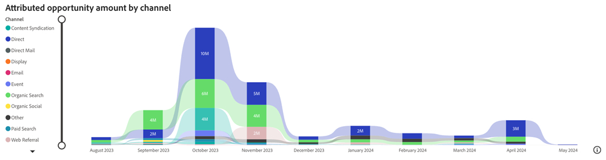

# Painel de Oportunidade Atribuída {#attributed-opportunity-dashboard}

O Painel de oportunidades atribuídas fornece uma visão abrangente de como os esforços de marketing contribuem para oportunidades de pipeline emergentes e maduras. Analise detalhadamente cada oportunidade aberta e fechada atribuível às suas estratégias, com a flexibilidade de filtrar por estágio de oportunidade, destacando o escopo completo da influência do marketing além das ofertas fechadas.

**Perguntas que o painel responde**:

* Quais canais, subcanais ou campanhas têm a classificação mais alta em termos de valor de oportunidade atribuído?
* Qual é a quantia total de oportunidades atribuídas e a contagem de nossas oportunidades abertas e fechadas atribuídas?

## Componentes do painel {#dashboard-components}

### Blocos de KPI {#kpi-tiles}

* **Valor de oportunidade atribuído**: a contribuição da receita total, com base no modelo de atribuição escolhido, de Oportunidades fechadas e abertas com pontos de contato que foram criados no período de data filtrado.
* **Oportunidades atribuídas**: o número de Oportunidades fechadas e abertas que têm pontos de contato.

### Gráfico de Quantia de Oportunidade Atribuída por Canal ao Longo do Tempo {#attributed-opportunity-amount-by-channel-over-time-chart}

Gráfico de barras empilhadas exibindo o Total de oportunidades atribuídas, segmentado por canal, para cada mês/trimestre/ano.

* Aproveite as funcionalidades de detalhamento e aumento para categorizar os dados por mês, trimestre ou ano.
* Passe o mouse sobre um segmento de barra ou sobre o espaço entre barras para revelar informações detalhadas.

**Perguntas que o gráfico responde**:

* Quais canais geraram o valor de oportunidade mais atribuído a cada trimestre?
* Qual foi o detalhamento do valor de oportunidade atribuído por canal no mês passado?

### Tabela de Valores de Oportunidades Atribuídos {#attributed-opportunity-amount-table}

Valor total da oportunidade atribuída segmentado por canal, subcanal e campanha, apresentado nos formatos Tabular e Árvore. Clique no botão no canto superior direito para alternar entre exibições.

**Perguntas que o painel responde**:

* Como a distribuição da quantidade de oportunidade atribuída varia entre diferentes subcanais em um canal?
* Quais campanhas em um determinado subcanal estão gerando a quantidade de oportunidades mais atribuída?

#### Exibição Tabular {#tabular-view}

A exibição em tabelas oferece insights claros e organizados da distribuição do valor de oportunidade atribuído. Os usuários podem discernir rapidamente os padrões de desempenho e apontar estratégias de marketing de alto impacto categorizando dados em canais, subcanais e campanhas.

Clique em **+** ícone ao lado de cada Canal para revelar o detalhamento por Subcanal e Campanha.

#### Visualização em árvore {#tree-view}

A visualização em árvore permite uma exploração de dados mais interativa e granular, permitindo que os profissionais de marketing identifiquem tendências, anomalias ou artistas de destaque em suas iniciativas de marketing.

Clique em uma ramificação para se aprofundar na camada de hierarquia subsequente.

### Painel de Filtro

Esse painel é equipado com as seguintes configurações e filtros:

* Data (com base na data de criação da oportunidade)
* Modelo de atribuição
   * Para oportunidades abertas, os modelos de atribuição &quot;caminho completo&quot; e &quot;personalizado&quot; oferecem visualizações point-in-time e não representam resultados de atribuição finais.
* Estágio da oportunidade (com base no estágio atual)
* Canal, Subcanal
* Campanha
* Segmentos
