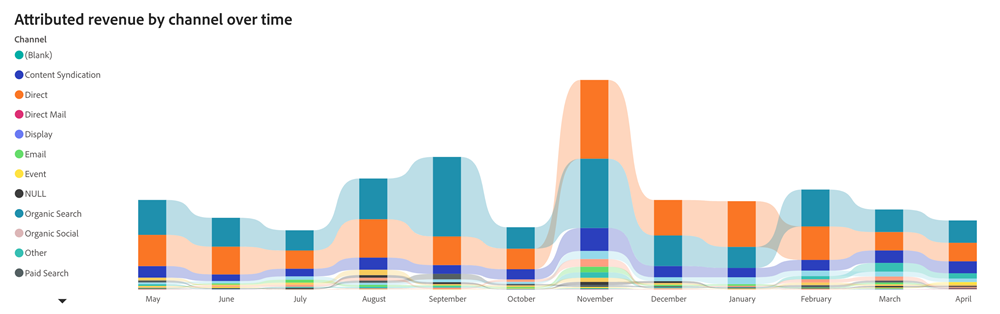
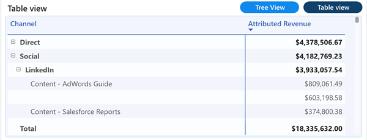
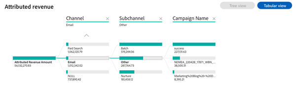

# Painel de receitas atribuídas {#attributed-revenue-dashboard}

O Painel de receita atribuída oferece uma perspectiva focada na receita diretamente vinculada às suas iniciativas de marketing. Explore em detalhes como suas estratégias de marketing têm sido fundamentais para selar ofertas.

Perguntas que o painel responde:

Quais canais, subcanais ou campanhas têm a classificação mais alta em termos de receita atribuída?
Qual é a quantia total de nossa receita atribuída e a contagem de nossas negociações fechadas atribuídas?

<table style="table-layout:auto"> 
<tbody>
  <tr> 
   <th>Componente</th> 
   <th>Descrição</th>
   <th>Campos de Drill-Through</th>
   <th>Tipo de dados</th>
   <th>Filtros</th>
  </tr>
  <tr>
    <td>Mosaico de receita atribuída</td>
    <td>Receita total atribuível de oportunidades "Ganhadas fechadas" com pontos de contato registrados.</td>
    <td rowspan="6"><li>ID da oportunidade</li>
<li>Nome da oportunidade</li>
<li>Data de criação da oportunidade</li>
<li>Data de Fechamento da Oportunidade</li>
<li>Está Fechado (S/N)</li>
<li>Está conquistado (S/N)</li>
<li>Estágio atual</li>
<li>Modelo de atribuição</li>
<li>Receita atribuída</li>
<li>Receita Realizada</li></td>
    <td rowspan="6">Data de encerramento</td>
    <td rowspan="6"><li>Data</li>
<li>Modelo de atribuição</li>
<li>Canal</li>
<li>Subcanal</li>
<li>Campanha</li>
<li>Segmentos</li></td>
  </tr>
  <tr>
    <td>Mosaico de ofertas atribuíveis</td>
    <td>Número total de negociações "Ganhadas Fechadas" de oportunidades atribuíveis.</td>
  </tr>
  <tr>
    <td>Receita atribuída por canal ao longo do tempo</td>
    <td>Gráfico de barras empilhadas exibindo a Receita total atribuída, segmentada por canal associado, para cada trimestre/mês.
     </td>
  </tr>
  <tr>
    <td>Tabela de Receitas Atribuídas</td>
    <td>A receita total atribuída segmentada por canal, subcanal e campanha, apresentada nos formatos Tabular e Árvore.
     
     </td>
  </tr>
  </tr>
</tbody>
</table>
