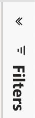
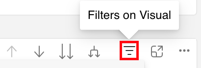
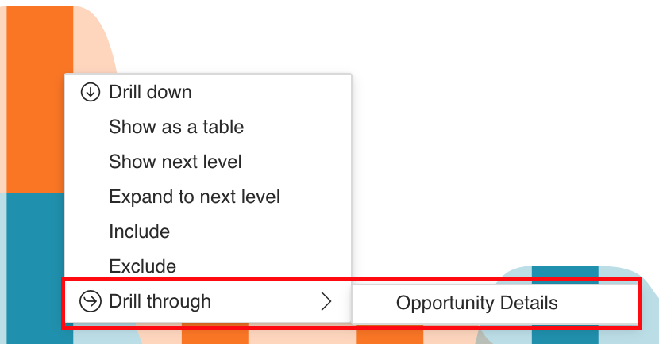
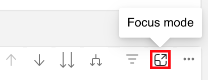

# Descubra as noções básicas do painel {#discover-dashboard-basics}

Este artigo o guiará pelos recursos fundamentais da interface reprojetada, garantindo que você possa acessar e interpretar seus dados com facilidade. Analise a dinâmica do painel de filtros e descubra as complexidades de nossas funcionalidades de relatórios aprimoradas, como os recursos de drill, filtragem cruzada e dicas de ferramentas.

## Painel de Filtro {#filter-pane}

Cada painel tem uma variedade de filtros, acompanhados pelos seguintes controles para navegação e personalização ininterruptas.

<table style="table-layout:auto"> 
 <tbody> 
  <tr> 
   <th>Nome</th> 
   <th>Ícone</th>
   <th>Descrição</th>
  </tr> 
  <tr> 
   <td>Botão Hamburger</td> 
   <td></td>
   <td>Alterne o painel de filtro aberto ou fechado.</td>
  </tr>
  <tr> 
   <td>Redefinir</td> 
   <td></td>
   <td>Retornar filtros às configurações padrão.</td>
  </tr>
   <tr> 
   <td>Filtros no visual</td> 
   <td></td>
   <td>Passe o mouse sobre o canto superior direito de um visual e clique no botão para ver os filtros ativos.</td>
  </tr>
 </tbody> 
</table>

## Recursos do relatório {#report-capabilities}

### Detalhar e aumentar {#drill-down-and-up}

* Passe o mouse sobre um visual para identificar se ele tem uma hierarquia; a presença de opções de controle de drill na barra de ação indica isso.

* Ative o drill-down clicando na seta para baixo única, realçada por um plano de fundo cinza. Para reverter, use o ícone de drill-up.

Para detalhar um campo por vez, ative o ícone de detalhamento e selecione um elemento visual, como uma barra.

Use o ícone de drill-down da seta dupla para avançar para o próximo nível de hierarquia.

Use o ícone de bifurcação para adicionar outro nível de hierarquia na exibição atual.

### Drill-through {#drill-through}

* Para explorar os dados por trás do visual, clique com o botão direito do mouse no elemento visual e selecione a opção de &quot;drill-through&quot;.

* Para exportar os dados subjacentes, passe o mouse sobre o canto superior direito da página de drill-through, clique no botão &quot;mais opções&quot; e selecione &quot;exportar dados&quot;.

* Para aplicar mais zoom a um visual ou bloco gráfico específico, passe o mouse sobre o canto superior direito e selecione o botão &quot;foco&quot;.

### Filtragem cruzada {#cross-filtering}

Por padrão, selecionar um rótulo de valor ou eixo em uma visualização cruzará os filtros de outros visuais na página do relatório, garantindo que eles exibam apenas os dados relevantes e filtrados.

### Dicas de ferramentas {#tooltips}

As dicas de ferramentas oferecem detalhes adicionais sobre os dados exibidos. Basta passar o mouse sobre um elemento visual e uma dica de ferramenta contextual será exibida, fornecendo insights ou explicações relacionados a esse ponto de dados específico.

