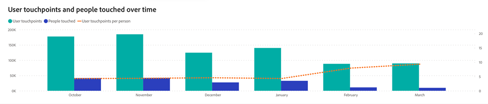

# Painel de engajamento {#engagement-dashboard}

O Painel de engajamento rastreia meticulosamente as métricas de engajamento do usuário. Ele mostra pontos de contato, o número de pessoas envolvidas e a média de pontos de contato por pessoa. Utilize o gráfico de barras de série temporal para uma exibição mensal, trimestral ou anual e o gráfico de barras para obter insights detalhados do Canal, Subcanal e Campanha. Essa ferramenta é essencial para entender os padrões de envolvimento e ajustar as estratégias de envolvimento.

Rastreamos cada interação com o cliente como pontos de contato do usuário (UTs), os pontos de dados coletados &quot;brutos&quot;, que servem como base para as métricas de engajamento em nosso painel. Nem todas as UTs evoluem para Pontos de Contato do Comprador (BTs) ou Pontos de Contato de Atribuição do Comprador (BATs), pois esses são resultados selecionados para atribuir interações específicas do cliente a atividades relacionadas à receita. É importante observar que as regras de supressão não afetam as UTs ou o painel de engajamento.

* **Pontos de Contato do Usuário**: pontos de contato criados a partir de todos os compromissos.
* **Pontos de Contato do Comprador**: Pontos de contato selecionados para atribuição de Cliente Potencial e Contato. Os BTs não estão vinculados a Oportunidades e não têm receita associada.
* **Pontos de contato de atribuição do comprador**: pontos de contato selecionados para atribuição de oportunidade. As MTD têm implicações em termos de receitas, uma vez que estão associadas a oportunidades.

Usar apenas BTs ou MTDs para medir o engajamento subestimaria a verdadeira extensão das interações do cliente, já que o engajamento é mais amplo do que apenas a atribuição.

Perguntas que o painel responde:

* Quantas pessoas estavam comprometidas? Qual é o número médio de contatos por pessoa envolvida?
* Como o número de pontos de contato se compara às pessoas tocadas em um canal/subcanal/campanha específico?
* Quantos pontos de contato havia em um determinado canal ou subcanal? Como isso mudou com o tempo?

>[!NOTE]
>
>As métricas de envolvimento de conta e oportunidade estão programadas para lançamento no primeiro semestre de 2024.

## Componentes do painel {#dashboard-components}

### Blocos de KPI {#kpi-tiles}

* Pontos de contato: o número total de pontos de contato brutos gerados.
   * Pontos de contato do comprador e Pontos de contato de atribuição do comprador são resultados de atribuição criados ao selecionar pontos de contato específicos para crédito. Nem todos os pontos de contato são selecionados como BT e MTD.
* Pessoas tocadas: o número total de pessoas que têm quaisquer pontos de contato.
* Pontos de contato por pessoa: número médio de pontos de contato por pessoa que foram tocados.

### Pontos de contato e pessoas tocadas ao longo do tempo {#touchpoints-and-people-touched-over-time}

O gráfico de barras de série temporal exibe o número de pontos de contato, Pessoas tocadas e pontos de contato por pessoa para cada mês, trimestre e ano.

* use as funcionalidades de drill-down e drill-up para categorizar os dados por Mês, Trimestre ou Ano.
* Passe o mouse sobre uma barra ou linha para revelar informações detalhadas.

Perguntas que o gráfico responde:

* Como o número de pontos de contato e de pessoas tocadas evoluiu com o tempo?
* Como os pontos de contato por pessoa se comparam de um trimestre/mês ao próximo?

### Pontos de contato/pessoas tocadas por canal {#touchpoints-people-touched-by-channel}

Gráfico de barras que exibe pontos de contato ou pessoas tocadas segmentado por canal/subcanal/campanha.

* use as funcionalidades de detalhamento e aumento para categorizar os dados por Subcanal e Campaign.
* Passe o mouse sobre cada barra para ver os pontos de contato ou as pessoas tocadas.

Perguntas que o gráfico responde:

* Qual canal/subcanal/campanha gerou mais engajamento?
* Como o número de pontos de contato se compara às pessoas tocadas em um canal/subcanal/campanha específico?

## Painel de Filtro {#filter-pane}

Esse painel é equipado com as seguintes configurações e filtros:

* Data (com base na data do ponto de contato)
* Canal, Subcanal
* Campanha
