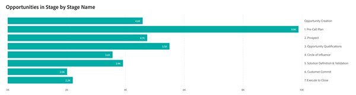
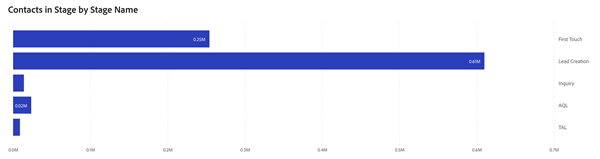

# Painel de passaporte {#passport-dashboard}

O painel Passport oferece aos profissionais de marketing uma visualização dinâmica de clientes potenciais, contatos e oportunidades à medida que transitam por vários estágios em um período especificado. Ao filtrar por uma data específica, os usuários também podem obter um instantâneo dos registros desse dia.

**Perguntas sobre as respostas do painel:**

* Quantos leads, contatos ou oportunidades existiam em cada estágio não terminal em um dia escolhido?
* Durante um período especificado, quantos Clientes Potenciais ou Contatos distintos avançaram em cada estágio transitório?
   * _Exemplo_: se o Líder A estivesse no estágio 1 em 1/1/2023 e avançasse para o estágio 5 em 31/3/2023, a análise do Passport do primeiro trimestre de 2023 contaria o Líder A nos estágios 1 a 5.
* Quantas oportunidades únicas passaram por cada estágio transitório durante um determinado período?

## Componentes do painel {#dashboard-components}

### Oportunidades em Estágio por Nome de Estágio {#opportunities-in-stage-by-stage-name}

* Cada estágio mostra o número de Oportunidades com pontos de contato que passaram por elas em um determinado período.
   * Se uma oportunidade progredir por vários estágios dentro desse intervalo, ela será contada em cada estágio que passar.
* Estágios terminais como &quot;Ganhado fechado&quot; e &quot;Perdido fechado&quot; são excluídos.
* As datas de início e término são inclusivas.

### Clientes Potenciais ou Contatos em Preparo por Nome do Estágio {#leads-or-contacts-in-stage-by-stage-name}

* Cada estágio mostra o número de Clientes Potenciais ou Contatos com pontos de contato que passaram por eles em um determinado período.
   * A exibição de &quot;Cliente em potencial&quot; ou &quot;Contato&quot; é determinada pela preferência definida em: Configurações > Configurações de atribuição > Objeto de painel padrão.
   * Se um lead ou contato progredir por vários estágios dentro desse intervalo, ele será contado em cada estágio que passar.
* Estágios terminais como &quot;Ganhado fechado&quot; e &quot;Perdido fechado&quot; são excluídos.
* As datas de início e término são inclusivas.

## Painel de Filtro {#filter-pane}

Esse painel é equipado com as seguintes configurações e filtros:

* Data (com base na Data de transição)
* Canal, Subcanal
* Campanha
* Segmentos

>[!MORELIKETHIS]
>
>* [Noções básicas do painel do Discover](/help/marketo-measure-discover-ui/dashboards/discover-dashboard-basics.md){target="_blank"}
>* [Política de Visibilidade de Dados do Painel](/help/marketo-measure-discover-ui/dashboards/dashboard-data-visibility-policy.md){target="_blank"}
