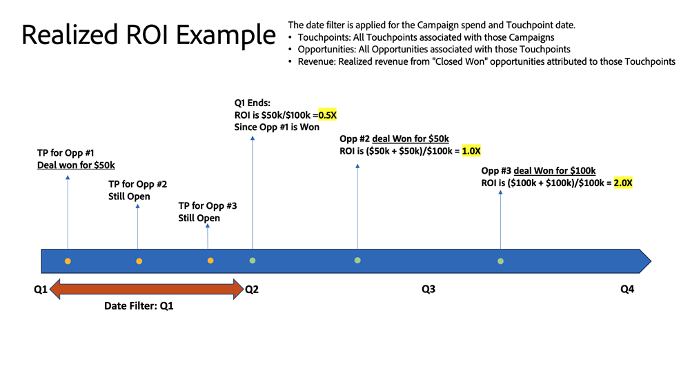

# Painel de ROI {#roi-dashboard}

O painel de ROI fornece aos profissionais de marketing uma visão detalhada do retorno sobre o investimento em canais, subcanais e campanhas. Ele detalha meticulosamente os padrões de custo e receita, além de destacar métricas como custo por lead, negociação e oportunidade, garantindo uma compreensão abrangente da atribuição de marketing.

**Perguntas e respostas do painel**

* Quais eram os valores de ROI para cada canal, subcanal e campanha?
* Como os custos e as receitas foram distribuídos em cada canal, subcanal e campanha?
* Qual foi o custo por oportunidade, o custo por negócio e o custo por oportunidade?

## Componentes do painel {#dashboard-components}

### Blocos de KPI {#kpi-tiles}

* **Custo**: custos totais de fontes de dados conectadas e custos carregados manualmente.
* **Receita atribuída**: a contribuição de receita total, com base no modelo de atribuição escolhido, de Oportunidades com pontos de contato que foram fechados dentro do período de data filtrado.
* **Receita atribuída realizada**: a contribuição de receita total, com base no modelo de atribuição escolhido, de Oportunidades com pontos de contato dentro do período de data filtrado, independentemente de quando elas foram fechadas.
* **Total de Novos Clientes Potenciais**: Número total de novos Clientes Potenciais gerados, incluindo Clientes Potenciais tocados e não tocados.
* **Custo por Novo Cliente Potencial**: o custo médio por novo Cliente Potencial, derivado do custo total dividido pelo número total de novos Clientes Potenciais.
* **Total de Novas Oportunidades**: Número total de novas Oportunidades geradas, incluindo Oportunidades tocadas e não tocadas.
* **Custo por nova oportunidade**: o custo médio por nova oportunidade, derivado do custo total dividido pelo número total de novas oportunidades.
* **Total de Contratos**: o número de Oportunidades &quot;Ganhadas Fechadas&quot;, incluindo Oportunidades sem pontos de contato.
* **ROI Simples**: a receita atribuída é dividida pelos custos no período de data filtrado.
* **ROI realizado**: a receita atribuída realizada foi dividida pelos custos no período de data filtrado.

### Gráfico de custo e receita por canal {#cost-and-revenue-by-channel-graph}

Gráfico de barras que ilustra o custo e a receita, projetado para oferecer uma perspectiva comparativa sobre sua magnitude em relação a vários canais, subcanais e campanhas.

* use as funcionalidades de detalhamento e aumento para categorizar os dados por Subcanal e Campaign.
* Passe o mouse sobre cada barra para visualizar os ROIs simples e realizados.

**Perguntas sobre as respostas do gráfico**

* Quais eram os valores de ROI para cada canal, subcanal e campanha?
* Existem canais ou subcanais com custos excepcionalmente altos ou baixos em relação à receita?

### ROI realizado vs. simples ao longo do tempo {#realized-vs-simple-roi-over-time}

Gráfico de linhas de série temporal exibindo a comparação entre ROI Realizado e Simples, rastreando sua progressão ao longo do tempo.

* Passe o mouse sobre uma seção do gráfico para visualizar os ROIs simples e realizados.

**Perguntas sobre as respostas do gráfico**

* Como o ROI realizado se compara ao ROI simples em períodos específicos?
* Como a tendência do ROI realizado está relacionada a eventos de marketing significativos durante o mesmo período?

### Gráfico de Custo ao longo do tempo {#cost-over-time-graph}

Gráfico de barras empilhadas exibindo os Custos totais, segmentados por Canais associados para cada mês/trimestre/ano.

* use as funcionalidades de drill-down e drill-up para categorizar os dados por Mês, Trimestre ou Ano.
* Passe o mouse sobre um segmento de barra ou sobre o espaço entre barras para revelar informações detalhadas.

**Perguntas sobre as respostas do gráfico**

* Como o custo combinado de todos os canais se compara de um trimestre/mês ao próximo?
* Como os custos de um canal específico evoluíram com o tempo?

### Gráfico de custo por canal {#cost-by-channel-graph}

Gráfico de barras que exibe os gastos com marketing segmentados por canal/subcanal/campanha.

* use as funcionalidades de detalhamento e aumento para categorizar os dados por Canal/Subcanal/Campanha.

**Perguntas sobre as respostas do gráfico**

* Quais subcanais ou campanhas em um canal principal têm a alocação mais alta?
* Quais canais de marketing (canal, subcanal ou campanha) parecem ter menos recursos em comparação a outros?

### Tabela de resumo do ROI {#roi-summary-table}

Tabela exibindo a receita atribuída, os custos e o ROI segmentados por canais individuais para obter uma análise detalhada.

* Clique no ícone &quot;+&quot; ao lado de cada Canal para revelar o detalhamento por Subcanal e Campanha.

**Colunas**

* Canal/Subcanal/Campanha
* Custo
* Receita atribuída
* Receita atribuída realizada
* ROI simples
* ROI realizado
* Receita não realizada do pipeline atribuída: receita do pipeline vinculada aos pontos de contato (oportunidades em aberto) criados no período de data filtrado.

### Tabela de gastos de marketing {#marketing-spend-table}

Tabela que exibe custos, novos clientes em potencial, oportunidades e ofertas fechadas segmentadas por canais individuais para obter um detalhamento detalhado.

* Clique no ícone &quot;+&quot; ao lado de cada Canal para revelar o detalhamento por Subcanal e Campanha.

**Colunas**

* Canal/Subcanal/Campanha
* Custo
* Novos leads
* Custo por Novo Cliente Potencial
* Novas oportunidades
* Custo por nova oportunidade
* Transações
* Custo por negócio

## Painel de Filtro {#filter-pane}

Esse painel é equipado com as seguintes configurações e filtros:

* Data
   * Baseado em:
      * Data de criação: clientes em potencial de notícias, novas oportunidades
      * Data de custo incorrido: custo
      * Data de fechamento: receita atribuída (ROI simples), ofertas
      * Data do ponto de contato: pontos de contato da receita atribuída realizada (ROI realizado)
* Modelo de atribuição
* Canal, Subcanal
* Campanha

>[!MORELIKETHIS]
>
>* [Noções básicas do painel do Discover](/help/marketo-measure-discover-ui/dashboards/discover-dashboard-basics.md){target="_blank"}
>* [Política de Visibilidade de Dados do Painel](/help/marketo-measure-discover-ui/dashboards/dashboard-data-visibility-policy.md){target="_blank"}

