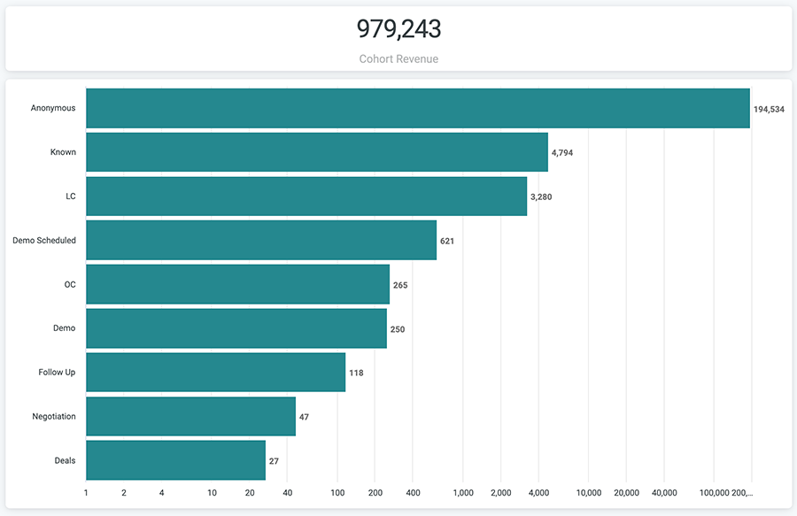

# Documentação do painel de Jornada de coorte {#cohort-journey-dashboard-documentation}

Os painéis Impacto da coorte e Funil permitem que os profissionais de marketing visualizem a progressão de um estágio de coorte inicial para um intervalo de tempo selecionado e meçam a taxa de conversão.

A principal diferença é como contamos cada entidade do estágio de coorte.

* Funil de coorte: o resultado de cada estágio é derivado diretamente do estágio anterior.

   * Somente os registros que passaram por cada estágio pelo funil após a hora de início definida do coorte são contados.

* Impacto da coorte: o resultado de cada estágio é derivado do estágio da coorte, não do estágio anterior.

   * Todos os registros em cada estágio são contados desde que tenham ocorrido após a hora de início definida do coorte. Esse painel naturalmente terá mais registros do que o painel Funil, já que estamos analisando como as entidades foram afetadas pelo estágio de coorte, não apenas o movimento pelo funil.

Cada painel tem dois blocos:

* Receita de coorte: o valor total da oportunidade proveniente de todas as oportunidades no estágio Ofertas do bloco Jornada de coorte.
* Jornada de coorte: a progressão para cada estágio da jornada a partir do estágio de coorte inicial para um intervalo de tempo selecionado.

>[!NOTE]
>
>Em todos os painéis do Discover, somente um objeto de pessoa, Cliente potencial ou Contato, pode ser relatado. Isso é definido em [!UICONTROL Configurações] > [!UICONTROL Relatórios] > [!UICONTROL Configurações de atribuição] > [!UICONTROL Objeto de painel padrão].

Os painéis são compatíveis com os seguintes filtros:

* Estágio de coorte: selecione o estágio inicial de coorte. Os registros em todos os estágios seguintes são evoluídos a partir dos registros no estágio de coorte.
* Intervalo de datas da coorte: selecione o intervalo de tempo do estágio de coorte selecionado. Junto com o Estágio de coorte, ele define o conjunto de dados inicial.
* Data Limite: selecione a data em que a progressão do registro em todos os estágios seguintes deverá ocorrer. O padrão é hoje. Observe que isso se aplica a todos os estágios, exceto o de coorte.
* Canal: filtre os registros por canais. Um registro é associado a um canal se qualquer um de seus pontos de contato estiver associado ao canal.
* Subchannel: filtrar os registros por subcanais. Um registro é associado a um subcanal se qualquer um de seus pontos de contato estiver associado ao subcanal.
* Campanha: filtre os registros por campanhas. Um registro é associado a uma campanha se qualquer um de seus pontos de contato estiver associado à campanha.
* Campaign Source: filtre os registros por origens de campanha. Exemplos de origens de campanha são [!DNL Adwords], [!DNL BingAds], [!DNL Facebook], [!DNL LinkedIn], etc. Um registro é associado a uma origem de campanha se qualquer um de seus pontos de contato estiver associado à origem da campanha.
* Filtros de segmento: filtre os registros por segmentos personalizados. Um registro é associado a um segmento se qualquer um de seus pontos de contato estiver associado ao segmento.

Em todos os filtros, a lógica &quot;AND&quot; é usada.

>[!NOTE]
>
>Os filtros de segmento se aplicam somente ao estágio LC e posterior. Se o Estágio de coorte for Desconhecido ou Conhecido e um dos filtros de segmento tiver um valor, o painel não retornará resultados.

Os estágios incluem Desconhecido, Conhecido, LC, estágios de Funil selecionados em Estágios de Lead/Contato Abertos (Configurações > CRM > Mapeamento de Estágio), OC, estágios de Funil selecionados em Estágios de Oportunidade Abertos (Configurações > CRM > Mapeamento de Estágio) e Ofertas (Oportunidades Ganhas Fechadas).

>[!NOTE]
>
>A contagem dos registros de um estágio de jornada, definida como qualquer estágio diferente do estágio de coorte, inclui todos os novos registros, relacionados aos registros de coorte, que são criados após a data de início do período selecionado e antes da data-limite. Isso é uma causalidade inferida.

Você pode fazer drill-down a partir de cada barra para exibir os registros de cada estágio.

* Para Desconhecido, mostra os detalhes do visitante anônimo.
* Para Conhecido, mostra detalhes do visitante conhecido.
* Para os estágios LC e Lead/Contato em Aberto, ele mostra os detalhes do Lead/Contato.
* Para o OC, estágios Oportunidade Aberta e Transações, mostra Detalhes da Oportunidade.
