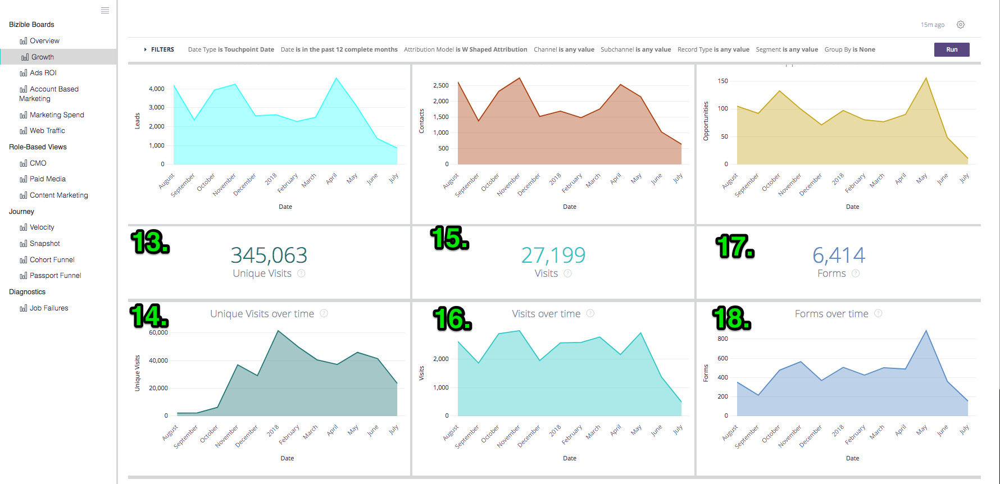

# Definições enciclopédia {#definitions-and-encyclopedia}

Veja a seguir uma visão geral dos diferentes Quadros e Blocos presentes na plataforma Discover, bem como os Filtros nesses Quadros. Na captura de tela de cada Quadro há vários blocos gráficos, cujas definições podem ser encontradas na seção desse Quadro abaixo.

**[!DNL Marketo Measure]Quadros**

Visão geral

Crescimento

ROI de anúncios

Marketing baseado em conta

Despesa de marketing

Tráfego na Web

**Exibições com base em função**

CMO

Mídia paga

Marketing de conteúdo

Oportunidades de marketing 

**Jornada**

Velocidade

Instantâneo

Funil de passaporte

Caminho de engajamento

## [!DNL Marketo Measure] Quadros {#marketo-measure-boards}

### Visão geral {#overview}

Visão geral oferece ao usuário uma visão geral de alto nível sobre o desempenho da equipe de marketing em relação ao impacto na receita, gastos e ROI.

**Filtros**

O tipo de data é Data de fechamento

A data está nos últimos 12 meses completos

O modelo de atribuição tem forma de W

A métrica é receita

Dimension é canal

Canal é igual a __

Subcanal é igual a __

A campanha é igual a __

Categorias

**Receita**

`1.` O valor total de receita de oportunidades Ganhas Fechadas, com base no modelo de atribuição.

Clique em para Mostrar detalhes e detalhar os dados exibindo-os como uma visualização e tabela.

**Visão geral**

`2.` Usando a lista suspensa Métrica no menu Filtros, este gráfico mostra a receita/receita do pipeline/gasto/ofertas/oportunidades/leads/contatos atribuídos a cada canal, mostrados ao longo do tempo.

**Gastos**

`3.` O valor total do gasto registrado dos custos de API e dos custos relatados automaticamente totalizados no nível mais alto do Canal.

Clique em para Mostrar detalhes e detalhar os dados exibindo-os como uma visualização e tabela.

**ROI**

`4.` Usando a lista suspensa Dimension no menu Filtros, isso mostra quanto ROI foi atribuído a cada Canal/Subcanal/Campanha/Conta/AdGroup/Anúncio/Anunciante/Criativo/Palavra-chave/Posicionamento/Site com base no modelo de atribuição durante todo o intervalo de datas selecionado.

**Resumo do ROI**

Usando a lista suspensa Dimension no menu Filtros, isso mostra quanto de Receita, Gastos e ROI foram atribuídos a cada Canal/Subcanal/Campanha/Conta/AdGroup/Anúncio/Anunciante/Criativo/Palavra-chave/Posicionamento/Site com base no modelo de atribuição durante todo o intervalo de datas selecionado.

**Transações**

`5.` O número total de oportunidades Ganhas Fechadas, com base na contagem de modelo de atribuição. Se o tipo de data &quot;Data do ponto de contato&quot; for selecionado, contagens parciais serão possíveis, pois é possível excluir alguns pontos de contato em uma oportunidade usando esse tipo de data.

Clique em para Mostrar detalhes e detalhar os dados exibindo-os como uma visualização e tabela.

**Custo por oferta**

`6.` O gasto total dividido pelo número total de negócios, fornecendo um custo médio necessário para adquirir uma oportunidade conquistada fechada.

**Receita do pipeline**

`7.` A receita potencial total de qualquer Oportunidade em Aberto, significando que não é Perdida Fechada ou Ganha Fechada. A receita é baseada no modelo de atribuição selecionado.

Clique em para Mostrar detalhes e detalhar os dados exibindo-os como uma visualização e tabela.

**Tamanho do negócio**

`8.` O valor médio de uma oportunidade Ganha Fechada.

**Resumo do canal**

`9`. Usando a lista suspensa Métrica no menu Filtros, esta é uma lista de canais com base em quanta receita/receita de pipeline/gasto/ofertas/oportunidades/clientes potenciais/contatos foi atribuída a cada canal, classificada pelo maior com base no modelo de atribuição selecionado.

**Resumo do Subcanal**

`10.` Usando a lista suspensa Métrica no menu Filtros, esta é uma lista de subcanais com base em quanta receita/receita de pipeline/gasto/ofertas/oportunidades/clientes potenciais/contatos foi atribuída a cada subcanal, classificada pelo maior com base no modelo de atribuição selecionado.

**Resumo da campanha**

`11.` Usando a lista suspensa Métrica no menu Filtros, esta é uma lista de campanhas com base na quantidade de receita/receita de pipeline/gasto/ofertas/oportunidades/clientes potenciais/contatos atribuída a cada campanha, classificada pela maior com base no modelo de atribuição selecionado.

### Crescimento {#growth}

O crescimento permite que o profissional de marketing veja o que gerou em todos os aspectos, desde leads a contatos e oportunidades até receitas. É uma visualização rápida de todos os pipelines e de como eles se deram ao longo do tempo.

**Filtros**

O tipo de data é a data do ponto de contato

A data está nos últimos 12 meses completos

O modelo de atribuição tem forma de W

Agrupar por Nenhum

Canal é igual a __

Subcanal é igual a __

A campanha é igual a __

Categorias

**Receita**

`1.` O valor total de receita de oportunidades Ganhas Fechadas, com base no modelo de atribuição.

Clique em para Mostrar detalhes e detalhar os dados exibindo-os como uma visualização e tabela.

**Receita ao longo do tempo**

`2.` O valor total de receita de oportunidades Ganhas Fechadas, com base no modelo de atribuição que mostra a tendência em um período específico. Use o filtro Agrupar por para alterar a pilha por canal, subcanal, campanha, conta, grupo de anúncios, anúncio, anunciante, criativo, palavra-chave, posicionamento, site.

Faça drill-in para exibir os dados de uma dimensão de data menor.

**Transações**

`3.` O número total de oportunidades Ganhas Fechadas, com base na contagem de modelo de atribuição.

Clique em para Mostrar detalhes e detalhar os dados exibindo-os como uma visualização e tabela.

**Transações ao longo do tempo**

`4.` O número total de oportunidades Ganhas Fechadas, com base no modelo de atribuição que mostra a tendência em um período específico. Use o filtro Agrupar por para alterar a pilha por canal, subcanal, campanha, conta, grupo de anúncios, anúncio, anunciante, criativo, palavra-chave, posicionamento, site.

Faça drill-in para exibir os dados de uma dimensão de data menor.

**Receita do pipeline**

`5.` A receita potencial total de qualquer Oportunidade em Aberto, significando que não é Perdida Fechada ou Ganha Fechada. A receita é baseada no modelo de atribuição selecionado.

Clique em para Mostrar detalhes e detalhar os dados exibindo-os como uma visualização e tabela.

**Receita do pipeline ao longo do tempo**

`6.` A receita potencial total de qualquer oportunidade aberta, com base no modelo de atribuição que mostra a tendência em um período específico. Use o filtro Agrupar por para alterar a pilha por canal, subcanal, campanha, conta, grupo de anúncios, anúncio, anunciante, criativo, palavra-chave, posicionamento, site.

Faça drill-in para exibir os dados de uma dimensão de data menor.

**Clientes potenciais**

`7.` O número total de clientes em potencial, com base no modelo de atribuição. Se o tipo de data &quot;Data do ponto de contato&quot; for selecionado, contagens parciais serão possíveis, pois é possível excluir alguns pontos de contato em um registro de cliente potencial usando esse tipo de data. Se um modelo de atribuição além de Forma de U for aplicado, a contagem de Forma de U será usada para Forma de W, Forma de W e Modelo personalizado.

Clique em para Mostrar detalhes e detalhar os dados exibindo-os como uma visualização e tabela.

**Clientes potenciais ao longo do tempo**

`8.` O número total de clientes em potencial, com base no modelo de atribuição que mostra a tendência em um período específico. Use o filtro Agrupar por para alterar a pilha por canal, subcanal, campanha, conta, grupo de anúncios, anúncio, anunciante, criativo, palavra-chave, posicionamento, site.

Faça drill-in para exibir os dados de uma dimensão de data menor.

**Contatos**

`9.` O número total de Contatos, com base no modelo de atribuição. Se o tipo de data &quot;Data do ponto de contato&quot; for selecionado, contagens parciais serão possíveis, pois é possível excluir alguns pontos de contato em um registro de Contato usando esse tipo de data. Se um modelo de atribuição além de Forma de U for aplicado, a contagem de Forma de U será usada para Forma de W, Forma de W e Modelo personalizado.

Clique em para Mostrar detalhes e detalhar os dados exibindo-os como uma visualização e tabela.

**Contatos ao longo do tempo**

`10.` O número total de Contatos, com base no modelo de atribuição que mostra a tendência em um período específico. Use o filtro Agrupar por para alterar a pilha por canal, subcanal, campanha, conta, grupo de anúncios, anúncio, anunciante, criativo, palavra-chave, posicionamento, site.

Faça drill-in para exibir os dados de uma dimensão de data menor.

**Oportunidades**

`11.` O número total de Oportunidades, com base no modelo de atribuição. Se o tipo de data &quot;Data do ponto de contato&quot; for selecionado, contagens parciais serão possíveis, pois é possível excluir alguns pontos de contato em um registro de Oportunidade usando esse tipo de data.

Clique em para Mostrar detalhes e detalhar os dados exibindo-os como uma visualização e tabela.

**Oportunidades ao longo do tempo**

`12.` O número total de Oportunidades, com base no modelo de atribuição que mostra a tendência em um período específico. Use o filtro Agrupar por para alterar a pilha por canal, subcanal, campanha, conta, grupo de anúncios, anúncio, anunciante, criativo, palavra-chave, posicionamento, site.

Faça drill-in para exibir os dados de uma dimensão de data menor.

**Visitas**

`13.` O número total de visitas ao site rastreadas em todos os visitantes conhecidos e anônimos.

Clique em para Mostrar detalhes e detalhar os dados exibindo-os como uma visualização e tabela.

(Aparecerá como 0 se esse recurso estiver desativado.)

**Visitas ao longo do tempo**

`14.` O número total de visitas ao site rastreadas que mostram a tendência em um período específico. Use o filtro Agrupar por para alterar a pilha por canal, subcanal, campanha, conta, grupo de anúncios, anúncio, anunciante, criativo, palavra-chave, posicionamento, site.

Faça drill-in para exibir os dados de uma dimensão de data menor.

(Isso aparecerá vazio se esse recurso estiver desativado.)

**Visitas únicas**

`15.` O número total de visitas únicas ao site rastreadas em todos os visitantes conhecidos e anônimos.

Clique em para Mostrar detalhes e detalhar os dados exibindo-os como uma visualização e tabela.

(Aparecerá como 0 se esse recurso estiver desativado.)

**Visitas únicas ao longo do tempo**

`16.` O número total de visitas exclusivas ao site rastreadas que mostram a tendência em um período específico. Use o filtro Agrupar por para alterar a pilha por canal, subcanal, campanha, conta, grupo de anúncios, anúncio, anunciante, criativo, palavra-chave, posicionamento, site.

Faça drill-in para exibir os dados de uma dimensão de data menor.

(Isso aparecerá vazio se esse recurso estiver desativado.)

**Forms**

`17.` O número total de formulários enviados para todos os visitantes conhecidos e anônimos.

Clique em para Mostrar detalhes e detalhar os dados exibindo-os como uma visualização e tabela.

(Aparecerá como 0 se esse recurso estiver desativado.)

**Forms ao longo do tempo**

`18.` O número total de formulários enviados que mostram a tendência em um período específico. Use o filtro Agrupar por para alterar a pilha por canal, subcanal, campanha, conta, grupo de anúncios, anúncio, anunciante, criativo, palavra-chave, posicionamento, site.

Faça drill-in para exibir os dados de uma dimensão de data menor.

(Isso aparecerá vazio se esse recurso estiver desativado.)

### ROI de anúncios {#ads-roi}

O ROI dos anúncios fornece aos gerentes de mídia paga uma visualização de seus esforços de marketing, fornecendo-lhes insights sobre o desempenho da campanha para desempenho de palavras-chave.

**Filtros**

O tipo de data é Data de fechamento

A data está nos últimos 12 meses completos

O modelo de atribuição tem forma de W

Canal é igual a __

Subcanal é igual a __

A campanha é igual a __

Categorias

**Resumo do ROI da campanha**

`1.` Uma lista de campanhas com base em quanta receita, gasto e ROI foram atribuídos a cada campanha, classificados pela receita mais alta com base no modelo de atribuição selecionado.

**Resumo do ROI de criação**

`2.` Uma lista de criadores com base em quanta receita, gasto e ROI são atribuídos a cada criativo, classificados pela receita mais alta com base no modelo de atribuição selecionado.

**Resumo do ROI da palavra-chave**

`3.` Uma lista de palavras-chave com base em quanta receita, gasto e ROI são atribuídos a cada palavra-chave, classificadas pela receita mais alta com base no modelo de atribuição selecionado.

### Marketing baseado em conta {#account-based-marketing}

O Marketing baseado em conta fornece às empresas que usam a ABM a capacidade de rastrear seus esforços em relação às contas de destino e quanto engajamento elas já viram em seu marketing.

**Filtros**

O tipo de data é a data do ponto de contato

A data está nos últimos 12 meses completos

O modelo de atribuição tem forma de W

Agrupar por seu canal

Contas é igual a __

**Receita**

O valor total de receita de oportunidades Ganhas Fechadas, com base no modelo de atribuição.

Clique em para Mostrar detalhes e detalhar os dados exibindo-os como uma visualização e tabela.

**Receita do pipeline**

A receita potencial total de qualquer Oportunidade em Aberto, significando que não é Perdida Fechada ou Ganha Fechada. A receita é baseada no modelo de atribuição selecionado.

**Número Médio de Toques por Conta**

O número médio de pontos de contato gerados de cada conta do CRM, por ID de conta.

**Clientes Potenciais Correspondentes**

O número total de clientes em potencial que foram correspondidos com êxito a uma Conta usando o [!DNL Marketo Measure] Recurso de lead para conta, usando algoritmos de correspondência de site, nome da empresa e domínio de email.

**Contas envolvidas**

O número total de contas que receberam qualquer ponto de contato. Se uma lista de contas de destino for usada, será o subconjunto de contas dessa lista.

**Oportunidades envolvidas**

O número total de oportunidades que receberam qualquer ponto de contato. Se uma lista de contas de destino for usada, será o subconjunto de oportunidades dessa lista de contas de destino.

**Indivíduos envolvidos**

O número total de indivíduos (clientes potenciais e contatos por endereços de email) que receberam qualquer ponto de contato. Se uma lista de contas de destino for usada, este será o subconjunto de indivíduos dessa lista de contas de destino.

**Pontos de contato ao longo do tempo**

O número total de pontos de contato registrados durante o período especificado. Se uma lista de contas de destino for usada, será o subconjunto de contas dessa lista.

**Contas Tocadas ao Longo do Tempo (gráfico)**

O número total de contas que receberam qualquer ponto de contato por mês durante o período de tempo especificado com a opção de agrupar os resultados por canal, subcanal, campanha, conta, grupo de anúncios, anúncio, anunciante, criativo, palavra-chave, posicionamento ou site. Se uma lista de contas de destino for usada, será o subconjunto de contas dessa lista.

**Contas por Contagem de Touchpoint**

Por ID da conta e Nome da conta, o número total de pontos de contato de cada conta.

**Contagem de pontos de contato**

O número de pontos de contato atribuídos a cada dimensão, em que a dimensão pode ser alterada pelo filtro Agrupar por, como: Nenhum / Canal / Subcanal / Campanha / Conta / Anunciante / Anúncio / Criativo / Grupo de anúncios / Palavra-chave / Posicionamento / Site.

### Despesa de marketing {#marketing-spend}

Gastos com marketing mostra aos profissionais de marketing quanto gastaram em um período para que possam rastrear o gasto por mês e por canal.

**Filtros**

O tipo de data é a data do ponto de contato

A data está nos últimos 12 meses completos

Modelo de atribuição

Agrupar por é igual a canal

Canal é igual a __

Subcanal é igual a __

A campanha é igual a __

**Receita**

O valor total de receita de oportunidades Ganhas Fechadas, com base no modelo de atribuição.

Clique em para Mostrar detalhes e detalhar os dados exibindo-os como uma visualização e tabela.

**Gastos**

O valor total do gasto registrado dos custos de API e dos custos relatados automaticamente totalizados no nível mais alto do Canal.

Clique em para Mostrar detalhes e detalhar os dados exibindo-os como uma visualização e tabela.

**ROI**

O ROI (retorno sobre o investimento) calculado a partir da receita total (do modelo de atribuição selecionado) e do gasto total.

**Gasto (gráfico)**

A quantidade total de gastos registrados mostrando a tendência em um período específico. Use o filtro Agrupar por para alterar a pilha por Nenhum, Canal, Subcanal, Campanha, Conta, Grupo de anúncios, Anúncio, Anunciante, Criativo, Palavra-chave, Posicionamento, Site.

Como o gasto não é registrado em todos os níveis, é possível que os totais não sejam iguais a cada seleção &quot;Agrupar por&quot;. Por exemplo, o total de todas as campanhas não será igual ao total de todos os subcanais.

**Gastos + ROI**

Exibe a quantidade de gastos em marketing por mês junto com o ROI no eixo y direito.

**Gastos por canal**

Uma lista de canais com base no valor relatado para cada canal, classificado pelo maior gasto.

**Gastos por Subcanal**

Uma lista de subcanais com base no quanto foi relatado para cada subcanal, classificado pelo maior gasto.

**Gastos por campanha**

Uma lista de campanhas com base em quanto foi relatado para cada campanha, classificada pelo maior gasto. As campanhas consistem em uma lista completa de campanhas que incluem valores utm_campaign de Exibições de página.

### Tráfego na Web {#web-traffic}

A exibição de Tráfego da Web permite que os profissionais de marketing rastreiem a atividade em seus sites, medindo o tráfego de visitantes conhecidos e anônimos do site.

**Filtros**

O tipo de data é a data do ponto de contato

A data está nos últimos 12 meses completos

O modelo de atribuição tem forma de W

URL é igual a __

Agrupar por é Nenhum

Métrica são visitas

Canal é igual a __

Subcanal é igual a __

A campanha é igual a __

**Visitas únicas**

O número total de visitas únicas ao site rastreadas em todos os visitantes conhecidos e anônimos.

Clique em para Mostrar detalhes e detalhar os dados exibindo-os como uma visualização e tabela.

**Visitas**

O número total de visitas ao site rastreadas em todos os visitantes conhecidos e anônimos.

Clique em para Mostrar detalhes e detalhar os dados exibindo-os como uma visualização e tabela.

**Custo por visita única**

O gasto total dividido pelo número total de visitas únicas, fornecendo o custo por taxa de visita única.

**Custo por visita**

O gasto total dividido pelo número total de visitas, fornecendo a taxa de custo por visita.

**Receita por visita única**

A média calculada da receita fechada por visita única ao site de visitantes conhecidos e anônimos.

**Receita por visita**

A média calculada da receita fechada por visita do site de visitantes conhecidos e anônimos.

**Exibições de página**

O número total de exibições de páginas rastreadas em todos os visitantes conhecidos e anônimos.

Clique em para Mostrar detalhes e detalhar os dados exibindo-os como uma visualização e tabela.

**Forms**

O número total de formulários enviados para todos os visitantes conhecidos e anônimos.

Clique em para Mostrar detalhes e detalhar os dados exibindo-os como uma visualização e tabela.

**Visão geral**

Usando a lista suspensa Métrica no menu Filtros, este gráfico mostra a receita/receita do pipeline/gasto/ofertas/oportunidades/contatos/cliques/impressões/visitas/visitas/visualizações de página/formulários atribuídos a cada dimensão, mostrados ao longo do tempo. Os Dimension podem ser alterados de None para Channel / Subchannel / Campaign / Account / Advertiser / Ad / Creative / Ad Group / Keyword / Placement / Site.

**Resumo de tráfego na Web**

Por URL, visualize o número de exibições de página, visitas, visitas únicas e envios de formulário creditados a cada um.

**Resumo do referenciador**

O número de visitas à página e visitas exclusivas provenientes de cada URL de referência.

**Visitas únicas por origem**

Usando a lista suspensa Agrupar por no menu Filtros, visualize a origem dos Visitantes únicos do site. Altere o Agrupar por: Canal, Subcanal, Campanha, Conta, Grupo de publicidade, Anúncio, Anunciante, Criativo, Palavra-chave, Posicionamento, Site.

**Visitas por origem**

Usando a lista suspensa Agrupar por no menu Filtros, visualize a origem dos Visitantes do site. Altere o Agrupar por: Canal, Subcanal, Campanha, Conta, Grupo de publicidade, Anúncio, Anunciante, Criativo, Palavra-chave, Posicionamento, Site.

**Clientes potenciais por página inicial**

Uma lista de páginas de aterrissagem com base no número de clientes potenciais gerados a partir de cada página de aterrissagem, classificados pelo maior número de clientes potenciais.

**Clientes potenciais por URL de formulário**

Uma lista de URLs de formulário com base no número de clientes potenciais gerados a partir de cada URL, classificados pelo maior número de clientes potenciais.

## Visualizações baseadas em função {#role-based-views}

### CMO {#cmo}

As visualizações de CMO oferecem a CMO uma visão de alto nível sobre o desempenho da equipe de marketing em relação ao impacto na receita, no gasto e no ROI.

**Filtros**

O tipo de data é Data de fechamento

A data está nos últimos 12 meses completos

O modelo de atribuição tem forma de W

Canal é igual a __

Subcanal é igual a __

A campanha é igual a __

A métrica é receita

Categorias

**Receita**

`1.` O valor total de receita de oportunidades Ganhas Fechadas, com base no modelo de atribuição.

Clique em para Mostrar detalhes e detalhar os dados exibindo-os como uma visualização e tabela.

**Visão geral**

`2.` Usando a lista suspensa Métrica no menu Filtros, este gráfico mostra a receita/receita do pipeline/gasto/ofertas/oportunidades/leads/contatos atribuídos a cada canal, mostrados ao longo do tempo.

**Gastos**

`3.` O valor total do gasto registrado dos custos de API e dos custos relatados automaticamente totalizados no nível mais alto do Canal.

Clique em para Mostrar detalhes e detalhar os dados exibindo-os como uma visualização e tabela.

**ROI**

`4.` O ROI (retorno sobre o investimento) calculado a partir da receita total (do modelo de atribuição selecionado) e do gasto total.

**Transações**

`5.` O número total de oportunidades Ganhas Fechadas, com base na contagem de modelo de atribuição. Se o tipo de data &quot;Data do ponto de contato&quot; for selecionado, contagens parciais serão possíveis, pois é possível excluir alguns pontos de contato em uma oportunidade usando esse tipo de data.

Clique em para Mostrar detalhes e detalhar os dados exibindo-os como uma visualização e tabela.

**Custo por oferta**

`6.` O gasto total dividido pelo número total de negócios, fornecendo um custo médio necessário para adquirir uma oportunidade conquistada fechada.

**Receita do pipeline**

`7.` A receita potencial total de qualquer Oportunidade em Aberto, significando que não é Perdida Fechada ou Ganha Fechada. A receita é baseada no modelo de atribuição selecionado.

Clique em para Mostrar detalhes e detalhar os dados exibindo-os como uma visualização e tabela.

**Tamanho do negócio**

`8.` O valor médio de uma oportunidade Ganha Fechada.

**Resumo do canal**

`9.` Usando a lista suspensa Métrica no menu Filtros, esta é uma lista de canais com base em quanta receita/receita de pipeline/gasto/ofertas/oportunidades/clientes potenciais/contatos foi atribuída a cada canal, classificada pelo maior com base no modelo de atribuição selecionado.

**Resumo do Subcanal**

`10.` Usando a lista suspensa Métrica no menu Filtros, esta é uma lista de subcanais com base em quanta receita/receita de pipeline/gasto/ofertas/oportunidades/clientes potenciais/contatos foi atribuída a cada subcanal, classificada pelo maior com base no modelo de atribuição selecionado.

**Resumo da campanha**

`11.` Usando a lista suspensa Métrica no menu Filtros, esta é uma lista de campanhas com base na quantidade de receita/receita de pipeline/gasto/ofertas/oportunidades/clientes potenciais/contatos atribuída a cada campanha, classificada pela maior com base no modelo de atribuição selecionado.

### Mídia paga {#paid-media}

Os painéis Mídia paga fornecem aos Gerentes de mídia paga (ou semelhantes) uma espiada no desempenho da mídia paga. Ser capaz de ver quanto foi atendido nos canais relevantes e quanta demanda foi gerada por seus esforços. Todas as métricas são extraídas de integrações de mídia paga.

**Filtros**

O tipo de data é a data do ponto de contato

A data está nos últimos 12 meses completos

O modelo de atribuição tem forma de W

A métrica é receita

Dimension é canal

Canal é igual a __

Subcanal é igual a __

A campanha é igual a __

Categorias

**Receita**

`1.` O valor total de receita de oportunidades Ganhas Fechadas, com base no modelo de atribuição.

Clique em para Mostrar detalhes e detalhar os dados exibindo-os como uma visualização e tabela.

**Gastos**

`2.` O valor total do gasto registrado dos custos de API e dos custos relatados automaticamente totalizados no nível mais alto do Canal.

Clique em para Mostrar detalhes e detalhar os dados exibindo-os como uma visualização e tabela.

**ROI**

`3.` O ROI (retorno sobre o investimento) calculado a partir da receita total (do modelo de atribuição selecionado) e do gasto total.

**Receita do pipeline**

`4.` A receita potencial total de qualquer Oportunidade em Aberto, significando que não é Perdida Fechada ou Ganha Fechada. A receita é baseada no modelo de atribuição selecionado.

Clique em para Mostrar detalhes e detalhar os dados exibindo-os como uma visualização e tabela.

**Visão geral**

`5.` Usando a lista suspensa Métrica no menu Filtros, este gráfico mostra a receita/receita do pipeline/gasto/ofertas/oportunidades/clientes potenciais/contatos/visitas/visitas/visitas/impressões/cliques/formulários ao longo do tempo.

**Impressões**

`6.` O número total de impressões servidas de todas as contas de anúncios conectadas.

Clique em para Mostrar detalhes e detalhar os dados exibindo-os como uma visualização e tabela.

**CPM**

`7.` O gasto total das impressões veiculadas dividido pelo total de impressões (dividido por 1000), fornecendo a taxa de CPM.

**Cliques**

`8.` O número total de cliques rastreados de todas as contas de anúncios conectadas.

Clique em para Mostrar detalhes e detalhar os dados exibindo-os como uma visualização e tabela.

**CPC**

`9.` O gasto total dos cliques rastreados dividido pelo total de cliques, fornecendo a taxa de CPC.

**Clientes potenciais**

`10.` O número total de clientes potenciais criados no CRM.

**Custo por lead**

`11.` O gasto total dos clientes potenciais criados dividido pelo total de cliques, fornecendo a taxa CPL.

**Visitas**

`12.` O número total de visitas ao site rastreadas em todos os visitantes conhecidos e anônimos.

Clique em para Mostrar detalhes e detalhar os dados exibindo-os como uma visualização e tabela.

**Visitas únicas**

`13.` O número total de visitas únicas ao site rastreadas em todos os visitantes conhecidos e anônimos.

Clique em para Mostrar detalhes e detalhar os dados exibindo-os como uma visualização e tabela.

**Resumo de tráfego na Web**

Usando o seletor de dimensão no menu Filtros, alterne entre Canal, Subcanal, Campanha, Conta, Grupo de publicidade, Anúncio, Anunciante, Criativo, Palavra-chave, Posicionamento, Site e visualize o número de exibições de página, visitas, visitas exclusivas e envios de formulário creditados a cada uma.

**Resumo do pipeline de lead**

Usando o seletor de dimensão no menu Filtros, alterne entre Canal, Subcanal, Campanha, Conta, Grupo de publicidade, Anúncio, Anunciante, Criativo, Palavra-chave, Posicionamento, Site e visualize o número de Clientes potenciais ou Contatos atribuídos a cada um, com base no modelo de atribuição selecionado.

**Resumo do pipeline da oportunidade**

Usando o seletor de dimensão no menu Filtros, alterne entre Canal, Subcanal, Campanha, Conta, Grupo de publicidade, Anúncio, Anunciante, Criativo, Palavra-chave, Posicionamento, Site e visualize o número de Oportunidades, Ofertas, Receita do pipeline, Gastos, ROI e Receita atribuídos a cada um, com base no modelo de atribuição selecionado.

### Marketing de conteúdo {#content-marketing}

O painel Marketing de conteúdo oferece aos profissionais de marketing de conteúdo a capacidade de ver o desempenho de seu conteúdo de marketing, de quantas visitas eles geraram até quanta receita foi fechada. Visualize por todo o conteúdo ou restrinja-o a partes específicas do conteúdo ou de páginas.

Filtros

O tipo de data é a data do ponto de contato

A data está nos últimos 12 meses completos

O modelo de atribuição tem forma de W

Página de aterrissagem é igual a __

Canal é igual a __

Subcanal é igual a __

A campanha é igual a __

Categorias

**Receita Total**

`1.` O valor total de receita de oportunidades Ganhas fechadas somente de fontes digitais, com base no modelo de atribuição.

Clique em para Mostrar detalhes e detalhar os dados exibindo-os como uma visualização e tabela.

**Páginas de aterrissagem por receita**

`2.` Uma lista de páginas de aterrissagem com base na receita atribuída a cada página de aterrissagem, classificada pela receita mais alta com base no modelo de atribuição selecionado.

**Receita total do pipeline**

`3.` A receita potencial total de qualquer Oportunidade em Aberto proveniente apenas de fontes digitais, o que significa que não é Perda Fechada ou Ganho Fechado. A receita é baseada no modelo de atribuição selecionado.

Clique em para Mostrar detalhes e detalhar os dados exibindo-os como uma visualização e tabela.

**Páginas de aterrissagem por receita do pipeline**

`4.` Uma lista de páginas de aterrissagem com base na quantidade de receita do pipeline atribuída a cada página de aterrissagem, classificada pela receita do pipeline mais baseada no modelo de atribuição selecionado.

**Total de oportunidades**

`5.` O número total de oportunidades somente de fontes digitais, com base no modelo de atribuição.

Clique em para Mostrar detalhes e detalhar os dados exibindo-os como uma visualização e tabela.

**Páginas de aterrissagem por contagem de oportunidade**

`6.` Uma lista de páginas de aterrissagem com base em quantas oportunidades foram atribuídas a cada página de aterrissagem, classificadas pelo maior número de oportunidades com base no modelo de atribuição selecionado.

**Forms**

`7.` O número total de formulários enviados em todas as páginas rastreadas.

**Principais URLs de Formulário por Envio de Formulário**

`8.` Uma lista de URLs de formulário com base no número de formulários enviados em cada URL, classificados pelo maior número de formulários enviados em uma página.

**URLs de formulário por canal**

`9.` As 10 principais URLs de formulário agrupadas pelo canal que está direcionando a visita.

Clique em para Mostrar detalhes e detalhar os dados exibindo-os como uma visualização e tabela.

**Visitas únicas**

`10.` O número total de visitas únicas ao site rastreadas em todos os visitantes conhecidos e anônimos.

Detalhe para ver as visitas exclusivas ao site rastreadas por mês.

**Principais páginas de aterrissagem por visitas únicas**

`11.` Uma lista de páginas de aterrissagem com base no número de visitas exclusivas a cada página de aterrissagem, classificadas pelas páginas com o maior número de visitas exclusivas.

Faça drill-in para ver as visitas exclusivas por mês ao URL selecionado.

**Visitas**

`12.` O número total de visitas ao site rastreadas em todos os visitantes conhecidos e anônimos.

**Principais páginas de aterrissagem por visitas**

`13.` Uma lista de páginas de aterrissagem com base no número de visitas iniciais a cada página de aterrissagem, classificada pelas páginas com mais visitas.

**Clientes potenciais**

`14.` O número total de clientes em potencial, com base no modelo de atribuição. Se o tipo de data &quot;Data do ponto de contato&quot; for selecionado, contagens parciais serão possíveis, pois é possível excluir alguns pontos de contato em um registro de cliente potencial usando esse tipo de data. Se um modelo de atribuição além de Forma de U for aplicado, a contagem de Forma de U será usada para Forma de W, Forma de W e Modelo personalizado.

Clique em para Mostrar detalhes e detalhar os dados exibindo-os como uma visualização e tabela.

**Páginas de aterrissagem por contagem de leads**

`15.` Uma lista de URLs de página com base no número de clientes potenciais criados a partir de cada URL, classificados pelas páginas com mais clientes potenciais.

### Oportunidades de marketing  {#marketing-ops}

Validar e diagnosticar [!DNL Marketo Measure] com total visibilidade em pontos de contato individuais.

**Filtros**

ID da Conta

Nome da conta

ID da oportunidade

ID do Lead ou Contato

Email do Lead ou Contato

ID da campanha

Oportunidade conquistada (S/N)

Data de criação da oportunidade

Data de fechamento da oportunidade

Data do touchpoint

Modelo de atribuição

**Drill-Down**

Detalhes da oportunidade

Detalhes do contato

Detalhes do lead

Detalhes do ponto de contato de atribuição

Detalhes do Touchpoint

**Contas**

`1.` Lista de todas as contas com pontos de contato. As informações de cada conta incluem classificação de engajamento, número de oportunidades, número de contatos, número de leads, número de pontos de contato de atribuição e número de pontos de contato.

Clique nos números agregados para fazer drill-down para obter detalhes dos dados básicos.

**Oportunidades**

`2.` Lista de todas as oportunidades com pontos de contato de atribuição. As informações para cada oportunidade incluem o valor da oportunidade, o número de contatos e o número de pontos de contato de atribuição.

Clique nos números agregados para fazer drill-down para obter detalhes dos dados básicos.

**Contatos**

`3.` Lista de todos os contatos com pontos de contato. As informações para cada contato incluem o número de pontos de contato do atributo e o número de pontos de contato

Clique nos números agregados para fazer drill-down para obter detalhes dos dados básicos.

**Clientes potenciais**

`4.` Lista de todos os clientes potenciais com pontos de contato. As informações para cada lead incluem o número de pontos de contato.

Clique nos números agregados para fazer drill-down para obter detalhes dos dados básicos.

**Campanhas**

`5.` Lista de todas as campanhas com pontos de contato. As informações para cada campanha incluem gasto da campanha, valor do atributo, número de pontos de contato de atribuição e número de pontos de contato.

Clique nos números agregados para fazer drill-down para obter detalhes dos dados básicos.

**Perguntas frequentes sobre Operações de Marketing**

**P: Por que há um filtro &quot;ID da conta&quot; e &quot;Nome da conta&quot;?**

R: Embora as IDs de conta sejam exclusivas, os nomes de conta não precisam ser. Por exemplo, você poderia ter criado várias contas diferentes para cada unidade de negócios em uma empresa. Embora o uso do nome da conta possa ser mais intuitivo, para garantir que você esteja filtrando uma conta específica, convém usar a ID da conta.

**P: Se eu filtrar por ID de conta, todas as tabelas serão filtradas?**

R: Sim, ele aplicará o filtro a cada bloco no quadro. Por exemplo, se você aplicasse um filtro de conta para &quot;Microsoft&quot;, no bloco &quot;Oportunidades&quot; você só veria as oportunidades relacionadas ao Microsoft.

**P: Qual é a coluna &quot;Classificação de engajamento&quot;?**

R: A classificação de engajamento extrai do [!DNL Marketo Measure] Pontuação de engajamento preditivo da conta, que está disponível em [!DNL Marketo Measure] Nível 2. Se não tiver, esse campo aparecerá como nulo.

**P: Posso alterar a forma como a tabela é classificada?**

R: Sim, se você clicar em qualquer um dos cabeçalhos da coluna, ela classificará a tabela. Se você clicar no mesmo cabeçalho novamente, a classificação da tabela será invertida.

**P: Posso exportar os dados?**

R: Sim, ao passar o mouse sobre o título do bloco (por exemplo, &quot;Contas&quot;), clique nos três pontos verticais no canto superior direito. Isso permitirá baixar os dados desse bloco nos seguintes formatos: TXT, CSV, XLS, JSON, HTML e Markdown.

**P: Posso ver mais de 500 linhas de dados?**

R: O bloco é limitado a exibir 500 linhas por vez, mas você pode exportar os dados e escolher &quot;Todos os resultados&quot; para ver mais de 500 linhas exibidas.

## Jornada {#journey}

### Velocidade de vendas {#sales-velocity}

A Velocidade de vendas permite que profissionais de marketing e vendas vejam a rapidez com que seus clientes potenciais estão passando pelo funil e descubram quais canais têm um tempo de conversão mais rápido (ou mais lento).

**Filtros**

A data está nos últimos 12 meses completos

Won é Sim

Estágio é igual a __

Canal é igual a __

Subcanal é igual a __

**Velocidade (dias)**

`1.` O número médio de dias que as Oportunidades estão em seu ciclo de vendas, desde o primeiro contato anônimo até o fechamento da oportunidade.

**Oportunidades Ativas**

`2.` O número total de oportunidades de qualquer Oportunidade Aberta, significando que não é Perdida Fechada ou Ganha Fechada.

**Tamanho Médio do Negócio**

`3.` O valor médio de uma oportunidade Ganha Fechada.

**Taxa de Ganhos**

`4.` O número total de oportunidades Ganhas Fechadas dividido pelo número total de Oportunidades Ganhas Fechadas e Perdidas Fechadas, mostrando a porcentagem de taxa de ganho.

**Velocidade da oportunidade por canal**

`5.` O número médio de dias que as Oportunidades estão em seu ciclo por estágio, agrupadas pelo Canal de Marketing e mostrando o tempo necessário para avançar para o próximo estágio. Os estágios que aparecem aqui são estágios de marcos (FT, LC, OC) e estágios personalizados.

**Velocidade do lead por canal**

`6.` O número médio de dias que os clientes potenciais estão em seu ciclo por estágio antes de serem convertidos em um Contato/Oportunidade/Conta, agrupados pelo Canal de marketing e mostrando o tempo necessário para avançar para o próximo estágio. Os estágios que aparecem aqui são estágios de marcos (FT, LC) e estágios personalizados.

**Velocidade média da oportunidade**

`7.` O número médio de dias que as Oportunidades estão em seu ciclo por estágio, mostrando o tempo necessário para avançar para o próximo estágio. Os estágios que aparecem aqui são estágios de marcos (FT, LC, OC) e estágios personalizados. Os números aqui refletem o tempo por estágio no gráfico Velocidade da oportunidade por canal acima.

**Velocidade média do lead**

`8.` O número médio de dias que os clientes potenciais estão em seu ciclo por estágio antes de serem convertidos em um Contato/Oportunidade/Conta, mostrando o tempo necessário para avançar para o próximo estágio. Os estágios que aparecem aqui são estágios de marcos (FT, LC) e estágios personalizados. Os números aqui refletem o tempo por estágio no gráfico Velocidade do lead por canal acima.

**Velocidade da oportunidade ao longo do tempo**

`9.` O número médio de dias em que as Oportunidades estão em seu ciclo por estágio com uma tendência ao longo do tempo.

**Velocidade do lead ao longo do tempo**

`10.` O número médio de dias que os clientes em potencial estão em seu ciclo por estágio com uma tendência ao longo do tempo.

### Instantâneo {#snapshot}

O instantâneo fornece aos profissionais de marketing uma visualização de todo o pipeline em um determinado momento. Uma única data é adicionada ao filtro para mostrar como era o estado do pipeline nessa data.

Filtros

A data é 01/01/2018

Leads ou Contatos

**Instantâneo de Cliente Potencial/Contato**

`1.` O número de registros de Cliente Potencial ou Contato que estavam em cada estágio na data selecionada.

**Instantâneo de Cliente Potencial/Contato (Tabela)**

`2.` O número de registros de Cliente Potencial ou Contato que estavam em cada estágio na data selecionada.

**Instantâneo da oportunidade**

`3.` O número de registros de Oportunidade que estavam em cada estágio na data selecionada.

**Instantâneo da oportunidade (Tabela)**

`4.` O número de registros de Oportunidade que estavam em cada estágio na data selecionada.

### Passaporte {#passport}

O Passport é a nova exibição de cascata de demanda do [!DNL Marketo Measure] Painel de ROI, onde cada estágio mostra o número de registros em cada estágio e o total de registros que passaram por cada estágio.

**Filtros**

O tipo de data é a data do ponto de contato

A data está nos últimos 12 meses completos

O modelo de atribuição tem forma de W

Canal é igual a __

Subcanal é igual a __

A campanha é igual a __

Categorias

**Passaporte de Cliente Potencial/Contato**

`1.` &amp; `2.` Cada estágio mostra o número de registros em cada Status de Cliente Potencial ou Estágio de Contato e o total de registros que passaram por cada estágio.

**Passaporte da Oportunidade**

`3.` Cada estágio mostra o número de registros em cada Estágio da Oportunidade e o total de registros que passaram por cada estágio.

### Caminho de engajamento {#engagement-path}

Entenda como clientes potenciais, contatos, oportunidades e contas se envolvem desde o primeiro contato até o fechamento.

**Filtros**

Nome/ID da conta

ID do cliente potencial/email

ID de contato / Email

Modelo de atribuição

Tipo de evento

Posição do Buyer Touchpoint

Posição de Buyer Attribution Touchpoint

Data do touchpoint

Email do Buyer Touchpoint

Tipo de Contato de Marketing

Canal

Meio

Fonte da Web

Primeira interação com a pessoa (S/N)

Receita atribuída

**Jornada de eventos**

Lista de todos os eventos com detalhes de ponto de contato associados e receita atribuída.

Clique em Tipo de Evento para fazer drill-down e exibir detalhes do evento.

**Perguntas frequentes sobre o caminho de engajamento**

**P: Como posso visualizar a jornada de uma única pessoa?**

R: Usando o filtro &quot;ID/email do cliente potencial&quot; ou &quot;ID/email do contato&quot;, defina o filtro como &quot;contém [endereço de email]&#39; e clique em &#39;Executar&#39;.

**P: O que o filtro &quot;Modelo de atribuição&quot; afeta?**

R: O filtro do modelo de atribuição afetará a coluna &quot;Receita atribuída&quot;

**P: Qual é o filtro &quot;Tipo de toque de marketing&quot;?**

R: O &quot;Tipo de toque de marketing&quot; é o tipo de engajamento, que pode incluir Visita na Web, Formulário da Web, Chat da Web, Email, Chamada, Mensagem à esquerda ou CRM (ou seja, associação de campanha para canais offline)

**P: Como filtrar todas as sessões da Web da jornada?**

R: Usando o filtro &quot;Tipo de toque de marketing&quot;, defina o filtro como &quot;não contém visita da Web&quot; OU &quot;contém [todos os tipos de contato, exceto Visita na Web]e, em seguida, clique em &#39;Executar&#39;

**P: Posso exportar os dados?**

R: Sim, ao passar o mouse sobre a tabela &quot;Jornada de eventos&quot;, clique nos três pontos verticais no canto superior direito. Isso permitirá baixar os dados nos seguintes formatos: TXT, CSV, XLS, JSON, HTML e Markdown.

**P: Posso alterar a forma como a tabela é classificada?**

R: Sim, se você clicar em qualquer um dos cabeçalhos da coluna, ela classificará a tabela. Se você clicar no mesmo cabeçalho novamente, a classificação da tabela será invertida. Por padrão, as tabelas são classificadas por Data do ponto de contato que começa com a mais antiga.

**P: Posso ver mais de 500 linhas de dados?**

R: O bloco é limitado a exibir 500 linhas por vez, mas você pode exportar os dados e escolher &quot;Todos os resultados&quot; para ver mais de 500 linhas exibidas.
