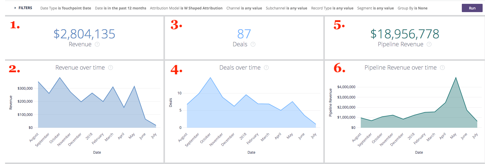

# Detalhamentos {#drill-throughs}

A variável [!DNL Marketo Measure Discover] A experiência do permite que os clientes detalhem o conjunto de dados com o qual se preocupam mais. Em certas medidas ao longo de todo o [!DNL Marketo Measure Discover], os clientes podem clicar em um bloco e explorar mais sobre essa métrica.

Abaixo está uma lista de Painéis e Blocos que contêm drill-throughs e a experiência que um usuário deve esperar ao fazer drill-through. Lembre-se de que os filtros globais do painel persistem ao fazer drill-through.

## Visão geral {#overview}

**Receita**

Definição: Receita total por mês através do gráfico de barras e da tabela. A partir daí, é possível entrar em um único mês ou sair um mês por semana, dia ou hora.

**Receita (Gráfico)**

Definição: Receita total por mês através do gráfico de barras e da tabela. Como o bloco principal já é um gráfico de barras, aprofundar em Mostrar Detalhes mostrará apenas um mês.

_Drill-Into: Receita total por mês dividida por semana ou data._

**Gastos**

Definição: Total de gastos por mês por meio de gráfico de barras e tabela. A partir daí, é possível entrar em um único mês ou sair um mês por semana, dia ou hora.

**Negócios**

Definição: número total de ofertas por mês por meio de um gráfico de barras e uma tabela. A partir daí, é possível entrar em um único mês ou sair um mês por semana, dia ou hora.

**Receita de planejamento**

Definição: Receita total do pipeline por mês via gráfico de barras e tabela. A partir daí, é possível entrar em um único mês ou sair um mês por semana, dia ou hora.

**Resumo do ROI**

Definição: Receita ou gasto total de cada canal por mês por meio de um gráfico de barras e uma tabela. A partir daí, é possível detalhar essa linha por um único mês ou dividir um mês por semana, dia ou hora.

**Custo por negócio**

Definição: o gasto total dividido pelo número total de negócios, fornecendo o custo médio necessário para adquirir uma oportunidade conquistada fechada. A partir daí, é possível detalhar essa linha por um único mês ou dividir um mês por semana, dia ou hora.

**Canais por receita**

Definição: A receita total de cada canal por mês através do gráfico de barras e da tabela. A partir daí, é possível detalhar essa linha por um único mês ou dividir um mês por semana, dia ou hora.

**Subcanais por receita**

Definição: Receita total de cada subcanal por mês por meio de um gráfico de barras e uma tabela. A partir daí, é possível detalhar essa linha por um único mês ou dividir um mês por semana, dia ou hora.

**Campanhas por receita**

Definição: Receita total de cada campanha por mês, por meio de um gráfico de barras e uma tabela. A partir daí, é possível detalhar essa linha por um único mês ou dividir um mês por semana, dia ou hora.

**Resumo da oferta**

Definição: contagem total de gastos ou negócios de cada canal por mês por meio de um gráfico de barras e uma tabela. A partir daí, é possível detalhar essa linha por um único mês ou dividir um mês por semana, dia ou hora.

## Crescimento {#growth}

**Total da receita**

Definição: Receita total por mês através do gráfico de barras e da tabela. A partir daí, é possível entrar em um único mês ou sair um mês por semana, dia ou hora.

**Receita ao longo do tempo**

Definição: Receita total por mês através do gráfico de barras e da tabela. Como o bloco principal já é um gráfico, aprofunde-se em Mostrar Detalhes e mostre apenas um mês.

_Receita total por mês, discriminada por semana ou data._

**Total de Ofertas**

Definição: número total de ofertas por mês por meio de um gráfico de barras e uma tabela. A partir daí, é possível entrar em um único mês ou sair um mês por semana, dia ou hora.

**Transações ao longo do tempo**

Definição: número total de ofertas por mês por meio de um gráfico de barras e uma tabela. Como o bloco principal já é um gráfico, aprofunde-se em Mostrar Detalhes e mostre apenas um mês.

_Número total de ofertas por mês, detalhado por semana ou data._

**Total de Receita de Pipeline**

Definição: Receita total do pipeline por mês via gráfico de barras e tabela. A partir daí, é possível entrar em um único mês ou sair um mês por semana, dia ou hora.

**Receita do pipeline ao longo do tempo**

Definição: Receita total do pipeline por mês via gráfico de barras e tabela. Como o bloco principal já é um gráfico, aprofunde-se em Mostrar Detalhes e mostre apenas um mês.

_Receita total do pipeline por mês dividida por semana ou data._

**Total de leads**

Definição: total de clientes em potencial por mês por meio de gráfico de barras e tabela. A partir daí, é possível entrar em um único mês ou sair um mês por semana, dia ou hora.

**Clientes potenciais ao longo do tempo**

Definição: total de clientes em potencial por mês por meio de gráfico de barras e tabela. Como o bloco principal já é um gráfico, aprofunde-se em Mostrar Detalhes e mostre apenas um mês.

_Total de clientes potenciais por mês detalhado por semana ou data._

**Total de contatos**

Definição: total de contatos por mês por meio de um gráfico de barras e uma tabela. A partir daí, é possível entrar em um único mês ou sair um mês por semana, dia ou hora.

**Contatos ao longo do tempo**

Definição: total de contatos por mês por meio de um gráfico de barras e uma tabela. Como o bloco principal já é um gráfico, aprofunde-se em Mostrar Detalhes e mostre apenas um mês.

_Total de contatos por mês, detalhados por semana ou data._

**Total de Oportunidades**

Definição: total de oportunidades por mês através de gráfico de barras e tabela. A partir daí, é possível entrar em um único mês ou sair um mês por semana, dia ou hora.

**Oportunidades ao longo do tempo**

Definição: total de oportunidades por mês através de gráfico de barras e tabela. Como o bloco principal já é um gráfico, aprofunde-se em Mostrar Detalhes e mostre apenas um mês.

_Oportunidades totais por mês detalhadas por semana ou data._

**Visitas Exclusivas**

Definição: Número total de exibições de página por mês por gráfico de barras e tabela. A partir daí, é possível entrar em um único mês ou sair um mês por semana, dia ou hora.

**Visitas únicas ao longo do tempo**

Definição: o número total de visitas únicas que mostram a tendência em um período específico. Use o filtro Agrupar por para alterar a pilha por canal, subcanal, campanha, conta, grupo de anúncios, anúncio, anunciante, criativo, palavra-chave, posicionamento e site. Isso aparecerá vazio se esse recurso estiver desativado.

**Visitas**

Definição: número total de visitas ao site por mês via gráfico de barras e tabela. A partir daí, é possível entrar em um único mês ou sair um mês por semana, dia ou hora.

**Visitas ao longo do tempo**

Definição: o número total de visitas ao site rastreadas que mostram a tendência em um período específico. Use o filtro Agrupar por para alterar a pilha por canal, subcanal, campanha, conta, grupo de anúncios, anúncio, anunciante, criativo, palavra-chave, posicionamento e site. Isso aparecerá vazio se esse recurso estiver desativado.

**Formulários**

Definição: número total de envios de formulários por mês através do gráfico de barras e da tabela. A partir daí, é possível entrar em um único mês ou sair um mês por semana, dia ou hora.

**Forms ao longo do tempo**

Definição: o número total de formulários enviados que mostram a tendência em um período específico. Use o filtro Agrupar por para alterar a pilha por canal, subcanal, campanha, conta, grupo de anúncios, anúncio, anunciante, criativo, palavra-chave, posicionamento e site. Isso aparecerá vazio se esse recurso estiver desativado.

## Gastos {#spend}

**Gastos**

Definição: Total de gastos por mês por meio de gráfico de barras e tabela. A partir daí, é possível entrar em um único mês ou sair um mês por semana, dia ou hora.

**Gasto (Gráfico)**

Definição: Total de gastos por mês por meio de gráfico de barras e tabela. Como o bloco principal já é um gráfico, aprofunde-se em Mostrar Detalhes e mostre apenas um mês.

_Total gasto por mês dividido por semana, data ou hora. O tempo é possível para gastar desde [!DNL Marketo Measure] O baixa o gasto real por minuto de nossas conexões de anúncios._

**Gasto por Canal**

Definição: Total de gastos de cada canal por mês por meio de um gráfico de barras e uma tabela. A partir daí, é possível detalhar essa linha por um único mês ou dividir um mês por semana, dia ou hora.

**Gasto por Subcanal**

Definição: gasto total de cada subcanal por mês por meio de gráfico de barras e tabela. A partir daí, é possível detalhar essa linha por um único mês ou dividir um mês por semana, dia ou hora.

**Gasto por Campanha**

Definição: gasto total de cada campanha por mês por meio de um gráfico de barras e uma tabela. A partir daí, é possível detalhar essa linha por um único mês ou dividir um mês por semana, dia ou hora.

## Velocidade de vendas {#sales-velocity}

**Velocidade (dias)**

Definição: o número médio de dias que as oportunidades estão em seu ciclo de vendas, desde o primeiro contato anônimo até o fechamento da oportunidade.

**Oportunidades ativas**

Definição: O número total de oportunidades de qualquer Oportunidade em Aberto, significando que não é Perdida Fechada ou Ganha Fechada.

**Tamanho do negócio**

Definição: O valor médio de uma oportunidade Ganha Fechada.

**Taxa de obtenções**

Definição: O número total de oportunidades Ganhas Fechadas dividido pelo número total de oportunidades Perdidas Fechadas e Ganhas Fechadas.

**Velocidade da oportunidade por canal**

Definição: o número médio de dias que as Oportunidades estão em seu ciclo por estágio, agrupadas pelo Canal de marketing e mostrando o tempo necessário para avançar para o próximo estágio. Os estágios que aparecem aqui são estágios de marcos (FT, LC, OC) e estágios personalizados.

**Velocidade de Lead por Canal**

Definição: o número médio de dias que os clientes potenciais estão em seu ciclo por estágio antes de serem convertidos em um Contato/Oportunidade/Valor, agrupados pelo Canal de marketing e mostrando o tempo necessário para avançar para o próximo estágio. Os estágios que aparecem aqui são estágios de marcos (FT, LC) e estágios personalizados.

**Velocidade média da oportunidade**

Definição: O número médio de dias que as Oportunidades estão em seu ciclo por estágio, mostrando o tempo necessário para avançar para o próximo estágio. Os estágios que aparecem aqui são estágios de marcos (FT, LC, OC) e estágios personalizados. os números aqui refletem o tempo por estágio no gráfico Velocidade da oportunidade por canal.

**Velocidade média de lead**

Definição: O número médio de dias que os clientes potenciais estão em seu ciclo por estágio antes de serem convertidos em um Contato/Oportunidade/Valor, mostrando o tempo necessário para avançar para o próximo estágio. Os estágios que aparecem aqui são estágios de marcos (FT, LC) e estágios personalizados. os números aqui refletem o tempo por estágio na Velocidade do lead pelo gráfico Canal.

**Velocidade da oportunidade ao longo do tempo**

Definição: O número médio de dias que as Oportunidades estão em seu ciclo por estágio com uma tendência ao longo do tempo.

**Velocidade do lead ao longo do tempo**

Definição: o número médio de dias que os clientes em potencial estão em seu ciclo por estágio com uma tendência ao longo do tempo.

## Marketing baseado em conta {#account-based-marketing}

**Total da receita**

Definição: Receita total por mês através do gráfico de barras e da tabela. A partir daí, é possível entrar em um único mês ou sair um mês por semana, dia ou hora.

**Total de Receita de Pipeline**

Definição: Receita total do pipeline por mês via gráfico de barras e tabela. A partir daí, é possível entrar em um único mês ou sair um mês por semana, dia ou hora.

**Leads Correspondidos**

Definição: número total de clientes em potencial correspondidos com êxito a uma conta.

**Contas tocadas**

Definição: o número total de contas que receberam qualquer ponto de contato.

**Oportunidades tocadas**

Definição: uma lista de IDs de oportunidade com a ID de conta correspondente.

**Contatos tocados**

Definição: uma lista de IDs de contato com sua ID de conta correspondente

**Pontos de contato ao longo do tempo (gráfico)**

Definição: uma lista de pontos de contato do mês selecionado.

_O número de pontos de contato tocados detalhados por semana, data ou hora._

**Contas Tocadas ao Longo do Tempo (gráfico)**

Definição: uma lista de IDs de conta do mês selecionado.

_O número de contas tocadas detalhadas por semana, data ou hora._

## Web Analytics {#web-analytics}

**Visitas Exclusivas**

Definição: número total de visitas únicas ao site por mês, por meio de um gráfico de barras e tabela. A partir daí, é possível entrar em um único mês ou sair um mês por semana, dia ou hora.

**Custo por visita única**

Definição: gasto total dividido pelo número total de visitas únicas. A partir daí, é possível entrar em um único mês ou sair um mês por semana, dia ou hora.

**Visitas únicas por página inicial**

Definição: uma lista de páginas de aterrissagem com base no número de visitantes únicos de cada URL.

**Visitas Exclusivas por Origem**

Definição: uma visualização nas fontes de visitantes únicos do site.

**Visitas Exclusivas ao longo do tempo**

Definição: o número total de visitas únicas rastreadas, que mostra uma tendência em um período específico.

**Visitas**

Definição: número total de visitas ao site por mês via gráfico de barras e tabela. A partir daí, é possível entrar em um único mês ou sair um mês por semana, dia ou hora.

**Custo por visita**

Definição: o gasto total dividido pelo número total de visitas.

**Visitas por página inicial**

Definição: uma lista de páginas de aterrissagem com base no número de visitas em cada URL.

**Visitas por Origem**

Definição: origem dos visitantes do site. Pode ser alterado por Canal, Subcanal, Campanha, Conta, Grupo de publicidade, Anúncio, Anunciante, Criativo, Palavra-chave, Posicionamento e Site.

**Visitas ao longo do tempo**

Definição: o número total de visitas rastreadas, que mostra a tendência em um período específico. A partir daí, é possível entrar em um único mês ou sair um mês por semana, dia ou hora.

**Visualizações de página**

Definição: Número total de exibições de página por mês por gráfico de barras e tabela. A partir daí, é possível entrar em um único mês ou sair um mês por semana, dia ou hora.

**Custo por exibição de página**

Definição: o gasto total dividido pelo número total de exibições de página rastreadas.

**Exibições de página por URLs**

Definição: uma lista de URLs de página com base no número de exibições de página de cada URL.

**Exibições de página ao longo do tempo**

Definição: Total de exibições de página por mês por gráfico de barras e tabela. Como o bloco principal já é um gráfico, aprofunde-se em Mostrar Detalhes e mostre apenas um mês.

_Total de exibições da página por mês, detalhadas por semana, data ou hora._

**Forms ao longo do tempo**

Definição: o número total de formulários rastreados, mostrando a tendência em um período específico.

**Formulários**

Definição: número total de envios de formulários por mês através do gráfico de barras e da tabela. A partir daí, é possível entrar em um único mês ou sair um mês por semana, dia ou hora.

**Custo por formulário**

Definição: o gasto total dividido pelo total de formulários enviados.

**Envios de formulários por URL do formulário**

Definição: uma lista de URLs de formulário com base no número enviado em cada URL.

**Leads por Página de Aterrissagem**

Definição: uma lista de páginas de aterrissagem com base no número de leads gerados em cada página de aterrissagem.

**Leads por URL de Formulário**

Definição: uma lista de URLs de formulário com base no número de leads gerados de cada URL.

## CMO {#cmo}

**Receita**

Definição: Receita total por mês através do gráfico de barras e da tabela. A partir daí, é possível entrar em um único mês ou sair um mês por semana, dia ou hora.

**Receita (Gráfico)**

Definição: Receita total por mês através do gráfico de barras e da tabela. Como o bloco principal já é um gráfico de barras, aprofundar em Mostrar Detalhes mostrará apenas um mês.

_Receita total por mês, discriminada por semana ou data._

**Gastos**

Definição: Total de gastos por mês por meio de gráfico de barras e tabela. A partir daí, é possível entrar em um único mês ou sair um mês por semana, dia ou hora.

**ROI**

Definição: o retorno calculado sobre o investimento do total da receita e do gasto total (com base no modelo de atribuição).

**Negócios**

Definição: número total de ofertas por mês por meio de um gráfico de barras e uma tabela. A partir daí, é possível entrar em um único mês ou sair um mês por semana, dia ou hora.

**Custo por negócio**

Definição: o gasto total dividido pelo número total de negócios, fornecendo o custo médio necessário para adquirir uma oportunidade conquistada fechada.

**Receita de planejamento**

Definição: Receita total do pipeline por mês via gráfico de barras e tabela. A partir daí, é possível entrar em um único mês ou sair um mês por semana, dia ou hora.

**Tamanho do negócio**

Definição: o valor médio de uma oportunidade ganha fechada.

**Canais por receita**

Definição: A receita total de cada canal por mês através do gráfico de barras e da tabela. A partir daí, é possível detalhar essa linha por um único mês ou dividir um mês por semana, dia ou hora.

**Subcanais por receita**

Definição: Receita total de cada subcanal por mês por meio de um gráfico de barras e uma tabela. A partir daí, é possível detalhar essa linha por um único mês ou dividir um mês por semana, dia ou hora.

**Campanhas por receita**

Definição: Receita total de cada campanha por mês, por meio de um gráfico de barras e uma tabela. A partir daí, é possível detalhar essa linha por um único mês ou dividir um mês por semana, dia ou hora.

**Resumo do ROI**

Definição: Receita ou gasto total de cada canal por mês por meio de um gráfico de barras e uma tabela. A partir daí, é possível detalhar essa linha por um único mês ou dividir um mês por semana, dia ou hora.

**Resumo da oferta**

Definição: contagem total de gastos ou negócios de cada canal por mês por meio de um gráfico de barras e uma tabela. A partir daí, é possível detalhar essa linha por um único mês ou dividir um mês por semana, dia ou hora.

## Marketing de conteúdo {#content-marketing}

**Total da receita**

Definição: Receita total por mês através do gráfico de barras e da tabela. A partir daí, é possível entrar em um único mês ou sair um mês por semana, dia ou hora.

**Páginas de Aterrissagem por Receita**

Definição: a receita total de cada landing page por meio do gráfico de barras e da tabela. A partir daí, é possível detalhar essa linha por um único mês ou dividir um mês por semana, dia ou hora.

**Total de Receita de Pipeline**

Definição: Receita total do pipeline por mês via gráfico de barras e tabela. A partir daí, é possível entrar em um único mês ou sair um mês por semana, dia ou hora.

**Páginas de Aterrissagem por Receita de Pipeline**

Definição: a receita total do pipeline de cada página de aterrissagem por meio de um gráfico de barras e uma tabela. A partir daí, é possível detalhar essa linha por um único mês ou dividir um mês por semana, dia ou hora.

**Total de Oportunidades**

Definição: número total de oportunidades por mês através de um gráfico de barras e uma tabela. A partir daí, é possível entrar em um único mês ou sair um mês por semana, dia ou hora.

**Páginas de Aterrissagem por Contagem de Oportunidades**

Definição: número total de oportunidades de cada página de aterrissagem por meio de um gráfico de barras e uma tabela. A partir daí, é possível detalhar essa linha por um único mês ou dividir um mês por semana, dia ou hora.

**Total de Formulários**

Definição: número total de formulários por mês por meio de gráfico de barras e tabela. A partir daí, é possível entrar em um único mês ou sair um mês por semana, dia ou hora.

**URL do formulário superior por envios de formulário**

Definição: número total de formulários de cada URL de formulário por meio de um gráfico de barras e uma tabela. A partir daí, é possível detalhar essa linha por um único mês ou dividir um mês por semana, dia ou hora.

**URLs de formulário por canal**

Definição: número total de formulários enviados da URL do formulário por mês por meio de um gráfico de barras e uma tabela. A partir daí, é possível detalhar essa linha por um único mês ou dividir um mês por semana, dia ou hora.

**Visitas Exclusivas**

Definição: o número total de visitas únicas ao site rastreadas em todos os visitantes conhecidos e anônimos. Detalhe para ver as visitas exclusivas ao site rastreadas por mês.

**Principais Páginas de Aterrissagem por Visitas Exclusivas**

Definição: uma lista de páginas de destino com base no número de visitas exclusivas a cada página de destino. Faça drill-in para ver as visitas exclusivas por mês ao URL selecionado.

**Visitas**

Definição: o número total de visitas ao site rastreadas em todos os visitantes conhecidos e anônimos. Detalhe para ver as visitas do site rastreadas por mês.

**Principais Páginas de Aterrissagem por Visitas**

Definição: uma lista de páginas de destino com base no número de visitas iniciais a cada página de destino. Faça drill-in para ver as visitas por mês ao URL selecionado.

**Total de leads**

Definição: número total de clientes potenciais por mês por meio de gráfico de barras e tabela. A partir daí, é possível entrar em um único mês ou sair um mês por semana, dia ou hora.

**Páginas de Aterrissagem por Contagem de Leads**

Definição: número total de clientes em potencial de cada página de aterrissagem por meio de um gráfico de barras e uma tabela. A partir daí, é possível detalhar essa linha por um único mês ou dividir um mês por semana, dia ou hora.

## Mídia paga {#paid-media}

**Impressões**

Definição: número total de impressões por mês, por meio de um gráfico de barras e uma tabela. A partir daí, é possível entrar em um único mês ou sair um mês por semana, dia ou hora.

**CPM**

Definição: o gasto total das impressões fornecidas dividido pelo total de impressões.

**Cliques**

Definição: Número total de cliques por mês por meio de um gráfico de barras e uma tabela. A partir daí, é possível entrar em um único mês ou sair um mês por semana, dia ou hora.

**CPC**

Definição: o gasto total dos cliques rastreados dividido pelo total de cliques.

**Leads**

Definição: Número total de clientes potenciais com base no modelo de atribuição.

**CPL**

Definição: O gasto total dos clientes potenciais criados dividido pelo total de cliques, fornecendo a taxa CPL.

**Visitas**

Definição: número total de visitas ao site por mês via gráfico de barras e tabela. A partir daí, é possível entrar em um único mês ou sair um mês por semana, dia ou hora.

**Visualizações de página**

Definição: Número total de exibições de página por mês por gráfico de barras e tabela. A partir daí, é possível entrar em um único mês ou sair um mês por semana, dia ou hora.

**Resumo de campanhas**

Definição: lista de campanhas com base em quanta receita/gasto/ofertas/oportunidades foram atribuídas a cada campanha, classificadas pelo maior com base no modelo de atribuição selecionado.

**Resumo do anúncio**

Definição: uma lista de anúncios com base em quanta receita/receita/gasto/ofertas/oportunidades do pipeline foi atribuída a cada anúncio, com base no modelo de atribuição selecionado.

**Resumo de palavras-chave**

Definição: uma lista de palavras-chave com base em quanta receita/receita de pipeline/gasto/ofertas/oportunidades foi atribuída a cada palavra-chave, com base no modelo de atribuição selecionado.

**Campanhas por ROI**

Definição: uma lista de campanhas com base no ROI calculado para cada campanha, classificado pelo ROI mais alto. Faça drill-in para ver a receita ou gasto por mês para a campanha selecionada.

**Anúncios por ROI**

Definição: uma lista de anúncios com base no ROI calculado para cada anúncio, classificado pelo ROI mais alto. Faça drill-in para ver a receita ou gasto por mês para o anúncio selecionado.

**Palavras-chave por ROI**

Definição: uma lista de palavras-chave com base no ROI calculado para cada palavra-chave, classificado pelo ROI mais alto. Faça drill-in para ver a receita ou gasto por mês para a palavra-chave selecionada.
