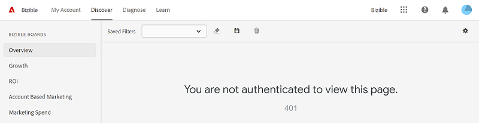

# Perguntas frequentes {#faq}

[!DNL Marketo Measure Discover]: Perguntas frequentes.

**Como salvar os filtros em um relatório?**

Assim como hoje, os resultados da consulta são salvos no URL e podem ser salvos ou compartilhados com o URL copiado.

**Como usar intervalos de datas predefinidos como Ano passado ou Trimestre atual?**

Em vez de usar intervalos de datas predefinidos, agora adicionamos flexibilidade de data. Você ainda pode definir Ano passado, mas tem a opção de selecionar Último ano, que é os últimos 365 dias de hoje, ou Último ano completo, que é o último ano completo de 1/1 a 12/31. Outros bons usos do novo seletor de datas é definir um intervalo de datas relativo, que tenderá a fornecer uma janela de tempo de rolagem para uma data móvel.

**Como obter dados CPL ou CPC?**

Essas métricas podem ser encontradas somente no quadro Mídia paga.

**Por que você não mostra Exibições de página no Quadro de crescimento?**

Um dos recursos do Quadro de crescimento é que você não pode agrupar os gráficos de tendência por uma dimensão, como Canal ou Campanha. Não temos esses dados disponíveis em um nível de Exibição de página, já que as Exibições de página nem sempre têm uma fonte como Canal ou Campanha, pois ocorrem no meio de visitas da Web. Use a Mídia paga ou o Tráfego da Web para exibir os dados de Exibições de página.

**Quando eu altero o agrupamento, os totais nem sempre são iguais à mesma quantidade. Por que isso ocorre?**

Não existem valores para cada hierarquia de dados, pois a hierarquia nem sempre é um fluxo de corte claro. Por exemplo, se os custos estiverem sendo relatados automaticamente ou importados de um provedor de anúncios, o custo total do Canal 1 pode ser de US$ 10.000, mas por campanha individual, apenas um total de US$ 5.500 foi relatado, de modo que, quando o agrupamento for alterado entre o Canal e a Campanha, os totais variarão.

**O que é &quot;corresponde a um atributo de usuário&quot; nos operadores de filtro?**

Os atributos do usuário são aplicados a usuários como ID comercial, nome ou sobrenome, mas como nossos usuários são você (nossos clientes) e não seus clientes, os atributos do usuário não podem ser usados na [!DNL Marketo Measure Discover] experiência. Sinta-se à vontade para ignorar essa opção. Estamos trabalhando em uma melhor experiência de filtro personalizado que removerá filtros que não se aplicam a nossos clientes.

**Por que alguns intervalos de datas padrão passam pelo primeiro dia do mês seguinte?**

Embora o intervalo de datas nem sempre seja intuitivo, a interface de filtro padrão tem o texto útil &quot;antes&quot; que corresponde à data final, portanto, isso deve ajudá-lo a lembrar que a data final usada deve estar 1 dia fora do intervalo desejado.

**Qual Modelo de Atribuição é usado para Clientes Potenciais e Contatos?**

Os Pontos de Contato do Comprador mapeados para Clientes Potenciais e Contatos medem até o toque de Criação de Clientes Potenciais, portanto, o modelo Primeiro Contato, Criação de Clientes Potenciais e Forma de U são recomendados. Se você alterar o Modelo de atribuição para Forma de W ou Caminho completo, aplicaremos automaticamente um modelo em Forma de U para Clientes potenciais e Contatos.

**Por que meus blocos Visitas, Visitas únicas e Forms estão em branco no quadro Crescimento?**

Se esses blocos forem 0 ou estiverem em branco na visualização, significa que eles não serão provisionados para a sua conta. Entre em contato com o Gerente de sucesso se houver alguma pergunta sobre isso.

**Para Clientes potenciais ao longo do tempo e Contatos ao longo do tempo, qual é a contagem que faz referência?**

Está usando as contagens de pontos de contato, distribuídas pelo Modelo de atribuição selecionado. Será o total de clientes em potencial e contagens distribuídos ao longo do tempo. Não é uma contagem exclusiva.

**O gráfico de URLs de formulário por canal no Marketing de conteúdo mostra Visitas da Web ou Preenchimentos de formulário?**

Esses são apenas preenchimentos de formulário rastreados.

**Qual é o benefício do Discover over Measure?**

[!DNL Marketo Measure Discover] O oferece melhor funcionalidade, como drill-throughs, e melhor filtragem, como Subcanais e Canais. Também estamos a pôr do sol Measure algum tempo em 2019.

**No Measure, pude filtrar por Grupo de anúncios e Conta quando filtrado para Contas de anúncio. Como posso ver isso no Discover?**

Isso só estará disponível com a placa Mídia paga.

**Qual é a diferença entre o funil de coorte e o funil do Passport?**

O funil de coorte permite que você veja a taxa de conversão do funil de vendas, medindo o impacto entre os estágios. É possível selecionar o estágio que deseja medir usando os filtros, o que permitirá visualizar a taxa de conversão desse estágio para todos os estágios subsequentes. A placa Passport mostra todos os clientes em potencial/contatos e oportunidades que passaram por cada estágio do pipeline em um determinado período.

**Como o conteúdo da placa de Mídia paga é determinado?**

Em cada um dos blocos do painel, adicionamos um filtro para incluir apenas dados em que temos um Provedor de anúncios conhecido do Facebook, Google, Bing, LinkedIn ou Doubleclick, já que nossa integração permite extrair os dados do anúncio dessas fontes. Além disso, adicionamos uma correspondência de nome difuso a Canais e Subcanais para Exibição, Pesquisa paga, Social paga, PPC, SEM, Dispositivo móvel pago, Twitter pago, Adroll, Terminus, Madison Logic, Madisonlogic e Demandbase.

**Qual é a diferença entre Visitas e Visitas únicas?**

Visitas únicas são um subconjunto de Visitas. Embora as Visitas sejam uma contagem de cada visita ao site, as Visitas únicas são cookies exclusivos dessas visitas. Uma pessoa pode contabilizar várias visitas exclusivas se retornar com um identificador de cookie diferente.

**As contagens de Pontos de contato são a contagem de Pontos de contato do comprador ou Pontos de contato de atribuição do comprador?**

É uma contagem do que consideramos pontos de contato &quot;brutos&quot;, ou &quot;pontos de contato do usuário&quot;, em que é uma agregação de ambos, além de toques que não resultaram em um ponto de contato no lead/contato ou na oportunidade.

**Quando eu filtro por URL, por que os blocos de Custo por mostram apenas US$ 0,00?**

Esse é o comportamento esperado devido ao fato de que não temos custos segmentados por URL, portanto, não é aplicável nesse cenário.

**Por que todas as opções de Segmento não são exibidas para meus Filtros de categoria?**

Somente os Segmentos que têm registros válidos mapeados para eles serão exibidos no filtro Segmentos. Por exemplo, se não houver registros com o segmento &quot;Outros&quot;, &quot;Outros&quot; não será exibido como uma opção.

**Faz [!DNL Marketo Measure Discover] oferecer suporte ao conjunto de caracteres GB18030?**

O Discover utiliza ferramentas de terceiros e não suporta o conjunto de caracteres GB18030 no momento.

**Ao carregar o Discover, por que vejo um erro 401 informando &quot;Você não está autenticado para visualizar esta página&quot;?**

[!DNL Marketo Measure Discover] O requer que cookies de terceiros sejam exibidos corretamente. Para usar o Discover, ative cookies de terceiros no navegador e atualize a página.

>[!NOTE]
>
>Alguns navegadores, incluindo o Chrome no Incógnito, desativam cookies de terceiros por padrão.

