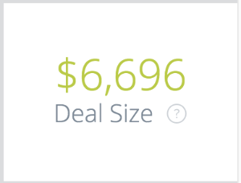

# Visão geral dos blocos de quadros {#overview-board-tiles}

O quadro Visão geral fornece a visualização mais abrangente do desempenho de marketing, ajudando as equipes de marketing a tomar as decisões certas ao aumentar sua equipe, orçamento ou receita.

<table> 
 <colgroup> 
  <col> 
  <col> 
  <col> 
  <col> 
  <col> 
  <col> 
  <col> 
  <col> 
  <col> 
  <col> 
  <col> 
 </colgroup> 
 <tbody> 
  <tr> 
   <td> </td> 
   <td>
<strong>Tipo de data</strong>
</td> 
   <td>
<strong>Data</strong>
</td> 
   <td>
<strong>Modelo de atribuição</strong>
</td> 
   <td>
<strong>Métrica</strong>
</td> 
   <td>
<strong>Dimensão</strong>
</td> 
   <td>
<strong>Canal</strong>
</td> 
   <td>
<strong>Subcanal</strong>
</td> 
   <td>
<strong>Campanha</strong>
</td> 
   <td>
<strong>ID da conta de anúncios</strong>
</td> 
   <td>
<strong>Nome de conta do CRM</strong>
</td> 
  </tr> 
  <tr> 
   <td>
<strong>Receita</strong>
</td> 
   <td><strong>X</strong></td> 
   <td><strong>X</strong></td> 
   <td><strong>X</strong></td> 
   <td> </td> 
   <td> </td> 
   <td><strong>X</strong></td> 
   <td><strong>X</strong></td> 
   <td><strong>X</strong></td> 
   <td><strong>X</strong></td> 
   <td><strong>X</strong></td> 
  </tr> 
  <tr> 
   <td>
<strong>Visão geral</strong>
</td> 
   <td><strong>X</strong></td> 
   <td><strong>X</strong></td> 
   <td><strong>X</strong></td> 
   <td><strong>X</strong></td> 
   <td><strong>X</strong></td> 
   <td><strong>X</strong></td> 
   <td><strong>X</strong></td> 
   <td><strong>X</strong></td> 
   <td><strong>X</strong></td> 
   <td><strong>X</strong></td> 
  </tr> 
  <tr> 
   <td>
<strong>Gastos</strong>
</td> 
   <td> </td> 
   <td><strong>X</strong></td> 
   <td> </td> 
   <td> </td> 
   <td> </td> 
   <td><strong>X</strong></td> 
   <td><strong>X</strong></td> 
   <td><strong>X</strong></td> 
   <td><strong>X</strong></td> 
   <td> </td> 
  </tr> 
  <tr> 
   <td>
<strong>ROI</strong>
</td> 
   <td><strong>X</strong></td> 
   <td><strong>X</strong></td> 
   <td><strong>X</strong></td> 
   <td> </td> 
   <td> </td> 
   <td><strong>X</strong></td> 
   <td><strong>X</strong></td> 
   <td><strong>X</strong></td> 
   <td><strong>X</strong></td> 
   <td><strong>X</strong></td> 
  </tr> 
  <tr> 
   <td>
<strong>Negócios</strong>
</td> 
   <td><strong>X</strong></td> 
   <td><strong>X</strong></td> 
   <td><strong>X</strong></td> 
   <td> </td> 
   <td> </td> 
   <td><strong>X</strong></td> 
   <td><strong>X</strong></td> 
   <td><strong>X</strong></td> 
   <td><strong>X</strong></td> 
   <td><strong>X</strong></td> 
  </tr> 
  <tr> 
   <td>
<strong>Custo por negócio</strong>
</td> 
   <td><strong>X</strong></td> 
   <td><strong>X</strong></td> 
   <td><strong>X</strong></td> 
   <td> </td> 
   <td> </td> 
   <td><strong>X</strong></td> 
   <td><strong>X</strong></td> 
   <td><strong>X</strong></td> 
   <td><strong>X</strong></td> 
   <td><strong>X</strong></td> 
  </tr> 
  <tr> 
   <td>
<strong>Receita de planejamento</strong>
</td> 
   <td><strong>X</strong></td> 
   <td><strong>X</strong></td> 
   <td><strong>X</strong></td> 
   <td> </td> 
   <td> </td> 
   <td><strong>X</strong></td> 
   <td><strong>X</strong></td> 
   <td><strong>X</strong></td> 
   <td><strong>X</strong></td> 
   <td><strong>X</strong></td> 
  </tr> 
  <tr> 
   <td>
<strong>Tamanho do negócio</strong>
</td> 
   <td><strong>X</strong></td> 
   <td><strong>X</strong></td> 
   <td><strong>X</strong></td> 
   <td> </td> 
   <td> </td> 
   <td><strong>X</strong></td> 
   <td><strong>X</strong></td> 
   <td><strong>X</strong></td> 
   <td><strong>X</strong></td> 
   <td><strong>X</strong></td> 
  </tr> 
  <tr> 
   <td>
<strong>Resumo do canal</strong>
</td> 
   <td><strong>X</strong></td> 
   <td><strong>X</strong></td> 
   <td><strong>X</strong></td> 
   <td><strong>X</strong></td> 
   <td> </td> 
   <td><strong>X</strong></td> 
   <td><strong>X</strong></td> 
   <td><strong>X</strong></td> 
   <td><strong>X</strong></td> 
   <td><strong>X</strong></td> 
  </tr> 
  <tr> 
   <td>
<strong>Resumo do Subcanal</strong>
</td> 
   <td><strong>X</strong></td> 
   <td><strong>X</strong></td> 
   <td><strong>X</strong></td> 
   <td><strong>X</strong></td> 
   <td> </td> 
   <td><strong>X</strong></td> 
   <td><strong>X</strong></td> 
   <td><strong>X</strong></td> 
   <td><strong>X</strong></td> 
   <td><strong>X</strong></td> 
  </tr> 
  <tr> 
   <td>
<strong>Resumo da campanha</strong>
</td> 
   <td><strong>X</strong></td> 
   <td><strong>X</strong></td> 
   <td><strong>X</strong></td> 
   <td><strong>X</strong></td> 
   <td> </td> 
   <td><strong>X</strong></td> 
   <td><strong>X</strong></td> 
   <td><strong>X</strong></td> 
   <td><strong>X</strong></td> 
   <td><strong>X</strong></td> 
  </tr> 
  <tr> 
   <td>
<strong>ROI</strong>
</td> 
   <td><strong>X</strong></td> 
   <td><strong>X</strong></td> 
   <td><strong>X</strong></td> 
   <td> </td> 
   <td><strong>X</strong></td> 
   <td><strong>X</strong></td> 
   <td><strong>X</strong></td> 
   <td><strong>X</strong></td> 
   <td><strong>X</strong></td> 
   <td><strong>X</strong></td> 
  </tr> 
  <tr> 
   <td>
<strong>Resumo do ROI</strong>
</td> 
   <td><strong>X</strong></td> 
   <td><strong>X</strong></td> 
   <td><strong>X</strong></td> 
   <td> </td> 
   <td><strong>X</strong></td> 
   <td><strong>X</strong></td> 
   <td><strong>X</strong></td> 
   <td><strong>X</strong></td> 
   <td><strong>X</strong></td> 
   <td><strong>X</strong></td> 
  </tr> 
 </tbody> 
</table>

## Mosaico de receita {#revenue-tile}

Receita total atribuída de oportunidades Ganhas Fechadas com base no modelo de atribuição.

-Detalhes da oportunidade: exibe um detalhamento das IDs de oportunidade relacionadas, a data de criação, a data de fechamento, o código ISO e a atribuição de receita.\
- Mostrar detalhes: um detalhamento por mês.

## Visão geral (gráfico) Lado a lado {#overview-chart-tile}

O gráfico exibirá a receita atribuída a cada canal, mostrada ao longo do tempo.

-Detalhes da oportunidade: exibe um detalhamento das IDs de oportunidade relacionadas, a data de criação, a data de fechamento, o código ISO e a atribuição de receita.\
-Exibe um detalhamento das IDs de Opp da contribuição:

* Por Semana do ROI
* Por dados de ROI
* Por hora de ROI
* Por minuto de ROI
* Por ROI Time

## Mosaico de gastos {#spend-tile}

O valor total do gasto com custos de API e custos relatados automaticamente para o período específico.

>[!NOTE]
>
>Ao fazer drill-in em menos de um mês, [!DNL Marketo Measure] fará a média do gasto para esse mês e alocará essa média para cada dia.

-Detalhes de gastos: exibe um detalhamento da ID exclusiva da campanha de gastos relacionada, nome da campanha, canal, subcanal, data, moeda original e gastos.  - Mostrar detalhes: um detalhamento por mês.

## Mosaico de ROI {#roi-tile}

O ROI calculado (retorno do investimento) do total da receita (do modelo de atribuição selecionado) e do gasto total (Bloco de receita ÷ Bloco de gasto = Bloco de ROI).

## Mosaico de ofertas {#deals-tile}

Exibe o número total de negociações atribuídas (Negociações são uma contagem de oportunidades Ganhas Fechadas).

>[!NOTE]
>
>Se o tipo de data &quot;Data do ponto de contato&quot; for selecionado, contagens parciais serão possíveis, pois pode haver determinados pontos de contato que não se enquadram no intervalo de tempo.

-Detalhes da oportunidade: exibe um detalhamento das IDs de oportunidade relacionadas, a data de criação, a data de fechamento e a atribuição (contagem).  - Mostrar detalhes: um detalhamento por mês.

## Custo por bloco de negociação {#cost-per-deal-tile}

Custo médio necessário para adquirir uma oportunidade conquistada fechada. O gasto total dividido pelo número total de negociações (Bloco de gastos ÷ Bloco de negociações = Custo por bloco de negociações).

## Mosaico de receita do pipeline {#pipeline-revenue-tile}

A receita potencial total atribuída para Oportunidades em Aberto

>[!NOTE]
>
>A receita será refletida para o modelo de atribuição especificado.

-Detalhes da oportunidade: exibe um detalhamento das IDs de oportunidade relacionadas, a data de criação, a data de fechamento, o código ISO e a atribuição de receita.  - Mostrar detalhes: um detalhamento por mês.

## Mosaico de tamanho do negócio {#deal-size-tile}

A receita média das oportunidades Ganhas Fechadas (Bloco de Receita ÷ Bloco de Transações = Bloco de Tamanho da Transação).

## Mosaico de resumo do canal {#channel-summary-tile}

Exibir uma lista de canais com base na métrica selecionada (receita, receita do pipeline, gastos, ofertas, oportunidades, clientes potenciais, contatos).

## Mosaico de resumo do subcanal {#subchannel-summary-tile}

Exibir uma lista de subcanais com base na métrica selecionada (receita, receita do pipeline, gastos, ofertas, oportunidades, clientes potenciais, contatos).

## Mosaico de resumo da campanha {#campaign-summary-tile}

Exibir uma lista de Campanhas com base na métrica selecionada (receita, receita de pipeline, gastos, ofertas, oportunidades, clientes potenciais, contatos).

## Mosaico de ROI (gráfico) {#roi-chart-tile}

Exibe o ROI atribuído à métrica selecionada (canal, subcanal, campanha, conta, adgroup, anúncio, anunciante, criativo, palavra-chave, posicionamento, site) com base no modelo de atribuição selecionado.

## Mosaico de resumo do ROI {#roi-summary-tile}

Exibe o ROI atribuído à métrica selecionada (canal, subcanal, campanha, conta, adgroup, anúncio, anunciante, criativo, palavra-chave, posicionamento, site) com base no modelo de atribuição selecionado.

-Detalhes da oportunidade: exibe um detalhamento das IDs de oportunidade relacionadas, a data de criação, a data de fechamento e a atribuição (contagem).

- Mostrar detalhes: um detalhamento por mês.
