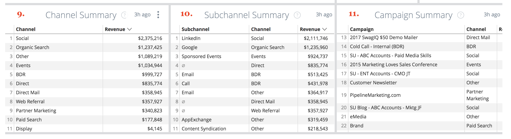

# Drill Throughs {#drill-throughs}

O [!DNL Marketo Measure Discover] permite que os clientes analisem o conjunto de dados com o qual mais se importam. Em relação a certas medidas [!DNL Marketo Measure Discover], os clientes do podem clicar em um bloco e explorar mais sobre essa métrica.

Abaixo está uma lista de Painéis e Mosaicos que contêm drill-throughs e a experiência que um usuário deve esperar ao realizar drill-through. Lembre-se de que os filtros globais do painel persistem ao fazer drill-through.

## Visão geral {#overview}

**Receita**

Definição: Receita total por mês através do gráfico de barras e da tabela. A partir daí, é possível detalhar um único mês por semana, dia ou hora.

**Receita (Gráfico)**

Definição: Receita total por mês através do gráfico de barras e da tabela. Como o bloco pai já é um gráfico de barras, detalhar em Mostrar detalhes mostrará apenas um mês.

_Detalhar: Receita total por mês discriminada por semana ou data._

**Gastos**

Definição: Total de gastos por mês por gráfico de barras e tabela. A partir daí, é possível detalhar um único mês por semana, dia ou hora.

**Negócios**

Definição: Número total de ofertas por mês através do gráfico de barras e da tabela. A partir daí, é possível detalhar um único mês por semana, dia ou hora.

**Receita de planejamento**

Definição: Receita total do pipeline por mês por gráfico de barras e tabela. A partir daí, é possível detalhar um único mês por semana, dia ou hora.

**Resumo do ROI**

Definição: Receita ou gasto total de cada canal por mês por meio do gráfico de barras e da tabela. A partir daí, é possível detalhar essa linha por um único mês ou dividir um mês por semana, dia ou hora.

**Custo por negócio**

Definição: O gasto total dividido pelo número total de ofertas, fornecendo o custo médio necessário para adquirir uma oportunidade vencida fechada. A partir daí, é possível detalhar essa linha por um único mês ou dividir um mês por semana, dia ou hora.

**Canais por receita**

Definição: Receita total de cada canal por mês através do gráfico de barras e da tabela. A partir daí, é possível detalhar essa linha por um único mês ou dividir um mês por semana, dia ou hora.

**Subcanais por Receita**

Definição: Receita total de cada subcanal por mês através do gráfico de barras e da tabela. A partir daí, é possível detalhar essa linha por um único mês ou dividir um mês por semana, dia ou hora.

**Campanhas por Receita**

Definição: Receita total de cada campanha por mês através do gráfico de barras e da tabela. A partir daí, é possível detalhar essa linha por um único mês ou dividir um mês por semana, dia ou hora.

**Resumo do contrato**

Definição: Contagem total de gastos ou negócios de cada canal por mês por meio do gráfico de barras e da tabela. A partir daí, é possível detalhar essa linha por um único mês ou dividir um mês por semana, dia ou hora.

## Crescimento {#growth}

**Total da receita**

Definição: Receita total por mês através do gráfico de barras e da tabela. A partir daí, é possível detalhar um único mês por semana, dia ou hora.

**Receita ao longo do tempo**

Definição: Receita total por mês através do gráfico de barras e da tabela. Como o bloco pai já é um gráfico, detalhar em Mostrar detalhes mostrará apenas um mês.

_Receita total por mês discriminada por semana ou data._

**Total de Ofertas**

Definição: Número total de ofertas por mês através do gráfico de barras e da tabela. A partir daí, é possível detalhar um único mês por semana, dia ou hora.

**Contratos ao longo do tempo**

Definição: Número total de ofertas por mês através do gráfico de barras e da tabela. Como o bloco pai já é um gráfico, detalhar em Mostrar detalhes mostrará apenas um mês.

_Número total de transações por mês, discriminadas por semana ou data._

**Total de Receita de Pipeline**

Definição: Receita total do pipeline por mês por gráfico de barras e tabela. A partir daí, é possível detalhar um único mês por semana, dia ou hora.

**Receita do pipeline ao longo do tempo**

Definição: Receita total do pipeline por mês por gráfico de barras e tabela. Como o bloco pai já é um gráfico, detalhar em Mostrar detalhes mostrará apenas um mês.

_Receita total do pipeline por mês discriminada por semana ou data._

**Total de leads**

Definição: Total de leads por mês por meio do gráfico de barras e da tabela. A partir daí, é possível detalhar um único mês por semana, dia ou hora.

**Potenciais ao longo do tempo**

Definição: Total de leads por mês por meio do gráfico de barras e da tabela. Como o bloco pai já é um gráfico, detalhar em Mostrar detalhes mostrará apenas um mês.

_Total de leads por mês detalhados por semana ou data._

**Total de contatos**

Definição: Total de contatos por mês através do gráfico de barras e da tabela. A partir daí, é possível detalhar um único mês por semana, dia ou hora.

**Contatos ao longo do tempo**

Definição: Total de contatos por mês através do gráfico de barras e da tabela. Como o bloco pai já é um gráfico, detalhar em Mostrar detalhes mostrará apenas um mês.

_Total de contatos por mês detalhados por semana ou data._

**Total de Oportunidades**

Definição: Total de oportunidades por mês por gráfico de barras e tabela. A partir daí, é possível detalhar um único mês por semana, dia ou hora.

**Oportunidades ao longo do tempo**

Definição: Total de oportunidades por mês por gráfico de barras e tabela. Como o bloco pai já é um gráfico, detalhar em Mostrar detalhes mostrará apenas um mês.

_Total de oportunidades por mês, discriminadas por semana ou data._

**Visitas Exclusivas**

Definição: Número total de exibições de página por mês por gráfico de barras e tabela. A partir daí, é possível detalhar um único mês por semana, dia ou hora.

**Visitas únicas ao longo do tempo**

Definição: O número total de visitas únicas que mostram a tendência de um período específico. Use o filtro Agrupar por canal, subcanal, campanha, conta, grupo de anúncios, anúncio, anunciante, criativo, palavra-chave, disposição e site para alterar a pilha. Isso aparecerá vazio se esse recurso estiver desativado.

**Visitas**

Definição: Número total de visitas ao site por mês através do gráfico de barras e da tabela. A partir daí, é possível detalhar um único mês por semana, dia ou hora.

**Visitas ao longo do tempo**

Definição: O número total de visitas ao site rastreadas que mostram a tendência em um período específico. Use o filtro Agrupar por canal, subcanal, campanha, conta, grupo de anúncios, anúncio, anunciante, criativo, palavra-chave, disposição e site para alterar a pilha. Isso aparecerá vazio se esse recurso estiver desativado.

**Formulários**

Definição: Número total de envios de formulário por mês por gráfico de barras e tabela. A partir daí, é possível detalhar um único mês por semana, dia ou hora.

**Forms ao longo do tempo**

Definição: O número total de formulários enviados que mostram a tendência de um período específico. Use o filtro Agrupar por canal, subcanal, campanha, conta, grupo de anúncios, anúncio, anunciante, criativo, palavra-chave, disposição e site para alterar a pilha. Isso aparecerá vazio se esse recurso estiver desativado.

## Gastos {#spend}

**Gastos**

Definição: Total de gastos por mês por gráfico de barras e tabela. A partir daí, é possível detalhar um único mês por semana, dia ou hora.

**Gasto (Gráfico)**

Definição: Total de gastos por mês por gráfico de barras e tabela. Como o bloco pai já é um gráfico, detalhar em Mostrar detalhes mostrará apenas um mês.

_Total de gastos por mês detalhado por semana, data ou hora. O tempo é possível para gastar desde que [!DNL Marketo Measure] baixa os gastos reais por minuto das nossas conexões de anúncios._

**Gasto por Canal**

Definição: Gasto total de cada canal por mês por meio do gráfico de barras e da tabela. A partir daí, é possível detalhar essa linha por um único mês ou dividir um mês por semana, dia ou hora.

**Gasto por Subcanal**

Definição: Gasto total de cada subcanal por mês através do gráfico de barras e da tabela. A partir daí, é possível detalhar essa linha por um único mês ou dividir um mês por semana, dia ou hora.

**Gasto por Campanha**

Definição: Total de gastos de cada campanha por mês através do gráfico de barras e da tabela. A partir daí, é possível detalhar essa linha por um único mês ou dividir um mês por semana, dia ou hora.

## Velocidade de vendas {#sales-velocity}

**Velocidade (dias)**

Definição: O número médio de dias que as oportunidades estão em seu ciclo de vendas, desde o primeiro toque anônimo até o fechamento da oportunidade.

**Oportunidades ativas**

Definição: O número total de oportunidades de qualquer Oportunidade Aberta, o que significa que não é Oportunidade Fechada ou Vencedora Fechada.

**Tamanho do negócio**

Definição: A quantidade média de uma oportunidade de Vencedor Fechado.

**Taxa de obtenções**

Definição: O número total de oportunidades de Vencedor Fechado dividido pelo número total de oportunidades de Ganho Fechado e Ganho Fechado.

**Velocidade da oportunidade por canal**

Definição: O número médio de dias em que as Oportunidades estão em seu ciclo por estágio, agrupado pelo Canal de marketing e mostrando o tempo necessário para o progresso até o próximo estágio. Os estágios que aparecem aqui são estágios de marco (FT, LC, OC) e estágios personalizados.

**Velocidade de Lead por Canal**

Definição: O número médio de dias em que os Clientes Potenciais estão em seu ciclo por estágio antes de serem convertidos em um Contato/Oportunidade/Quantia, agrupados pelo Canal de marketing e mostrando o tempo necessário para o progresso para o próximo estágio. Os estágios que aparecem aqui são estágios de marco (FT, LC) e estágios personalizados.

**Velocidade média da oportunidade**

Definição: O número médio de dias em que as Oportunidades estão em seu ciclo por estágio, mostrando o tempo necessário para o progresso até o próximo estágio. Os estágios que aparecem aqui são estágios de marco (FT, LC, OC) e estágios personalizados. os números aqui refletem o tempo por estágio na Velocidade da oportunidade pelo gráfico de canal.

**Velocidade média de lead**

Definição: O número médio de dias em que os Clientes Potenciais estão em seu ciclo por estágio antes de serem convertidos em um Contato/Oportunidade/Quantia, mostrando o tempo necessário para avançar para o próximo estágio. Os estágios que aparecem aqui são estágios de marco (FT, LC) e estágios personalizados. os números aqui refletem o tempo por estágio na Velocity do lead, pelo gráfico de canal.

**Velocidade da oportunidade ao longo do tempo**

Definição: O número médio de dias em que as Oportunidades estão em seu ciclo por estágio com uma tendência ao longo do tempo.

**Velocidade de lead ao longo do tempo**

Definição: O número médio de dias que os Leads estão em seu ciclo por estágio com uma tendência ao longo do tempo.

## Marketing baseado em conta {#account-based-marketing}

**Total da receita**

Definição: Receita total por mês através do gráfico de barras e da tabela. A partir daí, é possível detalhar um único mês por semana, dia ou hora.

**Total de Receita de Pipeline**

Definição: Receita total do pipeline por mês por gráfico de barras e tabela. A partir daí, é possível detalhar um único mês por semana, dia ou hora.

**Leads Correspondidos**

Definição: O número total de clientes potenciais correspondidos com êxito a uma conta.

**Contas tocadas**

Definição: O número total de contas que receberam qualquer ponto de contato.

**Oportunidades tocadas**

Definição: Uma lista de IDs de Oportunidade com sua ID de Conta correspondente

**Contatos Toque**

Definição: Uma lista de IDs de contato com a ID de conta correspondente

**Pontos de contato ao longo do tempo (gráfico)**

Definição: Uma lista de pontos de contato do mês selecionado.

_O número de pontos de contato tocados detalhados por semana, data ou hora._

**Contas tocadas ao longo do tempo (gráfico)**

Definição: Uma lista de IDs de conta do mês selecionado.

_O número de contas tocadas, detalhadas por semana, data ou hora._

## Web Analytics {#web-analytics}

**Visitas Exclusivas**

Definição: Número total de visitas únicas ao site por mês através do gráfico de barras e da tabela. A partir daí, é possível detalhar um único mês por semana, dia ou hora.

**Custo por visita única**

Definição: Total de gastos dividido pelo número total de visitas únicas. A partir daí, é possível detalhar um único mês por semana, dia ou hora.

**Visitas únicas por página de aterrissagem**

Definição: Uma lista de páginas de aterrissagem com base no número de visitantes únicos de cada URL.

**Visitas Exclusivas por Origem**

Definição: Uma visualização das fontes de visitantes únicos do site.

**Visitas Exclusivas ao longo do tempo**

Definição: O número total de visitas exclusivas rastreadas, mostrando uma tendência em um intervalo de tempo específico.

**Visitas**

Definição: Número total de visitas ao site por mês através do gráfico de barras e da tabela. A partir daí, é possível detalhar um único mês por semana, dia ou hora.

**Custo por visita**

Definição: O total de gastos dividido pelo número total de visitas.

**Visitas por página de aterrissagem**

Definição: Uma lista de páginas iniciais com base no número de visitas para cada URL.

**Visitas por Origem**

Definição: Fonte de visitantes do site. Pode ser alterado por Canal, Subcanal, Campanha, Conta, Grupo de anúncios, Anúncio, Anunciante, Criativo, Palavra-chave, Disposição e Site.

**Visitas ao longo do tempo**

Definição: O número total de visitas rastreadas, mostrando a tendência em um intervalo de tempo específico. A partir daí, é possível detalhar um único mês por semana, dia ou hora.

**Visualizações de página**

Definição: Número total de exibições de página por mês por gráfico de barras e tabela. A partir daí, é possível detalhar um único mês por semana, dia ou hora.

**Custo por exibição de página**

Definição: O total de gastos dividido pelo número total de exibições de página rastreadas.

**Exibições de página por URLs**

Definição: Uma lista de URLs de página com base no número de exibições de página de cada URL.

**Exibições de página ao longo do tempo**

Definição: Total de exibições de página por mês por gráfico de barras e tabela. Como o bloco pai já é um gráfico, detalhar em Mostrar detalhes mostrará apenas um mês.

_Total de exibições de página por mês detalhadas por semana, data ou hora._

**Forms ao longo do tempo**

Definição: O número total de formulários rastreados, mostrando a tendência em um intervalo de tempo específico.

**Formulários**

Definição: Número total de envios de formulário por mês por gráfico de barras e tabela. A partir daí, é possível detalhar um único mês por semana, dia ou hora.

**Custo por formulário**

Definição: O total de gastos dividido pelo total de formulários enviados.

**Envio de formulário por URL de formulário**

Definição: Uma lista de URLs de formulário com base no número que foi enviado em cada URL.

**Leads por Página de Aterrissagem**

Definição: Uma lista de páginas de aterrissagem com base no número de leads que foram gerados em cada página de aterrissagem.

**Leads por URL de Formulário**

Definição: Uma lista de URLs de formulário com base no número de leads gerados a partir de cada URL.

## CMO {#cmo}

**Receita**

Definição: Receita total por mês através do gráfico de barras e da tabela. A partir daí, é possível detalhar um único mês por semana, dia ou hora.

**Receita (Gráfico)**

Definição: Receita total por mês através do gráfico de barras e da tabela. Como o bloco pai já é um gráfico de barras, detalhar em Mostrar detalhes mostrará apenas um mês.

_Receita total por mês discriminada por semana ou data._

**Gastos**

Definição: Total de gastos por mês por gráfico de barras e tabela. A partir daí, é possível detalhar um único mês por semana, dia ou hora.

**ROI**

Definição: O retorno calculado do investimento da receita total e do gasto total (com base no modelo de atribuição).

**Negócios**

Definição: Número total de ofertas por mês através do gráfico de barras e da tabela. A partir daí, é possível detalhar um único mês por semana, dia ou hora.

**Custo por negócio**

Definição: Despesa total dividida pelo número total de negócios, fornecendo o custo médio que é necessário para adquirir uma oportunidade vencida.

**Receita de planejamento**

Definição: Receita total do pipeline por mês por gráfico de barras e tabela. A partir daí, é possível detalhar um único mês por semana, dia ou hora.

**Tamanho do negócio**

Definição: A quantidade média de uma oportunidade vencida fechada.

**Canais por receita**

Definição: Receita total de cada canal por mês através do gráfico de barras e da tabela. A partir daí, é possível detalhar essa linha por um único mês ou dividir um mês por semana, dia ou hora.

**Subcanais por Receita**

Definição: Receita total de cada subcanal por mês através do gráfico de barras e da tabela. A partir daí, é possível detalhar essa linha por um único mês ou dividir um mês por semana, dia ou hora.

**Campanhas por Receita**

Definição: Receita total de cada campanha por mês através do gráfico de barras e da tabela. A partir daí, é possível detalhar essa linha por um único mês ou dividir um mês por semana, dia ou hora.

**Resumo do ROI**

Definição: Receita ou gasto total de cada canal por mês por meio do gráfico de barras e da tabela. A partir daí, é possível detalhar essa linha por um único mês ou dividir um mês por semana, dia ou hora.

**Resumo do contrato**

Definição: Contagem total de gastos ou negócios de cada canal por mês por meio do gráfico de barras e da tabela. A partir daí, é possível detalhar essa linha por um único mês ou dividir um mês por semana, dia ou hora.

## Marketing de conteúdo {#content-marketing}

**Total da receita**

Definição: Receita total por mês através do gráfico de barras e da tabela. A partir daí, é possível detalhar um único mês por semana, dia ou hora.

**Páginas de Aterrissagem por Receita**

Definição: Receita total de cada landing page por meio do gráfico de barras e da tabela. A partir daí, é possível detalhar essa linha por um único mês ou dividir um mês por semana, dia ou hora.

**Total de Receita de Pipeline**

Definição: Receita total do pipeline por mês por gráfico de barras e tabela. A partir daí, é possível detalhar um único mês por semana, dia ou hora.

**Páginas de Aterrissagem por Receita de Pipeline**

Definição: Receita total do pipeline de cada landing page por meio do gráfico de barras e da tabela. A partir daí, é possível detalhar essa linha por um único mês ou dividir um mês por semana, dia ou hora.

**Total de Oportunidades**

Definição: Número total de oportunidades por mês por gráfico de barras e tabela. A partir daí, é possível detalhar um único mês por semana, dia ou hora.

**Páginas de Aterrissagem por Contagem de Oportunidades**

Definição: Número total de oportunidades de cada landing page por meio de gráfico de barras e tabela. A partir daí, é possível detalhar essa linha por um único mês ou dividir um mês por semana, dia ou hora.

**Total de Formulários**

Definição: Número total de formulários por mês por meio do gráfico de barras e da tabela. A partir daí, é possível detalhar um único mês por semana, dia ou hora.

**URL do formulário superior por envios de formulário**

Definição: Número total de formulários de cada URL de formulário por meio do gráfico de barras e da tabela. A partir daí, é possível detalhar essa linha por um único mês ou dividir um mês por semana, dia ou hora.

**URLs de formulário por canal**

Definição: Número total de formulários enviados pelo URL do formulário por mês através do gráfico de barras e da tabela. A partir daí, é possível detalhar essa linha por um único mês ou dividir um mês por semana, dia ou hora.

**Visitas Exclusivas**

Definição: O número total de visitas únicas ao site rastreadas por todos os visitantes conhecidos e anônimos. Faça o detalhamento para ver as visitas únicas do site acompanhadas por mês.

**Principais Páginas de Aterrissagem por Visitas Exclusivas**

Definição: Uma lista de páginas de aterrissagem com base no número de visitas únicas a cada página de aterrissagem. Faça o detalhamento para visualizar as visitas únicas por mês no URL selecionado.

**Visitas**

Definição: O número total de visitas ao site rastreadas por todos os visitantes conhecidos e anônimos. Faça o detalhamento para ver as visitas do site acompanhadas por mês.

**Principais Páginas de Aterrissagem por Visitas**

Definição: Uma lista de páginas iniciais com base no número de visitas iniciais a cada página inicial. Faça o detalhamento para visualizar as visitas por mês no URL selecionado.

**Total de leads**

Definição: Número total de leads por mês por meio do gráfico de barras e da tabela. A partir daí, é possível detalhar um único mês por semana, dia ou hora.

**Páginas de Aterrissagem por Contagem de Leads**

Definição: Número total de leads de cada landing page por meio do gráfico de barras e da tabela. A partir daí, é possível detalhar essa linha por um único mês ou dividir um mês por semana, dia ou hora.

## Mídia paga {#paid-media}

**Impressões**

Definição: Número total de impressões por mês por meio do gráfico de barras e da tabela. A partir daí, é possível detalhar um único mês por semana, dia ou hora.

**CPM**

Definição: O total de gastos das impressões servidas dividido pelo total de impressões.

**Cliques**

Definição: Número total de cliques por mês por meio do gráfico de barras e da tabela. A partir daí, é possível detalhar um único mês por semana, dia ou hora.

**CPC**

Definição: O gasto total dos cliques rastreados dividido pelo total de cliques.

**Leads**

Definição: Número total de leads com base no modelo de atribuição.

**CPL**

Definição: O gasto total dos leads criados dividido pelo total de cliques, fornecendo a taxa CPL.

**Visitas**

Definição: Número total de visitas ao site por mês através do gráfico de barras e da tabela. A partir daí, é possível detalhar um único mês por semana, dia ou hora.

**Visualizações de página**

Definição: Número total de exibições de página por mês por gráfico de barras e tabela. A partir daí, é possível detalhar um único mês por semana, dia ou hora.

**Resumo das campanhas**

Definição: Lista de campanhas com base na quantidade de receita/gasto/ofertas/oportunidades atribuída a cada campanha, classificada pela mais alta com base no modelo de atribuição selecionado.

**Resumo do anúncio**

Definição: Uma lista de anúncios com base em quanta receita/pipeline/gasto/ofertas/oportunidades foi atribuída a cada anúncio, com base no modelo de atribuição selecionado.

**Resumo de palavra-chave**

Definição: Uma lista de palavras-chave com base em quanta receita/pipeline receita/gasto/ofertas/oportunidades foi atribuída a cada palavra-chave, com base no modelo de atribuição selecionado.

**Campanhas por ROI**

Definição: Uma lista de campanhas com base no ROI calculado para cada campanha, classificado pelo ROI mais alto. Faça um detalhamento para ver a receita ou o gasto por mês da campanha selecionada.

**Anúncios por ROI**

Definição: Uma lista de anúncios com base no ROI calculado para cada anúncio, classificado pelo ROI mais alto. Faça um detalhamento para ver a receita ou o gasto por mês do anúncio selecionado.

**Palavras-chave por ROI**

Definição: Uma lista de palavras-chave com base no ROI calculado para cada palavra-chave, classificado pelo ROI mais alto. Faça drill-in para ver a receita ou gasto por mês da palavra-chave selecionada.
