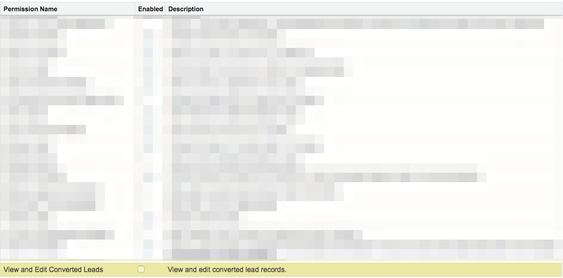

# Ativando a permissão para editar leads convertidos {#enabling-the-permission-to-edit-converted-leads}

Saiba como habilitar a permissão para editar registros de lead convertidos no [!DNL Salesforce]. [!DNL Marketo Measure] O tem a capacidade de enviar dados para seus vários objetos no Salesforce. Ao enviar para Leads, descobrimos que em alguns cenários podemos precisar reencaminhar para um registro de lead que já foi convertido. Para enviarmos dados para esses registros, o usuário pelo qual estamos conectados deve ter permissão para visualizar e editar leads convertidos no nível do perfil.

1. Ir para [!UICONTROL Configuração] e amplie o [!UICONTROL Gerenciar usuários] agrupamento para selecionar Profiles.

   

1. Selecione o Perfil do usuário ao qual estamos conectados.

1. Procure a permissão para Exibir e editar leads convertidos.

   

1. Marque a caixa para ativar a permissão para exibir e editar leads convertidos.

   

E você acabou!
