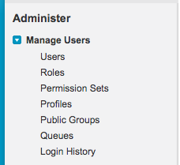
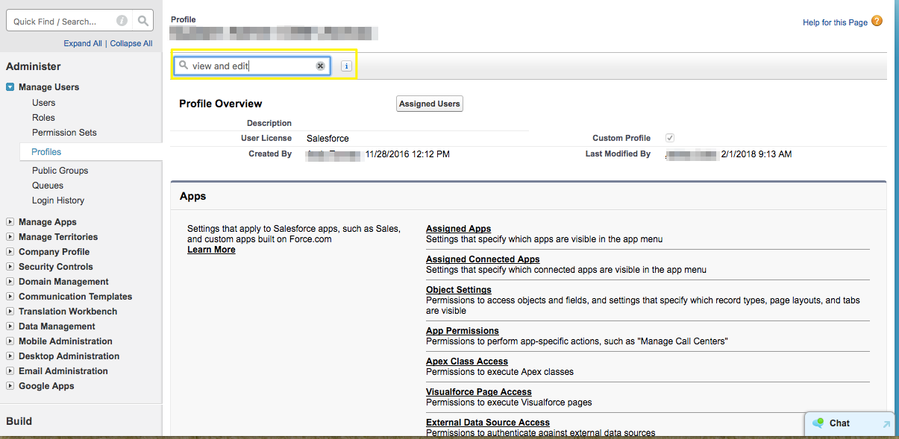

# Ativação da permissão para editar leads convertidos {#enabling-the-permission-to-edit-converted-leads}

Saiba como habilitar a permissão para editar registros de clientes potenciais convertidos em [!DNL Salesforce]. O [!DNL Marketo Measure] pode enviar dados para seus vários objetos no Salesforce. Ao enviar para clientes em potencial, descobrimos que em alguns cenários pode ser necessário reenviar para um registro de cliente potencial que já foi convertido. Para enviarmos dados para esses registros, o usuário ao qual estamos conectados deve ter permissão para exibir e editar clientes em potencial convertidos no nível do perfil.

1. Vá para [!UICONTROL Configuração] e expanda o agrupamento [!UICONTROL Gerenciar Usuários] para selecionar Perfis.

   

1. Selecione o Perfil do usuário ao qual estamos conectados.

1. Procurar permissão para Exibir e Editar Clientes Potenciais Convertidos.

   

1. Marque a caixa para ativar a permissão para exibir e editar leads convertidos.

   

E pronto!
