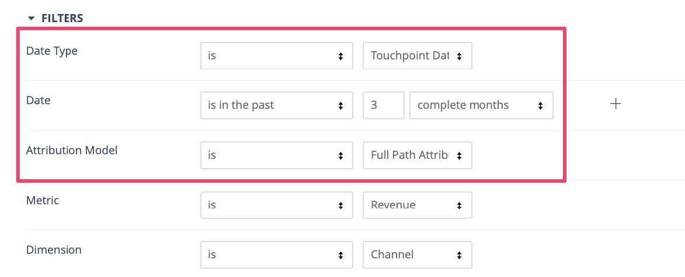
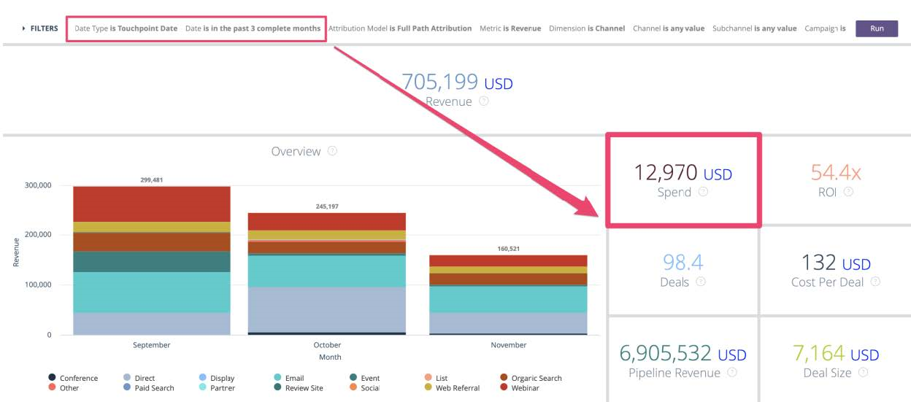

# Cliente Potencial com Relatório de Pontos de Contato do Comprador {#leads-with-buyer-touchpoints-report}

>[!NOTE]
>
>Você pode ver instruções especificando &quot;[!DNL Marketo Measure]&quot; na documentação, mas ainda pode ver &quot;[!DNL Bizible]&quot; no seu CRM. Estamos trabalhando na atualização e a reformulação da marca será refletida em seu CRM em breve.

Pronto para uso, você tem muitos recursos de relatórios na ponta dos dedos quando se trata de [!DNL Marketo Measure], mas há alguns tipos de relatórios adicionais que recomendamos criar. Saiba mais sobre como criar um tipo de relatório de clientes potenciais inclusivo com pontos de contato do comprador abaixo.

1. Navegue até sua opção de Instalação em [!DNL Salesforce]. Expanda o agrupamento &quot;Criar&quot; e selecione **[!UICONTROL Tipos de Relatório]**.

   

1. Selecione **[!UICONTROL Novo Tipo de Relatório Personalizado]**.

   

1. Defina o objeto principal como &quot;Clientes potenciais&quot; e, na entrada &quot;Rótulo de tipo de relatório&quot;, &quot;Clientes potenciais com pontos de contato do comprador - Inclusivo&quot;. Armazene o relatório na categoria &quot;Clientes potenciais&quot; e altere o status da implantação para **[!UICONTROL Implantado]**. Em seguida, selecione **[!UICONTROL Próximo]**.

   

1. Para as relações de objeto, selecione o objeto **[!DNL Marketo Measure]Pessoas** como o objeto secundário. Selecione o relacionamento A para B como, &quot;Cada registro &#39;A&#39; deve ter pelo menos um registro &#39;B&#39; relacionado.&quot; Lá, você relacionará o objeto &quot;Buyer Touchpoint&quot; e selecionará o mesmo relacionamento entre os objetos B e C.

   

1. Salve e comece a criar alguns relatórios!
