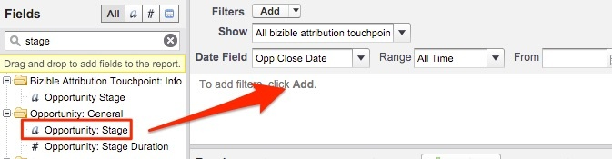

# Oportunidades perdidas encerradas pelo canal de marketing {#closed-lost-opportunities-by-marketing-channel}

Embora este relatório possa depender dos estágios de oportunidade, ele revelará quais canais de marketing contribuíram para oportunidades que não foram fechadas.

1. Clique no **[!UICONTROL Relatórios]** no Salesforce e selecione **[!UICONTROL Novo Relatório]**.

   

1. Na localização rápida, digite &quot;Atribuição da Bizible&quot; e selecione a **[!UICONTROL Ponto de contato de atribuição da Bizible com oportunidade]** tipo de relatório e, em seguida, selecione **[!UICONTROL Criar]**.

   

1. A partir da parte superior do relatório, mostrar &quot;[!UICONTROL Todos os pontos de contato de atribuição da Bizible]&quot; e ajuste o campo de data de acordo com o período que você deseja relatar. No nosso exemplo, estamos olhando para Todos os Tempos. Além disso, altere o formato do relatório de Tabular para Resumo.

   

   

1. Agora, adicionaremos campos ao relatório. Na localização rápida à esquerda, digite &quot;Canal de marketing&quot; e adicione-o ao agrupamento de resumo no relatório.

   

1. Em seguida, adicionaremos um filtro para observar apenas as Ops perdidas fechadas. Na localização rápida à esquerda, procure o campo &quot;Preparo&quot; e arraste-o para a área de filtro.

   

1. A partir daí, você selecionará a lupa para escolher os estágios que utilizar para as oportunidades &quot;Perdidas Fechadas&quot;. No nosso caso, usaremos o nome padrão &quot;Perda fechada&quot;.

   

1. Agora, vá em frente e execute o relatório!

   Este é um relatório de Oportunidades resumido pelo Canal de marketing que avalia as Oportunidades fechadas perdidas em seus canais. Esse relatório permite compreender quais Canais podem estar com baixo desempenho. Você pode adicionar filtros ou campos sobre os quais deseja criar relatórios.

>[!MORELIKETHIS]
>
>[[!DNL Marketo Measure] Universidade: relatórios adicionais do SFDC](https://universityonline.marketo.com/courses/bizible-fundamentals-bizible-102/#/page/5c5cb68dfb384d0c9fb96cd0)
