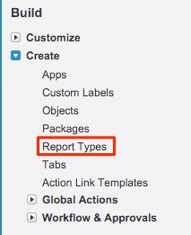

# Relatório de clientes potenciais com pontos de contato de comprador {#leads-with-buyer-touchpoints-report}

>[!NOTE]
>
>Você pode ver instruções especificando &quot;[!DNL Marketo Measure]&quot; na nossa documentação, mas ainda veja &quot;[!DNL Bizible]&quot; no seu CRM. Estamos trabalhando para atualizá-la e a reformulação da marca será refletida em seu CRM em breve.

Imediatamente, você tem muitos recursos de relatórios nas pontas dos dedos [!DNL Marketo Measure], mas há alguns tipos de relatórios adicionais que recomendamos criar. Saiba mais sobre como criar um relatório Leads inclusivos com pontos de contato de comprador abaixo.

1. Navegue até a opção Configurar no [!DNL Salesforce]. A partir daí, expanda o agrupamento &quot;Create&quot; e selecione **[!UICONTROL Tipos de relatórios]**.

   

1. Selecionar **[!UICONTROL Novo tipo de relatório personalizado]**.

   

1. Defina o objeto principal como &quot;Leads&quot; e na entrada &quot;Rótulo do tipo de relatório&quot; &quot;Leads com pontos de contato de comprador - Inclusivos&quot;. Armazene o relatório na categoria &quot;Leads&quot; e altere o status da implantação para **[!UICONTROL Implantado]**. Em seguida, selecione **[!UICONTROL Próximo]**.

   

1. Para os relacionamentos de objetos, selecione a variável **[!DNL Marketo Measure]Pessoas** como o objeto secundário. Selecione a relação A a B como, &quot;Cada registro &#39;A&#39; deve ter pelo menos um registro &#39;B&#39; relacionado.&quot; A partir daí, você relacionará o objeto &quot;Ponto de contato do comprador&quot; e selecionará a mesma relação entre os objetos B e C.

   

1. Salve e comece a criar alguns relatórios!
