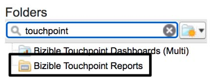

# [!DNL Marketo Measure] Visão geral dos relatórios 101 {#marketo-measure-101-reports-overview}

>[!NOTE]
>
>Você pode ver instruções especificando &quot;[!DNL Marketo Measure]&quot; em nossa documentação, mas ainda veja &quot;Bizible&quot; em seu CRM. Estamos trabalhando para atualizá-la e a reformulação da marca será refletida em seu CRM em breve.

Todos [!DNL Marketo Measure] clientes que utilizam [!DNL Marketo Measure] e [!DNL Salesforce] Ter acesso à pasta &quot;Relatórios de pontos de contato do comprador&quot; na instância SFDC. Esta pasta contém vários relatórios pré-criados que podem ajudar você a começar a criar relatórios com dados de ponto de contato do comprador.

Embora muitos desses relatórios tenham metas específicas de relatórios já estabelecidas, existem seis &quot;_[!DNL Marketo Measure]101..._&quot; representado por três tipos de relatórios principais que abrangem a maioria das necessidades de relatórios.

* Clientes potenciais com pontos de contato de comprador
* [!DNL Marketo Measure] Pessoas com pontos de contato de comprador
* Pontos de contato da atribuição do comprador com oportunidades

Esses relatórios fornecem os campos básicos e a infraestrutura necessária para qualquer [!DNL Marketo Measure] relatório relacionado que você deseja criar. Recomendamos que todos os clientes, novos e antigos, comecem a usar esses relatórios ao explorar perguntas de atribuição de marketing. Abaixo você encontrará uma explicação de cada um dos seis &quot;_[!DNL Marketo Measure]101..._&quot;.

_Se você não conseguir encontrar a pasta Relatório de pontos de contato do comprador ou a seis &quot;_[!DNL Marketo Measure] 101..._&quot; nessa pasta, entre em contato com o para obter assistência._

**Clientes potenciais com pontos de contato de comprador** | As duas variações a seguir, relatório sobre Leads e seus pontos de contato de comprador. Embora usem o mesmo tipo de relatório básico, eles são agrupados por métricas diferentes, ID de lead vs canal de marketing, para fornecer duas visualizações principais dos dados. Esse tipo de relatório é projetado para os principais relatórios de funil e é ideal para explorar como seus leads estão se relacionando com seus esforços de marketing. Antes de qualquer personalização, os dois relatórios abaixo exibem o seguinte:

**[!DNL Marketo Measure]101: Clientes potenciais por canal** | Uma visão de alto nível de como seus Canais de marketing estão influenciando a criação de leads e seus envolvimentos adicionais.
**[!DNL Marketo Measure]101: Informações privilegiadas por ID** | Ele exibe a história de clientes potenciais e é um relatório muito mais granular, mostrando cada cliente potencial e seus respectivos pontos de contato de comprador relacionados.

**Clientes potenciais/contatos com pontos de contato do comprador** | Estes relatórios são comumente designados por [!DNL Marketo Measure] Relatórios de Pessoas. Eles usam o [!DNL Marketo Measure] objeto personalizado _[!DNL Marketo Measure]Pessoa_ ao contrário do objeto Lead nos relatórios mencionados acima.

O [!DNL Marketo Measure] Objeto Pessoa relaciona os objetos Lead e Contact. Pronto para uso, [!DNL Salesforce] não fornece a opção para criar relatórios usando o objeto de lead e contato no mesmo relatório. Ao se relacionar ao Objeto de Cliente Potencial e Contato usando o identificador exclusivo de uma pessoa, seu email, a variável [!DNL Marketo Measure] A pessoa pode relatar pontos de contato de comprador relacionados ao cliente potencial e ao contato dentro do mesmo relatório. Esse tipo de relatório é ideal para validar qualquer um dos [!DNL Marketo Measure] Configurações da conta, pois é o nível mais inclusivo de relatórios de pontos de contato.

As duas variações de relatório a seguir usam o mesmo tipo de relatório, mas são agrupadas por métricas diferentes, ID de pessoa (email) vs Canal de marketing. Esses são os principais relatórios de funil/centro do funil que são excelentes ao explorar como seus Leads e Contatos estão se relacionando com seus esforços de marketing. Antes de qualquer personalização, os dois relatórios abaixo exibem o seguinte:

**[!DNL Marketo Measure]101: Lead/contatos por canal** | Uma visão de alto nível de como seus Canais de marketing estão influenciando a criação de Clientes potenciais ou Contatos e seus envolvimentos adicionais. Esse relatório é ideal para entender o engajamento total nos Canais de marketing e quais Canais de marketing estão liderando novos nomes em sua instância do Salesforce.
**[!DNL Marketo Measure]101: Lead/contatos por ID** | Cada um exibe [!DNL Marketo Measure] A história da pessoa e é um relatório muito mais granular, mostrando cada indivíduo e seus pontos de contato de comprador, independentemente de o ponto de contato ter ocorrido quando era líder ou como um contato.

**Oportunidades com pontos de contato de atribuição de comprador** | Os dois últimos &quot;_[!DNL Marketo Measure]101..._&quot; são a parte inferior dos relatórios de funil que exibem os dados do Ponto de Contato da Atribuição de Comprador relacionados às Oportunidades. O principal diferencial para esses relatórios é que eles são criados _Pontos de contato da atribuição do comprador_ que se relacionam aos dados de nível de Oportunidade e Oportunidade, como receita. Sempre que você deseja relatar sobre Oportunidades ou receita atribuída, esse tipo de relatório deve ser usado. Os dois relatórios abaixo usam o mesmo tipo de relatório, no entanto, são agrupados por métricas diferentes, ID da oportunidade vs Canal de marketing. Antes de qualquer personalização, os dois relatórios abaixo exibem o seguinte:

**[!DNL Marketo Measure]101: Oportunidades por Canal** | Uma exibição de alto nível de como seus Canais de marketing estão influenciando e gerando receita atribuída em suas Oportunidades.
**[!DNL Marketo Measure]101: Oportunidades por ID** | Esta versão de relatório granular mostra a jornada completa de suas oportunidades. Neste relatório, você pode ver cada ponto de contato de atribuição de comprador associado a uma Oportunidade e sua receita atribuída por meio dos vários modelos de atribuição.

É considerada uma prática recomendada para tratar o &quot;_[!DNL Marketo Measure]101..._&quot; como modelos para suas necessidades de relatórios. Começar com um dos relatórios acima economizará tempo e garantirá que você esteja trabalhando com os campos corretos relacionados ao [!DNL Marketo Measure] dados. Sempre certifique-se de &quot;Salvar como&quot; sempre que fizer personalizações no &quot;_[!DNL Marketo Measure]101..._&quot; para manter a variação original do relatório.

A pasta &quot;Relatórios de ponto de contato do comprador&quot; foi criada para ajudar você a começar a usar o [!DNL Marketo Measure] relatórios, para relatórios acionáveis, será necessário personalizar esses relatórios para que sejam personalizados de acordo com suas necessidades de relatórios. Você precisará adicionar os filtros necessários para garantir que os registros no relatório (e seus pontos de contato relacionados) estejam alinhados com a meta de relatórios.

Assim que estiver familiarizado com o &quot;_[!DNL Marketo Measure]101..._&quot; , talvez você queira recriá-los a partir de tipos de relatório personalizados para necessidades de relatórios mais personalizadas. Criação da [[!DNL Marketo Measure] Tipos de relatório personalizado](/help/marketo-measure-salesforce-reporting/new-report-types/creating-custom-marketo-measure-report-types.md) O permitirá que você extraia campos personalizados que podem ser usados em outros relatórios do CRM. Isso ajudará você a levá-lo [!DNL Marketo Measure] relatórios para o próximo nível!
