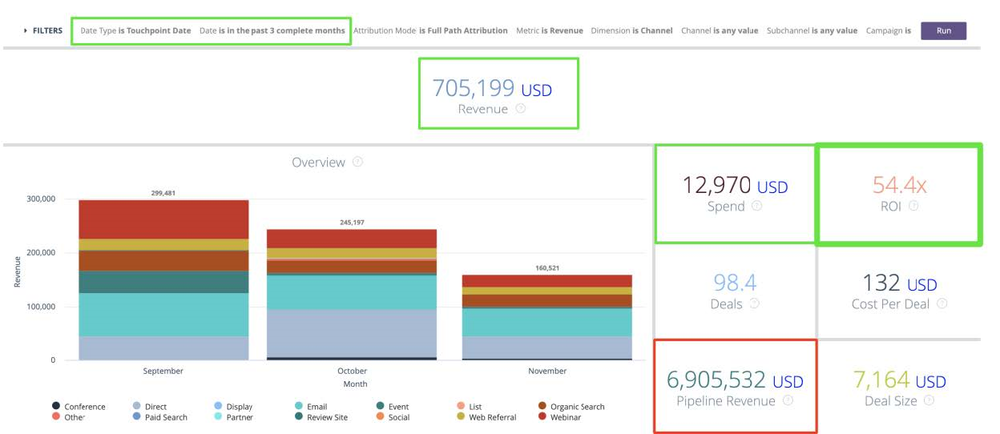

# [!DNL Marketo Measure] Guia de relatórios {#marketo-measure-reporting-guide}

>[!NOTE]
>
>Você pode ver instruções especificando &quot;[!DNL Marketo Measure]&quot; em nossa documentação, mas ainda veja &quot;Bizible&quot; em seu CRM. Estamos trabalhando para atualizar isso e a reformulação da marca será refletida em seu CRM em breve.

Antes de criar um [!DNL Marketo Measure] relatório, é mais importante confirmar a [!DNL Marketo Measure] As Configurações da conta foram revisadas e configuradas para garantir que os dados nos relatórios sejam precisos e reflitam as especificidades de sua empresa. Além disso, os projetos de relatórios funcionam melhor quando seguem um processo estruturado. Justin Norris, [!DNL Marketo Measure] usuário avançado, defensor e parceiro da [Perkuto](https://perkuto.com/) resumido de forma especializada [como abordar relatórios no [!DNL Marketo Measure]](https://perkuto.com/blog/turning-attribution-data-into-actionable-insights/):

**Estabelecer metas**: &quot;A primeira pergunta é &#39;por que medimos?&#39; Lori Wizdo de [Forrester Research](https://go.forrester.com/) resumiu bem em um [Webinar do Marketo](https://www.marketo.com/webinars/beyond-revenue-performance-real-kpis-of-b2b-marketing/). Segundo ela, &quot;medimos para provar ou validar uma decisão ou o valor do marketing ou para melhorar (melhoria do processo)&quot;. Acrescentamos que os insights da boa medição também fornecem informações e orientação sobre o processo de planejamento de marketing.

Então, antes de começar, é essencial ser muito claro sobre seus objetivos, as questões que você está tentando responder, ou os problemas que você está tentando resolver. Que história você quer contar? Que decisões serão tomadas em consequência? Muitas vezes, esses fundamentos são mal pensados, resultando em frustração para todos os envolvidos.&quot;

**Design do relatório**: &quot;Em seguida, é necessário projetar o relatório e determinar as dimensões, métricas e conjuntos de dados específicos que ele conterá. Uma experiência comum é fornecer a um usuário empresarial exatamente o que ele solicita, apenas para que ele ainda sinta que suas necessidades não foram atendidas. Isso ocorre porque o insight que um usuário empresarial está realmente procurando nem sempre está contido no relatório solicitado. Um bom analista (ou uma pessoa do MOPS com um analista de chapéu) vai fazer perguntas esclarecedoras, estabelecer definições comuns (&quot;então, o que você realmente quer dizer com lead?&quot;) e até mesmo esboçar um visual do relatório final para garantir que haja alinhamento. Só então você cria o relatório, sabendo que tem um conjunto sólido de requisitos.&quot;

**Report Build**: &quot;Uma vez construída, não é incomum encontrar obstáculos ou becos sem saída. Por exemplo, você pode descobrir que não tem um ponto de dados essencial ou que seus objetos não se vinculam da maneira que você precisa. Para resolver esses problemas, eu também acho que é importante entender o que está acontecendo &quot;por baixo dos panos&quot; na sua &quot;máquina&quot; de reportagem. Essa fluência permitirá que você dimensione rapidamente uma solicitação de relatórios e avalie se é realizável (e desenvolva mais facilmente soluções criativas quando não for possível).&quot;

Vamos dar uma olhada &quot;por baixo dos panos&quot; para entender melhor o que faz com que o [!DNL Marketo Measure] execução da máquina de relatórios de atribuição.

## Objetos de ponto de contato do comprador (CRM) {#buyer-touchpoint-objects-crm}

No nível mais alto, há duas categorias de relatório baseadas nos dois objetos diferentes de Ponto de Contato do Comprador: Essas categorias determinam qual tipo de [!DNL Marketo Measure] dados sobre os quais você deseja criar relatórios: dados relacionados a um _individual_ ou dados relacionados a um _oportunidade_.

1. **Pontos de contato do comprador** (BTs) / Pessoas físicas / Envolvimento total

   * Geralmente usado para métricas &quot;topo do funil&quot; (TOFU) e relatórios relacionados a _pessoas físicas_ (Clientes potenciais, Contatos, [!DNL Marketo Measure] Pessoas)
   * Os BTs são usados para entender todas as interações de marketing relacionadas a **pessoas**, pois contêm o histórico completo do ponto de contato de cada pessoa. Como lembrete, esses pontos de contato são criados no CRM para o Primeiro contato anônimo, o Toque de criação de lead e qualquer envio de formulário ou ponto de contato subsequente que você escolher sincronizar a partir de uma campanha ou atividade offline.

1. **Pontos de contato da atribuição do comprador** (BATs) / Oportunidade / Nível de conta / Receita

   * Geralmente usado para métricas &quot;intermediária e/ou inferior do funil&quot; (MOFU e BOFU) e relatórios relacionados a _Oportunidades_.
   * As MTD representam os pontos de contato pertinentes de todas as pessoas **oportunidade** (seja por meio das Funções de contato da oportunidade ou por meio de uma ID de conta compartilhada, dependendo de suas configurações). Ao contrário das OTB, que apenas dizem respeito a pessoas, as MTD também podem ser associadas a **receita**. Dessa forma, você usará as MTDs para responder a perguntas relacionadas a oportunidades, incluindo quantas oportunidades foram abertas ou fechadas, ou o valor e a receita do pipeline foram ganhos.

>[!NOTE]
>
>As MTD são criadas a partir de BT. Basicamente, o rastreamento começa em nível individual por meio dos BTs. Depois que uma Oportunidade é criada em uma Conta, todos os BTs de Contatos na mesma Conta são referenciados e qualificados para criar BATs relacionados à Oportunidade. Portanto, é desejável usar um ou outro dependendo das perguntas que você está tentando responder: perguntas relacionadas às métricas &quot;Pessoas&quot; (relatórios BT) ou perguntas relacionadas às métricas &quot;Oportunidade&quot; (relatórios BAT)

Artigo de suporte: [Diferença entre Pontos de Contato do Comprador e Pontos de Contato de Atribuição do Comprador](/help/configuration-and-setup/getting-started-with-marketo-measure/difference-between-buyer-touchpoints-and-buyer-attribution-touchpoints.md#configuration-and-setup)

## Buyer Touchpoint (BT) {#buyer-touchpoint-bt}

O ponto de contato do comprador (BT) é o objeto usado para rastrear todas as interações de marketing que alguém tem com seus materiais de marketing. De cada indivíduo (lead/contato/[!DNL Marketo Measure] Pessoa) A jornada seria representada pelos seus BTs relacionados. Entrada [!DNL Marketo Measure], a jornada de um indivíduo consiste em:

1. Como essa pessoa interagiu com nossa marca pela primeira vez? (Primeiro contato ou _FT_)
1. Como essa pessoa se converteu / se tornou conhecida / se tornou um lead? (Criação de leads ou _LC_)
1. De que outra forma essa pessoa interagiu com nossa marca e materiais de marketing desde que se tornou um líder? (_PostLC_)

Os Pontos de contato do comprador são usados para responder perguntas relacionadas ao _pessoas_ (&quot;pessoas&quot; são representadas por Clientes potenciais ou Contatos em um CRM), como métricas de geração de Clientes potenciais/contato ou aquisição, em vez de métricas relacionadas à Oportunidade. Por exemplo:

* Quais canais estão fornecendo mais clientes em potencial?
* Quais canais custam mais ou menos para criar um novo lead?
* Com qual conteúdo meus clientes em potencial/contatos estão se envolvendo?
* Qual é a história de marketing de títulos, funções e personalidades específicos?
* Quais canais direcionam os MQLs ou outros status de lead/contato?

Principalmente, as empresas precisam saber, &quot;de onde vêm meus clientes em potencial/contatos?&quot;. Historicamente, isso foi respondido com um único valor dimensional (Origem de lead, por exemplo). No entanto, conforme descrito em #1 e #2 acima, sabemos que os clientes potenciais podem ter vários pontos de contato durante sua jornada de se tornarem clientes potenciais. O ponto de contato do comprador permite obter informações sobre as duas interações mais importantes que representam como um lead foi gerado: o Primeiro contato e o Toque de criação de lead. Os pontos de contato do comprador também são _multidimensional_ ou seja, elas carregam uma grande quantidade de dados de marketing, principalmente de onde a pessoa veio (Canal de marketing) e o que ela envolveu (Conteúdo).

A variável [modelos de atribuição](/help/introduction-to-marketo-measure/overview-resources/marketo-measure-attribution-models.md) os melhores insights sobre métricas com base em pessoas são:

* **Primeiro contato** - 100% de crédito de atribuição ao Primeiro contato do lead (FT)
* **Criação de clientes potenciais** - Crédito de atribuição de 100% ao Toque de criação de leads (LC) do lead
* **Forma de U** - abordagem multitoque, com 40% de crédito para a FT, 40% de crédito para a LC

<table> 
 <tbody>
  <tr>
   <td></td> 
   <td>O modelo em forma de U foi projetado para dar crédito a quaisquer pontos de contato do comprador que resumem como um cliente potencial se tornou um cliente potencial. Embora os pontos de contato subsequentes desses clientes em potencial também possam ser relatados para compreender o envolvimento adicional (Post LC), eles não fazem parte da <strong>Jornada de Criação de Cliente Potencial</strong> por isso, não obtêm qualquer atribuição de crédito nos modelos FT, LC ou em forma de U.

&#42;Normalmente, a atribuição em forma de U reflete uma divisão par de 50/50 entre FT e LC. Se o lead se converter na mesma sessão do Primeiro contato, um único ponto de contato representará as posições do ponto de contato FT e LC. Portanto, 100% da atribuição seria dada a um único ponto de contato.</td>
</tr>
 </tbody>
</table>

Esses modelos colocam grande ênfase nas interações no estágio inicial e no envolvimento superior do funil. A atribuição em forma de U é o modelo recomendado, pois é importante para os pontos de contato de FT e LC, garantindo que o crédito seja dado a qualquer contato que influencie o lead na criação. No entanto, é possível obter insights adicionais sobre os modelos de primeiro contato e de criação de leads em toque se você deseja entender essas partes específicas da jornada de leads com mais detalhes.

## Relatórios recomendados usando o Ponto de Contato do Comprador (BT) {#recommended-reports-using-the-buyer-touchpoint-bt}

1. **CLIENTES POTENCIAIS COM PONTOS DE CONTATO DO COMPRADOR**

**1.1 | Novos clientes em potencial por canal de marketing**

Resumir os dados do ponto de contato do comprador do lead pelo campo &quot;Canal de marketing&quot; é a exibição de mais alto nível que representa quais canais/táticas estão influenciando novos leads na criação. Estruturar esse relatório em torno de um &quot;Tipo de data&quot; = &quot;Data de criação&quot; garante que um coorte de &quot;novos clientes em potencial líquidos&quot; (quando o cliente potencial foi criado em seu CRM) seja estabelecido no relatório.

<table> 
 <tbody>
  <tr>
   <td>Pergunta</td> 
   <td>Quais canais de marketing estão influenciando a criação de clientes potenciais?</td> 
  </tr>
  <tr>
   <td>Tipo de relatório</td> 
   <td>Clientes potenciais e pontos de contato do comprador (CRM) 
   Métrica: Clientes Potenciais ([!DNL Marketo Measure] Discover)</td> 
  </tr>
  <tr>
   <td>Campo de data / Tipo de data</td> 
   <td>Data de criação do lead (CRM) / Data de criação (Descoberta)</td> 
  </tr>
  <tr>
   <td>Intervalo de datas</td> 
   <td><i>selecione o intervalo de datas desejado</i></td> 
  </tr>
  <tr>
   <td>Grupo/Dimension</td> 
   <td>Canal de marketing</td> 
  </tr>
  <tr>
   <td>Modelos ideais</td> 
   <td>Primeiro contato, criação de leads, <strong>Forma de U</strong> 
   *SOME os campos "Contagem" em seus relatórios do CRM (Contagem - Primeiro contato, Contagem - Criação de clientes potenciais, Contagem - Forma de U)</td> 
  </tr>
 </tbody>
</table>

>[!TIP]
>
>Para qualquer tipo de relatório &quot;Clientes potenciais com pontos de contato do comprador&quot;, comece personalizando o relatório pré-criado intitulado &quot;Cliente potencial[!DNL Marketo Measure] 101 | Clientes potenciais por canal&#39;. Esse relatório está disponível pronto para uso e é uma ótima sandbox pré-criada, conforme descrito na tabela acima, e pode ser personalizada rapidamente para necessidades de relatórios mais específicas.

**1.2 | Novos clientes em potencial por campanha (ou insights mais granulares)**

Para obter um insight mais granular sobre os dados resumidos no relatório &quot;Novos clientes em potencial por canal de marketing&quot; (1.1), adicione um resumo adicional no nível da campanha. Isso permitirá que você não apenas entenda o que &quot;Canais de marketing&quot; estão impulsionando a criação de novos leads, mas, mais especificamente, quais campanhas nesses canais estão tendo o melhor desempenho:

<table> 
 <tbody>
  <tr>
   <td>Pergunta</td> 
   <td>O que <i>campanhas</i> Os estão influenciando a criação de clientes em potencial?</td> 
  </tr>
  <tr>
   <td>Tipo de relatório</td> 
   <td>Clientes potenciais e pontos de contato do comprador (CRM) 
   Métrica: Clientes Potenciais ([!DNL Marketo Measure] Discover)</td> 
  </tr>
  <tr>
   <td>Campo de data / Tipo de data</td> 
   <td>Data de criação do lead (CRM) / Data de criação (Descoberta)</td> 
  </tr>
  <tr>
   <td>Intervalo de datas</td> 
   <td><i>selecione o intervalo de datas desejado</i></td> 
  </tr>
  <tr>
   <td>Grupo/Dimension</td> 
   <td>Nome da campanha publicitária (CRM)</td> 
  </tr>
  <tr>
   <td>Modelos ideais</td> 
   <td>Primeiro contato, criação de leads, <strong>Forma de U</strong> 
   *SOME os campos "Contagem" em seus relatórios do CRM (Contagem - Primeiro contato, Contagem - Criação de clientes potenciais, Contagem - Forma de U)</td> 
  </tr>
 </tbody>
</table>

>[!TIP]
>
>Obtenha insights ainda mais granulares resumindo o relatório com outros campos disponíveis do objeto Ponto de contato do comprador. Faça isso definindo agrupamentos adicionais (CRM) ou dimensões (Discover). Dependendo do canal (que pode ser representativo da sua função), pode haver detalhes adicionais além do nível da campanha em que você deseja obter insights. Vamos analisar a &quot;Pesquisa paga&quot;, por exemplo, na tabela abaixo...

<table> 
 <tbody>
  <tr>
   <td>Pergunta</td> 
   <td>O que <i>palavras-chave</i> Os estão influenciando a criação de clientes em potencial?</td> 
  </tr>
  <tr>
   <td>Tipo de relatório</td> 
   <td>Clientes potenciais e pontos de contato do comprador (CRM) 
   Métrica: Clientes Potenciais ([!DNL Marketo Measure] Discover)</td> 
  </tr>
  <tr>
   <td>Filtros</td> 
   <td>Canal de marketing = Pesquisa paga</td> 
  </tr>
  <tr>
   <td>Campo de data / Tipo de data</td> 
   <td>Data de criação do lead (CRM) / Data de criação (Descoberta)</td> 
  </tr>
  <tr>
   <td>Intervalo de datas</td> 
   <td><i>selecione o intervalo de datas desejado</i></td> 
  </tr>
  <tr>
   <td>Grupo/Dimension</td> 
   <td>Texto da palavra-chave (CRM) / Palavra-chave (Discover)</td> 
  </tr>
  <tr>
   <td>Modelos ideais</td> 
   <td>Primeiro contato, criação de leads, <strong>Forma de U</strong> 
   *SOME os campos "Contagem" em seus relatórios do CRM (Contagem - Primeiro contato, Contagem - Criação de clientes potenciais, Contagem - Forma de U)</td> 
  </tr>
 </tbody>
</table>

O nível de granularidade pode variar de acordo com o canal. A abordagem recomendada seria perguntar a si mesmo, &quot;e quanto ao &#39;canal X&#39; estou querendo entender com mais detalhes?&quot;. Os gerentes de pesquisa paga também podem estar interessados em dimensões adicionais, como:

* Nome da campanha publicitária
* Conteúdo do anúncio
* Grupo de anúncios

No entanto, os gerentes de eventos podem estar mais interessados em quais eventos específicos ou quais tipos de eventos influenciaram mais os clientes em potencial na criação:

* Nome da campanha de publicidade / Campanha do Salesforce = evento específico
* Medium = &#39;Type&#39; da campanha

**LEMBRETE**: Filtros adicionais podem precisar ser adicionados a qualquer uma das variações de relatório descritas acima ou abaixo. Esses filtros seriam específicos para sua organização e algo que suas equipes de Operações de marketing ou Operações de vendas poderiam ajudar a aconselhar. Não é incomum que uma organização execute os mesmos filtros em todos os relatórios para garantir que o relatório seja o mais limpo e preciso possível. Exemplos comuns:

* Filtragem de registros internos a partir de testes, geralmente por endereço de email
* Filtragem com base em determinados &quot;Tipos de registro&quot; que podem ser específicos da sua unidade de negócios

**1.3 | Novos clientes em potencial por conteúdo (somente relatórios de CRM)**

<table> 
 <tbody>
  <tr>
   <td>Pergunta</td> 
   <td>O que <i>conteúdo</i> Os estão influenciando a criação de clientes em potencial?</td> 
  </tr>
  <tr>
   <td>Tipo de relatório</td> 
   <td>Clientes potenciais e pontos de contato do comprador (CRM)</td> 
  </tr>
  <tr>
   <td>Campo de data</td> 
   <td>Data de criação do lead</td> 
  </tr>
  <tr>
   <td>Intervalo de datas</td> 
   <td><i>selecione o intervalo de datas desejado</i></td> 
  </tr>
  <tr>
   <td>Grupo/Dimension</td> 
   <td>Landing Page  
   URL do formulário</td> 
  </tr>
  <tr>
   <td>Modelos ideais</td> 
   <td>Primeiro contato, criação de leads, <strong>Forma de U</strong> </td> 
  </tr>
 </tbody>
</table>

**LEMBRETE**: os dois principais campos para relatórios sobre conteúdo/ativos digitais são &quot;Página de aterrissagem&quot; e &quot;URL do formulário&quot;. Esses dois valores podem ser os mesmos se o lead converter (enviar um formulário) na mesma página em que &quot;chegou&quot; (página de aterrissagem), _no entanto_, às vezes esses valores são diferentes. Por exemplo, o lead pode clicar em um link no Facebook que o leva para uma página do seu site (esse seria o valor &quot;Landing Page&quot;). O lead pode então sair dessa página, continuar sua sessão no site e acabar enviando um formulário em outra página (URL do formulário). Isso seria resumido em um único ponto de contato que representa de onde o lead veio (canal de marketing), qual conteúdo o trouxe para o site (página de aterrissagem) e qual conteúdo ele acabou baixando (URL do formulário). &quot;URL do formulário&quot; também é o campo &quot;ir para&quot; para relatórios em outros formulários não associados ao conteúdo baixável, como formulários &quot;Fale conosco&quot; ou &quot;Solicitação de demonstração&quot;.

>[!TIP]
>
>Obter informações sobre &quot;conteúdo&quot; específico com filtros adicionais
>
>* Filtrar por: &quot;Página de aterrissagem&quot; CONTÉM (por exemplo):
>   * /blog
>   * /ebook
>   * /webinário
>
>* OU: &#39;URL do formulário&#39; CONTÉM (por exemplo)
>   * /contato
>   * /demo

Os relatórios baseados em &quot;Conteúdo&quot; são de grande valor quando relatados em qualquer parte do funil. No entanto, são usados com mais frequência na parte superior do funil para fornecer informações adicionais sobre um envolvimento inicial de clientes potenciais. Considerando que a &quot;Pesquisa orgânica&quot; tende a ser o canal mais forte na promoção do engajamento inicial (FT), não há muitos dados de nível de &quot;Campanha&quot;.

Os relatórios baseados em &quot;Conteúdo&quot; são excelentes para obter insights sobre o que está impulsionando os clientes potenciais mais especificamente no Canal de marketing de nível superior, neste caso, &quot;Pesquisa orgânica&quot;.

**1.4 | Lead Engajamento total em um determinado intervalo de datas**

<table> 
 <tbody>
  <tr>
   <td>Pergunta</td> 
   <td>Quais canais de marketing tiveram mais <i>envolvimento total do cliente potencial</i> no passado (semana/mês/trimestre)?</td> 
  </tr>
  <tr>
   <td>Tipo de relatório</td> 
   <td>Clientes potenciais e pontos de contato do comprador (CRM)  
   Métrica: Clientes Potenciais ([!DNL Marketo Measure] Discover)</td> 
  </tr>
  <tr>
   <td>Campo de data / Tipo de data</td> 
   <td>Data do Touchpoint</td> 
  </tr>
  <tr>
   <td>Intervalo de datas</td> 
   <td><i>selecione o intervalo de datas desejado</i></td> 
  </tr>
  <tr>
   <td>Grupo/Dimension</td> 
   <td>Canal de marketing (ou mais granular)</td> 
  </tr>
  <tr>
   <td>Modelos ideais*</td> 
   <td>*Este relatório trata menos da avaliação de onde os clientes em potencial vêm com um modelo de atribuição, mas mais da <i>número total de pontos de contato (quantidade de envolvimento)</i>, incluindo aqueles após o toque de criação de lead. A contagem total de registros de pontos de contato refletiria quais canais tiveram mais envolvimento de lead.</td> 
  </tr>
 </tbody>
</table>

**LEMBRETE**: basear seus relatórios em &quot;Data do ponto de contato&quot; é a maneira mais reflexiva de entender o desempenho de marketing durante um determinado intervalo de datas. A &quot;Data do ponto de contato&quot; estrutura o relatório de uma maneira em que a atribuição não está apenas relacionada ao canal, campanha ou conteúdo, mas também mostra quando o ponto de contato ocorreu. Essa é a maneira mais eficiente de entender o que o envolvimento de marketing estava acontecendo em um determinado momento, além da maneira recomendada de medir o impacto do marketing em comparação com o gasto com marketing investido ao mesmo tempo. É recomendado ao fazer qualquer gasto de marketing ou análise de ROI (consulte 5.1).

**2. LEADS QUALIFICADOS DE MARKETING COM PONTOS DE CONTATO DO COMPRADOR**

Um dos relatórios mais comuns está focado não apenas em novos leads ou no envolvimento de nível de lead, mas mais especificamente nos &quot;leads qualificados de marketing&quot; (MQLs). Há algumas abordagens diferentes quando se trata de relatórios sobre MQLs, dependendo do que [!DNL Marketo Measure] recursos e funcionalidades aos quais você tem acesso.

**2.1 | Clientes potenciais qualificados de marketing por canal (multitoque)**

Essa abordagem para medir o impacto do marketing em influenciar MQLs é essencialmente uma continuação do relatório &quot;Novos clientes potenciais por canal de marketing&quot; (1.1), mas com os critérios adicionais de que os clientes potenciais que estão sendo medidos são mais especificamente MQLs. O modelo de atribuição em forma de U ainda é recomendado aqui para identificar quais canais e conteúdo de marketing estão gerando clientes potenciais que estão _provável_ para se tornar um MQL:

<table> 
 <tbody>
  <tr>
   <td>Pergunta</td> 
   <td>Quais canais de marketing são melhores para gerar novos leads que se tornam <i>MQLs</i>?</td> 
  </tr>
  <tr>
   <td>Tipo de relatório</td> 
   <td>Clientes potenciais e pontos de contato do comprador (CRM)  
   Métrica: Clientes Potenciais ([!DNL Marketo Measure] Discover)</td> 
  </tr>
  <tr>
   <td>Filtros</td> 
   <td>MQL = true* 
   *<i>Os MQLs podem ser definidos de forma diferente por organização. Assegure a [!DNL Marketo Measure] O relatório de é filtrado para MQLs usando os mesmos campos que outros relatórios baseados em MQL. Um filtro de Segmento precisaria ser criado da mesma maneira para gerar relatórios sobre MQLs no [!DNL Marketo Measure] Descubra.</i></td> 
  </tr>
  <tr>
   <td>Campo de data / Tipo de data</td> 
   <td>Data MQL (ou equivalente) / Data de criação ([!DNL Marketo Measure] Discover)  <i>A Data de Criação do Cliente Potencial também poderá ser usada no relatório do CRM se 'Data MQL' não for uma opção no seu CRM. É importante ter em mente que o Campo de data que você está usando nele define o conjunto de dados coortado.</i></td> 
  </tr>
  <tr>
   <td>Intervalo de datas</td> 
   <td><i>selecione o intervalo de datas desejado</i></td> 
  </tr>
  <tr>
   <td>Grupo/Dimension</td> 
   <td>Canal de marketing</td> 
  </tr>
  <tr>
   <td>Modelos ideais</td> 
   <td>Primeiro contato, criação de leads, <strong>Forma de U</strong>  
   SOME os campos "Contagem" nos relatórios do CRM (Contagem - Primeiro contato, Contagem - Criação de clientes potenciais, Contagem - Forma de U)</td> 
  </tr>
 </tbody>
</table>

**2.2 | Clientes potenciais qualificados de marketing por canal (contato único, CRM somente)**

Essa abordagem para medir o impacto do marketing em influenciar os MQLs se concentra mais em identificar quais _ponto de contato único_ foi o último contato antes do lead atingir o MQL.

>[!NOTE]
>
>Para executar esse relatório, é necessário um valor de &quot;Status do lead&quot; de &quot;MQL&quot; para definir a etapa MQL para fins de rastreamento (Etapa de funil). Se os MQLs não forem rastreados por meio do campo &quot;Status do lead&quot;, o recurso Modelo de atribuição personalizado com estágios personalizados será necessário para criar um estágio &quot;MQL&quot; personalizado no [!DNL Marketo Measure] Configurações da conta.

<table> 
 <tbody>
  <tr>
   <td>Pergunta</td> 
   <td>Quais canais de marketing são mais fortes no incentivo a clientes potenciais para atingir o status MQL?</td> 
  </tr>
  <tr>
   <td>Tipo de relatório</td> 
   <td>Clientes potenciais e pontos de contato do comprador (CRM) 
   <i>esse relatório só é possível nos relatórios do CRM. Não é possível filtrar por determinados valores de "Posição do ponto de contato" em [!DNL Marketo Measure] Descobrir</i></td> 
  </tr>
  <tr>
   <td>Filtros</td> 
   <td><strong>Posição do ponto de contato CONTÉM "MQL"</strong></td> 
  </tr>
  <tr>
   <td>Campo de data / Tipo de data</td> 
   <td>Data MQL (ou equivalente)</td> 
  </tr>
  <tr>
   <td>Intervalo de datas</td> 
   <td><i>selecione o intervalo de datas desejado</i></td> 
  </tr>
  <tr>
   <td>Grupo/Dimension</td> 
   <td>Canal de marketing</td> 
  </tr>
  <tr>
   <td>Modelos ideais</td> 
   <td><i>Como esse relatório é filtrado em um único ponto de contato, os modelos de atribuição de nível de lead não são tão relevantes. Assim como no "Relatório de engajamento de lead" (1.4), o número de registros de ponto de contato seria aproveitado aqui para entender quais canais são os mais fortes (cada lead teria apenas um ponto de contato MQL).</i></td> 
  </tr>
 </tbody>
</table>

>[!TIP]
>
>Explore outros agrupamentos ou dimensões para obter informações adicionais sobre MQLs. Como mencionado nos outros relatórios &quot;Clientes potenciais com pontos de contato do comprador&quot;, o ponto de contato do comprador oferece muito mais granularidade do que apenas o Canal de marketing. Um relatório baseado em &quot;Conteúdo&quot; também pode ser combinado com qualquer um dos relatórios MQL acima para entender melhor qual conteúdo está influenciando melhor os MQLs.

**3. [!DNL MARKETO MEASURE] PESSOAS com PONTOS DE CONTATO DO COMPRADOR**

Há um terceiro personalizado [!DNL Marketo Measure] objeto no Salesforce que pode ser muito útil ao criar relatórios sobre métricas relacionadas a pessoas: **o [!DNL Marketo Measure] Pessoa (BP)**. A BP soluciona o antigo problema de como representar informações de clientes potenciais e contatos no mesmo relatório. Reúne todos os BT relacionados com uma &quot;pessoa&quot; (um [!DNL Marketo Measure] A ID da pessoa é o endereço de email dela). Independentemente de eles existirem como um lead ou um contato, a BP atua como um objeto de ponte, para ajudar os relatórios a se estender por lead e contato, e é muito útil na produção de relatórios mais sofisticados sobre as pessoas.

A variável [!DNL Marketo Measure] Pessoa está relacionada a apenas um dos objetos de ponto de contato, o ponto de contato do comprador (BT). Isso significa que ele não pode ser aproveitado para uma Oportunidade ou métricas relacionadas à receita. A &#39;[!DNL Marketo Measure] O tipo de relatório de Pontos de contato de pessoa e comprador é ótimo para entender _engajamento total_ como mostra todos os BT se o BT se relaciona com um lead ou contato mais especificamente. Por exemplo, se você tiver uma Campanha do Salesforce sendo usada para rastrear um Evento, poderá ter membros da campanha dentro da Campanha CRM que existem como Clientes potenciais OU Contatos. [!DNL Marketo Measure] criará pontos de contato para os membros da campanha independentemente, mas sem a [!DNL Marketo Measure] Pessoa, os relatórios padrão do Salesforce exigiriam dois relatórios separados para entender quantos _total_ Pontos de contato que você tem no Evento: um que é &quot;Clientes potenciais com pontos de contato do comprador&quot; e outro que é &quot;Contatos com pontos de contato do comprador&quot;. Algumas outras [!DNL Marketo Measure] Os casos de uso de relatórios com base em pessoas estão listados abaixo:

**3.1 [!DNL Marketo Measure] Pessoas que baixaram &quot;ebooks&quot; ou &quot;whitepapers&quot; (downloads totais)**

Esse relatório seria o mesmo que um relatório baseado em &quot;Conteúdo&quot; no nível de lead. No entanto, em vez de procurar medir o número de leads atribuíveis a cada parte do conteúdo, usando um [!DNL Marketo Measure] O relatório de pessoas será útil para entender o total _número de downloads_ se o ativo estiver restrito (o número total de pontos de contato representaria o número total de downloads/envios de formulários).

<table> 
 <tbody>
  <tr>
   <td>Pergunta</td> 
   <td>Quantas pessoas baixaram um ativo específico?</td> 
  </tr>
  <tr>
   <td>Tipo de relatório</td> 
   <td>[!DNL Marketo Measure] Pontos de contato de pessoas e compradores (CRM)</td> 
  </tr>
  <tr>
   <td>Filtros</td> 
   <td>'URL do formulário' CONTÉM (por exemplo) 
   <li>/ebook</li>
   <li>/whitepaper</li>
   <i>Os valores de filtro acima são apenas exemplos. O valor real será baseado na estrutura de URL de cada organização.</i></td> 
  </tr>
  <tr>
   <td>Campo de data / Tipo de data</td> 
   <td>Data do ponto de contato <i>(quando o ativo foi baixado)</i></td> 
  </tr>
  <tr>
   <td>Intervalo de datas</td> 
   <td><i>selecione o intervalo de datas desejado</i></td> 
  </tr>
  <tr>
   <td>Grupo/Dimension</td> 
   <td>URL do formulário</td> 
  </tr>
  <tr>
   <td>Modelos ideais</td> 
   <td>Esse relatório é menos sobre medir de onde os clientes em potencial ou os Contatos vêm com um modelo de atribuição, mas mais sobre o <i>número total de pontos de contato (quantidade de envolvimento)</i>, incluindo aqueles após o toque de criação de lead. Com este relatório, procuramos compreender a <i>quantidade de envolvimento total</i>. A contagem total de registros de pontos de contato refletiria quais ativos foram mais baixados.</td> 
  </tr>
 </tbody>
</table>

>[!TIP]
>
>Para qualquer cliente potencial com [!DNL Marketo Measure] Tipo de relatório de pessoas, comece personalizando o relatório pré-criado intitulado &#39;**[!DNL Marketo Measure]101 | Clientes potenciais/Contatos por canal**&#39;. Esse relatório está disponível pronto para uso e é uma ótima ferramenta [!DNL Marketo Measure] Sandbox baseada em pessoas. Ele é pré-criado e pode ser rapidamente personalizado para necessidades de relatórios mais específicas.

>[!TIP]
>
>Você pode usar esse relatório para obter insights sobre o engajamento total de qualquer dimensão de marketing do objeto Buyer Touchpoint, não apenas downloads de conteúdo, como apresentado no exemplo. O relatório pode ser agrupado ou filtrado em dimensões como &quot;Canal de marketing&quot; ou &quot;Nome da campanha de publicidade&quot; para entender melhor o engajamento total de clientes potenciais e contatos no banco de dados. Basta alterar os filtros ou agrupamentos no relatório para zero em outras dimensões representadas por outros campos do objeto de ponto de contato.

**3.2 [!DNL Marketo Measure] Pessoas que se inscreveram para um evento (somente CRM)**

_Este relatório só é aplicável se os formulários de registro estiverem hospedados em seu(s) site(s) que [!DNL Marketo Measure] O pode rastrear digitalmente._

<table> 
 <tbody>
  <tr>
   <td>Pergunta</td> 
   <td>Quais canais de marketing estão gerando meus registros de evento?</td> 
  </tr>
  <tr>
   <td>Tipo de relatório</td> 
   <td>[!DNL Marketo Measure] Pontos de contato de pessoas e compradores (CRM)</td> 
  </tr>
  <tr>
   <td>Filtros</td> 
   <td>'URL do formulário' CONTÉM (por exemplo) 
   <li>/evento</li>
   <i>O valor do filtro acima é apenas para exemplos. O valor real será baseado na estrutura de URL de cada organização.</i></td> 
  </tr>
  <tr>
   <td>Campo de data / Tipo de data</td> 
   <td>Data do ponto de contato <i>(quando o formulário de registro foi enviado)</i></td> 
  </tr>
  <tr>
   <td>Intervalo de datas</td> 
   <td><i>selecione o intervalo de datas desejado</i></td> 
  </tr>
  <tr>
   <td>Grupo/Dimension</td> 
   <td>URL do formulário 
   Canal de marketing</td> 
  </tr>
  <tr>
   <td>Modelos ideais</td> 
   <td>Esse relatório é menos sobre medir de onde os clientes em potencial ou os Contatos vêm com um modelo de atribuição, mas mais sobre o <i>número total de pontos de contato (número de registros)</i>, incluindo aqueles após o toque de criação de lead. Com este relatório, procuramos obter insights sobre o que está impulsionando os registros de eventos. A contagem total de pontos de contato por "Canal de marketing" refletiria quais canais impulsionaram mais registros.</td> 
  </tr>
 </tbody>
</table>

O principal argumento desse relatório é que os dados do ponto de contato do comprador também fornecerão dados do canal de marketing. Embora você já possa ter insights sobre o número de pessoas que se registraram nos seus eventos, este relatório também fornecerá insights sobre quais Canais de marketing digital, Fontes e/ou Campanhas estão trazendo pessoas para o seu site para depois se registrarem no evento.

>[!TIP]
>
>Essa mesma abordagem pode ser adotada ao procurar obter insights sobre registros de webinários ou talvez downloads de webinários sob demanda (se forem um ativo restrito). A única diferença seria o valor do filtro no &quot;URL do formulário&quot; se esses formulários estiverem hospedados em páginas exclusivas do seu site. No entanto, a meta é a mesma. Ele responde às perguntas &quot;Quais dos meus Canais de marketing estão gerando mais registros/downloads de webinários sob demanda&quot;.

**3.3 [!DNL Marketo Measure] Pessoas com Pontos de Contato do Comprador (Validação de Pontos de Contato)**

Considerando o [!DNL Marketo Measure] Pessoa permite relatar todos os pontos de contato em um único relatório. É o tipo de relatório ideal para usar ao validar seus dados. Queremos garantir que não estamos deixando de lado nenhum ponto de contato que possa revelar onde, por exemplo, há um problema na configuração dos seus &quot;Canais de marketing&quot; (consulte os artigos de suporte vinculados abaixo para obter mais informações sobre como configurar seus &quot;Canais de marketing&quot;).

* [Configuração de canal personalizado online](/help/channel-tracking-and-setup/online-channels/online-custom-channel-setup.md)
* [Configuração de canal personalizado offline](/help/channel-tracking-and-setup/offline-channels/offline-custom-channel-setup.md)

Basicamente, os dados do ponto de contato refletirão o que foi rastreado pelo [!DNL Marketo Measure] e podem ser auditados para garantir que a configuração corresponda às entradas com base em coisas como: valores de parâmetro UTM, Páginas de referência ou Tipos de campanha. Se os dados do ponto de contato não corresponderem à sua configuração, algo provavelmente precisará ser ajustado. Além da configuração do &quot;Canal de marketing&quot;, você pode consultar os dados do ponto de contato para determinar quais pontos de contato podem precisar ser [suprimido](/help/advanced-marketo-measure-features/touchpoint-settings/touchpoint-removal-and-touchpoint-suppression.md) ou [segmentado](/help/advanced-marketo-measure-features/segmentation/custom-segmentation.md). É recomendável auditar os dados de ponto de contato em um &#39;[!DNL Marketo Measure] Relatório de pessoas e pontos de contato do comprador no final de cada mês ou trimestre, se possível. Isso garantirá que sua atribuição seja a mais precisa possível. O &#39;[!DNL Marketo Measure] 101 | Clientes potenciais/Contatos por canal&#39;, disponível e pronto para uso, é um ótimo ponto de partida. Inclua os seguintes campos se eles ainda não estiverem incluídos para revisar algumas das partes mais importantes da configuração:

* **Canal de marketing** - Caminho = Marketing Channel.Subchannel (valores definidos em [!DNL Marketo Measure])
* **Fonte do ponto de contato** = utm_source
* **Medium** = utm_medium (pontos de contato online) OU Tipo de Campanha CRM (pontos de contato offline)
* **Página Referenciador** (usado na configuração &#39;Canais online&#39;)
* **Página de aterrissagem - bruta** (usado na configuração &quot;Canais online&quot;) também uma entrada comum para a supressão de pontos de contato na guia &quot;Configurações de ponto de contato&quot; de suas Configurações)
* **URL do formulário** (uma entrada comum para supressão de ponto de contato na guia &quot;Configurações do ponto de contato&quot; das Configurações)

**PONTO DE CONTATO DE ATRIBUIÇÃO DO COMPRADOR (MTD)**

Os Pontos de contato de atribuição do comprador (BATs) representam os pontos de contato relevantes de todos os contatos conectados à oportunidade (por meio das Funções de contato da oportunidade ou por meio de uma ID de conta compartilhada, dependendo de suas configurações). Ao contrário das BT (que estão principalmente ligadas a pessoas), as MTD podem estar associadas às receitas. Dessa forma, você usará as MTDs para responder a perguntas relacionadas a oportunidades, principalmente abertas _Oportunidades/Receita do pipeline_ e won fechado _Oportunidades/Ofertas/Receita_. Um BAT é criado por meio dos registros BT de um Contato assim que uma Oportunidade é criada na mesma Conta que o Contato (o BT não é convertido em um BAT). Os dados da BT são simplesmente referenciados para criar um registro adicional (o MTD que então se relaciona com a oportunidade).

O ponto de contato de atribuição do comprador permite medir o impacto do marketing mais profundamente no funil. _A profundidade do funil em que você deseja medir pode ser representada pelos vários modelos de atribuição multitoque_.

Considerando que o relacionamento principal das MTDs é com a Oportunidade, elas são usadas para responder a perguntas como:

* Quais dos meus esforços de marketing influenciaram mais oportunidades?
* Quantas novas receitas de pipeline posso atribuir a cada um dos meus canais de marketing?
* Quais das minhas campanhas tiveram o maior ROI no último trimestre?

A variável [modelos de atribuição](/help/introduction-to-marketo-measure/overview-resources/marketo-measure-attribution-models.md) O fornecimento de melhores insights sobre as métricas baseadas em oportunidades é:

**Forma de W** - O &#39;_Modelo de pipeline_&#39;. Três pontos de contato de marcos são incluídos no modelo em forma de W. Neste modelo, os touchpoints FT, LC e OC são atribuídos a cada um 30% do crédito de atribuição. Os 10% restantes são atribuídos igualmente a quaisquer pontos de contato intermediários que ocorram entre os três pontos de contato de marco.

<table> 
 <tbody>
  <tr>
   <td></td> 
   <td>Esse modelo resume basicamente a jornada de uma nova Oportunidade, que normalmente é sinônimo da geração de nova Receita do pipeline.

   

   Ao procurar medir o impacto do marketing em novas oportunidades ou em novos pipelines gerados, o modelo em forma de W é recomendado.</td> 
  </tr>
 </tbody>
</table>

**Caminho completo** - O &#39;_Modelo conquistado fechado_&#39;. Esse modelo inclui os quatro pontos de contato de marco: FT, LC, OC e Fechado. Cada um recebe 22,5% do crédito da Oportunidade e os 10% restantes são distribuídos igualmente entre os toques intermediários.

<table> 
 <tbody>
  <tr>
   <td></td> 
   <td>Este modelo resume essencialmente a jornada de um acordo conquistado fechado, que normalmente é sinônimo de receita ganha fechada/reservas.

   

   Ao procurar medir o impacto do marketing em negociações conquistadas fechadas ou receita ganha fechada, o Modelo de caminho completo é recomendado.</td> 
  </tr>
 </tbody>
</table>

Este modelo resume essencialmente a jornada de um acordo conquistado fechado, que normalmente é sinônimo de receita ganha fechada/reservas.

Ao procurar medir o impacto do marketing em negociações conquistadas fechadas ou receita ganha fechada, o Modelo de caminho completo é recomendado.

**Personalizado** - [!DNL Marketo Measure] O também oferece um modelo de Atribuição personalizada que permite aos usuários escolher quais pontos de contato ou estágios personalizados incluir em seu modelo. Além disso, os usuários podem controlar a porcentagem de crédito de atribuição atribuída a esses pontos de contato e estágios. Dependendo da configuração de seu modelo personalizado, ele pode ser usado mais apropriadamente para medir Oportunidades e Pipeline OU, Transações e Receita Ganha Fechada. Lembre-se disso ao usá-lo em seus relatórios.

>[!NOTE]
>
>O Modelo de atribuição personalizado é um recurso adicional não disponível para todos os clientes. Entre em contato com a equipe de conta do Adobe (seu gerente de conta) para saber mais sobre como adicionar esse recurso à sua conta.

Geralmente, os profissionais de marketing precisam saber: &quot;de onde vêm minhas oportunidades?&quot;. Semelhante ao relatório de nível de lead, essa pergunta foi historicamente respondida com um valor único e unidimensional (Fonte principal da campanha, por exemplo). No entanto, sabemos que o desenvolvimento de uma oportunidade envolve muito mais do que um único ponto de contato de um único contato. Normalmente, há vários pontos de contato de vários canais e por várias partes interessadas que influenciam uma Oportunidade na criação. Com [!DNL Marketo Measure]Além disso, podemos exibir todos os pontos de contato de uma conta para entender melhor de onde veio uma oportunidade. No entanto, além disso, podemos continuar a exibir qualquer ponto de contato que tenha ocorrido após a criação da Oportunidade e até o momento em que ela for encerrada. Isso nos permite não apenas ter uma abordagem multitoque para entender de onde veio uma Oportunidade, mas também o que a influenciou a fechar e, em última análise, representar receita ganha fechada. Isso fornece insight sobre diferentes perguntas, como &quot;qual é o impacto do marketing ao influenciar as Transações a serem fechadas?&quot;, &quot;qual marketing está impulsionando a Receita ganha fechada?&quot; e por fim, &quot;quais dos meus esforços de marketing estão tendo o maior ROI?&quot;

## RELATÓRIOS RECOMENDADOS USANDO O PONTO DE CONTATO DE ATRIBUIÇÃO DO COMPRADOR (BAT) {#recommended-reports-using-the-buyer-attribution-touchpoint}

**4.1 | Novas oportunidades por canal de marketing**

Resumir os dados de ponto de contato da atribuição do comprador das suas oportunidades pelo campo &quot;Canal de marketing&quot; é a exibição de mais alto nível que representa quais canais/táticas estão influenciando novas oportunidades na criação. Estruturar esse relatório em torno de um &quot;Tipo de data&quot; = &quot;Data de criação da oportunidade&quot; garante que também estejamos resumindo o relatório com base em quando a oportunidade foi realmente criada em seu CRM. Os pontos de contato podem ter sido de algum momento anterior, mas ainda se relacionarão às Oportunidades que foram criadas dentro do Intervalo de datas definido e, portanto, receberão crédito de atribuição, pois são reconhecidos como influenciando a Oportunidade.

<table> 
 <tbody>
  <tr>
   <td>Pergunta</td> 
   <td>O que <i>canais de marketing</i> O está influenciando as oportunidades na criação?</td> 
  </tr>
  <tr>
   <td>Tipo de relatório</td> 
   <td>Pontos de contato da atribuição do comprador com oportunidades (CRM)  
   Métrica: oportunidades ([!DNL Marketo Measure] Discover)</td> 
  </tr>
  <tr>
   <td>Filtros</td> 
   <td>
   <li>Estágio da oportunidade* <i>(opcional) dependendo de quais Oportunidades específicas você pode limitar ao relatório. É possível relatar apenas sobre as MTDs que ainda estão associadas somente a Oportunidades "Abertas" (por exemplo)</i></li>
   <li>Tipo de oportunidade (é comum filtrar determinadas oportunidades como "Novos negócios" e não <i>all</i> Oportunidades)</li> 
   *Um filtro de Segmento para 'Tipo de oportunidade' deve ser utilizado em [!DNL Marketo Measure] Descobrir</td> 
  </tr>
  <tr>
   <td>Campo de data / Tipo de data</td> 
   <td>Data de criação da oportunidade (CRM) / Data de criação (Discover)</td> 
  </tr>
  <tr>
   <td>Intervalo de datas</td> 
   <td><i>selecione o intervalo de datas desejado</i></td> 
  </tr>
  <tr>
   <td>Grupo/Dimension</td> 
   <td>Canal de marketing</td> 
  </tr>
  <tr>
   <td>Modelos ideais</td> 
   <td><strong>Forma de W</strong> 
   SOME os campos "W-Shaped" em seus relatórios de CRM (Count - W-Shaped, Revenue - W-Shaped)</td> 
  </tr>
 </tbody>
</table>

>[!TIP]
>
>Para qualquer tipo de relatório &quot;Pontos de contato de atribuição do comprador com oportunidades&quot;, comece personalizando o relatório pré-criado intitulado &quot;[!DNL Marketo Measure] 101 | Oportunidades por canal&#39;. Este relatório está disponível e pronto para uso, é uma ótima sandbox pré-criada conforme descrito na tabela acima e pode ser rapidamente personalizada para necessidades de relatórios mais específicas (o relatório usa um modelo de Caminho completo pronto para uso, portanto, personalize o relatório para incluir qualquer outro modelo de atribuição, neste caso, o modelo em forma de W).

>[!TIP]
>
>O relatório acima descrito também seria utilizado para compreender a quantidade de moeda que também deve ser atribuída. Ao gerar relatórios no nível da Oportunidade usando as MTDs, há duas métricas principais que podem ser resumidas: moeda (o valor da Oportunidade) e o próprio registro da Oportunidade. No exemplo acima, estamos medindo mais especificamente as Oportunidades abertas e a receita de novos pipelines.

>[!TIP]
>
>Obtenha insights ainda mais granulares resumindo o relatório com outros campos disponíveis do objeto de ponto de contato de atribuição do comprador. Isso é feito da mesma forma que no nível de liderança com pontos de contato do comprador (1.2). Faça isso adicionando agrupamentos (CRM) ou dimensões (Discover). Dependendo do canal (que pode ser representativo da sua função), pode haver detalhes adicionais além do nível da campanha na qual você deseja obter mais informações. Vamos analisar a &quot;Pesquisa paga&quot; abaixo:

<table> 
 <tbody>
  <tr>
   <td>Pergunta</td> 
   <td>Qual <i>palavras-chave</i> dos meus Anúncios de pesquisa paga estão gerando mais receita de pipeline?
</td> 
  </tr>
  <tr>
   <td>Tipo de relatório</td> 
   <td>Pontos de contato da atribuição do comprador com oportunidades (CRM)  
   Métrica: oportunidades ([!DNL Marketo Measure] Discover)</td> 
  </tr>
  <tr>
   <td>Filtros</td> 
   <td>
   <li>Canal de marketing = Pesquisa paga</li>
   <li>Estágio da oportunidade* <i>(opcional) dependendo de quais Oportunidades específicas você pode limitar ao relatório. Este exemplo é baseado na Receita do pipeline, que é definida em [!DNL Marketo Measure] por Oportunidades "Abertas" que representam receita potencial/pipeline aberto)</i></li>
   <li>Tipo de oportunidade (é comum filtrar determinadas oportunidades como "Novos negócios" e não <i>all</i> Oportunidades)</li> 
   *Um filtro de Segmento para 'Tipo de oportunidade' deve ser utilizado em [!DNL Marketo Measure] Descobrir</td> 
  </tr>
  <tr>
   <td>Campo de data / Tipo de data</td> 
   <td>Data de criação da oportunidade</td> 
  </tr>
  <tr>
   <td>Intervalo de datas</td> 
   <td><i>selecione o intervalo de datas desejado</i></td> 
  </tr>
  <tr>
   <td>Grupo/Dimension</td> 
   <td>Texto de Palavra-chave (CRM)  
   Palavra-chave (Discover)</td> 
  </tr>
  <tr>
   <td>Modelos ideais</td> 
   <td><strong>Forma de W</strong> 
   SOME os campos "W-Shaped" em seus relatórios de CRM (Count - W-Shaped, Revenue - W-Shaped)</td> 
  </tr>
 </tbody>
</table>

**4.2 | Ofertas por canal de marketing**

Este relatório seria essencialmente o mesmo que o primeiro exemplo de ponto de contato de atribuição do comprador (4.1), exceto que a métrica agora mudou de Oportunidades em aberto para Negociações conquistadas fechadas. A métrica deve ser sempre a que informa qual modelo de atribuição usar. Considerando que agora estamos considerando negociações fechadas e seus BATs relacionados, devemos usar um modelo que represente toda a jornada do comprador (Negociação). Isso garante que qualquer rastreamento de contato de marketing durante a jornada do comprador receba crédito de atribuição:

<table> 
 <tbody>
  <tr>
   <td>Pergunta</td> 
   <td>O que <i>canais de marketing</i> As negociações estão sendo fechadas?</td> 
  </tr>
  <tr>
   <td>Tipo de relatório</td> 
   <td>Pontos de contato da atribuição do comprador com oportunidades (CRM)  
   Métrica: Transações ([!DNL Marketo Measure] Discover)</td> 
  </tr>
  <tr>
   <td>Filtros</td> 
   <td>
   <li>Estágio da oportunidade (<i>somente Oportunidades Ganhas Fechadas devem estar no relatório</i>) OU</li>
   <li>Oportunidade conquistada = Verdadeira</li>
   <li>Tipo de oportunidade (é comum filtrar determinadas oportunidades, ou seja, "Novos negócios", em vez de todas as oportunidades) 
   </td> 
  </tr>
  <tr>
   <td>Campo de data / Tipo de data</td> 
   <td>Data de Fechamento da Oportunidade</td> 
  </tr>
  <tr>
   <td>Intervalo de datas</td> 
   <td><i>selecione o intervalo de datas desejado</i></td> 
  </tr>
  <tr>
   <td>Grupo/Dimension</td> 
   <td>Canal de marketing</td> 
  </tr>
  <tr>
   <td>Modelos ideais</td> 
   <td><strong>Caminho completo</strong> 
   SOME os campos "Caminho completo" nos relatórios do CRM (Contagem - Caminho completo, Receita - Caminho completo)</td> 
  </tr>
 </tbody>
</table>

**LEMBRETE**: é crucial lembrar de filtrar as Oportunidades específicas que deseja incluir nos relatórios baseados em MTD, especialmente quando se trata de &quot;Oportunidades em aberto e receita de pipeline&quot; vs. &quot;Vendas e receita conquistada fechada&quot;. Normalmente, isso é feito por meio de um filtro &quot;Estágio da oportunidade&quot; (o filtro &quot;Oportunidade conquistada&quot; = verdadeiro/falso também pode ser muito útil aqui).

**5. ROI ([!DNL Marketo Measure] Somente descobrir)**

A variável [!DNL Marketo Measure] Descubra os painéis que fornecem uma visualização de alto nível do seu desempenho de marketing usando o [!DNL Marketo Measure] dados de atribuição. Esses painéis agregados fornecem os principais dados de gastos e ROI de marketing que não estão disponíveis em seus relatórios de CRM. Esse ambiente pré-construído permite que você visualize seu desempenho de marketing em alinhamento com seus dados de ROI, permitindo que você tome decisões acionáveis em relação ao marketing.

>[!TIP]
>
>Sempre que você tiver uma pergunta relacionada ao ROI, gasto ou custo, [!DNL Marketo Measure] O Discover será o melhor lugar para gerar relatórios!

A variável [!DNL Marketo Measure] Os painéis de descoberta são compostos de dados de Pontos de contato do comprador e Pontos de contato de atribuição do comprador, bem como dados importantes do CRM. A principal diferença entre os relatórios de CRM e os relatórios em [!DNL Marketo Measure] A Descoberta indica que os dados do ponto de contato na Descoberta são apresentados mais de forma &quot;agregada&quot; e resumidos por dimensão (Canal de marketing, Campanha etc.) em vez de registros de ponto de contato individuais que podem ser resumidos. [!DNL Marketo Measure] A Discover é usada para entender em um alto nível quais de seus esforços estão causando o maior impacto em clientes potenciais, opções e negociações, e qual receita deve ser atribuída a eles. Depois que a receita atribuída é calculada por meio dos vários modelos de atribuição (o Caminho completo é recomendado para atribuir receitas/reservas conquistadas fechadas), podemos mensurá-la em relação à quantidade gasta na mesma dimensão (Canal de marketing, Subcanal ou Campanha). Isso então nos dá o **ROI**.

>[!TIP]
>
>Uma das coisas mais importantes a lembrar ao criar relatórios no Discover é qual tipo de dados você está usando para filtrar. O Tipo de data ditará qual conjunto de dados [!DNL Marketo Measure] O está usando o nos vários blocos gráficos.

* **Data do ponto de contato**: exibe os dados relacionados que tinham uma &quot;Data do ponto de contato&quot; no período especificado
* **Data de criação**: exibe os dados relacionados que tinham uma &quot;Data de criação&quot; no período especificado
* **Data de fechamento**: exibe os dados relacionados que tinham uma &quot;Data de fechamento&quot; no período especificado

Ao gerar relatórios sobre o ROI no [!DNL Marketo Measure] Descubra, é recomendável usar um &#39;Tipo de data&#39; = &quot;Data do ponto de contato&quot;. Para determinar o retorno de cada dólar investido, precisamos garantir que a receita seja atribuída à data em que o investimento foi feito. &#39;Tipo de data&#39; = &quot;Data do ponto de contato&quot; garante que os relatórios sejam estruturados dessa maneira, não de quando a Oportunidade foi criada (Data de criação) ou fechada (Data de fechamento). Vamos analisar mais detalhadamente:

Os filtros destacados abaixo são cruciais para um relatório focado no ROI no [!DNL Marketo Measure] (provavelmente, você definirá esses filtros nas placas &quot;Visão geral&quot;, &quot;CMO&quot; ou &quot;ROI&quot;):

**5.1 | ROI no painel &quot;Visão geral&quot;**

O intervalo &quot;Data&quot; não apenas define o coorte de pontos de contato (por Data do ponto de contato) que estão recebendo atribuição, mas também define o intervalo que o bloco ou as colunas &quot;Gasto&quot; representam.
[!DNL Marketo Measure] O simplesmente verifica o intervalo &quot;Data&quot; para determinar quanto foi gasto no total ou nos níveis de Canal de marketing, Subcanal ou Campanha. Consulte abaixo:

A captura de tela acima mostra os dados de Gastos com marketing nos últimos 3 meses completos. Neste exemplo, US$ 12.970 foram gastos em todos os canais. Esse número é composto pelos dados de Gasto com marketing [!DNL Marketo Measure] O foi extraído de integrações com qualquer uma de suas contas de anúncios conectadas (Google AdWords, Bing Ads, Facebook Ads, LinkedIn, DoubleClick) e qualquer gasto de marketing adicional que tenha sido carregado dentro de sua conta ou obtido automaticamente de um registro de campanha em seu CRM. O exemplo também mostra quanto fechado ganhou &quot;Receita&quot; também pode ser atribuído aos pontos de contato que ocorreram durante o mesmo intervalo de datas (caixas verdes). É assim que o ROI é calculado: receita atribuída aos pontos de contato que foram obtidos do investimento no mesmo intervalo de datas:

**LEMBRETE**: [!DNL Marketo Measure] define &quot;Receita&quot; como Receita ou Registros ganhos fechados e define &quot;Receita do pipeline&quot; como _receita em aberto/potencial de Oportunidades em aberto_.

Outra conclusão importante do relatório de ROI acima é a &quot;Receita do pipeline&quot; representada na caixa vermelha. Isso significa que, dos US$ 12.970 investidos nos últimos 3 meses completos, estamos atualmente atribuindo US$ 705.199 de receita ganha fechada, mas também estamos atribuindo US$ 6.905.532 de receita potencial aberta (receita do pipeline) a pontos de contato criados a partir do mesmo investimento! O que esperaríamos ver é uma parte da &quot;Receita do pipeline&quot; fechada ao longo do tempo, alimentando o número da &quot;Receita&quot; e, portanto, o número de ROI aumentaria ao longo do tempo. O número &quot;Gasto&quot; é fixo porque não podemos voltar no tempo para gastar mais nos últimos 3 meses completos. Essa é a importância de usar um &quot;Tipo de data&quot; de &quot;Data do ponto de contato&quot; em qualquer relatório de ROI: ele define a quantidade (**I**) investido e garante a quantidade de (**R**(A receita atribuída é atribuída aos mesmos pontos de contato que foram obtidos do investimento (para cada dólar gasto, quanto foi feito?).

>[!TIP]
>
>Filtre os Canais de marketing, Subcanais e/ou Campanhas nas quais você sabe que os dados de Gasto com marketing estão completos e precisos. O exemplo acima é para todos os Canais de marketing, mas se alguns Canais não tiverem os dados relacionados aos Gastos com marketing carregados, o relatório de ROI poderá ser impreciso. Veja o exemplo abaixo, desta vez na placa &#39;ROI&#39; que foca nas Campanhas no Canal de marketing de &quot;Pesquisa paga&quot;, um Canal com dados muito granulares de Gastos com marketing por meio das integrações.

