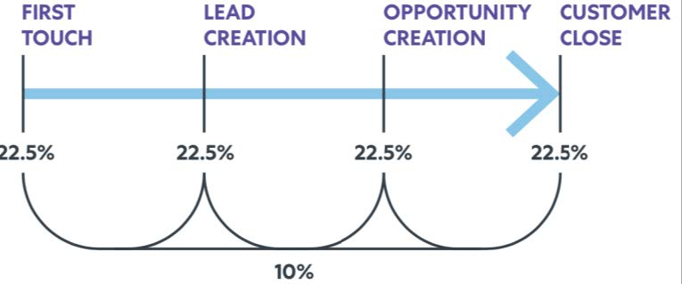

# [!DNL Marketo Measure] Guia de relatórios {#marketo-measure-reporting-guide}

>[!NOTE]
>
>Você pode ver instruções específicas para o “[!DNL Marketo Measure]” na documentação, mas ainda notar o termo “Bizible” em seu CRM. Estamos trabalhando na atualização e a reformulação da marca será refletida em seu CRM em breve.

Antes de criar um relatório do [!DNL Marketo Measure], é mais importante confirmar se as Configurações da Conta do [!DNL Marketo Measure] foram revisadas e configuradas para garantir que os dados nos relatórios sejam precisos e reflitam as especificidades da sua empresa. Além disso, os projetos de relatórios funcionam melhor quando seguem um processo estruturado. Justin Norris, um usuário avançado, defensor e parceiro [!DNL Marketo Measure] de [Perkuto](https://perkuto.com/){target="_blank"} resumiu com habilidade [como abordar relatórios em [!DNL Marketo Measure]](https://perkuto.com/blog/turning-attribution-data-into-actionable-insights/){target="_blank"}:

**Estabelecer Metas**: &quot;A primeira pergunta a ser feita é &#39;por que medimos?&#39; Lori Wizdo do [Forrester Research](https://go.forrester.com/) resumiu tudo em um [webinário do Marketo](https://www.marketo.com/webinars/beyond-revenue-performance-real-kpis-of-b2b-marketing/){target="_blank"}. Segundo ela, &quot;medimos para provar ou validar uma decisão ou o valor do marketing ou para melhorar (melhoria do processo)&quot;. Acrescentamos que os insights da boa medição também fornecem informações e orientação sobre o processo de planejamento de marketing.

Portanto, antes de começar, é essencial ser muito claro sobre seus objetivos, as perguntas que você está tentando responder, ou os problemas que você está tentando resolver. Que história você quer contar? Que decisões serão tomadas em consequência? Muitas vezes, esses fundamentos são mal pensados, resultando em frustração para todos os envolvidos.&quot;

**Design do Relatório**: &quot;Em seguida, você precisa projetar o relatório e determinar as dimensões, métricas e conjuntos de dados específicos que ele conterá. Uma experiência comum é fornecer a um usuário empresarial exatamente o que ele solicita, apenas para que ele ainda sinta que suas necessidades não foram atendidas. Isso ocorre porque o insight que um usuário empresarial está realmente procurando nem sempre está contido no relatório solicitado. Um bom analista (ou uma pessoa do MOPS com um analista de chapéu) vai fazer perguntas esclarecedoras, estabelecer definições comuns (&quot;então, o que você realmente quer dizer com lead?&quot;) e até mesmo esboçar um visual do relatório final para garantir que haja alinhamento. Só então você cria o relatório, sabendo que tem um conjunto sólido de requisitos.&quot;

**Report Build**: &quot;Depois que você vai para a build, não é incomum encontrar obstáculos ou becos sem saída. Por exemplo, você pode descobrir que não tem um ponto de dados essencial ou que seus objetos não se vinculam da maneira que você precisa. Para resolver esses problemas, eu também acho que é importante entender o que está acontecendo &quot;por baixo dos panos&quot; na sua &quot;máquina&quot; de reportagem. Essa fluência permitirá que você dimensione rapidamente uma solicitação de relatórios e avalie se é realizável (e desenvolva mais facilmente soluções criativas quando não for possível).&quot;

Vamos observar &quot;por baixo dos panos&quot; para entender melhor o que faz a máquina de relatórios de atribuição do [!DNL Marketo Measure] funcionar.

## Objetos do Buyer Touchpoint (CRM) {#buyer-touchpoint-objects-crm}

No nível mais alto, há duas categorias de relatórios baseadas nos dois objetos Buyer Touchpoint diferentes: Essas categorias determinam em qual tipo de dados do [!DNL Marketo Measure] você gostaria de relatar: dados relacionados a um _indivíduo_ ou dados relacionados a uma _oportunidade_.

1. **Pontos de contato do comprador** (BT)/Pessoas físicas/Envolvimento total

   * Geralmente usado para métricas e relatórios &quot;topo do funil&quot; (TOFU) relacionados a _indivíduos_ (clientes em potencial, contatos, [!DNL Marketo Measure] pessoas)
   * Os BT são usados para entender todas as interações de marketing relacionadas a **pessoas**, pois eles contêm o histórico completo dos pontos de contato de cada pessoa. Como lembrete, esses pontos de contato são criados no CRM para o Primeiro contato anônimo, o Toque de criação de lead e qualquer envio de formulário ou ponto de contato subsequente que você escolher sincronizar
uma campanha ou atividade offline.

1. **Pontos de contato de atribuição do comprador** (BAT) / Oportunidade / Nível da conta / Receita

   * Geralmente usado para métricas de &quot;meio e/ou fundo do funil&quot; (MOFU e BOFU) e relatórios relacionados a _Oportunidades_.
   * O BAT representa os pontos de contato relevantes de todas as pessoas conectadas à **oportunidade** (seja por meio das Funções de Contato da Oportunidade ou de uma ID de Conta compartilhada, dependendo das suas configurações). Ao contrário do BT, que se relaciona somente com pessoas, o BAT também pode ser associado com **receita**. Dessa forma, você usará o BAT para responder a perguntas relacionadas a oportunidades, incluindo quantas oportunidades foram abertas ou fechadas, ou o valor e a receita do pipeline foram ganhos.

>[!NOTE]
>
>O BAT é criado a partir do BT. Basicamente, o rastreamento começa em nível individual via BT. Depois que uma Oportunidade é criada em uma Conta, todos os BT dos Contatos na mesma Conta são referenciados e qualificados para criar BAT relacionados à Oportunidade, portanto, você desejará usar um ou outro dependendo de quais perguntas você está tentando responder: perguntas relacionadas às métricas de &quot;Pessoas&quot; (relatórios de BT) ou perguntas relacionadas às métricas de &quot;Oportunidade&quot; (relatórios BAT)

Artigo de Suporte: [Diferença Entre Pontos de Contato do Comprador e Pontos de Contato de Atribuição do Comprador](/help/configuration-and-setup/getting-started-with-marketo-measure/difference-between-buyer-touchpoints-and-buyer-attribution-touchpoints.md#configuration-and-setup){target="_blank"}

## Buyer Touchpoint (BT) {#buyer-touchpoint-bt}

O Buyer Touchpoint (BT) é o objeto usado para rastrear todas as interações de marketing que alguém tem com seus materiais de marketing. A jornada de cada indivíduo (Cliente Potencial/Contato/[!DNL Marketo Measure] Pessoa) seria representada por seu BT relacionado. Em [!DNL Marketo Measure], a jornada de um indivíduo consiste em:

1. Como essa pessoa interagiu com nossa marca pela primeira vez? (Primeiro contato ou _FT_)
1. Como essa pessoa se converteu / se tornou conhecida / se tornou um lead? (Criação de Cliente Potencial ou _LC_)
1. De que outra forma essa pessoa interagiu com nossa marca e materiais de marketing desde que se tornou um líder? (_PostLC_)

Os Pontos de Contato do Comprador são usados para responder perguntas relacionadas a _pessoas_ (&quot;pessoas&quot; são representadas por Clientes Potenciais ou Contatos em um CRM), como métricas de geração de Clientes Potenciais/Contatos ou de aquisição, em vez de métricas relacionadas a Oportunidades. Por exemplo:

* Quais canais estão fornecendo mais clientes em potencial?
* Quais canais custam mais ou menos para criar um novo lead?
* Com qual conteúdo meus clientes em potencial/contatos estão se envolvendo?
* Qual é a história de marketing de títulos, funções e personalidades específicos?
* Quais canais direcionam os MQLs ou outros status de lead/contato?

Principalmente, as empresas precisam saber, &quot;de onde vêm meus clientes em potencial/contatos?&quot;. Historicamente, isso foi respondido com um valor único e unidimensional (Source principal, por exemplo). No entanto, conforme descrito em #1 e #2 acima, sabemos que os clientes potenciais podem ter vários pontos de contato durante sua jornada de se tornarem clientes potenciais. O Buyer Touchpoint nos permite obter informações sobre as duas interações mais importantes que representam como um lead foi gerado: seu primeiro contato e seu toque de criação de lead. Os pontos de contato do comprador também são _multidimensionais_, o que significa que eles carregam muitos dados de marketing, principalmente de onde a pessoa veio (Canal de marketing) e com o que ela está envolvida (Conteúdo).

Os [modelos de atribuição](/help/introduction-to-marketo-measure/overview-resources/marketo-measure-attribution-models.md){target="_blank"} que fornecem melhores insights sobre métricas com base em pessoas são:

* **Primeiro contato** - 100% de crédito de atribuição para o Primeiro contato (FT) do cliente potencial
* **Criação de clientes potenciais** - 100% de crédito de atribuição para o Toque de criação de clientes potenciais (LC)
* **Forma de U** - abordagem multitoque, com 40% de crédito para FT, 40% de crédito para LC

<table> 
 <tbody>
  <tr>
   <td></td> 
   <td>O modelo em forma de U foi projetado para dar crédito a quaisquer pontos de contato do comprador que resumem como um cliente potencial se tornou um cliente potencial. Embora os pontos de contato subsequentes desses clientes potenciais também possam ser relatados para compreender o envolvimento adicional (Pós-LC), eles não fazem parte da <strong>jornada de Criação de clientes potenciais</strong>, portanto, não recebem crédito de atribuição nos modelos FT, LC ou em forma de U.

&#42;Normalmente, a atribuição em forma de U reflete uma divisão par de 50/50 entre FT e LC. Se o lead se converter na mesma sessão do Primeiro contato, um único ponto de contato representará as posições do ponto de contato FT e LC. Portanto, 100% da atribuição seria dada a um único ponto de contato.</td>
</tr>
 </tbody>
</table>

Esses modelos colocam grande ênfase nas interações no estágio inicial e no envolvimento superior do funil. A atribuição em forma de U é o modelo recomendado, pois é importante para os pontos de contato de FT e LC, garantindo que o crédito seja dado a qualquer contato que influencie o lead na criação. No entanto, é possível obter insights adicionais sobre os modelos de primeiro contato e de criação de leads em toque se você deseja entender essas partes específicas da jornada de leads com mais detalhes.

## Relatórios recomendados usando o Buyer Touchpoint (BT) {#recommended-reports-using-the-buyer-touchpoint-bt}

1. **CLIENTES POTENCIAIS COM PONTOS DE CONTATO DO COMPRADOR**

**1.1 | Novos clientes em potencial por canal de marketing**

Resumir os dados do Buyer Touchpoint do lead pelo campo &quot;Canal de marketing&quot; é a exibição de mais alto nível que representa quais canais/táticas estão influenciando novos leads na criação. Estruturar esse relatório em torno de um &quot;Tipo de data&quot; = &quot;Data de criação&quot; garante que um coorte de &quot;novos clientes em potencial líquidos&quot; (quando o cliente potencial foi criado em seu CRM) seja estabelecido no relatório.

<table> 
 <tbody>
  <tr>
   <td>Pergunta</td> 
   <td>Quais canais de marketing estão influenciando a criação de clientes potenciais?</td> 
  </tr>
  <tr>
   <td>Tipo de relatório</td> 
   <td>Clientes potenciais e Pontos de Contato do Comprador (CRM) 
   Métrica: Clientes Potenciais ([!DNL Marketo Measure] Discover)</td> 
  </tr>
  <tr>
   <td>Campo de data / Tipo de data</td> 
   <td>Data de criação do lead (CRM) / Data de criação (Descoberta)</td> 
  </tr>
  <tr>
   <td>Date Range</td> 
   <td><i>selecione o intervalo de datas desejado</i></td> 
  </tr>
  <tr>
   <td>Grupo/Dimension</td> 
   <td>Canal de marketing</td> 
  </tr>
  <tr>
   <td>Modelos ideais</td> 
   <td>Primeiro Contato, Criação De Cliente Potencial, <strong>Forma De U</strong> 
   *SOME os campos "Contagem" em seus relatórios do CRM (Contagem - Primeiro contato, Contagem - Criação de clientes potenciais, Contagem - Forma de U)</td> 
  </tr>
 </tbody>
</table>

>[!TIP]
>
>Para qualquer tipo de relatório &quot;Clientes potenciais com pontos de contato do comprador&quot;, comece personalizando o relatório pré-criado intitulado &#39;[!DNL Marketo Measure] 101 | Clientes potenciais por canal&#39;. Esse relatório está disponível pronto para uso e é uma ótima sandbox pré-criada, conforme descrito na tabela acima, e pode ser personalizada rapidamente para necessidades de relatórios mais específicas.

**1.2 | Novos clientes em potencial por campanha (ou insights mais granulares)**

Para obter um insight mais granular sobre os dados resumidos no relatório &quot;Novos clientes em potencial por canal de marketing&quot; (1.1), adicione um resumo adicional no nível da campanha. Isso permitirá que você não apenas entenda o que &quot;Canais de marketing&quot; estão impulsionando a criação de novos leads, mas, mais especificamente, quais campanhas nesses canais estão tendo o melhor desempenho:

<table> 
 <tbody>
  <tr>
   <td>Pergunta</td> 
   <td>Quais <i>campanhas</i> estão influenciando clientes em potencial na criação?</td> 
  </tr>
  <tr>
   <td>Tipo de relatório</td> 
   <td>Clientes potenciais e Pontos de Contato do Comprador (CRM) 
   Métrica: Clientes Potenciais ([!DNL Marketo Measure] Discover)</td> 
  </tr>
  <tr>
   <td>Campo de data / Tipo de data</td> 
   <td>Data de criação do lead (CRM) / Data de criação (Descoberta)</td> 
  </tr>
  <tr>
   <td>Date Range</td> 
   <td><i>selecione o intervalo de datas desejado</i></td> 
  </tr>
  <tr>
   <td>Grupo/Dimension</td> 
   <td>Nome da campanha publicitária (CRM)</td> 
  </tr>
  <tr>
   <td>Modelos ideais</td> 
   <td>Primeiro Contato, Criação De Cliente Potencial, <strong>Forma De U</strong> 
   *SOME os campos "Contagem" em seus relatórios do CRM (Contagem - Primeiro contato, Contagem - Criação de clientes potenciais, Contagem - Forma de U)</td> 
  </tr>
 </tbody>
</table>

>[!TIP]
>
>Obtenha um insight ainda mais granular resumindo o relatório com outros campos disponíveis do objeto do Buyer Touchpoint. Faça isso definindo agrupamentos adicionais (CRM) ou dimensões (Discover). Dependendo do canal (que pode ser representativo de sua função), pode haver detalhes adicionais além do nível da campanha em que você deseja obter insights. Vamos analisar a &quot;Pesquisa paga&quot;, por exemplo, na tabela abaixo...

<table> 
 <tbody>
  <tr>
   <td>Pergunta</td> 
   <td>Quais <i>palavras-chave</i> estão influenciando clientes em potencial na criação?</td> 
  </tr>
  <tr>
   <td>Tipo de relatório</td> 
   <td>Clientes potenciais e Pontos de Contato do Comprador (CRM) 
   Métrica: Clientes Potenciais ([!DNL Marketo Measure] Discover)</td> 
  </tr>
  <tr>
   <td>Filtros</td> 
   <td>Canal de marketing = Pesquisa paga</td> 
  </tr>
  <tr>
   <td>Campo de data / Tipo de data</td> 
   <td>Data de criação do lead (CRM) / Data de criação (Descoberta)</td> 
  </tr>
  <tr>
   <td>Date Range</td> 
   <td><i>selecione o intervalo de datas desejado</i></td> 
  </tr>
  <tr>
   <td>Grupo/Dimension</td> 
   <td>Texto da palavra-chave (CRM) / Palavra-chave (Discover)</td> 
  </tr>
  <tr>
   <td>Modelos ideais</td> 
   <td>Primeiro Contato, Criação De Cliente Potencial, <strong>Forma De U</strong> 
   *SOME os campos "Contagem" em seus relatórios do CRM (Contagem - Primeiro contato, Contagem - Criação de clientes potenciais, Contagem - Forma de U)</td> 
  </tr>
 </tbody>
</table>

O nível de granularidade pode variar de acordo com o canal. A abordagem recomendada seria perguntar a si mesmo, &quot;e quanto ao &#39;canal X&#39; estou querendo entender com mais detalhes?&quot;. Os gerentes de pesquisa paga também podem estar interessados em dimensões adicionais, como:

* Nome da campanha publicitária
* Conteúdo do anúncio
* Grupo de anúncios

No entanto, os gerentes de eventos podem estar mais interessados em quais eventos específicos ou quais tipos de eventos influenciaram mais os clientes em potencial na criação:

* Nome da campanha de publicidade / Campanha do Salesforce = evento específico
* Medium = &#39;Type&#39; da campanha

**LEMBRETE**: filtros adicionais podem precisar ser adicionados a qualquer uma das variações de relatório descritas acima ou abaixo. Esses filtros seriam específicos para sua organização e algo que suas equipes de Operações de marketing ou Operações de vendas poderiam ajudar a aconselhar. Não é incomum que uma organização execute os mesmos filtros em todos os relatórios para garantir que o relatório seja o mais limpo e preciso possível. Exemplos comuns:

* Filtragem de registros internos a partir de testes, geralmente por endereço de email
* Filtragem com base em determinados &quot;Tipos de registro&quot; que podem ser específicos da sua unidade de negócios

**1.3 | Novos clientes em potencial por conteúdo (somente relatórios do CRM)**

<table> 
 <tbody>
  <tr>
   <td>Pergunta</td> 
   <td>Que <i>conteúdo</i> está influenciando clientes em potencial na criação?</td> 
  </tr>
  <tr>
   <td>Tipo de relatório</td> 
   <td>Clientes potenciais e pontos de contato do comprador (CRM)</td> 
  </tr>
  <tr>
   <td>Campo de data</td> 
   <td>Data de criação do lead</td> 
  </tr>
  <tr>
   <td>Date Range</td> 
   <td><i>selecione o intervalo de datas desejado</i></td> 
  </tr>
  <tr>
   <td>Grupo/Dimension</td> 
   <td>Página de aterrissagem  
   URL do formulário</td> 
  </tr>
  <tr>
   <td>Modelos ideais</td> 
   <td>Primeiro Contato, Criação De Cliente Potencial, <strong>Forma De U</strong> </td> 
  </tr>
 </tbody>
</table>

**LEMBRETE**: os dois campos principais para relatórios sobre conteúdo/ativos digitais são &#39;Página de aterrissagem&#39; e &#39;URL do formulário&#39;. Esses dois valores podem ser os mesmos se o cliente potencial converter (enviar um formulário) na mesma página em que &quot;chegou&quot; (página inicial), _entretanto_, às vezes esses valores são diferentes. Por exemplo, o lead pode clicar em um link no Facebook que o leva para uma página do seu site (esse seria o valor &quot;Landing Page&quot;). O lead pode então sair dessa página, continuar sua sessão no site e acabar enviando um formulário em outra página (URL do formulário). Isso seria resumido em um único ponto de contato que representa de onde o lead veio (canal de marketing), qual conteúdo o trouxe para o site (página de aterrissagem) e qual conteúdo ele acabou baixando (URL do formulário). &quot;URL do formulário&quot; também é o campo &quot;ir para&quot; para relatórios em outros formulários não associados ao conteúdo baixável, como formulários &quot;Fale conosco&quot; ou &quot;Solicitação de demonstração&quot;.

>[!TIP]
>
>Obter informações sobre &quot;conteúdo&quot; específico com filtros adicionais
>
>* Filtrar por: &quot;Página de aterrissagem&quot; CONTÉM (por exemplo):
>   * /blog
>   * /ebook
>   * /webinário
>
>* OU: &#39;URL do formulário&#39; CONTÉM (por exemplo)
>   * /contact
>   * /demo

Os relatórios baseados em &quot;Conteúdo&quot; são de grande valor quando relatados em qualquer parte do funil. No entanto, são usados com mais frequência na parte superior do funil para fornecer informações adicionais sobre um envolvimento inicial de clientes potenciais. Considerando que a &quot;Pesquisa orgânica&quot; tende a ser o canal mais forte na promoção do engajamento inicial (FT), não há muitos dados a nível de &quot;Campanha&quot;.

Os relatórios baseados em &quot;Conteúdo&quot; são excelentes para obter insights sobre o que está impulsionando os clientes potenciais mais especificamente no Canal de marketing de nível superior, neste caso, &quot;Pesquisa orgânica&quot;.

**1.4 | Participação total do lead em um determinado intervalo de datas**

<table> 
 <tbody>
  <tr>
   <td>Pergunta</td> 
   <td>Quais canais de marketing tiveram mais <i>engajamento total de clientes potenciais</i> no passado (semana/mês/trimestre)?</td> 
  </tr>
  <tr>
   <td>Tipo de relatório</td> 
   <td>Clientes potenciais e Pontos de Contato do Comprador (CRM)  
   Métrica: Clientes Potenciais ([!DNL Marketo Measure] Discover)</td> 
  </tr>
  <tr>
   <td>Campo de data / Tipo de data</td> 
   <td>Data do touchpoint</td> 
  </tr>
  <tr>
   <td>Date Range</td> 
   <td><i>selecione o intervalo de datas desejado</i></td> 
  </tr>
  <tr>
   <td>Grupo/Dimension</td> 
   <td>Canal de marketing (ou mais granular)</td> 
  </tr>
  <tr>
   <td>Modelos ideais*</td> 
   <td>*Este relatório aborda menos a medição de onde os clientes potenciais vêm com um modelo de atribuição, mas mais sobre o <i>número total de pontos de contato (quantidade de engajamento)</i>, incluindo aqueles após o toque de criação de clientes potenciais. A contagem total de registros de pontos de contato refletiria quais canais tiveram mais envolvimento de lead.</td> 
  </tr>
 </tbody>
</table>

**LEMBRETE**: basear seus relatórios em &quot;Data do ponto de contato&quot; é a maneira mais reflexiva de entender o desempenho de marketing durante um determinado intervalo de datas. A &quot;Data do ponto de contato&quot; estrutura o relatório de uma maneira em que a atribuição não está apenas relacionada ao canal, campanha ou conteúdo, mas também mostra quando o ponto de contato ocorreu. Essa é a maneira mais eficiente de entender o que o envolvimento de marketing estava acontecendo em um determinado momento, além da maneira recomendada de medir o impacto do marketing em comparação com o gasto com marketing investido ao mesmo tempo. É recomendado ao fazer qualquer gasto de marketing ou análise de ROI (consulte 5.1).

**2. CLIENTES POTENCIAIS QUALIFICADOS DE MARKETING COM PONTOS DE CONTATO DO COMPRADOR**

Um dos relatórios mais comuns está focado não apenas em novos leads ou no envolvimento de nível de lead, mas mais especificamente nos &quot;leads qualificados de marketing&quot; (MQLs). Há algumas abordagens diferentes quando se trata de relatórios sobre MQLs, dependendo de quais recursos e funcionalidades do [!DNL Marketo Measure] você tem acesso.

**2.1 | Clientes potenciais qualificados de marketing por canal (multitoque)**

Essa abordagem para medir o impacto do marketing em influenciar MQLs é essencialmente uma continuação do relatório &quot;Novos clientes potenciais por canal de marketing&quot; (1.1), mas com os critérios adicionais de que os clientes potenciais que estão sendo medidos são mais especificamente MQLs. O modelo de atribuição em forma de U ainda é recomendado aqui para identificar quais canais e conteúdos de marketing estão gerando clientes potenciais que então _provavelmente_ se tornarão um MQL:

<table> 
 <tbody>
  <tr>
   <td>Pergunta</td> 
   <td>Quais canais de marketing são melhores para gerar novos clientes potenciais que se tornam <i>MQLs</i>?</td> 
  </tr>
  <tr>
   <td>Tipo de relatório</td> 
   <td>Clientes potenciais e Pontos de Contato do Comprador (CRM)  
   Métrica: Clientes Potenciais ([!DNL Marketo Measure] Discover)</td> 
  </tr>
  <tr>
   <td>Filtros</td> 
   <td>MQL = true* 
   *<i>Os MQLs podem ser definidos de forma diferente por organização. Verifique se o relatório [!DNL Marketo Measure] está filtrado para MQLs usando os mesmos campos que outros relatórios baseados em MQL. Um filtro de Segmento precisaria ser criado da mesma forma para relatórios em MQLs na [!DNL Marketo Measure] Discover.</i></td> 
  </tr>
  <tr>
   <td>Campo de data / Tipo de data</td> 
   <td>Data MQL (ou equivalente) / Data de criação ([!DNL Marketo Measure] Descoberta)  <i>A Data de criação do lead também pode ser usada no relatório do CRM se 'Data MQL' não for uma opção no seu CRM. É importante ter em mente que o Campo de Data que você está usando nele define o conjunto de dados coortado.</i></td> 
  </tr>
  <tr>
   <td>Date Range</td> 
   <td><i>selecione o intervalo de datas desejado</i></td> 
  </tr>
  <tr>
   <td>Grupo/Dimension</td> 
   <td>Canal de marketing</td> 
  </tr>
  <tr>
   <td>Modelos ideais</td> 
   <td>Primeiro Contato, Criação De Cliente Potencial, <strong>Forma De U</strong>  
   SOME os campos "Contagem" nos relatórios do CRM (Contagem - Primeiro contato, Contagem - Criação de clientes potenciais, Contagem - Forma de U)</td> 
  </tr>
 </tbody>
</table>

**2.2 | Clientes potenciais qualificados de marketing por canal (somente para toque único, CRM)**

Essa abordagem para medir o impacto do marketing em influenciar os MQLs se concentra mais em identificar qual _ponto de contato único_ foi o último contato antes de o lead atingir o MQL.

>[!NOTE]
>
>Para executar esse relatório, é necessário um valor de &quot;Status do lead&quot; de &quot;MQL&quot; para definir a etapa MQL para fins de rastreamento (Etapa de funil). Se os MQLs não forem rastreados por meio do campo &quot;Status do lead&quot;, o recurso Modelo de atribuição personalizado com estágios personalizados será necessário para criar um estágio &quot;MQL&quot; personalizado nas Configurações da conta [!DNL Marketo Measure].

<table> 
 <tbody>
  <tr>
   <td>Pergunta</td> 
   <td>Quais canais de marketing são mais fortes no incentivo a clientes potenciais para atingir o status MQL?</td> 
  </tr>
  <tr>
   <td>Tipo de relatório</td> 
   <td>Clientes potenciais e Pontos de Contato do Comprador (CRM) 
   <i>este relatório só é possível nos relatórios do CRM. Não é possível filtrar determinados valores de "Posição do ponto de contato" na [!DNL Marketo Measure] Descoberta</i></td> 
  </tr>
  <tr>
   <td>Filtros</td> 
   <td><strong>Posição do ponto de contato CONTÉM "MQL"</strong></td> 
  </tr>
  <tr>
   <td>Campo de data / Tipo de data</td> 
   <td>Data MQL (ou equivalente)</td> 
  </tr>
  <tr>
   <td>Date Range</td> 
   <td><i>selecione o intervalo de datas desejado</i></td> 
  </tr>
  <tr>
   <td>Grupo/Dimension</td> 
   <td>Canal de marketing</td> 
  </tr>
  <tr>
   <td>Modelos ideais</td> 
   <td><i>Como esse relatório é filtrado em um único ponto de contato, os modelos de atribuição de nível de lead não são tão relevantes. Assim como no "Relatório de engajamento de lead" (1.4), o número de registros de ponto de contato seria usado aqui para entender quais canais são os mais fortes (cada lead teria apenas um ponto de contato MQL).</i></td> 
  </tr>
 </tbody>
</table>

>[!TIP]
>
>Explore outros agrupamentos ou dimensões para obter informações adicionais sobre MQLs. Como mencionado nos outros relatórios &quot;Clientes potenciais com pontos de contato do comprador&quot;, o Buyer Touchpoint oferece muito mais granularidade do que apenas o Canal de marketing. Um relatório baseado em &quot;Conteúdo&quot; também pode ser combinado com qualquer um dos relatórios MQL acima para entender melhor qual conteúdo está influenciando melhor os MQLs.

**3. [!DNL MARKETO MEASURE] PESSOAS com PONTOS DE CONTATO DE COMPRADOR**

Há um terceiro objeto [!DNL Marketo Measure] personalizado no Salesforce que pode ser muito útil ao criar relatórios sobre métricas relacionadas a pessoas: **a [!DNL Marketo Measure] Pessoa (BP)**. A BP soluciona o antigo problema de como representar informações de clientes potenciais e contatos no mesmo relatório. Ele une todos os BT relacionados a uma &quot;pessoa&quot; (a ID de uma pessoa [!DNL Marketo Measure] é seu endereço de email). Independentemente de eles existirem como um lead ou um contato, a BP atua como um objeto de ponte, para ajudar os relatórios a se estender por lead e contato, e é muito útil na produção de relatórios mais sofisticados sobre as pessoas.

A Pessoa [!DNL Marketo Measure] está relacionada a apenas um dos objetos de ponto de contato, o Buyer Touchpoint (BT). Isso significa que ele não pode ser usado para métricas relacionadas a oportunidade ou receita. Um tipo de relatório de &#39;[!DNL Marketo Measure] Pontos de Contato de Pessoa e Comprador&#39; é ideal para entender o _engajamento total_, pois revela todos os BT se o BT está relacionado a um Cliente Potencial ou Contato mais especificamente. Por exemplo, se você tiver uma campanha do Salesforce em uso para rastrear um evento, poderá ter membros da campanha do CRM que existem como clientes em potencial OU contatos. [!DNL Marketo Measure] criará pontos de contato para os membros da campanha independentemente, mas sem a Pessoa [!DNL Marketo Measure], os relatórios padrão do Salesforce exigirão dois relatórios separados para entender quantos _totais_ pontos de contato você tem do Evento: um que seja &quot;Clientes potenciais com pontos de contato do comprador&quot; e outro que seja &quot;Contatos com pontos de contato do comprador&quot;. Alguns outros casos de uso de relatórios com base em pessoas [!DNL Marketo Measure] estão listados abaixo:

**3.1 [!DNL Marketo Measure] Pessoas que baixaram &#39;ebooks&#39; ou &#39;whitepapers&#39; (total de downloads)**

Esse relatório seria o mesmo que um relatório baseado em &quot;Conteúdo&quot; no nível de lead. No entanto, em vez de procurar medir o número de clientes potenciais atribuíveis a cada parte do conteúdo, usar um relatório de [!DNL Marketo Measure] Pessoas será útil para entender o total de _número de downloads_ se o ativo estiver restringido (o número total de pontos de contato representaria o número total de downloads/envios de formulários).

<table> 
 <tbody>
  <tr>
   <td>Pergunta</td> 
   <td>Quantas pessoas baixaram um ativo específico?</td> 
  </tr>
  <tr>
   <td>Tipo de relatório</td> 
   <td>[!DNL Marketo Measure] Pontos de contato de pessoas e compradores (CRM)</td> 
  </tr>
  <tr>
   <td>Filtros</td> 
   <td>'URL do Formulário' CONTÉM (por exemplo) 
   <li>/ebook</li>
   <li>/whitepaper</li>
   <i>Os valores de filtro acima são apenas exemplos. O valor real será baseado na estrutura de URL de cada organização.</i></td> 
  </tr>
  <tr>
   <td>Campo de data / Tipo de data</td> 
   <td>Data do ponto de contato <i>(quando o ativo foi baixado)</i></td> 
  </tr>
  <tr>
   <td>Date Range</td> 
   <td><i>selecione o intervalo de datas desejado</i></td> 
  </tr>
  <tr>
   <td>Grupo/Dimension</td> 
   <td>URL do formulário</td> 
  </tr>
  <tr>
   <td>Modelos ideais</td> 
   <td>Este relatório é menos sobre como medir de onde os Clientes potenciais ou Contatos vêm com um modelo de atribuição, mas mais sobre o <i>número total de pontos de contato (quantidade de engajamento)</i>, incluindo aqueles após o Toque de Criação de Clientes Potenciais. Com este relatório, queremos entender a <i>quantidade total de engajamento</i>. A contagem total de registros de pontos de contato refletiria quais ativos foram mais baixados.</td> 
  </tr>
 </tbody>
</table>

>[!TIP]
>
>Para qualquer tipo de relatório &quot;Clientes potenciais com [!DNL Marketo Measure] Pessoas&quot;, comece personalizando o relatório pré-criado intitulado &#39;**[!DNL Marketo Measure]101 | Clientes Potenciais/Contatos por Canal &#39;**&#39;. Este relatório está disponível pronto para uso e é uma ótima sandbox com base em [!DNL Marketo Measure] Pessoas. Ele é pré-criado e pode ser rapidamente personalizado para necessidades de relatórios mais específicas.

>[!TIP]
>
>Você pode usar esse relatório para obter insights sobre o engajamento total de qualquer dimensão de marketing do objeto do Buyer Touchpoint, não apenas downloads de conteúdo, como apresentado no exemplo. O relatório pode ser agrupado ou filtrado em dimensões como &quot;Canal de marketing&quot; ou &quot;Nome da campanha de publicidade&quot; para entender melhor o engajamento total de clientes potenciais e contatos no banco de dados. Altere os filtros ou agrupamentos no relatório para zero em outras dimensões representadas por outros campos do objeto de ponto de contato.

**3.2 [!DNL Marketo Measure] Pessoas que se Registraram em um Evento (somente CRM)**

_Este relatório só será aplicável se os formulários de inscrição estiverem hospedados em seu(s) site(s) que [!DNL Marketo Measure] pode rastrear digitalmente._

<table> 
 <tbody>
  <tr>
   <td>Pergunta</td> 
   <td>Quais canais de marketing estão gerando meus registros de evento?</td> 
  </tr>
  <tr>
   <td>Tipo de relatório</td> 
   <td>[!DNL Marketo Measure] Pontos de contato de pessoas e compradores (CRM)</td> 
  </tr>
  <tr>
   <td>Filtros</td> 
   <td>'URL do Formulário' CONTÉM (por exemplo) 
   <li>/event</li>
   <i>Os valores de filtro acima são apenas exemplos. O valor real será baseado na estrutura de URL de cada organização.</i></td> 
  </tr>
  <tr>
   <td>Campo de data / Tipo de data</td> 
   <td>Data do ponto de contato <i>(quando o formulário de registro foi enviado)</i></td> 
  </tr>
  <tr>
   <td>Date Range</td> 
   <td><i>selecione o intervalo de datas desejado</i></td> 
  </tr>
  <tr>
   <td>Grupo/Dimension</td> 
   <td>URL do Formulário  
   Canal de marketing</td> 
  </tr>
  <tr>
   <td>Modelos ideais</td> 
   <td>Este relatório trata menos da medição de onde os clientes potenciais ou os contatos vêm com um modelo de atribuição, mas mais sobre o <i>número total de pontos de contato (número de registros)</i>, inclusive aqueles após o Toque de Criação de clientes potenciais. Com este relatório, procuramos obter insights sobre o que está impulsionando os registros de eventos. A contagem total de pontos de contato por "Canal de marketing" refletiria quais canais impulsionaram mais registros.</td> 
  </tr>
 </tbody>
</table>

O principal argumento desse relatório é que os dados do Buyer Touchpoint também fornecerão dados do Canal de marketing. Embora você já possa ter insights sobre o número de pessoas que se registraram nos seus eventos, este relatório também fornecerá insights sobre quais Canais de marketing digital, Fontes e/ou Campanhas estão trazendo pessoas para o seu site para depois se registrarem no evento.

>[!TIP]
>
>Essa mesma abordagem pode ser adotada ao procurar obter insights sobre registros de webinários ou talvez downloads de webinários sob demanda (se forem um ativo restrito). A única diferença seria o valor do filtro no &quot;URL do formulário&quot; se esses formulários estiverem hospedados em páginas exclusivas do seu site. No entanto, a meta é a mesma. Ele responde às perguntas &quot;Quais dos meus Canais de marketing estão gerando mais registros/downloads de webinários sob demanda&quot;.

**3.3 [!DNL Marketo Measure] Pessoas com Pontos de Contato do Comprador (Validação de Pontos de Contato)**

Considerando que a Pessoa [!DNL Marketo Measure] nos permite relatar todos os pontos de contato em um único relatório, esse é o tipo de relatório ideal para ser usado ao validar seus dados. Queremos garantir que não estamos deixando de lado nenhum ponto de contato que possa revelar onde, por exemplo, há um problema na configuração dos seus &quot;Canais de marketing&quot; (consulte os artigos de suporte vinculados abaixo para obter mais informações sobre como configurar seus &quot;Canais de marketing&quot;).

* [Configuração de Canal Personalizado Online](/help/channel-tracking-and-setup/online-channels/online-custom-channel-setup.md){target="_blank"}
* [Configuração de Canal Personalizado Offline](/help/channel-tracking-and-setup/offline-channels/offline-custom-channel-setup.md){target="_blank"}

Essencialmente, os dados do ponto de contato refletirão o que foi rastreado por [!DNL Marketo Measure] e podem ser auditados para garantir que sua configuração corresponda às entradas com base em coisas como: valores de parâmetro UTM, Páginas de Referência ou Tipos de Campanha. Se os dados do ponto de contato não corresponderem à sua configuração, algo provavelmente precisará ser ajustado. Além da configuração do &quot;Canal de marketing&quot;, você pode examinar os dados do ponto de contato para determinar quais pontos de contato podem precisar ser [suprimidos](/help/advanced-marketo-measure-features/touchpoint-settings/touchpoint-removal-and-touchpoint-suppression.md) ou [segmentados](/help/advanced-marketo-measure-features/segmentation/custom-segmentation.md){target="_blank"}. É recomendável auditar os dados do ponto de contato em um relatório de &#39;[!DNL Marketo Measure] Pessoas e Pontos de Contato do Comprador&#39; no final de cada mês ou trimestre, se possível. Isso garantirá que sua atribuição seja a mais precisa possível. O &#39;[!DNL Marketo Measure] 101 | Relatório de clientes potenciais/contatos por canal disponível e pronto para uso é um ótimo ponto de partida. Inclua os seguintes campos se eles ainda não estiverem incluídos para revisar algumas das partes mais importantes da configuração:

* **Canal de marketing** - Caminho = Canal de marketing.Subchannel (valores definidos em [!DNL Marketo Measure])
* **Source do Touchpoint** = utm_source
* **Medium** = utm_medium (pontos de contato online) OU Tipo de Campanha CRM (pontos de contato offline)
* **Página do Referenciador** (usou a configuração &#39;Canais Online&#39;)
* **Página de Aterrissagem - Bruta** (usada a configuração &#39;Canais Online&#39;) também é uma entrada comum para supressão de pontos de contato na guia &#39;Configurações de Pontos de Contato&#39; de suas Configurações
* **URL do Formulário** (uma entrada comum para supressão do ponto de contato na guia &#39;Configurações do Ponto de Contato&#39; de suas Configurações)

**BUYER ATTRIBUTION TOUCHPOINT (BAT)**

Os Pontos de contato de atribuição do comprador (BAT) representam os pontos de contato relevantes de todos os contatos conectados à oportunidade (por meio das Funções de contato da oportunidade ou por meio de uma ID de conta compartilhada, dependendo de suas configurações). Ao contrário do BT (que está principalmente conectado às pessoas), o BAT pode ser associado à receita. Dessa forma, você usará o BAT para responder a perguntas relacionadas a oportunidades, principalmente as _Oportunidades/Receita do pipeline_ abertas e as _Oportunidades/Contratos/Receita_ fechadas. Um BAT é criado por meio dos registros BT de um Contato assim que uma Oportunidade é criada na mesma Conta do Contato (o BT não é convertido em um BAT). Os dados do BT são simplesmente referenciados para criar um registro adicional - o BAT que então se relaciona com a Oportunidade).

O Buyer Attribution Touchpoint nos permite medir o impacto do marketing mais profundamente no funil. _A profundidade do funil na qual você deseja medir pode ser representada por vários modelos de atribuição multitoque_.

Considerando que o relacionamento primário com o BAT é com a Oportunidade, eles são usados para responder a perguntas como:

* Quais dos meus esforços de marketing influenciaram mais oportunidades?
* Quantas novas receitas de pipeline posso atribuir a cada um dos meus canais de marketing?
* Quais das minhas campanhas tiveram o maior ROI no último trimestre?

Os [modelos de atribuição](/help/introduction-to-marketo-measure/overview-resources/marketo-measure-attribution-models.md){target="_blank"} que fornecem melhor insight sobre métricas baseadas em Oportunidades são:

**Forma De W** - O &#39;_Modelo De Pipeline_&#39;. Três pontos de contato de marcos são incluídos no modelo em forma de W. Neste modelo, os touchpoints FT, LC e OC são atribuídos a cada um 30% do crédito de atribuição. Os 10% restantes são atribuídos igualmente a quaisquer pontos de contato intermediários que ocorram entre os três pontos de contato de marco.

<table> 
 <tbody>
  <tr>
   <td></td> 
   <td>Esse modelo resume basicamente a jornada de uma nova Oportunidade, que normalmente é sinônimo da geração de nova Receita do pipeline.

   

   Ao procurar medir o impacto do marketing em novas oportunidades ou em novos pipelines gerados, o modelo em forma de W é recomendado.</td> 
  </tr>
 </tbody>
</table>

**Caminho Completo** - O &#39;_Modelo Ganho Fechado_&#39;. Esse modelo inclui os quatro pontos de contato de marco: FT, LC, OC e Fechado. Cada um recebe 22,5% do crédito da Oportunidade e os 10% restantes são distribuídos igualmente entre os toques intermediários.

<table> 
 <tbody>
  <tr>
   <td></td> 
   <td>Este modelo resume essencialmente a jornada de um acordo conquistado fechado, que normalmente é sinônimo de receita ganha fechada/reservas.

   

   Ao procurar medir o impacto do marketing em negociações conquistadas fechadas ou receita ganha fechada, o Modelo de caminho completo é recomendado.</td> 
  </tr>
 </tbody>
</table>

Este modelo resume essencialmente a jornada de um acordo conquistado fechado, que normalmente é sinônimo de receita ganha fechada/reservas.

Ao procurar medir o impacto do marketing em negociações conquistadas fechadas ou receita ganha fechada, o Modelo de caminho completo é recomendado.

**Personalizado** - [!DNL Marketo Measure] também oferece um modelo de Atribuição personalizada que permite aos usuários escolher quais pontos de contato ou estágios personalizados incluir em seus modelos. Além disso, os usuários podem controlar a porcentagem de crédito de atribuição atribuída a esses pontos de contato e estágios. Dependendo da configuração de seu modelo personalizado, ele pode ser usado mais apropriadamente para medir Oportunidades e Pipeline OU, Transações e Receita Ganha Fechada. Lembre-se disso ao usá-lo em seus relatórios.

>[!NOTE]
>
>O Modelo de atribuição personalizado é um recurso adicional não disponível para todos os clientes. Entre em contato com a equipe de conta do Adobe (seu gerente de conta) para saber mais sobre como adicionar esse recurso à sua conta.

Geralmente, os profissionais de marketing precisam saber: &quot;de onde vêm minhas oportunidades?&quot;. Semelhante ao relatório de nível de lead, essa pergunta foi historicamente respondida com um valor único e unidimensional (Source principal da campanha, por exemplo). No entanto, sabemos que o desenvolvimento de uma oportunidade envolve muito mais do que um único ponto de contato de um único contato. Normalmente, há vários pontos de contato de vários canais e por várias partes interessadas que influenciam uma Oportunidade na criação. Com o [!DNL Marketo Measure], podemos exibir todos os pontos de contato de uma Conta para entender melhor de onde veio uma Oportunidade. No entanto, além disso, podemos continuar a exibir qualquer ponto de contato que tenha ocorrido após a criação da Oportunidade e até o momento em que ela for encerrada. Isso nos permite não apenas ter uma abordagem multitoque para entender de onde veio uma Oportunidade, mas também o que a influenciou a fechar e, em última análise, representar receita ganha fechada. Isso fornece insight sobre diferentes perguntas, como &quot;qual é o impacto do marketing ao influenciar as Transações a serem fechadas?&quot;, &quot;qual marketing está impulsionando a Receita ganha fechada?&quot; e por fim, &quot;quais dos meus esforços de marketing estão tendo o maior ROI?&quot;

## RELATÓRIOS RECOMENDADOS USANDO O BUYER ATTRIBUTION TOUCHPOINT (BAT) {#recommended-reports-using-the-buyer-attribution-touchpoint}

**4.1 | Novas Oportunidades por Canal de Marketing**

Resumir os dados do Buyer Attribution Touchpoint de suas oportunidades pelo campo &quot;Canal de marketing&quot; é a exibição de mais alto nível que representa quais canais/táticas estão influenciando novas oportunidades na criação. Estruturar esse relatório em torno de um &quot;Tipo de data&quot; = &quot;Data de criação da oportunidade&quot; garante que também estejamos resumindo o relatório com base em quando a oportunidade foi realmente criada em seu CRM. Os pontos de contato podem ter sido de algum momento anterior, mas ainda se relacionarão às Oportunidades que foram criadas dentro do Intervalo de datas definido e, portanto, receberão crédito de atribuição, pois são reconhecidos como influenciando a Oportunidade.

<table> 
 <tbody>
  <tr>
   <td>Pergunta</td> 
   <td>Quais <i>canais de marketing</i> estão influenciando as oportunidades na criação?</td> 
  </tr>
  <tr>
   <td>Tipo de relatório</td> 
   <td>Pontos de Contato de Atribuição do Comprador com Oportunidades (CRM)  
   Métrica: Oportunidades ([!DNL Marketo Measure] Discover)</td> 
  </tr>
  <tr>
   <td>Filtros</td> 
   <td>
   <li>Estágio da Oportunidade* <i>(opcional, dependendo das Oportunidades específicas que você deseja limitar ao relatório. É possível relatar somente sobre BAT que ainda estejam associados somente a Oportunidades 'Abertas' (por exemplo)</i></li>
   <li>Tipo de Oportunidade (é comum filtrar em determinadas Oportunidades, por exemplo, "Novos Negócios" em vez de <i>todas</i> Oportunidades)</li> 
   *Um filtro de Segmento para 'Tipo de Oportunidade' deve ser usado na Descoberta [!DNL Marketo Measure]</td> 
  </tr>
  <tr>
   <td>Campo de data / Tipo de data</td> 
   <td>Data de criação da oportunidade (CRM) / Data de criação (Discover)</td> 
  </tr>
  <tr>
   <td>Date Range</td> 
   <td><i>selecione o intervalo de datas desejado</i></td> 
  </tr>
  <tr>
   <td>Grupo/Dimension</td> 
   <td>Canal de marketing</td> 
  </tr>
  <tr>
   <td>Modelos ideais</td> 
   <td><strong>Forma de W</strong> 
   SOME os campos "W-Shaped" em seus relatórios de CRM (Count - W-Shaped, Revenue - W-Shaped)</td> 
  </tr>
 </tbody>
</table>

>[!TIP]
>
>Para qualquer tipo de relatório &quot;Pontos de contato de atribuição do comprador com oportunidades&quot;, comece personalizando o relatório pré-criado intitulado &#39;[!DNL Marketo Measure] 101 | Oportunidades por canal&#39;. Este relatório está disponível e pronto para uso, é uma ótima sandbox pré-criada conforme descrito na tabela acima e pode ser rapidamente personalizada para necessidades de relatórios mais específicas (o relatório usa um modelo de Caminho completo pronto para uso, portanto, personalize o relatório para incluir qualquer outro modelo de atribuição, neste caso, o modelo em forma de W).

>[!TIP]
>
>O relatório acima descrito também seria utilizado para compreender a quantidade de moeda que também deve ser atribuída. Ao criar relatórios no nível da Oportunidade usando BAT, há duas métricas principais que podem ser resumidas: moeda (o valor da Oportunidade) e o próprio registro da Oportunidade. No exemplo acima, estamos medindo mais especificamente as Oportunidades abertas e a receita de novos pipelines.

>[!TIP]
>
>Obtenha um insight ainda mais granular resumindo o relatório com outros campos disponíveis do objeto do Buyer Attribution Touchpoint. Isso é feito da mesma forma que no nível de liderança com pontos de contato do comprador (1.2). Faça isso adicionando agrupamentos (CRM) ou dimensões (Discover). Dependendo do canal (que pode ser representativo de sua função), pode haver detalhes adicionais além do nível da campanha na qual você deseja obter mais informações. Vamos analisar a &quot;Pesquisa paga&quot; abaixo:

<table> 
 <tbody>
  <tr>
   <td>Pergunta</td> 
   <td>Quais <i>palavras-chave</i> dos meus anúncios de Pesquisa paga estão gerando mais receita de pipeline?
</td> 
  </tr>
  <tr>
   <td>Tipo de relatório</td> 
   <td>Pontos de Contato de Atribuição do Comprador com Oportunidades (CRM)  
   Métrica: Oportunidades ([!DNL Marketo Measure] Discover)</td> 
  </tr>
  <tr>
   <td>Filtros</td> 
   <td>
   <li>Canal de marketing = Pesquisa paga</li>
   <li>Estágio da Oportunidade* <i>(opcional, dependendo das Oportunidades específicas que você deseja limitar ao relatório. Este exemplo é baseado na Receita do Pipeline que é definida em [!DNL Marketo Measure] por Oportunidades 'Abertas' representando a receita potencial (pipeline aberto)</i></li>
   <li>Tipo de Oportunidade (é comum filtrar em determinadas Oportunidades, por exemplo, "Novos Negócios" em vez de <i>todas</i> Oportunidades)</li> 
   *Um filtro de Segmento para 'Tipo de Oportunidade' deve ser usado na Descoberta [!DNL Marketo Measure]</td> 
  </tr>
  <tr>
   <td>Campo de data / Tipo de data</td> 
   <td>Data de criação da oportunidade</td> 
  </tr>
  <tr>
   <td>Date Range</td> 
   <td><i>selecione o intervalo de datas desejado</i></td> 
  </tr>
  <tr>
   <td>Grupo/Dimension</td> 
   <td>Texto de Palavra-chave (CRM)  
   Palavra-chave (Discover)</td> 
  </tr>
  <tr>
   <td>Modelos ideais</td> 
   <td><strong>Forma de W</strong> 
   SOME os campos "W-Shaped" em seus relatórios de CRM (Count - W-Shaped, Revenue - W-Shaped)</td> 
  </tr>
 </tbody>
</table>

**4.2 | Ofertas por canal de marketing**

Esse relatório seria essencialmente o mesmo que o primeiro exemplo do Buyer Attribution Touchpoint (4.1), exceto que a métrica agora mudou de Oportunidades em aberto para Negociações conquistadas fechadas. A métrica deve ser sempre a que informa qual modelo de atribuição usar. Considerando que agora estamos olhando para negociações fechadas e seu BAT relacionado, devemos usar um modelo que represente toda a jornada do comprador (acordo). Isso garante que qualquer rastreamento de contato de marketing durante a jornada do comprador receba crédito de atribuição:

<table> 
 <tbody>
  <tr>
   <td>Pergunta</td> 
   <td>Quais <i>canais de marketing</i> estão influenciando as Transações a serem fechadas?</td> 
  </tr>
  <tr>
   <td>Tipo de relatório</td> 
   <td>Pontos de Contato de Atribuição do Comprador com Oportunidades (CRM)  
   Métrica: Ofertas ([!DNL Marketo Measure] Descoberta)</td> 
  </tr>
  <tr>
   <td>Filtros</td> 
   <td>
   <li>Estágio da oportunidade (<i>somente Oportunidades conquistadas fechadas deve estar no relatório</i>) OU,</li>
   <li>Oportunidade conquistada = Verdadeira</li>
   <li>Tipo de Oportunidade (é comum filtrar em determinadas Oportunidades, por exemplo, "Novos Negócios" em vez de todas as Oportunidades) 
   </td> 
  </tr>
  <tr>
   <td>Campo de data / Tipo de data</td> 
   <td>Data de Fechamento da Oportunidade</td> 
  </tr>
  <tr>
   <td>Date Range</td> 
   <td><i>selecione o intervalo de datas desejado</i></td> 
  </tr>
  <tr>
   <td>Grupo/Dimension</td> 
   <td>Canal de marketing</td> 
  </tr>
  <tr>
   <td>Modelos ideais</td> 
   <td><strong>Caminho completo</strong> 
   SOME os campos "Caminho completo" nos relatórios do CRM (Contagem - Caminho completo, Receita - Caminho completo)</td> 
  </tr>
 </tbody>
</table>

**LEMBRETE**: é crucial lembrar de filtrar as Oportunidades específicas que deseja incluir nos relatórios baseados em BAT, especialmente quando se trata de &quot;Oportunidades em Aberto e Receita do Pipeline&quot; vs. &quot;Vendas e Receita Ganha Fechada&quot;. Normalmente, isso é feito por meio de um filtro &quot;Estágio da oportunidade&quot; (o filtro &quot;Oportunidade conquistada&quot; = verdadeiro/falso também pode ser muito útil aqui).

>[!MORELIKETHIS]
>
>[Manual do novo painel do Discover](/help/marketo-measure-discover-ui/dashboards/new-discover-dashboard-guide.md){target="_blank"}
