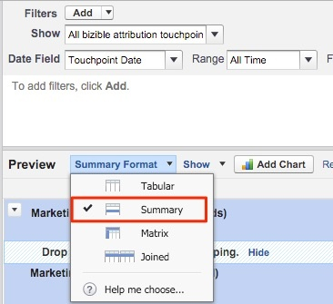

# Oportunidades por canal de marketing {#opportunities-by-marketing-channel}

Este relatório mostra o número de oportunidades geradas pelos seus Canais de marketing; inclui todas as suas oportunidades. No entanto, você pode filtrar esse relatório para analisar tipos específicos de oportunidades.

1. Clique na guia **[!UICONTROL Relatórios]** no Salesforce e selecione **[!UICONTROL Novo relatório]**.

1. Na localização rápida, digite &quot;Atribuição de Bizible&quot;, selecione o **[!UICONTROL Ponto de Contato de Atribuição de Bizible com o tipo de relatório Oportunidade]** e selecione **[!UICONTROL Criar]**.

   

1. A partir da parte superior do relatório, mostre **[!UICONTROL Todos os pontos de contato de atribuição da Bizible]** e ajuste o campo de data de acordo com o período no qual você deseja criar o relatório. No nosso exemplo, estamos olhando para Todos os Tempos. Além disso, altere o formato do relatório de [!UICONTROL Tabular] para **[!UICONTROL Resumo]**.

   

1. Agora, adicionaremos campos ao relatório. Na localização rápida à esquerda, digite &quot;Canal de marketing&quot; e adicione-o ao agrupamento de resumo no relatório.

   

1. Agora, execute o relatório e analise.

   Este é um relatório de Oportunidades resumido pelo Canal de marketing. Este relatório foca em todas as Ops, mas sinta-se à vontade para filtrar com base no estágio/tipo de oportunidade. Além disso, fique à vontade para adicionar campos sobre os quais deseja criar relatórios.

>[!MORELIKETHIS]
>
>[[!DNL Marketo Measure] Tutorials: Relatórios SFDC do Stock](https://experienceleague.adobe.com/en/docs/marketo-measure-learn/tutorials/onboarding/marketo-measure-102/stock-salesforce-reports){target="_blank"}
