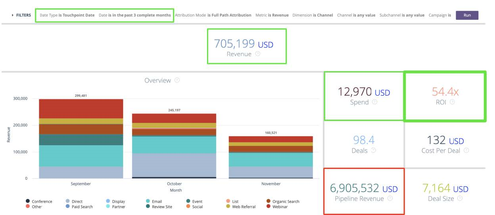

# Relatório sobre oportunidades com ou sem Buyer Attribution Touchpoints {#reporting-on-opportunities-with-or-without-buyer-attribution-touchpoints}

>[!NOTE]
>
>Você pode ver instruções específicas para o “[!DNL Marketo Measure]” na documentação, mas ainda notar o termo “Bizible” em seu CRM. Estamos trabalhando na atualização e a reformulação da marca será refletida em seu CRM em breve.

Crie um novo Tipo de Relatório para incluir todas as Oportunidades com ou sem Pontos de Contato de Atribuição do Comprador.

1. Vá para **[!UICONTROL Configuração]** > **[!UICONTROL Criar]** > **[!UICONTROL Tipos de Relatório]**.

   

1. Selecione **[!UICONTROL Novo Tipo de Relatório Personalizado]**.

   

1. Defina o Objeto Principal como &quot;[!UICONTROL Oportunidades].&quot;

   * Nomeie o Label do Tipo de Relatório como: &quot;Oportunidades com ou sem Atribuição do Comprador&quot;.
   * Use o mesmo nome para o Nome do tipo de relatório. Na entrada da descrição, &quot;Oportunidades com ou sem Pontos de contato de atribuição do comprador&quot;.
   * Salve o relatório em &quot;[!UICONTROL Outros]&quot; e defina o relatório como &quot;[!UICONTROL Implantado]&quot;.&quot;

   

1. A partir daí, você vinculará o Objeto de oportunidades ao Objeto de pontos de contato de atribuição do comprador. Escolha o botão &quot;Registros &#39;A&#39; podem ou não ter registros &#39;B&#39; relacionados.&quot; Clique em **[!UICONTROL Salvar]** quando terminar.

   

>[!MORELIKETHIS]
>
>[[!DNL Marketo Measure] Tutoriais: Relatórios Adicionais do SFDC](https://experienceleague.adobe.com/en/docs/marketo-measure-learn/tutorials/onboarding/marketo-measure-102/addtional-salesforce-reports)
