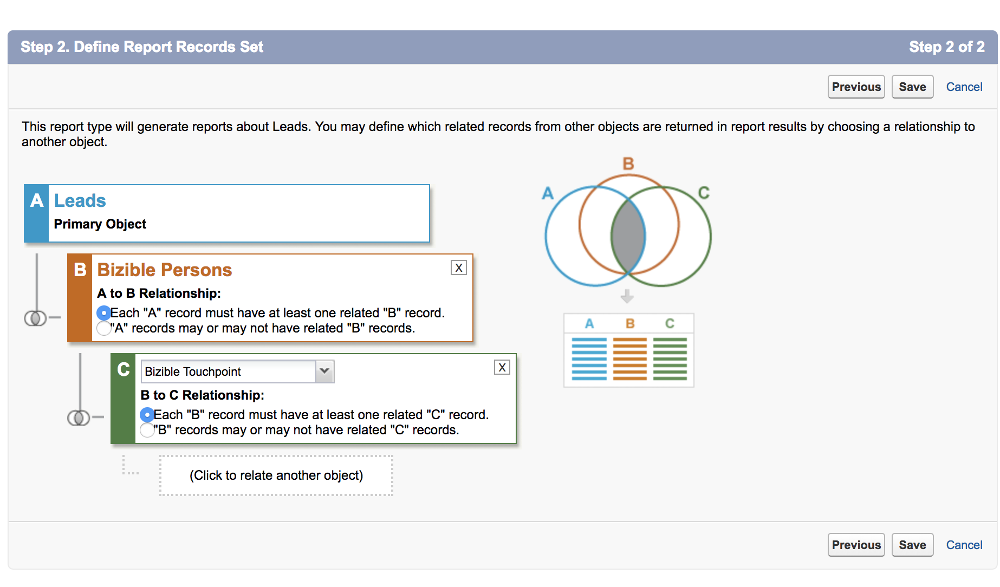
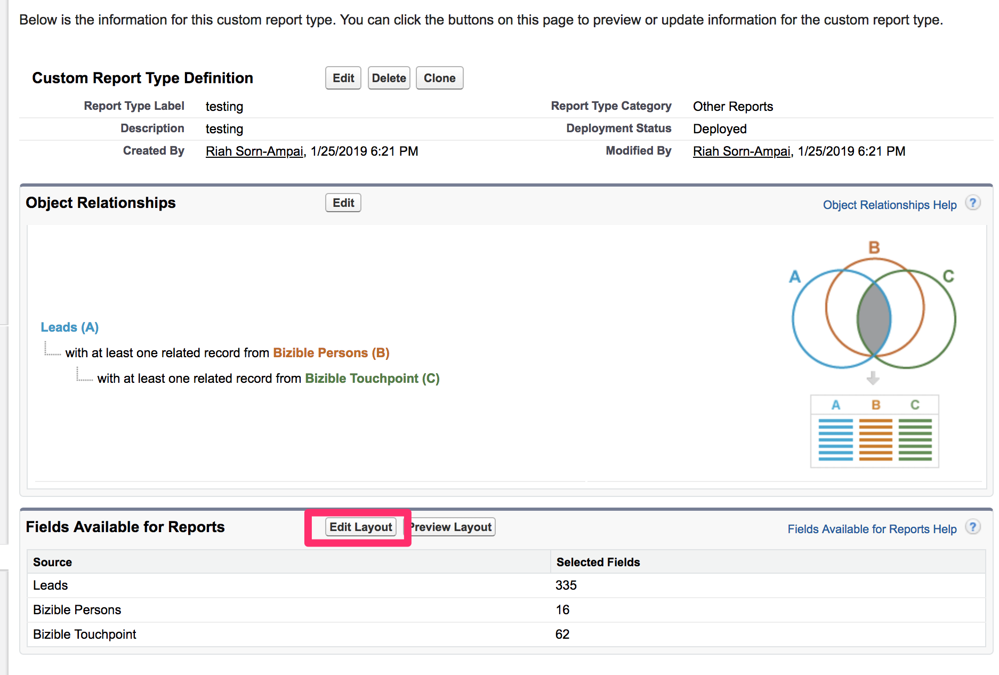

# Criação de personalizados [!DNL Marketo Measure] Tipos de relatório {#creating-custom-marketo-measure-report-types}

>[!NOTE]
>
>Você pode ver instruções especificando &quot;[!DNL Marketo Measure]&quot; na documentação, mas ainda consulte &quot;[!DNL Bizible]&quot; no seu CRM. Estamos trabalhando para atualizar isso e a reformulação da marca será refletida em seu CRM em breve.

Saiba como criar relatórios personalizados [!DNL Marketo Measure] [!DNL Salesforce] tipos de relatório. Há três tipos diferentes de relatórios que recomendamos criar: Clientes potenciais com Pontos de contato do comprador (Personalizado), [!DNL Marketo Measure] Pessoa com Pontos de contato do comprador (Personalizado), Oportunidades com Ponto de contato de atribuição do comprador (Personalizado).

## Clientes potenciais com pontos de contato do comprador (personalizado) {#leads-with-buyer-touchpoints-custom}

1. Ir para **[!UICONTROL Configuração]** > **[!UICONTROL Build]** > **[!UICONTROL Tipos de relatório]** > **[!UICONTROL Novos tipos de relatórios personalizados]**.

   

1. Defina o Tipo de relatório personalizado.

   * [!UICONTROL Foco do tipo de relatório] > [!UICONTROL [!UICONTROL Objeto primário]]: lead
   * Identificação > [!UICONTROL Rótulo de tipo de relatório]: Clientes potenciais com pontos de contato do comprador (personalizado)
   * [!UICONTROL Armazenar na categoria]: Outros relatórios
   * [!UICONTROL Implantação] > [!UICONTROL Status da implantação]: implantado

   

1. Defina os Relacionamentos entre objetos.

   * Relacionar o objeto de cliente em potencial (A) ao [!DNL Marketo Measure] Objeto Pessoa (B) e, em seguida, ao Objeto Ponto de Contato do Comprador (C)
   * Certifique-se de que &quot;[!UICONTROL Cada registro A/B deve ter pelo menos um registro B/C]O registro &quot; está selecionado
   * [!UICONTROL Salvar]

   

## [!DNL Marketo Measure] Pessoa com Pontos de contato do comprador (Personalizado) {#marketo-measure-person-with-buyer-touchpoints-custom}

1. Ir para **[!UICONTROL Configuração]** > **[!UICONTROL Build]** > **[!UICONTROL Tipos de relatório]** > **[!UICONTROL Novos tipos de relatórios personalizados]**.

   

1. Defina o Tipo de relatório personalizado.

   * [!UICONTROL Foco do tipo de relatório] > [!UICONTROL Objeto primário]: [!DNL Marketo Measure] Pessoas
   * [!UICONTROL Identificação] > [!UICONTROL Rótulo de tipo de relatório]: [!DNL Marketo Measure] Pessoa com Pontos de contato do comprador (Personalizado)
   * [!UICONTROL Armazenar na categoria]: Outros relatórios
   * [!UICONTROL Implantação] > [!UICONTROL Status da implantação]: implantado

   

1. Defina os Relacionamentos entre objetos.

   * Relacione o [!DNL Marketo Measure] Objeto de pessoa (A) para o Objeto de ponto de contato do comprador (B)
   * Certifique-se de que &quot;[!UICONTROL Cada registro A deve ter pelo menos um B]O registro &quot; está selecionado
   * [!UICONTROL Salvar]

   

## Oportunidades com o ponto de contato de atribuição do comprador (personalizado) {#opportunities-with-buyer-attribution-touchpoint-custom}

1. Ir para **[!UICONTROL Configuração]** > **[!UICONTROL Build]** > **[!UICONTROL Tipos de relatório]** > **[!UICONTROL Novos tipos de relatórios personalizados]**.

   

1. Defina o Tipo de relatório personalizado.

   * [!UICONTROL Foco do tipo de relatório] > [!UICONTROL Objeto primário]: Oportunidades
   * [!UICONTROL Identificação] > [!UICONTROL Rótulo de tipo de relatório]: Oportunidades com o ponto de contato de atribuição do comprador (personalizado)
   * [!UICONTROL Armazenar na categoria]: Outros relatórios
   * [!UICONTROL Implantação] > [!UICONTROL Status da implantação]: implantado

   

1. Defina os Relacionamentos entre objetos.

   * Relacione o objeto Oportunidades (A) ao Objeto de ponto de contato (B) de atribuição do comprador
   * Certifique-se de que &quot;[!UICONTROL Cada registro A deve ter pelo menos um B]O registro &quot; está selecionado
   * [!UICONTROL Salvar]

   

## Adição de campos personalizados a tipos de relatórios personalizados {#adding-custom-fields-to-custom-report-types}

1. Depois que os relatórios forem criados, você será redirecionado para uma visão geral do tipo de relatório. Clique em **[!UICONTROL Editar layout]**.

   

1. Verifique se os campos personalizados que deseja adicionar ao relatório aparecem na seção Propriedades de layout do campo. Se houver outros campos que você deseja adicionar, use o &quot;[!UICONTROL Adicionar campos relacionados por meio de pesquisa]&quot;.

   
