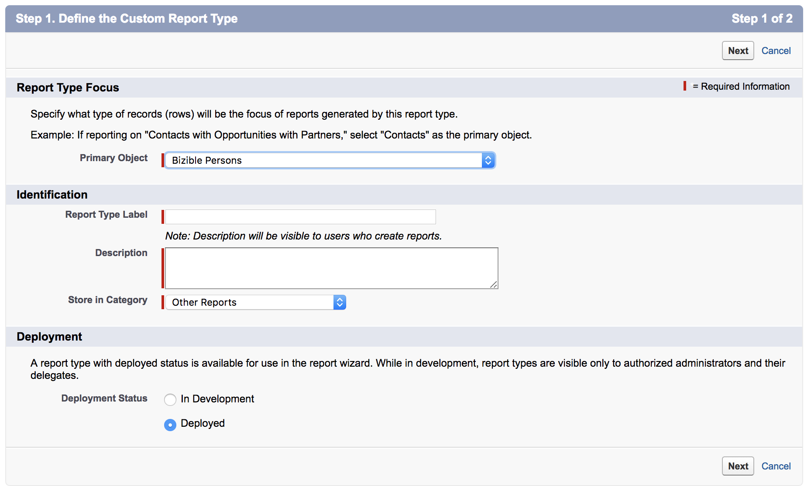

# Criação personalizada [!DNL Marketo Measure] Tipos de relatórios {#creating-custom-marketo-measure-report-types}

>[!NOTE]
>
>Você pode ver instruções especificando &quot;[!DNL Marketo Measure]&quot; na nossa documentação, mas ainda veja &quot;[!DNL Bizible]&quot; no seu CRM. Estamos trabalhando para atualizá-la e a reformulação da marca será refletida em seu CRM em breve.

Saiba como criar personalizado [!DNL Marketo Measure] [!DNL Salesforce] tipos de relatório. Há três tipos diferentes de relatórios que recomendamos criar: Clientes potenciais com pontos de contato de comprador (Personalizado), [!DNL Marketo Measure] Pessoa com pontos de contato de comprador (Personalizado), Oportunidades com ponto de contato de atribuição de comprador (Personalizado).

## Clientes potenciais com pontos de contato de comprador (Personalizado) {#leads-with-buyer-touchpoints-custom}

1. Ir para **[!UICONTROL Configuração]** > **[!UICONTROL Criar]** > **[!UICONTROL Tipos de relatórios]** > **[!UICONTROL Novos tipos de relatório personalizado]**.

   

1. Defina o Tipo de relatório personalizado.

   * [!UICONTROL Foco do tipo de relatório] > [!UICONTROL [!UICONTROL Objeto principal]]: Líder
   * Identificação > [!UICONTROL Rótulo do tipo de relatório]: Clientes potenciais com pontos de contato de comprador (Personalizado)
   * [!UICONTROL Armazenar na categoria]: Outros relatórios
   * [!UICONTROL Implantação] > [!UICONTROL Status da implantação]: Implantado

   

1. Defina os Relacionamentos de Objeto.

   * Relate o objeto de lead (A) ao [!DNL Marketo Measure] Objeto de Pessoa (B) e, em seguida, para o Objeto de Ponto de Contato do Comprador (C)
   * Certifique-se de que &quot;[!UICONTROL Cada registro A/B deve ter pelo menos um registro B/C]&quot; registro selecionado
   * [!UICONTROL Salvar]

   

## [!DNL Marketo Measure] Pessoa com pontos de contato de comprador (Personalizado) {#marketo-measure-person-with-buyer-touchpoints-custom}

1. Ir para **[!UICONTROL Configuração]** > **[!UICONTROL Criar]** > **[!UICONTROL Tipos de relatórios]** > **[!UICONTROL Novos tipos de relatório personalizado]**.

   

1. Defina o Tipo de relatório personalizado.

   * [!UICONTROL Foco do tipo de relatório] > [!UICONTROL Objeto principal]: [!DNL Marketo Measure] Pessoas
   * [!UICONTROL Identificação] > [!UICONTROL Rótulo do tipo de relatório]: [!DNL Marketo Measure] Pessoa com pontos de contato de comprador (Personalizado)
   * [!UICONTROL Armazenar na categoria]: Outros relatórios
   * [!UICONTROL Implantação] > [!UICONTROL Status da implantação]: Implantado

   

1. Defina os Relacionamentos de Objeto.

   * Relacione o [!DNL Marketo Measure] Objeto Pessoa (A) para o Objeto de ponto de contato do comprador (B)
   * Certifique-se de que &quot;[!UICONTROL Cada registro A deve ter pelo menos um registro B]&quot; registro selecionado
   * [!UICONTROL Salvar]

   

## Oportunidades com Ponto de Contato de Atribuição de Comprador (Personalizado) {#opportunities-with-buyer-attribution-touchpoint-custom}

1. Ir para **[!UICONTROL Configuração]** > **[!UICONTROL Criar]** > **[!UICONTROL Tipos de relatórios]** > **[!UICONTROL Novos tipos de relatório personalizado]**.

   

1. Defina o Tipo de relatório personalizado.

   * [!UICONTROL Foco do tipo de relatório] > [!UICONTROL Objeto principal]: Oportunidades
   * [!UICONTROL Identificação] > [!UICONTROL Rótulo do tipo de relatório]: Oportunidades com Ponto de Contato de Atribuição de Comprador (Personalizado)
   * [!UICONTROL Armazenar na categoria]: Outros relatórios
   * [!UICONTROL Implantação] > [!UICONTROL Status da implantação]: Implantado

   

1. Defina os Relacionamentos de Objeto.

   * Relate o objeto Oportunidades (A) ao objeto de ponto de contato da atribuição do comprador (B)
   * Certifique-se de que &quot;[!UICONTROL Cada registro A deve ter pelo menos um registro B]&quot; registro selecionado
   * [!UICONTROL Salvar]

   

## Adicionar campos personalizados aos tipos de relatório personalizados {#adding-custom-fields-to-custom-report-types}

1. Depois que os relatórios forem criados, você será redirecionado para uma visão geral do tipo de relatório. Clique em **[!UICONTROL Editar layout]**.

   

1. Verifique se os campos personalizados que deseja adicionar ao relatório são exibidos na seção Propriedades de layout de campo . Se houver outros campos que você deseja adicionar, use o[!UICONTROL Adicionar campos relacionados por meio de pesquisa]&quot;.

   
