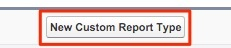
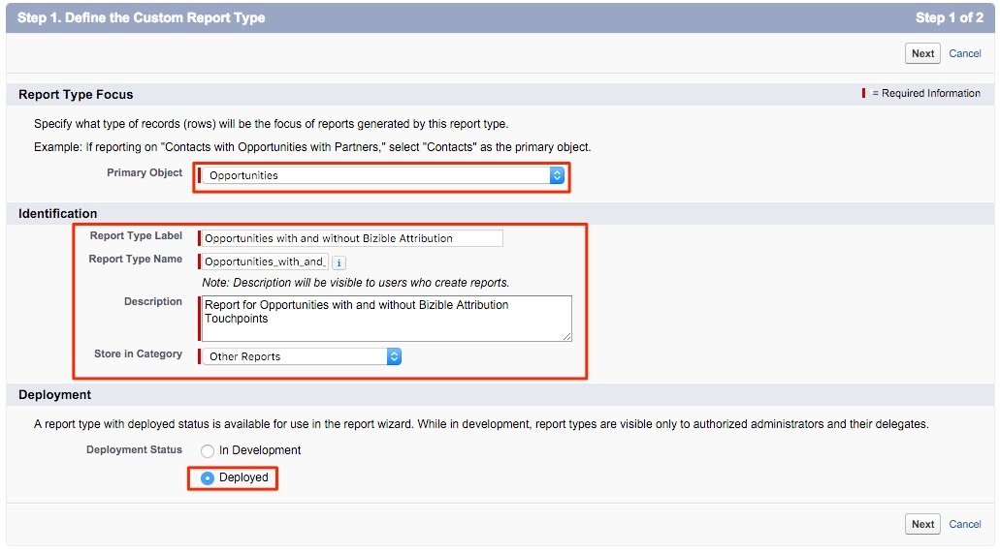

# Tipo de relatório para contatos sem oportunidades {#report-type-for-contacts-without-opportunities}

>[!NOTE]
>
>Você pode ver instruções especificando &quot;[!DNL Marketo Measure]&quot; na nossa documentação, mas ainda veja &quot;[!DNL Bizible]&quot; no seu CRM. Estamos trabalhando para atualizá-la e a reformulação da marca será refletida em seu CRM em breve.

Para criar relatórios sobre Contatos com Pontos de Contato do Comprador que não estão associados a uma Oportunidade, é necessário criar um tipo de relatório personalizado.

1. Ir para **[!UICONTROL Configuração]** > **[!UICONTROL Criar]** > **[!UICONTROL Tipos de relatórios]**.

   

1. Selecionar **[!UICONTROL Novo tipo de relatório personalizado]**.

   

1. Defina as [!UICONTROL Objeto principal] como &quot;[!UICONTROL Contatos].&quot; Nomeie o Rótulo do tipo de relatório como &quot;Contatos com pontos de contato do comprador&quot;. Use o mesmo nome para o Nome do tipo de relatório. Na entrada de descrição, &quot;Contatos com pontos de contato do comprador&quot;. Salve o relatório dentro de &quot;[!UICONTROL Outras]&quot; e defina o relatório como &quot;[!UICONTROL Implantado].&quot;

   

1. A partir daí, você vinculará o Objeto de Contatos ao Objeto de Pontos de Contato do Comprador. Certifique-se de escolher o botão &quot;Cada registro &quot;A&quot; deve ter pelo menos um registro &quot;B&quot; relacionado.&quot;

   

1. Clique em **[!UICONTROL Salvar]** e você terminou!
