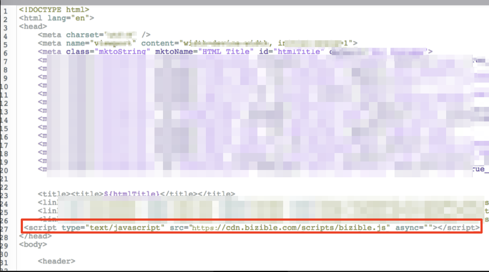

# Formulários do IFrame e [!DNL Marketo Measure] {#iframe-forms-and-marketo-measure}

No [!DNL Marketo Measure], uma das funcionalidades principais é rastrear iniciativas de marketing digital por meio de sessões de site e envios de formulários. Geralmente, quando o JavaScript do Marketo é inserido no site, nós o inserimos automaticamente em todos os formulários no site. No entanto, essa funcionalidade possui limitações caso o formulário esteja contido em um IFrame.

Pense em um IFrame como uma página dentro de uma página; logo, assim como solicitamos que o script seja adicionado a todas as páginas do site, também é necessário inserir o script dentro do IFrame para garantir o rastreamento.

Em muitos casos, vemos que o IFrame é gerenciado por meio de um provedor de automação de marketing, portanto, é necessário configurá-lo nessa plataforma ou por meio do provedor de formulários.

Recomendamos inserir o JavaScript no cabeçalho do IFrame para que, em seguida, possamos anexá-lo automaticamente aos formulários dentro desse IFrame.

Em caso de dúvidas sobre a adição do JavaScript aos formulários IFrame, entre em contato com a Equipe de Contas da Adobe (seu Gerente de Contas) ou com o [Suporte da Marketo](https://nation.marketo.com/t5/support/ct-p/Support){target="_blank"}.
