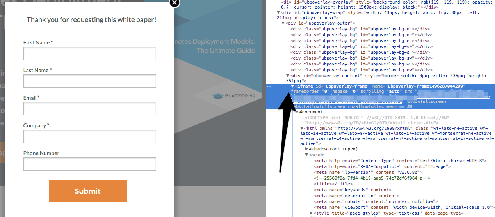
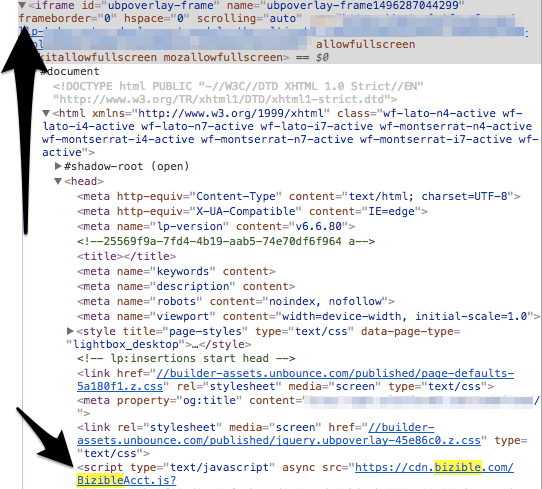

# Adicionando Script [!DNL Marketo Measure] ao Lightbox Forms {#adding-marketo-measure-script-to-lightbox-forms}

Saiba como adicionar corretamente o JavaScript [!DNL Marketo Measure] a um formulário em uma lightbox.

Uma lightbox abre um formulário na frente do conteúdo quando o visitante executa uma ação específica (ou seja, clicando em uma parte específica da página, gastando um determinado tempo na página e assim por diante). Normalmente, pedimos que o JavaScript [!DNL Marketo Measure] seja colocado no cabeçalho da página de aterrissagem, mas para formulários em uma lightbox, é necessária uma etapa extra.

Como um formulário em um lightbox é basicamente um formulário em um iFrame, o script é colocado nesse iFrame.

Primeiro, localize o iFrame em que reside o formulário [!UICONTROL lightbox].

Em seguida, coloque o JavaScript [!DNL Marketo Measure] no iFrame.

Por fim, quando a JavaScript é adicionada, os envios de formulários de validação são rastreados seguindo estas orientações:

1. Copie a URL da página de aterrissagem que contém o formulário [!UICONTROL lightbox].
1. Abra um navegador Incógnito e cole o URL.
1. Envie o formulário usando um endereço de email exclusivo.
1. Confirme se o teste foi rastreado verificando seu CRM em busca do endereço de email exclusivo usado. Verifique se os dados do Touchpoint estão sendo preenchidos.
