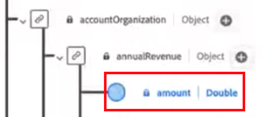

# Guia de implementação do [!DNL Marketo Measure] Ultimate {#marketo-measure-ultimate-implementation-guide}

Este artigo serve como um guia de implementação do Marketo Measure Ultimate, fornecendo etapas e insights claros para garantir uma integração e utilização bem-sucedidas.

## Principais diferenças ao usar o Ultimate em relação aos níveis Padrão {#main-differences-when-using-ultimate-over-standard-tiers}

Importar dados B2B por meio da AEP: Espera-se que os profissionais de marketing tragam seus dados B2B (por exemplo, conta, oportunidade, contato, lead, campanha, membro da campanha e atividade) por meio da AEP. Assimilação de praticamente qualquer fonte de dados, bem como de várias fontes de dados do mesmo tipo para trazer todos os seus dados para atribuição.

* Use com quase qualquer CRM, não apenas o Salesforce e o Dynamics.
* Conecte várias instâncias do CRM e/ou instâncias de MAP a uma instância do Marketo Measure.
* Traga dados de registro e participação em webinários de terceiros.

As conexões diretas do CRM e do Marketo Engage não estão mais disponíveis para o Ultimate.

* O Ultimate não envia dados de volta para o CRM. Os clientes podem consumir dados do data warehouse.
* Os profissionais de marketing continuarão trazendo dados da plataforma de anúncios por meio de conexões diretas e rastreando atividades da Web por meio do Marketo Measure Javascript.

Os usuários do Ultimate serão provisionados na AEP. Se eles já tiverem a AEP, não provisionaremos novamente uma nova instância.

* A versão da AEP fornecida incluirá todos os conectores de origem, modelagem de dados de esquema, conjuntos de dados, serviço de consulta Ad hoc e apenas um destino para o Marketo Measure.

Saiba mais sobre o [Marketo Measure Ultimate](/help/marketo-measure-ultimate/marketo-measure-ultimate-overview.md){target="_blank"}.

## Esquemas e conjuntos de dados {#schemas-and-datasets}

>[!NOTE]
>
>Confira os [Blocos de construção de um esquema](https://experienceleague.adobe.com/docs/experience-platform/xdm/schema/composition.html?lang=pt-BR#building-blocks-of-a-schema){target="_blank"} para obter uma visão geral de esquemas, classes e grupos de campos.

**Esquema XDM = Classe + Grupo de campos do esquema&#42;**

* Os campos obrigatórios não podem ser alterados. Os clientes podem criar e adicionar campos personalizados conforme necessário.
* Exemplo de nome de campo com base na hierarquia: accountOrganization.annualRevenue.amount

&#42; _Um esquema compreende uma classe e zero ou mais grupos de campos de esquema. Isso significa que você pode compor um esquema de conjunto de dados sem usar grupos de campos._

[Visão geral dos conjuntos de dados](https://experienceleague.adobe.com/docs/experience-platform/catalog/datasets/overview.html?lang=pt-BR){target="_blank"}: todos os dados assimilados com sucesso na AEP são mantidos no data lake como conjuntos de dados. Um conjunto de dados é uma construção de armazenamento e gerenciamento para uma coleção de dados, geralmente uma tabela, que contém um esquema (colunas) e campos (linhas).

## Criação de um esquema {#creating-a-schema}

Recomendamos o uso de um utilitário de geração automática para criar 10 esquemas B2B padrão.

* Etapas para baixar e configurar o utilitário [podem ser encontradas aqui](https://experienceleague.adobe.com/docs/experience-platform/sources/connectors/adobe-applications/marketo/marketo-namespaces.html?lang=pt-BR#set-up-b2b-namespaces-and-schema-auto-generation-utility){target="_blank"}.

Para aqueles com _**direito a CDP**_: crie esquemas acessando a página Origens.

* Na Origem, selecione Adicionar Dados > Usar modelos

* Selecione uma conta e todos os modelos B2B para criar 10 esquemas B2B padrão.

## Fluxos de dados {#dataflows}

[Visão geral dos fluxos de dados](https://experienceleague.adobe.com/docs/experience-platform/dataflows/home.html?lang=pt-BR){target="_blank"}

**Etapas para criar um fluxo de dados:**

1. Selecione uma Origem.
1. Selecione uma conta existente ou crie uma conta.
1. Selecione um tipo de dados na lista de tipos disponíveis para importar da Origem.
1. Selecione um conjunto de dados existente ou crie um novo conjunto de dados.
1. Mapeie os campos a partir dos dados de origem para o esquema.

   >[!NOTE]
   >
   >* Se você mapear um tipo de esquema para outro idêntico, isso será feito automaticamente.
   >* Você também pode importar o mapeamento de outro fluxo no sistema.
   >* Você pode mapear um campo de origem para vários campos de destino, mas não pode fazer o contrário.
   >* Você pode criar campos calculados ([Funções de mapeamento de preparação de dados](https://experienceleague.adobe.com/docs/experience-platform/data-prep/functions.html?lang=pt-BR){target="_blank"}).

   >[!CAUTION]
   >
   >* Você poderia editar um fluxo de dados, mas os dados não serão preenchidos quando um mapeamento for alterado.
   >* Se um campo obrigatório for NULO, todo o fluxo será rejeitado.

   >[!NOTE]
   >
   >[Requisito de integridade de dados do Marketo Measure Ultimate](/help/marketo-measure-ultimate/data-integrity-requirement.md){target="_blank"}

1. Defina uma cadência de carregamento de dados.
1. Revisão e conclusão.
1. Verifique a página “Status da conta” nas configurações da interface do Measure para ver o status do fluxo de dados.

**Monitoramento:**

Página Origens > Fluxos de dados para verificar o status dos fluxos de dados

* Para visualizar os detalhes da atividade de um conjunto de dados, basta clicar no conjunto de dados.
* Para visualizar erros de fluxo de dados, selecione um fluxo de dados, escolha uma execução de fluxo de dados e clique em &quot;Visualização do diagnóstico de erros&quot;.

## Inspeção de dados {#data-inspection}

Opção 1: Para executar consultas diretamente da interface, acesse a guia Consultas em Gerenciamento de dados.

Opção 2: [Baixe e use o PSQL](https://experienceleague.adobe.com/docs/experience-platform/query/clients/psql.html?lang=pt-BR){target="_blank"} (mais rápido e confiável).

## Ativar conjunto de dados para o Marketo Measure {#activate-dataset-for-marketo-measure}

Antes de começar, vá para a seção “Experience Platform > Mapeamento de sandbox” nas configurações da Interface do Measure e mapeie uma sandbox.

>[!CAUTION]
>
>Isso não pode ser alterado após selecionado.

1. Na AEP, vá para a página “Destinos > Marketo Measure” para exportar conjuntos de dados.
1. Configure o destino.
1. Ative o conjunto de dados.
1. Verifique a página “Status da conta” nas configurações da interface do Measure para ver o status do fluxo de dados.

>[!NOTE]
>
>* Os dados de uma determinada entidade (por exemplo, Conta) de uma determinada origem só podem entrar em um conjunto de dados. Cada conjunto de dados pode ser incluído somente em um fluxo de dados. As violações interromperão o fluxo de dados no tempo de execução.
>* Exclua todo o destino na AEP para excluir dados no Measure. A desativação apenas interromperá as exportações de novos dados e manterá os dados antigos.
>* A configuração do Measure terá a mesma aparência, mas algumas partes, como o Mapeamento de estágio, terão uma aparência diferente.
>* Leva algumas horas para que um novo fluxo de dados gere uma execução de fluxo e, em seguida, eles ocorrem em intervalos regulares de hora em hora.

No Measure, a moeda padrão precisa ser definida na seção “Moeda”

* Se você usar várias moedas, o esquema de taxa de conversão de moeda deverá ser preenchido na AEP para que possamos ler e usar nas conversões.

**Mapeamento de estágio:**

Não importamos estágios automaticamente dos dados do usuário, portanto todas os estágios devem ser mapeados manualmente.

* Os usuários podem mapear estágios de diferentes origens.

Se os estágios não forem mapeados, o sistema não funcionará porque os dados não terão para onde ir.

Se você for um cliente do Marketo Measure Ultimate e tiver definido seu Objeto de painel padrão como Contato, não use os dois campos específicos abaixo para Lead ([saiba mais aqui](/help/marketo-measure-ultimate/data-integrity-requirement.md){target="_blank"}).

* b2b.personStatus
* b2b.isConverted

**Regras de membro de campanha:**

É necessário escolher um conjunto de dados e definir regras para cada um.

**Regras de eventos de experiência:**

É necessário escolher um conjunto de dados e selecionar os tipos de atividades.

* As atividades personalizadas ainda não são compatíveis.
* Caso o cliente possua atividades que não se enquadrem nas opções disponíveis, sugerimos categorizá-las como “Momentos interessantes” e utilizar campos personalizados para distingui-las.

**Canais off-line:**

* Não aplicamos regras de mapeamento de canais específicas para conjuntos de dados, então isso seria global.
* No final, precisamos combinar o tipo de campanha de CRM e o canal, mas, por enquanto, podemos mapear o nome do canal para ambos os campos como solução alternativa.
* **Regras do canal: os dados preenchidos não terão dados de transição de estágio.**

As configurações de touchpoint e segmento permanecem as mesmas.
