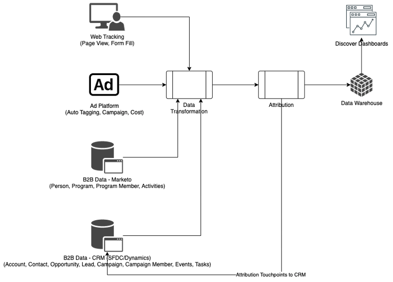
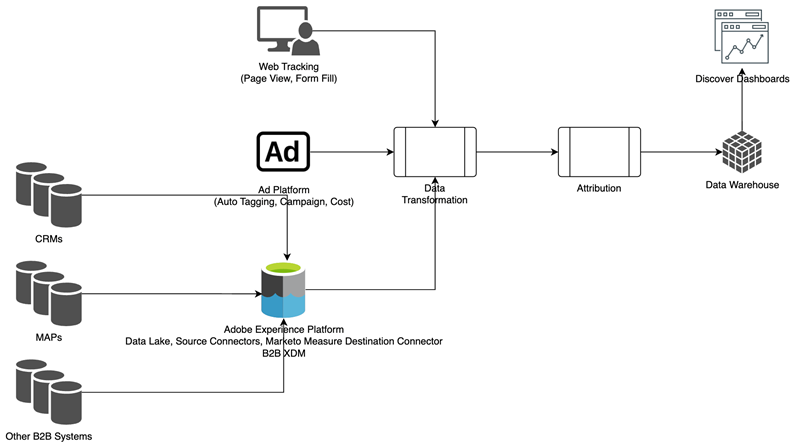
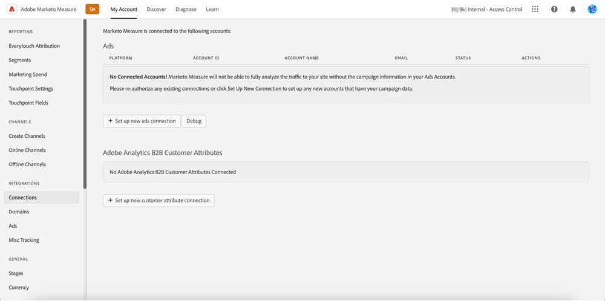
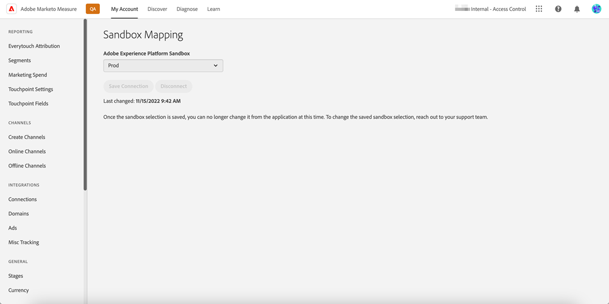

# Visão geral do [!DNL Marketo Measure] Ultimate {#marketo-measure-ultimate-overview}

O [!DNL Marketo Measure] (anteriormente Bizible) fornece aos profissionais de marketing insights sobre quais iniciativas de marketing são as mais eficientes na geração de receita e na maximização do retorno do investimento para a empresa. O [!DNL Marketo Measure] é uma solução de atribuição de marketing que rastreia e faz relatórios automaticamente sobre o desempenho do canal, oferecendo visibilidade sobre quais canais geram a maioria dos engajamentos de clientes e permitindo otimizar seus gastos com marketing de acordo com esses dados.

O [!DNL Marketo Measure Ultimate] contém os recursos adicionais:

* Assimilação de praticamente qualquer fonte de dados, bem como de várias fontes de dados do mesmo tipo para trazer todos os seus dados para atribuição.
   * Use com quase qualquer CRM, não apenas o Salesforce e o Dynamics.
   * Conecte várias instâncias do CRM e/ou do MAP à instância do [!DNL Marketo Measure].
   * Traga dados de registro e participação em webinários de terceiros.

* Transforme seus dados com grande flexibilidade por meio dos recursos de transformação e de mapeamento de campo para garantir a forma correta dos dados.

* Disponibilize insights de atribuição para aplicativos externos por meio do data warehouse incluído para integrar os insights ao seu fluxo de trabalho. Dados de resultados mais granulares e relatórios baseados em BI, incluindo o Snowflake Data Warehouse, que fornece acesso a dados de resultados granulares e a capacidade de usar qualquer ferramenta de BI para análise e relatório.

* Integração com a RTCDP (Edição B2B ou B2P), fornecendo uma solução de atribuição B2B integrada para clientes da RTCDP como RTCDP e [!DNL Marketo Measure]. Ambos funcionam a partir de dados centralizados da Adobe Experience Platform (AEP).

**[!DNL Marketo Measure]Níveis 1 a 3**

**[!DNL Marketo Measure Ultimate]**

## Novidades do [!DNL Marketo Measure Ultimate] {#whats-new-in-marketo-measure-ultimate}

**Importação de dados B2B por meio da AEP**

Espera-se que os profissionais de marketing tragam seus dados B2B (por exemplo, conta, oportunidade, contato, lead, campanha, membro da campanha e atividade) por meio da AEP. As conexões diretas do CRM e do Marketo Engage não estão mais disponíveis para o Ultimate. Os profissionais de marketing continuarão trazendo dados da Plataforma de anúncios por meio de conexões diretas e rastreando atividades da Web pelo javascript do [!DNL Marketo Measure].

**Configuração de moeda padrão**

O [!DNL Marketo Measure Ultimate] definirá a moeda padrão como USD até que seja alterada. A definição de uma nova moeda padrão atualizará os dados sem reprocessamento. Desde que a moeda selecionada esteja presente como um código ISO de destino, não é necessário enviar taxas de conversão.

Sandbox do **[!DNL Marketo Measure Ultimate]**

A instância do [!DNL Marketo Measure Ultimate] precisa ser mapeada para uma sandbox da AEP antes de criar os fluxos de dados de destino do [!DNL Marketo Measure] na AEP.

>[!NOTE]
>
>Uma instância de produção do [!DNL Marketo Measure Ultimate] precisa ser mapeada para uma sandbox de produção da AEP. Uma instância de desenvolvedores do [!DNL Marketo Measure Ultimate] precisa ser mapeada para uma sandbox de desenvolvedores da AEP.

Após a seleção de mapeamento da sandbox ser salva, não é possível alterá-la no aplicativo. Para alterá-la, entre em contato com o [Suporte do Marketo](https://nation.marketo.com/t5/support/ct-p/Support){target="_blank"}.

Os dados de uma determinada entidade (por exemplo, Conta) em uma determinada fonte de dados só podem ir para um conjunto de dados. Cada conjunto de dados pode ser incluído somente em um fluxo de dados. As violações interromperão o fluxo de dados no tempo de execução.

**Mapeamento de estágios**

Todas as regras do [!DNL Marketo Measure Ultimate] são específicas do conjunto de dados. As regras do Mapeamento de estágio devem ser criadas para todos os conjuntos de dados e todos os estágios selecionados.

Há seis estágios integrados:

* Lead perdido
* Lead aberto
* Lead convertido
* Oportunidade perdida
* Oportunidade aberta
* Oportunidade Ganha

As seções Perdido, Ganho e Convertido não permitem estágios personalizados. No entanto, os dados de origem podem ser mapeados para os estágios integrados Perdido/Ganho/Convertido ao atualizar a regra de mapeamento.

Estágios personalizados só podem ser definidos para seções Abertas.
Não incluímos mais estágios de CRM automaticamente no mapeamento de estágio.

Quatro estágios integrados precisam ser mapeados com regras (as regras de mapeamento para os outros dois, Lead perdido e Lead convertido, são opcionais):

* Lead aberto
* Oportunidade perdida
* Oportunidade aberta
* Oportunidade Ganha

As condições das regras são específicas do conjunto de dados. As regras de Mapeamento de estágio precisam ser criadas para todos os conjuntos de dados e todos os estágios, exceto Lead perdido e Lead convertido.

Nenhuma seleção para funil vs bumerangue vs modelo personalizado. Todos os estágios estão selecionados para funil, bumerangue e modelo personalizado. Oferecemos suporte a um número limitado de estágios: 6 estágios integrados mais 15 personalizados.

As regras de ponto de contato do membro da campanha e as regras de ponto de contato da atividade são específicas para o conjunto de dados.

Os pontos de contato de atribuição não são gravados no CRM porque o Ultimate não tem uma conexão direta com o CRM.

Os serviços de ML do ABM (correspondência entre lead e conta e pontuação preditiva de engajamento) do [!DNL Marketo Measure] não estão disponíveis para [!DNL Marketo Measure Ultimate]. É possível encontrar esses serviços incluídos gratuitamente na edição B2B da RT-CDP.

## Limitações {#limitations}

* No momento, campos limitados estão disponíveis para regras de transformação de dados.
* Não há um caminho de migração para usuários(as) de nível 1/2/3 já existentes. Precisa de uma nova implementação, mas ajudaremos a migrar os dados de atividade da web rastreados da instância já existente.

>[!MORELIKETHIS]
>
>[Destino do Marketo Measure Ultimate](https://experienceleague.adobe.com/docs/experience-platform/destinations/catalog/adobe/marketo-measure-ultimate.html?lang=pt-BR){target="_blank"}
