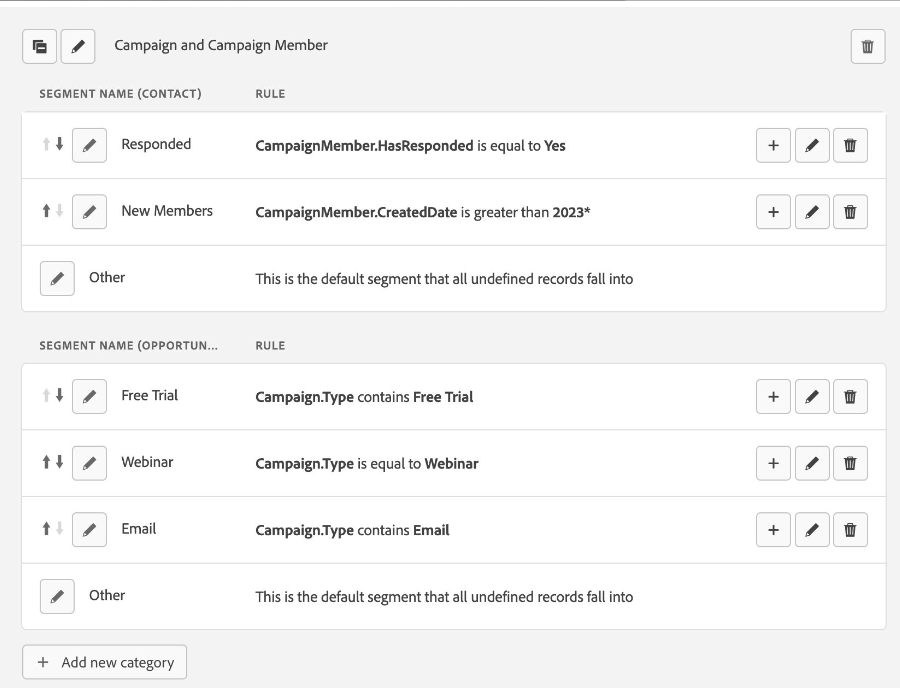

# Notas de versão: 2024 {#release-notes-2024}

Abaixo, você encontrará todos os recursos novos e atualizados das versões de 2024.

## Versão do 4º trimestre {#q4-release}

### Comportamento de transferência de canal para a nova sessão

O canal da sessão anterior agora será transferido se uma nova sessão começar dentro de sete dias após 30 minutos de inatividade, aplicando-se apenas às visitas diretas (sem referenciador ou referenciadores internos). Após sete dias de inatividade, a sessão assumirá Direto/Outro como padrão. Os canais não diretos não serão substituídos pelos dados da sessão anterior.

Além disso, as sessões que usam o logon a partir de redes sociais (Google, Microsoft ou Apple) agora são mescladas em uma única sessão contínua, garantindo uma experiência mais suave. Sem essa transferência, os logons a partir de redes sociais poderiam criar sessões separadas devido a diferenças externas do referenciador.

Para novos clientes, a transferência de canal de sessão agora é o comportamento padrão. Os clientes existentes podem habilitar isso ativando o botão de transferência de canal de sessão em Configurações > Atribuição Everytouch. Após ativada, essa configuração não poderá ser desfeita.

Documentação: [Definição de sessões da Web do Marketo Measure](https://experienceleague.adobe.com/pt-br/docs/marketo-measure/using/marketo-measure-tracking/setting-up-tracking/definition-of-marketo-measure-web-sessions){target="_blank"}

### Painel de ROI da palavra-chave

O novo Painel de ROI da palavra-chave oferece insights detalhados sobre o desempenho das campanhas de Pesquisa paga, fornecendo uma exibição abrangente dos custos em nível de palavra-chave, da receita atribuída e dos leads e oportunidades geradas. Esse painel ajuda a avaliar o ROI de cada palavra-chave no Google Adwords, LinkedIn, Bing Ads etc.

Documentação: [Painel de ROI da palavra-chave](https://experienceleague.adobe.com/pt-br/docs/marketo-measure/using/marketo-measure-discover-ui/dashboards/keyword-roi-dashboard){target="_blank"}

### Regras de segmento aprimoradas

Agora é possível criar segmentos usando os campos Campanha e Membro da campanha, além dos campos Ponto de contato e Contato. Esse aprimoramento permite analisar e dissecar seus dados com mais eficiência no Discover.

### Atualização: configuração do tratamento de erros para exportações CRM

Ouvimos seu feedback sobre a abordagem de interrupção de tarefa e estamos introduzindo um novo recurso na interface. A partir de hoje, você poderá determinar se as tarefas de exportação devem ser pausadas quando ocorrerem erros. Use o novo alternador em **Minha Conta** > **Configurações** > **CRM** > **Geral**. Este botão fica ativado por padrão para aprimorar a integridade e a visibilidade dos dados. No entanto, se preferir não usar esse recurso, desative-o na interface e as tarefas de exportação serão retomadas. Essa atualização foi projetada para aprimorar a confiabilidade dos processos de gerenciamento de dados enquanto dá a você um maior controle.

#### Principais datas e implantação em fases

1. **Disponibilidade do botão de alternância imediata:** o botão de alternância agora está disponível na interface e fica habilitado por padrão para impedir que dados sejam ignorados durante tarefas de exportação. Se preferir que as tarefas de exportação continuem em execução apesar de encontrar erros, desative o botão de alternância.

1. **Ativação da pausa de tarefas em 1º de outubro:** a partir de 1º de outubro de 2024, se o botão de alternância estiver ativo e um erro de nível de registro for encontrado durante uma tarefa de exportação, a tarefa será pausada para garantir que nenhum dado seja perdido. Esses erros geralmente ocorrem devido à ausência de permissões, regras de validação personalizadas aplicadas incorretamente ou problemas em fluxos de trabalho/acionadores. Você receberá notificações sobre o problema e, uma vez corrigido, a tarefa de exportação será retomada a partir do ponto de interrupção. Se você recusar a pausa de tarefas, ainda receberá notificações de problemas e, quando forem corrigidos, os registros ignorados serão automaticamente reexportados.

#### Por que isso é importante

* **Integridade de dados aprimorada e integração pronta para o futuro:** ao pausar a tarefa no primeiro sinal de um problema, evitamos a perda de dados e garantimos a precisão. Isso permite uma resolução rápida de erros, aprimorando a qualidade da exportação de dados e a confiabilidade geral do sistema.

* **Visibilidade imediata:** através das notificações de pulso, você receberá alertas oportunos sobre erros de permissão, permitindo respostas imediatas e minimizando possíveis impactos em suas operações.

#### Apoio à sua transição

Para ajudar na adaptação para essa mudança, criamos uma documentação sobre o novo recurso com descrições claras de erros e etapas abrangentes de resolução de problemas.

* Nova documentação: [Configuração do tratamento de erros para exportações do CRM](/help/configuration-and-setup/marketo-measure-and-salesforce/crm-error-handling.md)
* [Notificações de erro](/help/configuration-and-setup/getting-started-with-marketo-measure/error-notifications.md)

## Versão do terceiro trimestre {#q3-release}

### Lembrete: descontinuação do campo Salesforce - 14 de junho

Conforme anunciado no ano passado, vamos [eliminar gradualmente nossos trabalhos de exportação para objetos de Cliente Potencial/Contato](https://nation.marketo.com/t5/employee-blogs/marketo-measure-salesforce-lead-and-contact-field-deprecation-06/ba-p/350179){target="_blank"} para simplificar nossa integração e eliminar a necessidade de exportar para objetos padrão do Salesforce. Você pode obter os mesmos dados de seus objetos touchpoint seguindo as etapas [documentadas aqui](/help/release-notes/previous-releases/2023.md#deprecations){target="_blank"}. Também compartilharemos a documentação sobre como criar fluxos de trabalho para adicionar esses dados ao objeto lead/contato. A descontinuação entrará em vigor em 14 de junho de 2024.

Essa alteração trará dois benefícios principais:

* **Redução de custos da API do Salesforce**: os clientes podem esperar uma redução de cerca de 10% nos custos da API do Salesforce.
* **Integração simplificada**: o maior número de erros em nossas tarefas de exportação está relacionado a esses processos. Removê-los simplificará significativamente nossa integração.

### Painel de oportunidades atribuídas

Estamos animados em apresentar o novo [Painel de oportunidades atribuídas](/help/marketo-measure-discover-ui/dashboards/attributed-opportunity-dashboard.md){target="_blank"}, criado para fornecer uma visão abrangente de como seus esforços de marketing contribuem para oportunidades de pipeline nascentes e maduras.  Esse painel permite um aprofundamento nos detalhes de cada oportunidade aberta e fechada atribuível às suas estratégias, com a flexibilidade de filtrar por estágio da oportunidade. Ele fornece insights sobre quais canais, subcanais ou campanhas estão na classificação mais alta em termos de quantidade de oportunidades atribuídas, e exibe a quantidade total de oportunidades atribuídas, juntamente com a contagem de oportunidades atribuídas abertas e fechadas.

### Sincronização de cookies do Marketo Engage para o Marketo Measure Ultimate

A Sincronização de cookies do Marketo Engage agora está disponível para o Marketo Measure Ultimate. Para usar este recurso:

1. Na página esquemas da AEP, edite o esquema Pessoa B2B e adicione o grupo de campos “detalhes da pessoa Marketo Engage”.
1. Ao assimilar os dados no MMU, mapeie o campo ID de cookie do grupo de campos para cookies do Marketo Engage.

### Estágios de bumerangue habilitados para clientes de nível 2

Anteriormente disponível apenas para clientes de nível 3, o recurso “Estágio de bumerangue” também estará disponível para todos os clientes de nível 2 a partir de 13 de junho de 2024. Para obter informações mais detalhadas sobre esse recurso, consulte a documentação abaixo.

* [“Estágios de bumerangue” e Touchpoints](/help/advanced-marketo-measure-features/boomerang/boomerang-stages-and-touchpoints.md){target="_blank"}
* [Configurando “Estágios de bumerangue”](/help/advanced-marketo-measure-features/boomerang/setting-up-boomerang-stages.md){target="_blank"}
* [Cenários de “Estágio de bumerangue”](/help/advanced-marketo-measure-features/boomerang/boomerang-stage-scenarios.md){target="_blank"}

## Versão do segundo trimestre {#q2-release}

### Substituição de recursos do Marketo Measure em resposta à eliminação gradual de cookies de terceiros

Em resposta aos crescentes receios em relação à privacidade, os cookies de terceiros estão sendo descontinuados gradualmente, sendo que o prazo final no terceiro trimestre de 2024 do Google Chrome sinalizará seu fim. O Marketo Measure descontinuará certos recursos que dependem de cookies de terceiros, mais especificamente, o rastreamento entre domínios e a atribuição de viewthrough, que dependem do cookie de impressão do Google/DoubleClick. Essa alteração não afetará outras funcionalidades do Marketo Measure nem o uso de cookies próprios. Seguindo o cronograma do Google, espera-se que essas funcionalidades sejam descontinuadas até 1º de junho, mas os dados coletados antes dessa data continuarão acessíveis para os clientes.

* [Adaptando-se à descontinuação de cookies de terceiros no Marketo Measure](https://nation.marketo.com/t5/employee-blogs/adapting-to-third-party-cookie-deprecation-in-marketo-measure/ba-p/345110){target="_blank"}
* [Cookies do Marketo Measure](/help/marketo-measure-tracking/setting-up-tracking/marketo-measure-cookies.md){target="_blank"}

### Implantação em fases de nosso tratamento de erros aprimorado

Estamos introduzindo uma implantação em fases do tratamento aprimorado de erros para tarefas de exportação, começando por notificações de pulso imediatas no aplicativo para erros de permissão e fazendo a transição para uma nova abordagem, na qual as tarefas de exportação serão pausadas quando um erro ocorre. Essa alteração visa melhorar a integridade e visibilidade dos dados, garantindo processos de gerenciamento de dados mais fluidos e confiáveis para os nossos usuários. Para garantir uma transição tranquila e interrupções mínimas das suas operações, estamos implementando essas mudanças em duas fases:

* Disponibilidade imediata de notificações de pulso: você receberá notificações de pulso no aplicativo sobre erros de permissão durante tarefas de exportação. Isso não interromperá as suas exportações, mas informará sobre os erros sem afetar as suas tarefas atuais.
* Implementação de pausa de tarefas em 25 de abril: **ADIADA**; depois de considerar o feedback de usuários do Marketo Measure, decidimos adiar a implementação da pausa das tarefas de exportação quando um erro ocorre, originalmente programada para 25 de abril. Reconhecemos que a interrupção das tarefas pode não ser a abordagem mais eficaz. Estamos empenhados em encontrar uma solução melhor que mantenha a integridade dos dados e minimize as interrupções. Vamos esperar para fazer quaisquer alterações no nosso sistema atual até que possamos garantir uma solução que se alinhe mais às necessidades dos nossos usuários.

_Por que isso é importante_

Integridade de dados aprimorada e integração pronta para o futuro: interrompemos a tarefa no primeiro sinal de problema para evitar a perda de dados e garantir a precisão. Isso permite uma resolução rápida de problemas, melhorando a qualidade da exportação de dados e a confiabilidade do sistema.

Visibilidade imediata: a introdução de notificações de pulso permite uma resposta imediata aos erros de permissão, evitando possíveis impactos nas operações.

_Apoio à sua transição_

Para ajudar na adaptação para essa mudança, [criamos uma documentação](/help/configuration-and-setup/getting-started-with-marketo-measure/error-notifications.md){target="_blank"} com descrições claras de erros e etapas abrangentes de resolução de problemas.

 

### Ação necessária para a integração com o LinkedIn

O LinkedIn lançou recentemente uma versão atualizada de sua API Lead Sync. Autentique novamente a conexão com o LinkedIn na sua instância do Marketo Measure até 20 de maio para evitar interrupções.
