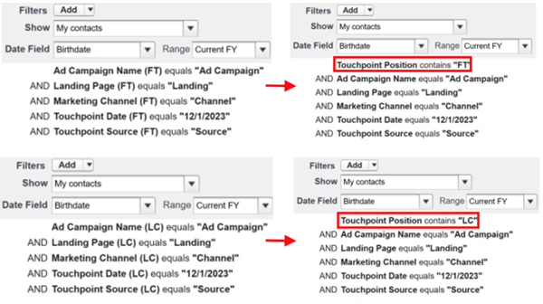

# Notas de versão: 2023 {#release-notes-2023}

Veja abaixo todos os recursos novos e atualizados das versões de 2023.

## Versão do 4º trimestre {#q4-release}

**Painel de tráfego na web**

O novo design do [Painel de tráfego na web](/help/marketo-measure-discover-ui/dashboards/web-traffic-dashboard.md){target="_blank"} agora está acessível a todos os clientes. Esse painel oferece uma visão geral completa das interações de visitantes do site. Você pode analisar métricas, como contagens de visitantes únicos por URL, total de visitas, visualizações de página e envios de formulários, utilizando páginas de destino ou URLs de formulários específicos. Também é possível acompanhar as tendências mensais de tráfego e identificar mídias pagas de alto desempenho, o que ajudará você a refinar suas estratégias para uma geração de receita ideal.

O novo conjunto de painéis pré-construídos está programado para ser introduzido em ondas, e esse processo será concluído antes do final do ano.

>[!NOTE]
>
>Os painéis atuais serão descontinuados em março de 2024, mas você poderá utilizar ambas as versões até lá, garantindo uma transição tranquila.

**Remoção de dados do endereço IP**

Estamos removendo os dados de endereços IP do nosso armazenamento de longo prazo para garantir a conformidade com a privacidade de dados. Atualmente, as tabelas e visualizações do Snowflake a seguir contêm endereços IP, e planejamos remover esses dados e adicionar novas informações de geolocalização:

<table style="width:400px">
<thead>
  <tr>
    <th style="width:50%">Tabelas</th>
    <th>Exibições</th>
  </tr>
</thead>
<tbody>
  <tr>
    <td>CUSTOMER_AB_TESTS</td>
    <td>BIZ_CUSTOMER_AB_TESTS</td>
  </tr>
  <tr>
    <td>CUSTOMER_EVENTS</td>
    <td>BIZ_CUSTOMER_EVENTS</td>
  </tr>
  <tr>
    <td>FORM_SUBMITS</td>
    <td>BIZ_FORM_SUBMITS</td>
  </tr>
  <tr>
    <td>IMPRESSIONS</td>
    <td>BIZ_IMPRESSIONS</td>
  </tr>
  <tr>
    <td>PAGE_VIEWS</td>
    <td>BIZ_PAGE_VIEWS</td>
  </tr>
  <tr>
    <td>SESSIONS</td>
    <td>BIZ_SESSIONS</td>
  </tr>
  <tr>
    <td>WEB_HOST_MAPPINGS</td>
    <td>BIZ_WEB_HOST_MAPPINGS</td>
  </tr>
</tbody>
</table>

* A partir de agora, baixaremos o código do país, nome da cidade e código da região em vez do nome do país, nome da cidade e nome da região.
* Durante o processamento de todas as atividades históricas da web, poderão surgir inconsistências nas informações de localização dos registros. Essas inconsistências podem incluir a presença de endereços IP sem detalhes de geolocalização, informações de geolocalização atualizadas sem endereços IP ou uma combinação de nomes e códigos de países ou regiões.
* _**Este período de dados mistos deve ocorrer de 04/01/2023 a 29/02/2023.**_

**Dados do título da página na tabela de URL**

A tabela de URL no [data warehouse](/help/marketo-measure-data-warehouse/data-warehouse-schema.md){target="_blank"} agora incluirá um campo de título da página, além das tabelas de dados da web.

Observe que o título da página na tabela URL nem sempre pode corresponder ao título da página em outras tabelas da Web. A tabela de URL utilizará o título de página mais recente. Se o título tiver sido alterado para o URL após a atividade da web, ele não corresponderá ao utilizado na tabela de URL.

**Novo design do painel Discover**

Todos os usuários do Marketo Measure usarão nossos painéis no aplicativo reprojetados, que combinam usabilidade aprimorada com valor agregado. Também estamos introduzindo novas métricas, como “ROI concretizado”, que leva em conta o atraso típico entre investimentos e compras de marketing no mercado B2B.

O novo conjunto de painéis pré-construídos está programado para ser introduzido em ondas, começando na primeira semana de outubro e concluindo antes do final do ano. Esses novos painéis aparecerão automaticamente em suas instâncias, juntamente com informações no produto e links para a documentação.

* [Manual do novo painel do Discover](/help/marketo-measure-discover-ui/dashboards/new-discover-dashboard-guide.md){target="_blank"}
* [Noções básicas do painel do Discover](/help/marketo-measure-discover-ui/dashboards/discover-dashboard-basics.md){target="_blank"}
* [Painel de visão geral da receita](/help/marketo-measure-discover-ui/dashboards/revenue-overview-dashboard.md){target="_blank"}
* [Painel de receita atribuída](/help/marketo-measure-discover-ui/dashboards/attributed-revenue-dashboard.md){target="_blank"}
* [Painel de ROI](/help/marketo-measure-discover-ui/dashboards/roi-dashboard.md){target="_blank"}
* [Painel de passaporte](/help/marketo-measure-discover-ui/dashboards/passport-dashboard.md){target="_blank"}

>[!NOTE]
>
>Os painéis atuais serão descontinuados em março de 2024, mas você poderá utilizar ambas as versões até lá, garantindo uma transição tranquila.

### Descontinuações {#deprecations}

#### Descontinuações de campos do Salesforce

Vamos eliminar gradualmente nossos processos de exportação para objetos de clientes potenciais e contatos a fim de simplificar a integração e eliminar a necessidade de exportação para objetos padrão do Salesforce. Os campos desnormalizados listados abaixo também serão descontinuados, pois clientes podem obter os mesmos dados de seus objetos de touchpoint. _**A linha do tempo de descontinuação foi definida para junho de 2024.**_

<table style="width:350px">
<tbody>
  <tr>
    <td>bizible2__Ad_Campaign_Name_FT__c</td>
  </tr>
  <tr>
    <td>bizible2__Ad_Campaign_Name_LC__c</td>
  </tr>
  <tr>
    <td>bizible2__Landing_Page_FT__c</td>
  </tr>
  <tr>
    <td>bizible2__Landing_Page_LC__c</td>
  </tr>
  <tr>
    <td>bizible2__Touchpoint_Date_FT__c</td>
  </tr>
  <tr>
    <td>bizible2__Touchpoint_Date_LC__c</td>
  </tr>
  <tr>
    <td>bizible2__Touchpoint_Source_FT__c</td>
  </tr>
  <tr>
    <td>bizible2__Touchpoint_Source_LC__c</td>
  </tr>
  <tr>
    <td>bizible2__Marketing_Channel_FT__c</td>
  </tr>
  <tr>
    <td>bizible2__Marketing_Channel_LC__c</td>
  </tr>
</tbody>
</table>

Os campos que contêm as mesmas informações nos objetos Touchpoint e Touchpoint de atribuição são:

* bizible2__Ad_Campaign_Name__c
* bizible2__Landing_Page__c
* bizible2__Marketing_Channel__c
* bizible2__Touchpoint_Date__c
* bizible2__Touchpoint_Source__c

**Ações necessárias**

* Crie novos tipos de relatório para leads e contatos com ou sem touchpoints.

* Crie relatórios que capturem a funcionalidade de qualquer relatório já existente que utilize os campos removidos. Como parte deste processo, você poderá alterar os campos do relatório conforme especificado abaixo:

* Remover campos FT/LC de lead/contato:

* Adicionar campos de touchpoint:

* O filtro Posição do touchpoint e todos os filtros que usam campos FT/LC, incluindo o Campo de data, devem ser atualizados da seguinte maneira:

* Exclua todos os relatórios pré-existentes que utilizaram os campos removidos do objeto de lead/contato para não fazer mais referência a esses campos.

#### Pacote do Dynamics relacionado

* Para permanecer conectado ao Dynamics, instale a versão mais recente do pacote, v6.12. Versões antigas do `(<v6.12)` não serão mais compatíveis. Essa atualização otimiza a criação de registros históricos para reduzir o uso do armazenamento.

* O método desatualizado do OAuth com um RefreshToken será descontinuado. Consulte [este guia](/help/marketo-measure-and-dynamics/getting-started-with-marketo-measure-and-dynamics/oauth-with-azure-active-directory-for-dynamics-crm.md){target="_blank"} para atualizar suas credenciais para seguir as práticas recomendadas da Microsoft de uso do ClientSecret.

#### Campo “custom_properties”

Em nosso data warehouse, o campo “custom_properties” tem servido como um armazenamento para pontos de dados adicionais não cobertos pelo nosso esquema fixo. Armazenado no formato JSON, o uso desse campo é limitado e sua integração com consultas SQL pode ser complicada, afetando o desempenho. Dados esses fatores, decidimos descontinuar esse campo. Essa alteração afetará principalmente a camada de processamento de dados em nosso armazenamento de tabela do Azure e os dados exportados para nosso data warehouse.

### O que está por vir? {#q4-whats-coming}

**Relatórios personalizados no aplicativo**

Os clientes do Marketo Measure, pela primeira vez, poderão criar e salvar seus próprios relatórios diretamente no aplicativo. Isso virá após o lançamento dos painéis pré-construídos no início de 2024.

 

## Versão do segundo trimestre {#q2-release}

* **Consolidação de pacotes do Salesforce**

Estamos mesclando todos os pacotes do Salesforce em um pacote único e abrangente para melhorar a experiência do usuário e simplificar o uso. Os pacotes V1, V2_EXT e Relatórios serão descontinuados no próximo trimestre. O novo pacote combina todos os recursos anteriores, permitindo um rastreamento mais eficiente e insights do cliente mais profundos.

Os clientes que já têm o pacote V2 instalado devem atualizá-lo para a nova versão consolidada.

Adicionamos dois novos campos para aprimorar seus recursos de relatório:

* form_name: agora disponível em objetos BT/BAT, esse campo permite criar relatórios com base em nomes de formulário.
* user_touchpoint_id: esse campo permite criar relatórios com contagens de pontos de contato de usuários exclusivos.

[Este artigo](/help/configuration-and-setup/marketo-measure-and-salesforce/salesforce-package-consolidation.md){target="_blank"} inclui guias sobre como recriar relatórios e painéis de pacotes de relatórios herdados.

* **Atualizações de versão da API do Salesforce**

Todas as versões da API do Salesforce das classes Apex, incluindo a classe UserActivityContext, foram atualizadas para versões compatíveis. (31.0 a 57.0)

* **Instalação do novo pacote**

O link de instalação do novo pacote consolidado [pode ser encontrado aqui](https://login.salesforce.com/packaging/installPackage.apexp?p0=04t1P000000VY6Z){target="_blank"}

### O que está por vir? {#q2-whats-coming}

**Alterações no armazenamento de endereços IP**

Não armazenaremos mais endereços IP em nosso sistema conforme as considerações de privacidade. Continuaremos a identificar e armazenar a localização geográfica do endereço IP, mas o formato será alterado (por exemplo, “Estados Unidos” para “EUA”).
