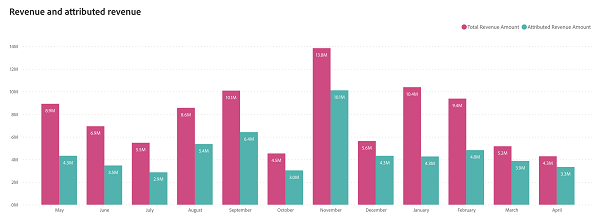
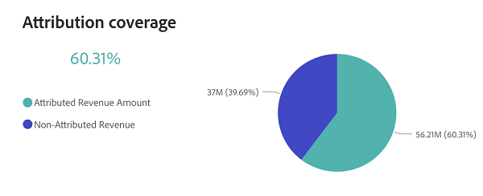

# Painel de visão geral da receita {#revenue-overview-dashboard}

O painel Visão geral da receita fornece insights sobre a receita total derivada do seu CRM, esclarecendo a função das estratégias de marketing. Ele oferece uma visão geral de como o marketing influencia sua receita geral e contribui para o encerramento bem-sucedido das ofertas.

**Perguntas sobre as respostas do painel:**

* Qual % de nossa receita é atribuível aos nossos esforços de marketing?
* Quais % de nossas ofertas de &quot;Closed Won&quot; foram influenciadas por nossos esforços de marketing?

## Componentes do painel {#dashboard-components}

### Blocos de KPI {#kpi-tiles}

* **Receita total**: a receita total de Oportunidades &quot;Ganhadas Fechadas&quot;, incluindo Oportunidades sem pontos de contato.
* **Total de Contratos**: o número de Oportunidades &quot;Ganhadas Fechadas&quot;, incluindo Oportunidades sem pontos de contato.
* **Receita atribuída**: a receita total de oportunidades &quot;Ganhadas fechadas&quot; com pontos de contato.
* **Contratos Atribuídos**: o número de Oportunidades &quot;Ganhadas Fechadas&quot; que têm pontos de contato.

### Gráfico de Receita e Receita Atribuída {#revenue-and-attributed-revenue-chart}

Este gráfico de barras lado a lado da série temporal contrasta a Receita total com a Receita atribuída, visualizando claramente o impacto de marketing na receita geral.

* use as funcionalidades de detalhamento e aumento para categorizar os dados por Trimestre e Ano.
* Passe o mouse sobre uma seção do gráfico de barras para revelar suas informações detalhadas.

**Perguntas sobre as respostas do gráfico:**

* Qual % de nossa receita de agosto de 2022 pode ser atribuída às nossas iniciativas de marketing?
* Como a receita atribuída no terceiro trimestre do ano passado se compara ao quarto trimestre?

### Gráfico de cobertura de atribuição {#attribution-coverage-chart}

Este gráfico de pizza visualiza distintamente a cobertura de atribuição, segmentando a receita total em receita Atribuída e Não Atribuída, destacando a porcentagem precisa da receita influenciada pelos seus esforços de marketing.

**Perguntas sobre as respostas do gráfico:**

* Qual foi a % de cobertura de receita atribuída aos nossos esforços de marketing no ano passado?

## Painel de Filtro {#filter-pane}

Esse painel é equipado com as seguintes configurações e filtros:

* Data (com base na data de fechamento)

>[!MORELIKETHIS]
>
>* [Noções básicas do painel do Discover](/help/discover-dashboard-basics.md){target="_blank"}
>* [Política de Visibilidade de Dados do Painel](/help/dashboard-data-visibility-policy.md){target="_blank"}
