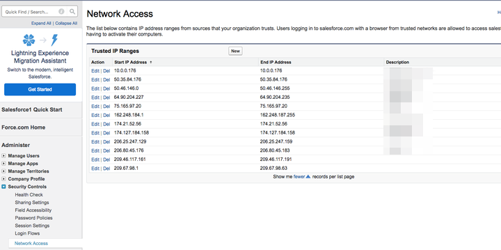

# Restrições de sessão de segurança: Endereços IP para incluir na lista de permissões {#security-session-restrictions-ip-addresses-to-allowlist}

Se houver [Configurações de Segurança de Sessão](https://help.salesforce.com/articleView?id=admin_sessions.htm&type=0){target="_blank"} em vigor, impedindo que Endereços IP específicos enviem/enviem dados para a instância [!DNL Salesforce], precisaremos dos seguintes intervalos IP para permitir que [!DNL Marketo Measure] envie dados para [!DNL Salesforce]:

* 52.162.84.192 - 52.162.84.207
* 23.100.229.112 - 23.100.229.127
* 20.186.163.0 - 20.186.163.15

Para adicionar IPs [!DNL Marketo Measure] aos Intervalos IP Confiáveis na Salesforce, clique em **[!UICONTROL Instalação]** > **[!UICONTROL Instalação da Administração]** > **[!UICONTROL Controles de Segurança]** > **[!UICONTROL Acesso à Rede]** > **[!UICONTROL Novo]**.

