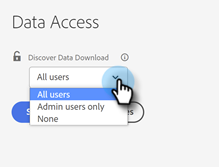

# Controle de Acesso do [!UICONTROL Download de Dados da Descoberta] {#discover-data-download-access-control}

O controle [!UICONTROL Download de Dados da Descoberta] habilita [!DNL Marketo Measure] Administradores a definir as políticas de download de dados para os painéis da Descoberta com base nas funções dos usuários. O controle abrange todas as ações de download de dados nos painéis do Discover.

1. Clique em **[!UICONTROL Acesso aos Dados]** em [!UICONTROL Segurança].

   

1. Clique na lista suspensa e selecione a opção apropriada para seu console.

   

   <table>
    <tr>
     <td><strong>Todos os usuários</strong></td>
     <td>Todos os usuários podem baixar dados, incluindo os formatos PDF e CSV.</td>
    </tr>
    <tr>
     <td><strong>Somente usuários administradores</strong></td>
     <td>Somente usuários administradores podem baixar dados, incluindo formatos PDF e CSV.</td>
    </tr>
    <tr>
     <td><strong>None</strong></td>
     <td>Ninguém pode baixar dados, incluindo os formatos PDF e CSV.</td>
    </tr>
   </table>

1. Clique em **[!UICONTROL Salvar]** quando terminar.

   

>[!NOTE]
>A configuração pode não ter efeito até que os usuários tenham feito logoff e logon novamente.
