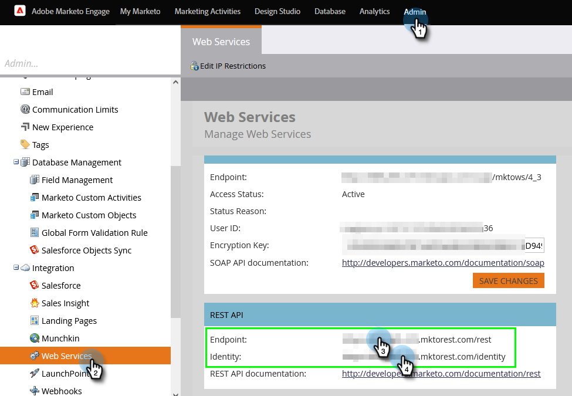
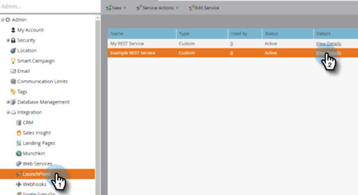

# Configurar conexão do Marketo {#set-up-marketo-connection}

Veja como configurar sua conexão com o Marketo.

>[!PREREQUISITES]
>
>[Criar uma função de Usuário Somente API](https://experienceleague.adobe.com/docs/marketo/using/product-docs/administration/users-and-roles/create-an-api-only-user.html) para a conexão [!DNL Marketo Measure]/Marketo Engage.

1. Em [!DNL Marketo Measure], clique no menu suspenso **[!UICONTROL Minha Conta]** e selecione **[!UICONTROL Configurações]**.

   

1. Em [!UICONTROL Integrações], clique em **[!UICONTROL Conexões]**.

   

1. Clique em **[!UICONTROL Configurar Nova Conexão do CRM]**.

   

1. Clique no botão **[!UICONTROL Conectar]** ao lado de Marketo.

   

1. Em uma nova guia, faça logon na conta do Marketo Engage. Vá para **Admin** > **Serviços da Web**. Role para baixo até API REST. Realce e salve o Ponto de extremidade e o URL do serviço de identidade. Você precisa deles nas etapas a seguir.

   

1. Ainda no Marketo Engage, selecione **LaunchPoint** na árvore à esquerda. Encontre o serviço personalizado que você deseja conectar ao Marketo Measure e clique em **Exibir Detalhes**.

   

1. Realce e salve a ID do cliente e o Segredo do cliente. Clique em **Fechar**.

   

1. De volta ao [!DNL Marketo Measure], preencha os campos com os dados coletados.

   

1. Após inserir os valores, clique em **[!UICONTROL Autenticar]**. Sua conta do Marketo Engage está conectada ao [!DNL Marketo Measure].

   

   >[!NOTE]
   >
   >O [!DNL Marketo Measure] faz chamadas para a API do Marketo em seu nome sem consumir nenhum dos limites da API do Marketo, portanto, não há necessidade de se preocupar com limites e alocação de crédito com outras integrações.
