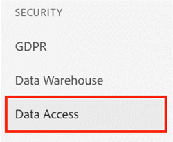
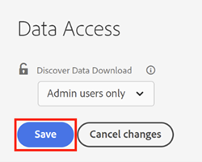

# Logon único {#single-sign-on}

A SAML (linguagem de marcação de declaração de segurança) para SSO (logon único) permite que usuários se autentiquem por meio do provedor de identidade de uma empresa ao fazer logon no aplicativo [!DNL Marketo Measure]. O SSO permite que usuários se autentiquem uma vez, sem precisar se autenticar em aplicativos separados. A SAML é uma necessidade para clientes corporativos porque nem todos os usuários têm uma conta do [!DNL Salesforce] ou [!DNL Google] em sua organização. Pensando nisso, o [!DNL Marketo Measure] desenvolveu uma solução de SAML para oferecer suporte a provedores de identidade de empresas.

>[!CAUTION]
>
>Este artigo descreve o processo de logon único (SSO) e gerenciamento avançado de usuários do CRM. Se sua conta foi provisionada **após 10/9/2020**, ignore este artigo, pois o SSO e o gerenciamento de identidade da sua integração do  [!DNL Marketo Measure] [&#128279;](/help/implementation-guide.md) serão configurados no Adobe Admin Console.

>[!NOTE]
>
>É provável que as empresas usem diferentes provedores de identidade (por exemplo, identidade de ping e Okta). Os termos usados nas instruções de configuração a seguir e na interface podem não ser os mesmos utilizados pelo seu provedor de identidade.

## Requisitos {#requirements}

* Usuário com permissões de admin de conta no aplicativo do [!DNL Marketo Measure]
* Usuário com acesso administrativo ao provedor de identidade do(a) cliente

## Introdução {#getting-started}

Para começar, no aplicativo do [!DNL Marketo Measure], navegue até a página Configurações > Segurança > Autenticação. Em seguida, altere o tipo de logon para SSO personalizado para ver as opções de configuração. As alterações não entrarão em vigor até que você teste a autenticação e clique em **[!UICONTROL Salvar]** na parte inferior da página.

## Processar {#process}

O logon único do [!DNL Marketo Measure] exige a definição das configurações de autenticação em uma série de etapas para que não haja risco de você perder o acesso à conta do [!DNL Marketo Measure].

Configurar o aplicativo do [!DNL Marketo Measure] no provedor de identidade. Consulte a documentação externa listada abaixo para obter instruções passo a passo.

    a. Quando for solicitado o URL de logon único, URL do destinatário, URL de destino ou URL de SAML do Assertion Customer Service (ACS), use [https://apps.bizible.com/BizibleSAML2/ReceiveSSORequest](https://apps.bizible.com/BizibleSAML2/ReceiveSSORequest)
    
    b. Quando solicitado o URL de restrição de público-alvo ou o identificador exclusivo definido pelo aplicativo, use [https://BizibleLPM](https://biziblelpm/)

Alterar para SSO personalizado no aplicativo do [!DNL Marketo Measure]

    a. Após habilitar o grupo de faturamento na sua conta, navegue até [!UICONTROL Configurações] >>[!UICONTROL Segurança] >> [!UICONTROL Autenticação]
    
    b. Por padrão, seu tipo de logon será definido como “Usuários do CRM”.
    
    c. Altere o tipo de logon para “SSO personalizado” para iniciar o processo de configuração.

Preencha as configurações de conexão do provedor de identidade

    a. O provedor de identidade pode fornecer um documento .xml de metadados de IdP que extrairá os campos de configuração necessários. Carregue o conteúdo do documento .xml ou preencha os três campos abaixo com base nas informações obtidas durante o processo de configuração do provedor de identidade. **Você não precisa preencher ambos.**
    
    i. URL de IdP: o URL para o qual o  [!DNL Marketo Measure]  precisa apontar para autenticar usuários no aplicativo do  [!DNL Marketo Measure] . Às vezes chamado de “URL de redirecionamento”.
    ii.  Emissor de IdP: um identificador exclusivo do provedor de identidade. Às vezes chamado de “Chave externa”.
    iii.  Certificado IdP: uma chave pública que permite que o  [!DNL Marketo Measure]  verifique e valide a assinatura de todas as respostas do provedor de identidade.

Defina a expiração do token de usuários em minutos.

    a. O  [!DNL Marketo Measure]  permite um número inteiro de 1 a 1440 minutos. Após o tempo de sessão expirar, o usuário é desconectado assim que navega para uma nova página.

Defina e mapeie suas configurações de Atributo do usuário para o respectivo nome, sobrenome e endereço de email.

    a. Ao inserir os atributos de SAML, o  [!DNL Marketo Measure]  poderá reconhecer usuários pelas informações transmitidas.
    
    i. Atributo de email: forneça o nome do atributo que o provedor de identidade usa para o endereço de email do usuário.
    ii.  Atributo de nome: forneça o nome do atributo que o provedor de identidade usa para o nome do usuário.
    iii.  Atributo de sobrenome: forneça o nome do atributo que o provedor de identidade usa para o sobrenome do usuário.
    
    b. Dica: se você testar a configuração SAML agora, analisaremos os atributos de email, nome e sobrenome que você pode usar nesta seção.

Defina e mapeie suas configurações de função de usuário para as respectivas funções ou grupos classificados pelo seu IdP.

    a. Clientes têm a opção de atribuir funções de usuário do  [!DNL Marketo Measure]  com base em grupos definidos no provedor de identidade. Ao inserir os atributos SAML, o  [!DNL Marketo Measure]  poderá mapear as funções e grupos do seu usuário para as permissões do  [!DNL Marketo Measure] . Recomendamos configurar essas funções para que o(a) admin do  [!DNL Marketo Measure]  tenha direitos suficientes para atualizar sua conta.
    
    b. Se nenhuma função ou grupo for mapeado, a configuração padrão é que todas as pessoas no provedor de identidade terão acesso de usuário padrão.
    
    i. Usuário padrão do  [!DNL Marketo Measure] : fornece o valor da função ou do grupo (do provedor de SSO) para pessoas que precisam de acesso somente leitura ao aplicativo  [!DNL Marketo Measure] .
    ii.Usuário admin de conta do  [!DNL Marketo Measure] : fornece o valor da função ou do grupo (do provedor de SSO) para pessoas que precisam de acesso administrativo ao aplicativo  [!DNL Marketo Measure] . Isso significa que a função tem acesso para alterar configurações e definições relacionadas à conta.
    iii. Você deve ter um atributo no IdP com os nomes exatos dos “grupos” que abrigam os valores inseridos nos atributos “Usuário padrão do Bizible” ou “Usuário admin de conta do Bizible”.
    
    c. Se for necessário mapear várias funções ou grupos para uma função, insira cada valor separado por uma vírgula.

Testar a configuração de logon único

    a. Antes de clicar em Salvar, clique em [!UICONTROL Testar autenticação SAML] para verificar se as configurações estão corretas.
    
    b. Se observar um erro do tipo “falha”, siga a mensagem e tente novamente.

Salve as configurações e oriente os(as) colegas a utilizar o [!UICONTROL logon único] com o novo URL de logon personalizado.

    a. Importante: depois de salvar as novas configurações de autenticação, é possível que a sessão termine ao navegar para uma nova página, pois você desabilitou o logon de usuários do CRM e habilitou o SSO personalizado.

Experimente.

    a. Use o novo URL de logon personalizado e tente refazer o logon no aplicativo  [!DNL Marketo Measure]  com suas credenciais do provedor de identidade.
    
    b. O formato será semelhante a “https://apps.adobe.com/business/[accountName]”
    
    c. Parabéns. Você configurou com sucesso o logon único no aplicativo  [!DNL Marketo Measure]  para sua conta.

>[!NOTE]
>
>Após configurar o SSO, não é mais necessário adicionar usuários no aplicativo [!DNL Marketo Measure]. O provisionamento de usuários é feito diretamente no provedor de identidade.

## Usuários do CRM (configuração avançada) {#crm-users-advanced-setup}

Por padrão, todas as contas podem acessar o aplicativo [!DNL Marketo Measure] usando as credenciais do CRM. Às vezes, proprietários(as) de conta precisam limitar o acesso a determinadas funções, em vez de concedê-lo a todos os usuários com uma licença do CRM ativa. A configuração avançada permite mapear funções e grupos do CRM para permissões do [!DNL Marketo Measure].

Se nenhuma função ou grupo for mapeado, todas as licenças ativas no seu CRM possuirão o acesso de usuário padrão.

* Usuário padrão do [!DNL Marketo Measure]: fornece o valor da função ou do grupo para usuários que precisam de acesso somente leitura ao aplicativo [!DNL Marketo Measure].
* Usuário admin de conta do [!DNL Marketo Measure]: fornece o valor da função ou do grupo para usuários que precisam de acesso administrativo ao aplicativo [!DNL Marketo Measure]. Isso significa que a função tem acesso para alterar configurações e definições relacionadas à conta.

Se for necessário mapear várias funções ou grupos para uma função, insira cada valor separado por uma vírgula.

**Funções do Salesforce**

Para as funções do [!DNL Salesforce], use o nome de cada função. Para encontrar todas as funções, acesse o menu [!UICONTROL Configuração] >[!UICONTROL Gerenciar usuários] > [!UICONTROL Funções].

**Funções do Dynamics**

Para as funções do [!DNL Dynamics], use o nome de cada função de segurança. Para encontrar todas as funções de segurança, acesse o menu [!UICONTROL Configurações] > [!UICONTROL Segurança] > [!UICONTROL Funções de segurança].

**Usuários do Google**

Depois de configurar o SSO personalizado, a página [!UICONTROL Usuários] é atualizada para mostrar apenas usuários externos que foram adicionados com logons do Google. Como todos os usuários com acesso são definidos por meio da configuração de SSO, os usuários externos adicionais são listados aqui.

Somente contas do [!DNL Google] válidas podem ser adicionadas e devem ter uma função de usuário definida.

## Links externos {#external-links}

* [Okta](https://developer.okta.com/standards/SAML/setting_up_a_saml_application_in_okta)
* [Identidade do ping](https://docs.pingidentity.com:443/bundle/p1_enterpriseConfigSsoSaml_cas/page/enableAppWithoutURL.html)
* [OneLogin](https://onelogin.service-now.com/support?id=kb_article&sys_id=b2c91143db109700d5505eea4b9619d5)
* [Active Directory](https://docs.microsoft.com/pt-BR/azure/active-directory/active-directory-saas-custom-apps)
